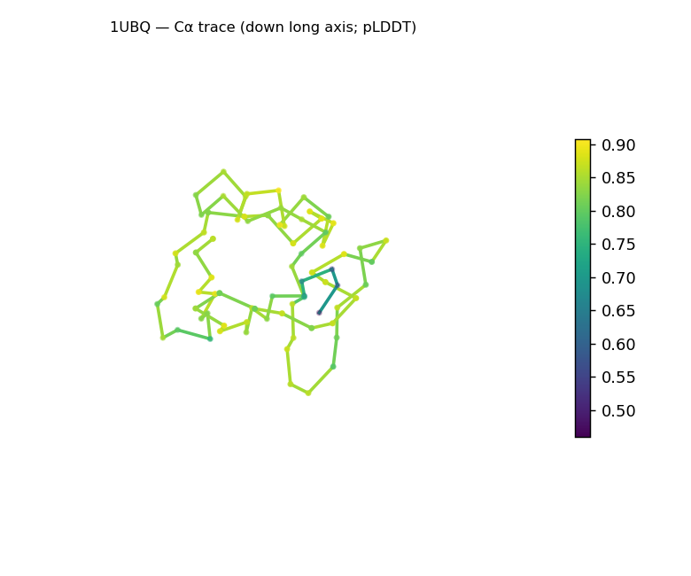
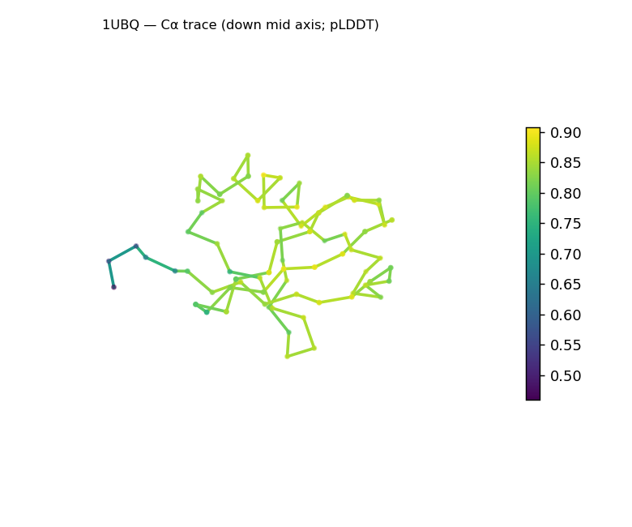
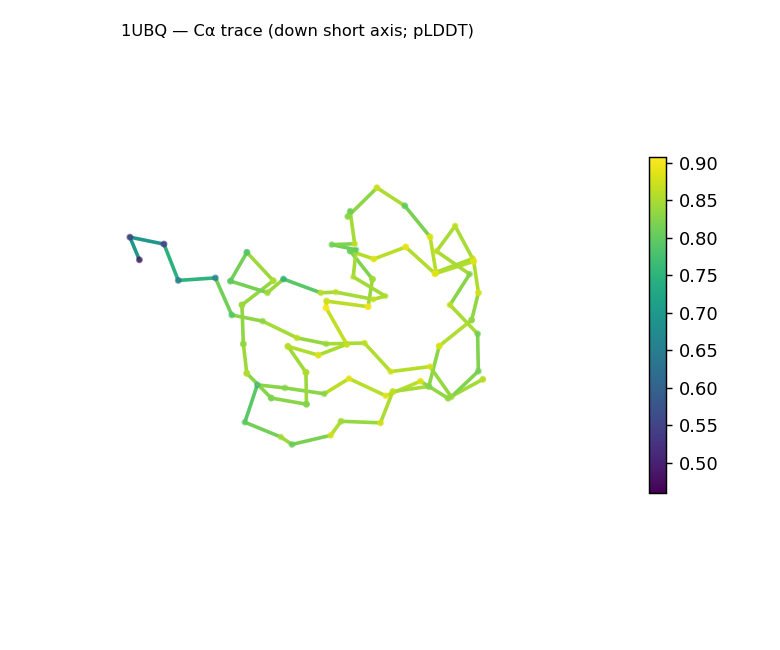
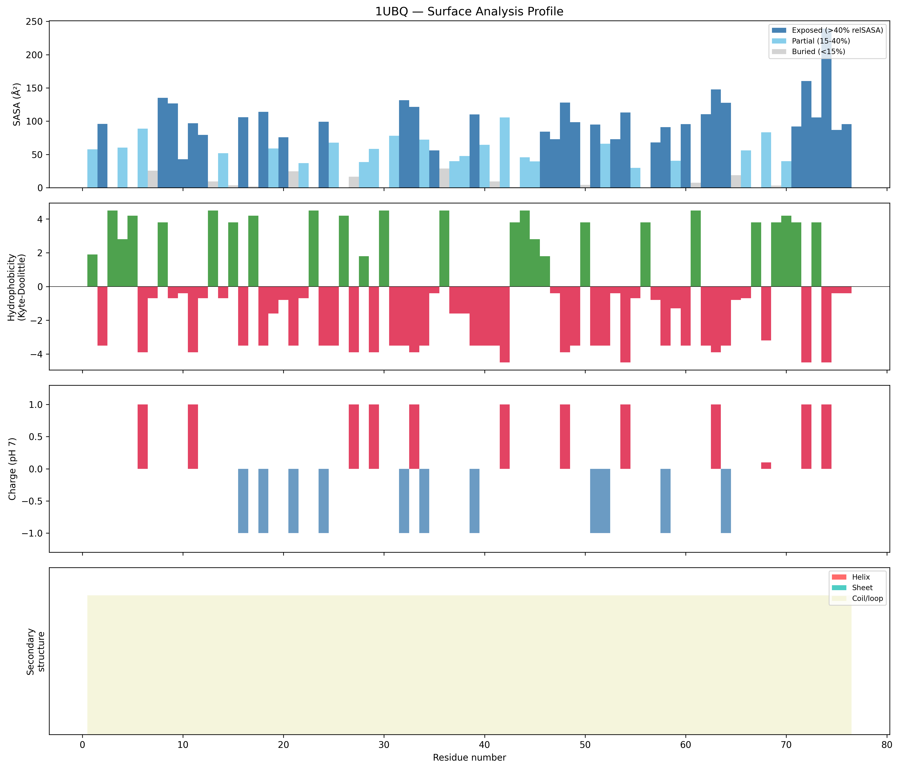
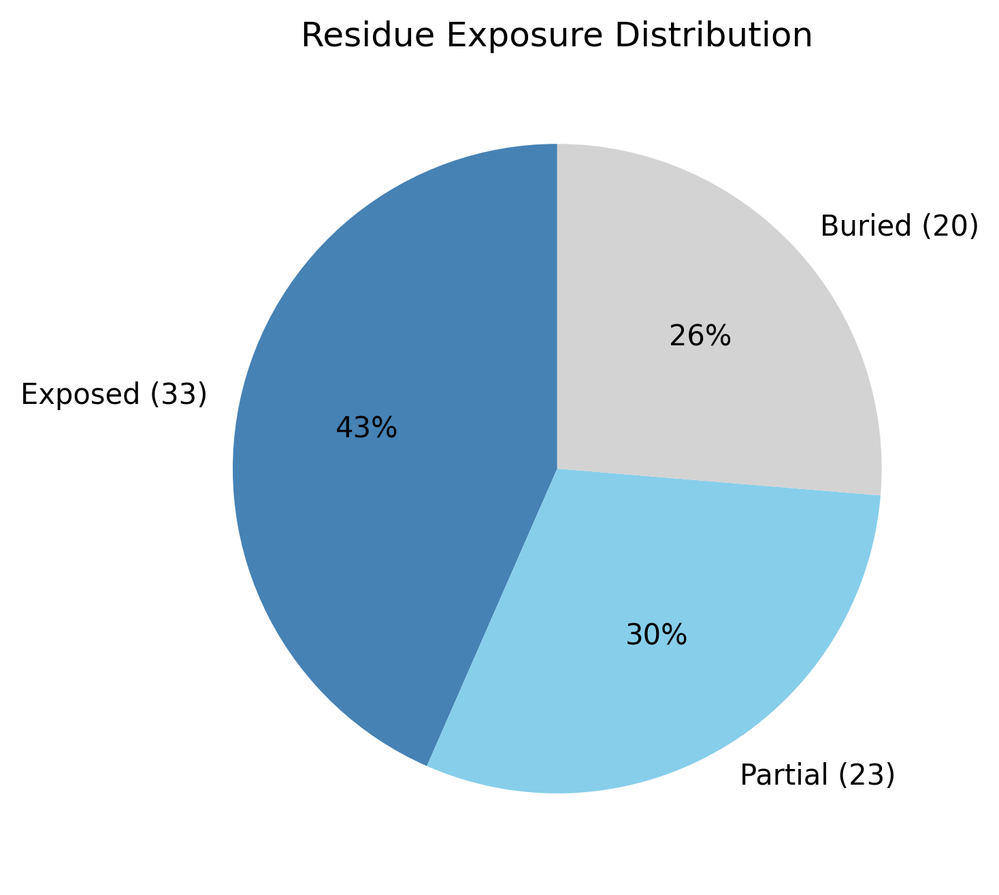

# Structural analysis — `1UBQ`

> Facts are emitted deterministically from the measurement scripts. Sections marked with a SYNTHESIS comment are authored by the Claude session (judgment, Zone 2), kept visibly separate from the measured facts.

## Executive summary

A small single-chain, 76-residue predicted model that is compact and near-spherical: asphericity 0.07 and Rg 11.25 Å (below the ~14.1 Å expected for this length) with approximate dimensions 32 × 24 × 23 Å. Confidence is moderate and unusually uniform — mean pLDDT 82.9, median 85.2, std 8.1 — with no sharply low-confidence region (minimum 46.0). The solvent-exposed surface is roughly charge-balanced (net −1 e; 7 positive, 8 negative). Secondary structure could not be assigned in this run (DSSP unavailable), so fold class is undetermined.

## User-provided context

None provided. All observations below are derived from the structure alone.

## Structure overview

- **Source:** predicted model — pLDDT in the B-factor column
- **Chains:** 1 (single chain)
- **Residues / atoms:** 76 / 601
- **Missing residues:** 0
- **Non-solvent ligands:** none
  - chain **A**: 76 res

## Structural views

_Cα backbone trace (Agent 2.2 matplotlib placeholder), down the long / mid / short principal axes; coloured by pLDDT. A worm trace, not a cartoon — Mol\* cartoons pending Agent 2.1._

## Fold & shape

- **Shape:** roughly globular (asphericity 0.07, Rg 11.25 Å)
- **Approx. dimensions:** 32.5 × 23.7 × 23 Å
- **Secondary structure:** helix 0.0%, sheet 0.0%, coil 100.0%
- **⚠ Secondary structure unavailable** (source: unavailable) — the SS fractions above are not a real measurement (DSSP missing); fold class and any disorder assessment are unreliable until DSSP is installed.
- **Fold class:** undetermined (secondary structure unavailable)

## Surface properties

- **Exposure:** buried 26.3%, partial 30.3%, exposed 43.4%
- **Total SASA:** 4962.7 Ų
- **Surface hydrophobicity (KD):** mean -1.92 ± 2.44
- **Surface charge (pH 7):** net -1 e (7 +, 8 −)
- **Hydrophobic patches:** 1:
  - residues 44–46 (len 3, mean KD 3.03)

## Prediction quality / structural coherence

Confidence is **reported, never gated** — these signals are inputs for the synthesis below, not a pass/fail.

- **pLDDT (chain A):** mean 82.88, median 85.23, range 45.98–90.71, std 8.14
- **Compactness:** Rg 11.25 Å vs ~14.1 Å expected for 76 residues (2.5·N^0.4) — consistent
- **Core present:** buried fraction 26.3%
- **Coil fraction:** 100.0%

### Coherence assessment

The coherence signals agree with the confidence score and indicate a folded model. Compactness is in the folded range (Rg 11.25 Å vs ~14.1 Å expected) and the domain is near-spherical (asphericity 0.07). Confidence is moderate and notably **uniform** (mean 82.9, std 8.1, range 46.0–90.7) — there is no low-confidence tail, so uncertainty is distributed rather than localized to a terminus. The buried fraction is modest (26.3%), which the globular-enzyme profile flags as below its 0.30 "folded core" threshold; for a chain this short a lower buried fraction partly reflects the higher surface-to-volume ratio of small domains rather than poor packing — though with DSSP unavailable, fold-level coherence cannot be confirmed.

## Expected-parameter comparison

### vs `Globular enzyme`

| Parameter | Observed | Expected | Verdict | Note |
| --- | --- | --- | --- | --- |
| Asphericity | 0.07 | ≤ 0.30 | within | > 0.30 → elongated, atypical for a compact globular domain |
| Buried fraction | 0.26 | ≥ 0.30 | **deviates** | folded hydrophobic core present |
| Coil fraction | 1 | ≤ 0.45 | **deviates** | high coil → poor packing or disorder |
| Sheet fraction | 0 | ≥ 0.05 | **deviates** | most α/β and β enzymes carry some sheet |

## Independent observations

- **Compact, near-spherical small domain.** Asphericity 0.07 (near-isotropic) and Rg 11.25 Å (below the 14.1 Å expectation for 76 residues), dimensions ≈32 × 24 × 23 Å.
- **Uniform confidence.** Per-residue pLDDT std is only 8.1 with no value below 46.0 — unlike a confident-core / flexible-terminus split, this model is moderately and *evenly* confident throughout.
- **Modest buried fraction (26.3%).** Below the generic 0.30 "folded core" baseline, but expected to run lower for a 76-residue chain because of its higher surface-to-volume ratio — flagged as a likely size effect, not necessarily weak packing.
- **Roughly charge-balanced surface.** Net −1 e at pH 7 (7 positive, 8 negative).
- **Secondary structure is unavailable** (DSSP absent): the 100% coil, the "undetermined" fold class, and the coil/sheet "deviates" rows in the comparison table are artifacts of that gap — **not** real findings.

## What cannot be determined from structure alone

- **Identity and function** — not established; the analysis is identity-agnostic.
- **Fold class / topology** — undetermined while DSSP is unavailable; re-running with DSSP would resolve secondary structure and fold class.
- **Mechanism / binding** — no non-solvent ligands are present; no functional inference is made.
- **Homology / structural relatives** — not assessed here; that is Agent 3's job. *Seeds to hand off:* a small (~76-residue), compact, near-spherical single domain with a roughly charge-neutral surface; revisit fold class once secondary structure is available.

## Methods

- **Measurements (deterministic):** `parse_structure.py` (metadata, confidence stats), `surface_analysis.py` (Shrake–Rupley SASA, Kyte–Doolittle hydrophobicity, charge at pH 7, DSSP secondary structure, shape metrics, SCOP/CATH fold class), `render_views.py` (Mol* cartoon renders).
- **Report facts** below the synthesis sections are emitted verbatim from the above scripts' JSON by `assemble_report.py` — no transcription.
- **Synthesis** sections (executive summary, independent observations, coherence assessment, cannot-determine) are authored by Claude per `SKILL.md` Step 9, each claim cited to a measurement.
- **Expected-parameter profiles:** `Globular enzyme`.
