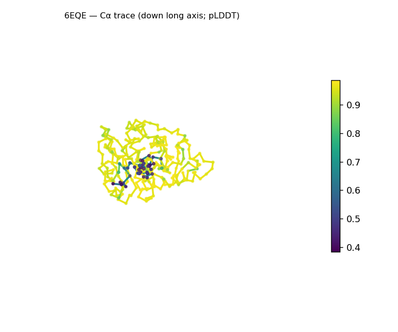
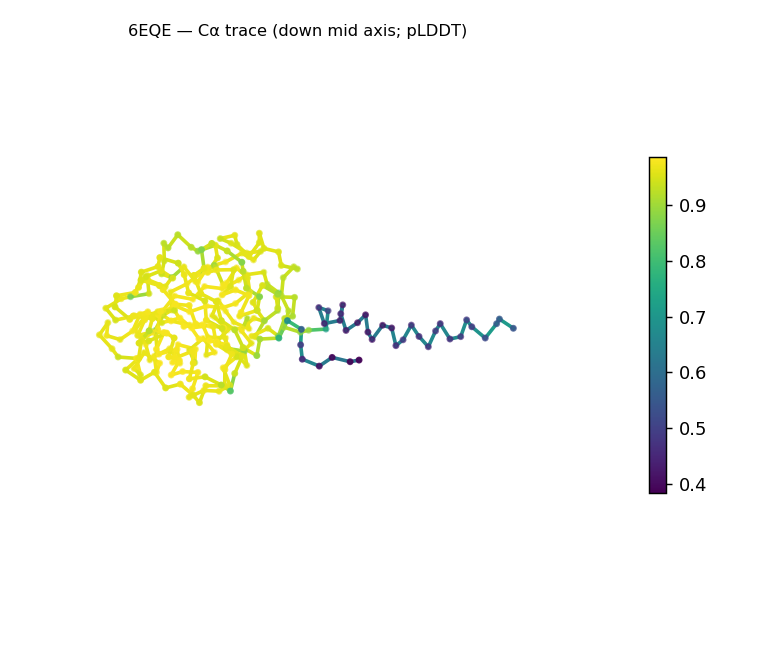
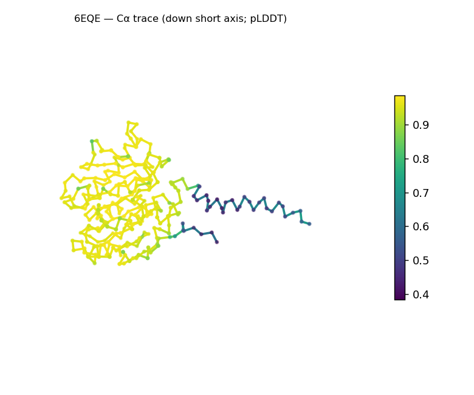
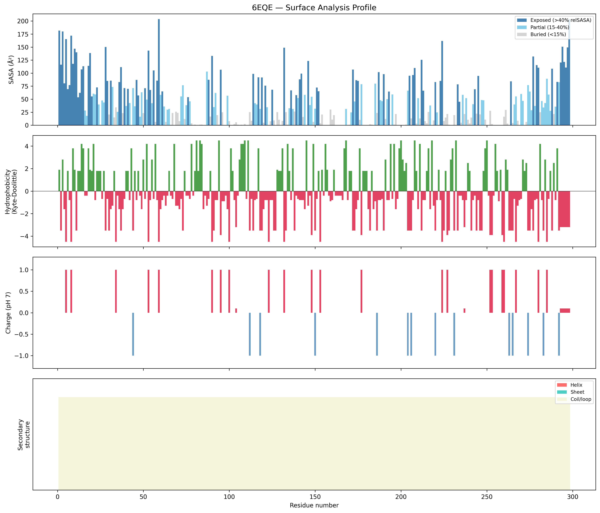
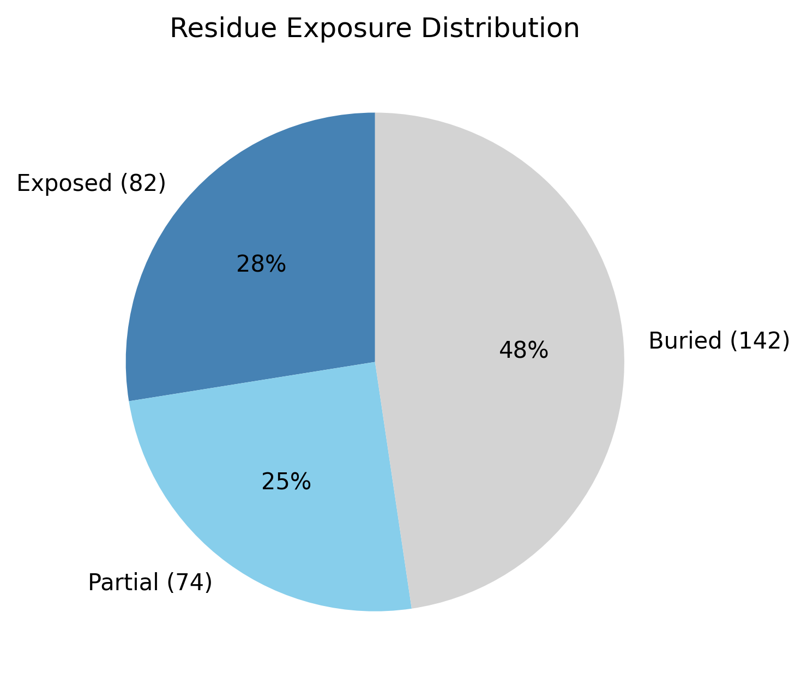

# Structural analysis — `6EQE`

> Facts are emitted deterministically from the measurement scripts. Sections marked with a SYNTHESIS comment are authored by the Claude session (judgment, Zone 2), kept visibly separate from the measured facts.

## Executive summary

A single-chain, 298-residue predicted model that is compact and well-folded: radius of gyration (19.8 Å) sits below the ~24.4 Å expected for a chain this length, and ~48% of residues are buried — a packed core, not an extended chain. Mean pLDDT is 89.4 but the distribution is uneven (median 96.2, minimum 38.3, std 16.6): a high-confidence core with one low-confidence segment. The solvent-exposed surface is strongly net-positive (+8.6 e; 15 positive vs 1 negative surface residue). Secondary structure could not be assigned in this run (DSSP unavailable), so fold class is undetermined and the "elongated" shape label below should be read cautiously.

## User-provided context

None provided. All observations below are derived from the structure alone.

## Structure overview

- **Source:** predicted model — pLDDT in the B-factor column
- **Chains:** 1 (single chain)
- **Residues / atoms:** 298 / 2197
- **Missing residues:** 0
- **Non-solvent ligands:** none
  - chain **A**: 298 res

## Structural views

_Cα backbone trace (Agent 2.2 matplotlib placeholder), down the long / mid / short principal axes; coloured by pLDDT. A worm trace, not a cartoon — Mol\* cartoons pending Agent 2.1._

## Fold & shape

- **Shape:** prolate (elongated) (asphericity 0.17, Rg 19.81 Å)
- **Approx. dimensions:** 81.1 × 45.9 × 33 Å
- **Secondary structure:** helix 0.0%, sheet 0.0%, coil 100.0%
- **⚠ Secondary structure unavailable** (source: unavailable) — the SS fractions above are not a real measurement (DSSP missing); fold class and any disorder assessment are unreliable until DSSP is installed.
- **Fold class:** undetermined (secondary structure unavailable)

## Surface properties

- **Exposure:** buried 47.7%, partial 24.8%, exposed 27.5%
- **Total SASA:** 12966.9 Ų
- **Surface hydrophobicity (KD):** mean -1.08 ± 2.49
- **Surface charge (pH 7):** net 8.6 e (15 +, 1 −)
- **Hydrophobic patches:** 2:
  - residues 12–15 (len 4, mean KD 2.9)
  - residues 18–21 (len 4, mean KD 2.92)

## Prediction quality / structural coherence

Confidence is **reported, never gated** — these signals are inputs for the synthesis below, not a pass/fail.

- **pLDDT (chain A):** mean 89.43, median 96.16, range 38.28–98.65, std 16.57
- **Compactness:** Rg 19.81 Å vs ~24.4 Å expected for 298 residues (2.5·N^0.4) — consistent
- **Core present:** buried fraction 47.7%
- **Coil fraction:** 100.0%

### Coherence assessment

The coherence signals indicate a genuinely folded model and broadly agree with the confidence score. Compactness is in the folded range (Rg 19.8 Å vs ~24.4 Å expected) and a buried core is present (47.7% buried), so the model is neither extended nor molten. The mean pLDDT (89.4) is moderate-to-high, and the wide spread (range 38.3–98.7, median 96.2, std 16.6) **localizes** the uncertainty rather than indicating global low confidence — most of the chain is high-confidence, with a minority low-confidence segment consistent with a flexible or poorly-constrained terminus. Fold-level coherence (does the secondary structure match the shape?) **could not be evaluated** here because DSSP was unavailable.

## Expected-parameter comparison

### vs `Globular enzyme`

| Parameter | Observed | Expected | Verdict | Note |
| --- | --- | --- | --- | --- |
| Asphericity | 0.17 | ≤ 0.30 | within | > 0.30 → elongated, atypical for a compact globular domain |
| Buried fraction | 0.48 | ≥ 0.30 | within | folded hydrophobic core present |
| Coil fraction | 1 | ≤ 0.45 | **deviates** | high coil → poor packing or disorder |
| Sheet fraction | 0 | ≥ 0.05 | **deviates** | most α/β and β enzymes carry some sheet |

## Independent observations

- **Compact, folded single domain.** Rg 19.8 Å is below the 24.4 Å folded-globular expectation for 298 residues, with 47.7% of residues buried — a packed core.
- **Strongly net-positive surface.** Net +8.6 e at pH 7, from 15 positive vs only 1 negative surface residue — a markedly asymmetric surface-charge profile relative to a charge-balanced default.
- **Non-uniform confidence.** The per-residue pLDDT spans 38.3–98.7 (median 96.2, std 16.6): a high-confidence core with one localized low-confidence segment — the signature of a flexible/disordered terminus rather than a globally uncertain model.
- **Shape descriptors are only partly concordant (internal inconsistency).** The approximate dimensions (81 × 46 × 33 Å, ≈2.5:1 long:short) and the "prolate (elongated)" label suggest some elongation, yet asphericity (0.17) is only modestly aspherical and reads "within" the compact-globular range in the comparison table. Treat "elongated" as *mild*, and note the two shape metrics disagree.
- **Secondary structure is unavailable** (DSSP absent): the 100% coil, the "undetermined" fold class, and the coil/sheet "deviates" rows in the comparison table are all artifacts of that gap — **not** real findings.

## What cannot be determined from structure alone

- **Identity and function** — what this protein is or does is not established; the analysis is identity-agnostic.
- **Fold class / topology** — undetermined while DSSP is unavailable; re-running with DSSP (e.g. on Modal / claude.ai) would resolve secondary structure and fold class.
- **Mechanism, active site, binding** — no non-solvent ligands are present and no functional inference is made.
- **Homology / structural relatives** — not assessed here; that is Agent 3's job (Foldseek + literature). *Seeds to hand off:* a compact ~298-residue single domain with a strongly net-positive surface (+8.6 e); revisit fold class once secondary structure is available.

## Methods

- **Measurements (deterministic):** `parse_structure.py` (metadata, confidence stats), `surface_analysis.py` (Shrake–Rupley SASA, Kyte–Doolittle hydrophobicity, charge at pH 7, DSSP secondary structure, shape metrics, SCOP/CATH fold class), `render_views.py` (Mol* cartoon renders).
- **Report facts** below the synthesis sections are emitted verbatim from the above scripts' JSON by `assemble_report.py` — no transcription.
- **Synthesis** sections (executive summary, independent observations, coherence assessment, cannot-determine) are authored by Claude per `SKILL.md` Step 9, each claim cited to a measurement.
- **Expected-parameter profiles:** `Globular enzyme`.
