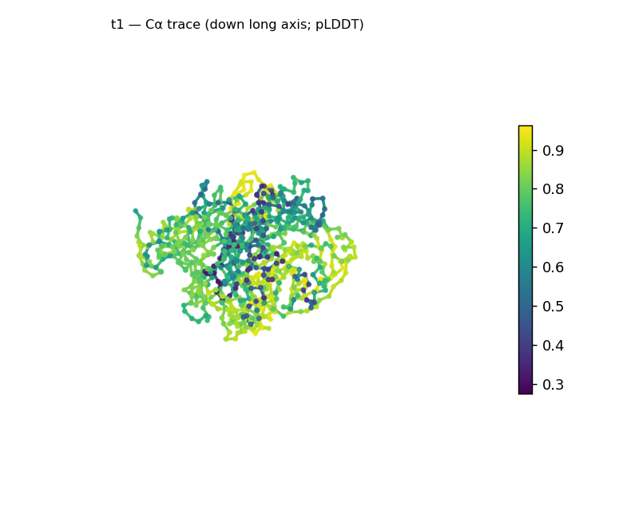
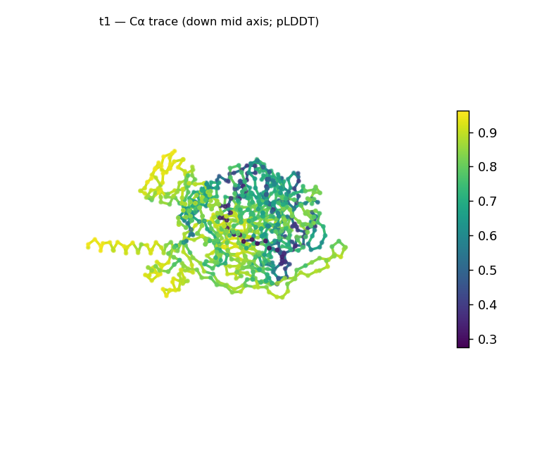
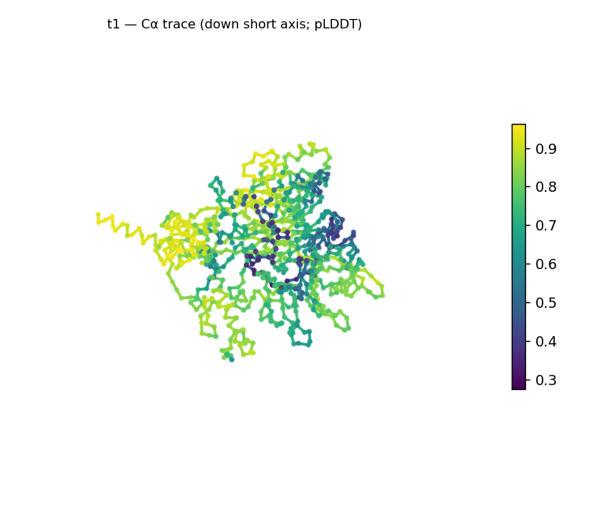
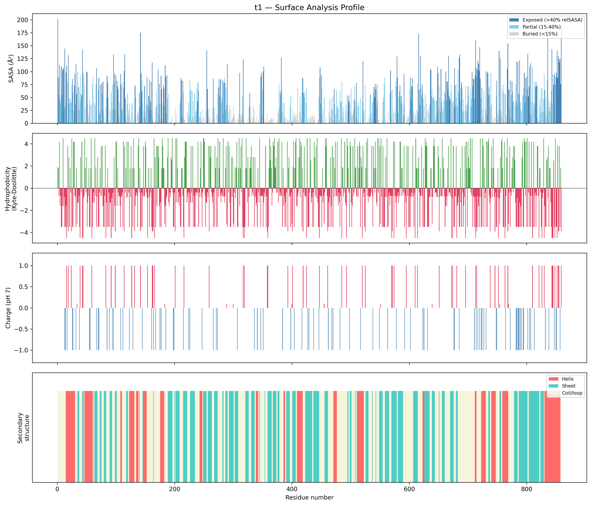
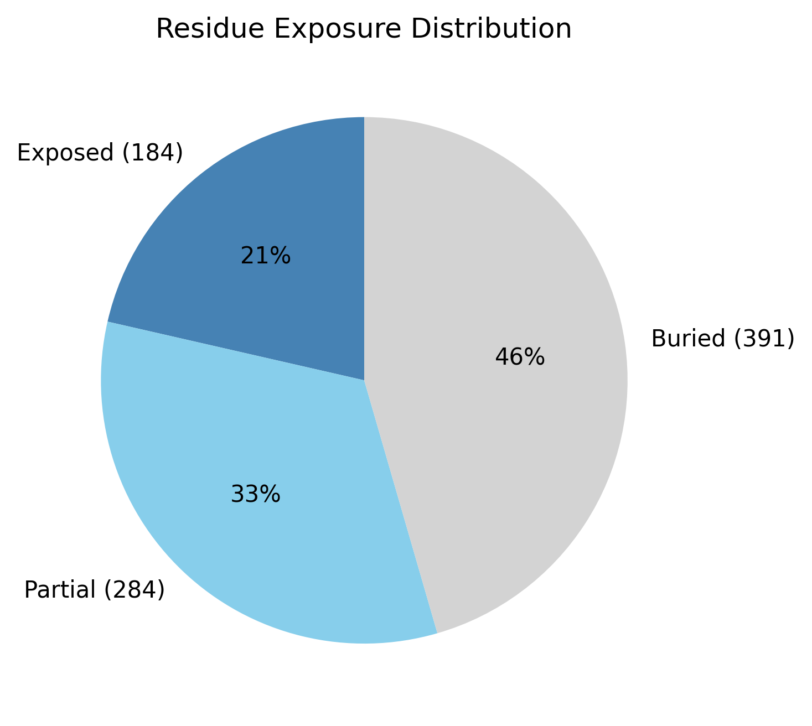

# Structural analysis — `t1`

> Facts are emitted deterministically from the measurement scripts. Sections marked with a SYNTHESIS comment are authored by the Claude session (judgment), kept visibly separate from the measured facts.

## Executive summary

A single-chain, 859-residue predicted model. Real DSSP secondary structure is β-predominant and mixed (35.6% sheet, 18.2% helix, 46.2% coil), so the coarse structural class is **α/β-or-α+β, β-rich** — but at 859 residues this is a whole-chain average across what are almost certainly multiple domains, not a single-domain fold, and the parallel-vs-antiparallel (α/β vs α+β) distinction is not resolvable from whole-chain data. The model is compact and globular (Rg 27.2 Å, well below the ~37.3 Å expected for 859 residues; asphericity 0.05) with a substantial buried core (45.5%), reading as a tightly packed multidomain globular protein. Confidence is medium and non-uniform (mean pLDDT 73.8, median 77.7, min 27.5, std 16.5). The solvent-exposed surface is strongly electronegative (net −17 e; 14 positive vs 31 negative surface residues).

## User-provided context

None provided. All observations below are derived from the structure alone.

## Structure overview

- **Source:** predicted model — pLDDT in the B-factor column
- **Chains:** 1 (single chain)
- **Residues / atoms:** 859 / 6619
- **Missing residues:** 0
- **Non-solvent ligands:** none
  - chain **A**: 859 res

## Structural views

_Cα backbone trace (Agent 2.2 matplotlib placeholder), down the long / mid / short principal axes; coloured by pLDDT._

## Shape & secondary structure

- **Shape:** spherical/globular (asphericity 0.05, Rg 27.15 Å)
- **Approx. dimensions:** 100.3 × 74.6 × 57 Å
- **Secondary structure:** helix 18.2%, sheet 35.6%, coil 46.2%

## Surface properties

- **Exposure:** buried 45.5%, partial 33.1%, exposed 21.4%
- **Total SASA:** 36121.6 Ų
- **Surface hydrophobicity (KD):** mean -0.71 ± 2.57
- **Surface charge (pH 7):** net -17 e (14 +, 31 −)
- **Hydrophobic patches:** 2:
  - residues 180–182 (len 3, mean KD 2.47)
  - residues 641–643 (len 3, mean KD 4.03)

## Prediction quality / structural coherence

Confidence is **reported, never gated** — these signals are inputs for the synthesis below, not a pass/fail.

- **pLDDT (chain A):** mean 73.81, median 77.72, range 27.54–96.2, std 16.49
- **Compactness:** Rg 27.15 Å vs ~37.3 Å expected for 859 residues (2.5·N^0.4) — consistent
- **Core present:** buried fraction 45.5%
- **Coil fraction:** 46.2%

### Coherence assessment

The coherence signals support a genuinely folded model despite only medium confidence. Compactness is well within the folded range — Rg 27.2 Å against the ~37.3 Å globular expectation for 859 residues — with a 45.5% buried core and ~54% of residues in defined SS, so the model is neither extended nor molten. Mean pLDDT 73.8 (median 77.7) is medium; the wide spread (27.5–96.2, std 16.5) localizes substantial uncertainty to a minority of positions — expected for a large, MSA-free prediction — without contradicting the compact, cored architecture.

## Expected-parameter comparison

_No expected-parameter profile supplied — this is the default for novel / low-homology targets. See the independent observations below._

## Independent observations

- **Compact for its size.** Rg 27.2 Å is well below the ~37.3 Å expected for 859 residues (2.5·N^0.4); with 45.5% buried this is a tightly packed, multidomain globular protein, not an extended one.
- **β-predominant mixed class.** 35.6% sheet vs 18.2% helix gives an α/β-or-α+β (β-rich) class — but at 859 residues this is a whole-chain average; naming a single fold or resolving α/β vs α+β would require per-domain segmentation.
- **Strongly electronegative surface.** Net −17 e (14 +, 31 −) is a markedly acidic surface, not a balanced one; only two short hydrophobic patches (each 3 residues, KD 2.5–4.0).
- **Confidence is non-uniform** (median 77.7, min 27.5, std 16.5): a well-determined majority with a lower-confidence minority — a shape signal of a large model whose domain cores are resolved better than its linkers/surface.

## What cannot be determined from structure alone

- **Identity and function** — not established; the analysis is identity-agnostic.
- **Specific fold and domain architecture** — the β-rich α/β-or-α+β class is a whole-chain average; the number of domains, their boundaries, and their individual folds need per-domain segmentation and database verification (Foldseek/CATH).
- **α/β vs α+β** — the parallel-vs-antiparallel distinction is not resolvable from whole-chain per-residue ordering at this size.
- **Mechanism** — no ligands detected; there is insufficient structural evidence to assign a function.

## Methods

- **Measurements (deterministic):** `parse_structure.py` (metadata, confidence stats), `surface_analysis.py` (Shrake–Rupley SASA, Kyte–Doolittle hydrophobicity, charge at pH 7, DSSP secondary structure, shape metrics), `render_trace.py` (Agent 2.2 Cα-trace figures; `render_views.py` Mol* cartoons when Agent 2.1 is available).
- **Report facts** below the synthesis sections are emitted verbatim from the above scripts' JSON by `assemble_report.py` — no transcription.
- **Synthesis** sections (executive summary, independent observations, coherence assessment, cannot-determine) are authored by Claude per `SKILL.md` Step 9, each claim cited to a measurement.
