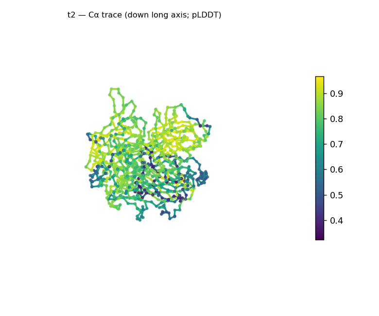
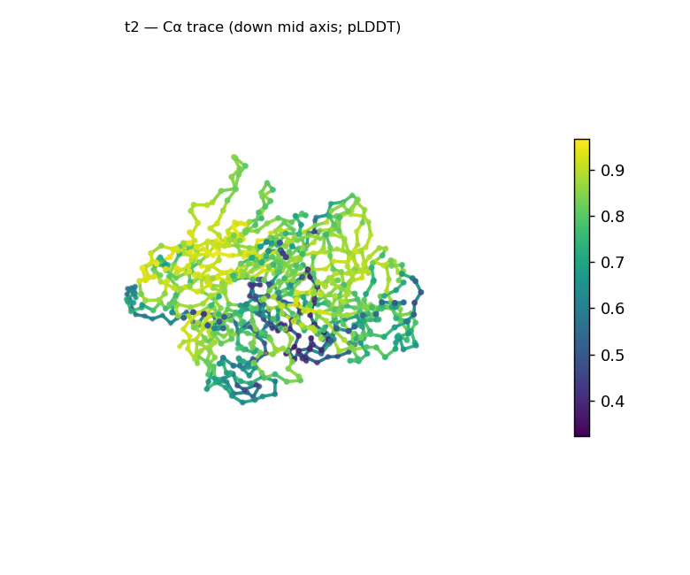
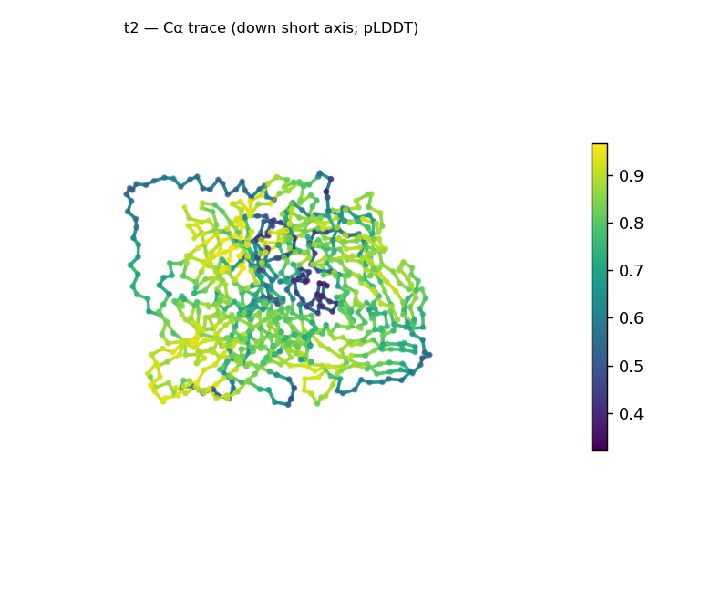
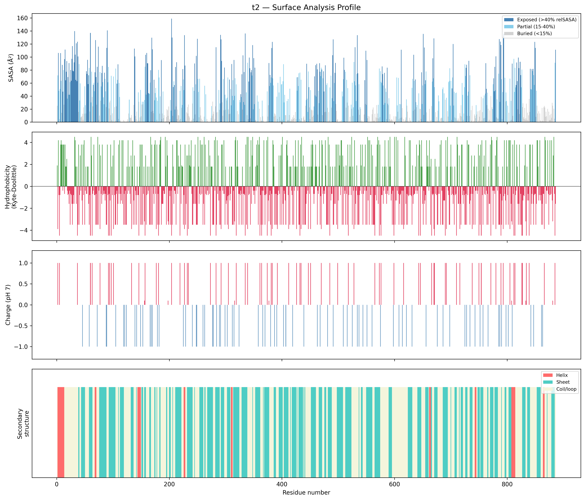
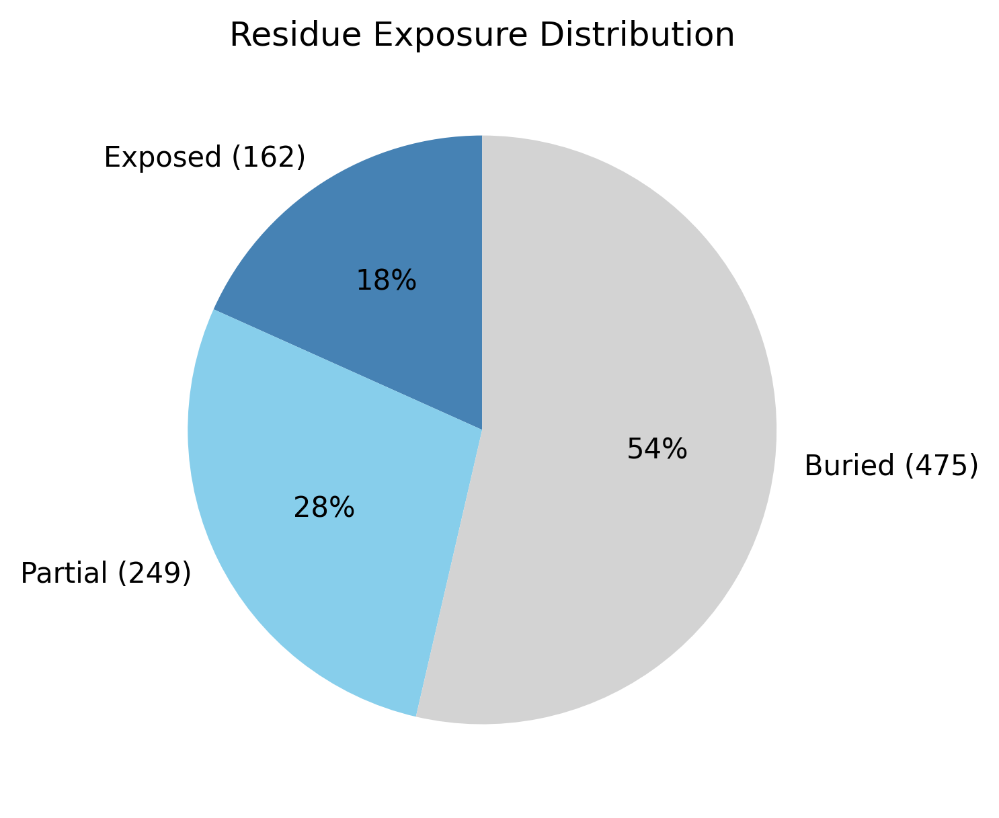

# Structural analysis — `t2`

> Facts are emitted deterministically from the measurement scripts. Sections marked with a SYNTHESIS comment are authored by the Claude session (judgment), kept visibly separate from the measured facts.

## Executive summary

A single-chain, 886-residue predicted model — **supplied as a coding nucleotide sequence and translated to protein by the Agent 0 fast path** (clean single ORF) before folding. Real DSSP secondary structure is overwhelmingly β: 45.9% sheet against only 4.9% helix (49.2% coil). Helix sits right at the ~5% presence floor, so the coarse class is **predominantly all-β**, with the honest caveat that a minor (~5%) helical component is being treated as at/below the floor rather than strictly absent. The model is compact and globular (Rg 26.5 Å vs ~37.7 Å expected for 886 residues; asphericity 0.05) with a strong buried core (53.6%); at 886 residues this is a whole-chain average over probable multiple domains. Confidence is medium (mean pLDDT 75.7, median 81.0) and the surface is near charge-neutral (net −1.9 e).

## User-provided context

No biological context was provided. **Provenance:** the input for this case was a coding nucleotide sequence (2,661 nt), not a protein. The Agent 0 fast path detected the nucleotide composition, found a clean single ORF (ATG start, length divisible by 3, no internal stop codons, terminal stop), and translated it to this 886-residue protein, which was then folded. All observations below are derived from the structure alone.

## Structure overview

- **Source:** predicted model — pLDDT in the B-factor column
- **Chains:** 1 (single chain)
- **Residues / atoms:** 886 / 6673
- **Missing residues:** 0
- **Non-solvent ligands:** none
  - chain **A**: 886 res

## Structural views

_Cα backbone trace (Agent 2.2 matplotlib placeholder), down the long / mid / short principal axes; coloured by pLDDT._

## Shape & secondary structure

- **Shape:** spherical/globular (asphericity 0.05, Rg 26.46 Å)
- **Approx. dimensions:** 79.8 × 65.3 × 60.3 Å
- **Secondary structure:** helix 4.9%, sheet 45.9%, coil 49.2%

## Surface properties

- **Exposure:** buried 53.6%, partial 28.1%, exposed 18.3%
- **Total SASA:** 31876.7 Ų
- **Surface hydrophobicity (KD):** mean -0.46 ± 2.61
- **Surface charge (pH 7):** net -1.9 e (13 +, 14 −)
- **Hydrophobic patches:** 3:
  - residues 15–18 (len 4, mean KD 2.47)
  - residues 32–34 (len 3, mean KD 3.5)
  - residues 459–462 (len 4, mean KD 2.3)

## Prediction quality / structural coherence

Confidence is **reported, never gated** — these signals are inputs for the synthesis below, not a pass/fail.

- **pLDDT (chain A):** mean 75.66, median 80.97, range 32.34–96.57, std 15.63
- **Compactness:** Rg 26.46 Å vs ~37.7 Å expected for 886 residues (2.5·N^0.4) — consistent
- **Core present:** buried fraction 53.6%
- **Coil fraction:** 49.2%

### Coherence assessment

The signals support a genuinely folded model. Rg 26.5 Å is far below the ~37.7 Å globular expectation for 886 residues, with a 53.6% buried core and ~51% of residues in defined SS (overwhelmingly sheet) — compact and well-packed, not extended or molten. Mean pLDDT 75.7 (median 81.0) is medium with a low-confidence minority (min 32.3, std 15.6), as expected for a large MSA-free prediction. The coherent, compact β fold also corroborates the upstream translation: a wrong reading frame would not produce a packed, high-β domain.

## Expected-parameter comparison

_No expected-parameter profile supplied — this is the default for novel / low-homology targets. See the independent observations below._

## Independent observations

- **Overwhelmingly β.** 45.9% sheet vs 4.9% helix — a strongly β-dominant architecture (coarse class all-β). The ~5% helix sits right at the presence floor: minor but not strictly absent, so "predominantly β" is the honest reading rather than a bald "all-β".
- **Compact and strongly cored for its size.** Rg 26.5 Å vs ~37.7 expected and 53.6% buried — a tightly packed (multidomain) globular β protein.
- **Whole-chain average.** At 886 residues the all-β class is averaged over what are probably several domains; individual domain folds are not resolved here.
- **Near-neutral surface.** Net −1.9 e (13 +, 14 −), balanced; three short hydrophobic patches (≤4 residues).

## What cannot be determined from structure alone

- **Identity and function** — not established; the analysis is identity-agnostic. (The reading frame is settled by the clean ORF; the protein's identity is not.)
- **Specific fold / domain architecture** — the all-β class is a whole-chain average; domain count, boundaries, and individual β-fold topologies need per-domain segmentation and database verification (Foldseek/CATH).
- **The minor helical component** — whether the ~5% helix is decorative or a small distinct element is below what this pipeline resolves.
- **Mechanism** — no ligands detected; insufficient structural evidence to assign a function.

## Methods

- **Measurements (deterministic):** `parse_structure.py` (metadata, confidence stats), `surface_analysis.py` (Shrake–Rupley SASA, Kyte–Doolittle hydrophobicity, charge at pH 7, DSSP secondary structure, shape metrics), `render_trace.py` (Agent 2.2 Cα-trace figures; `render_views.py` Mol* cartoons when Agent 2.1 is available).
- **Report facts** below the synthesis sections are emitted verbatim from the above scripts' JSON by `assemble_report.py` — no transcription.
- **Synthesis** sections (executive summary, independent observations, coherence assessment, cannot-determine) are authored by Claude per `SKILL.md` Step 9, each claim cited to a measurement.
