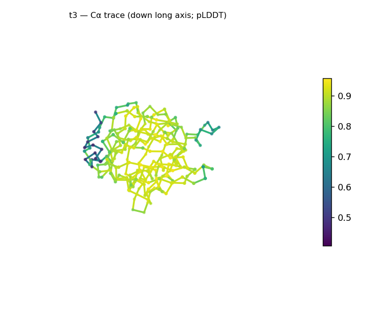
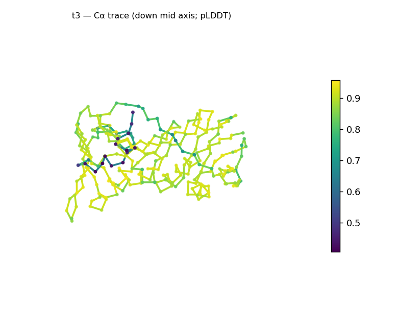
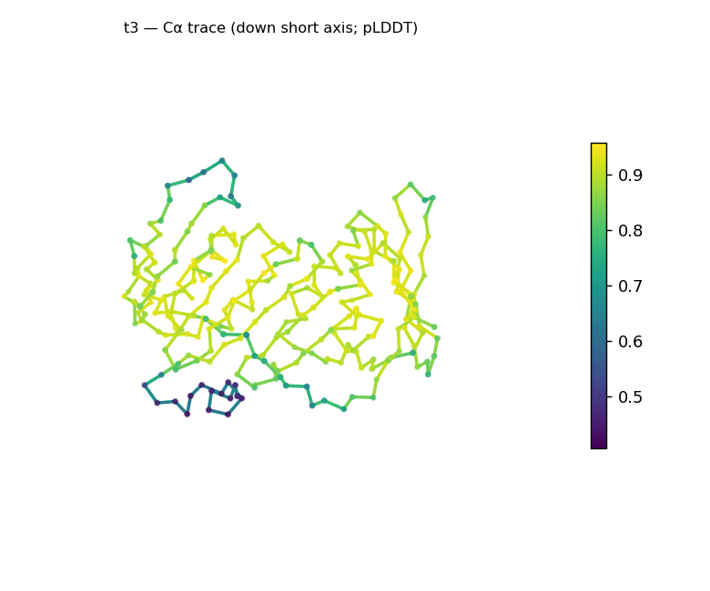
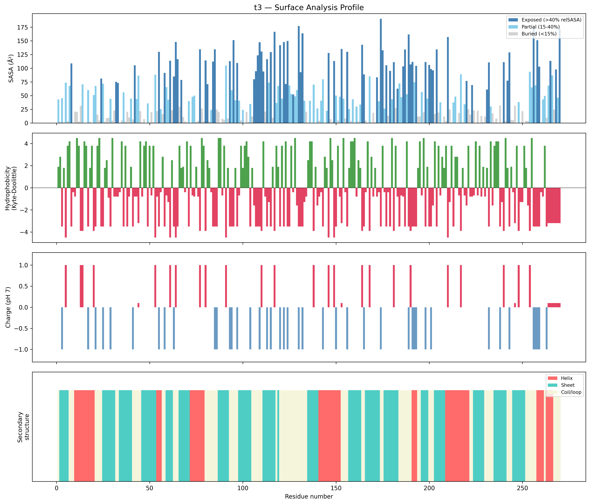
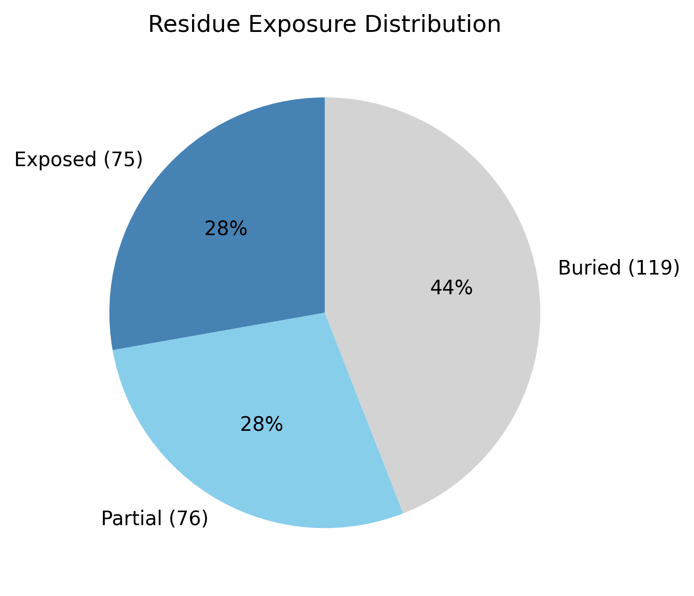

# Structural analysis — `t3`

> Facts are emitted deterministically from the measurement scripts. Sections marked with a SYNTHESIS comment are authored by the Claude session (judgment), kept visibly separate from the measured facts.

## Executive summary

A single-chain, 270-residue predicted model (carrying a C-terminal His-tag from the expression construct). Real DSSP secondary structure is mixed and sheet-leaning — 43.3% sheet, 21.5% helix, 35.2% coil — giving a coarse class of **mixed α/β character** (α/β vs α+β not resolved: the per-residue helix/strand ordering is ambiguous). The domain is compact (Rg 19.3 Å vs ~23.5 Å expected for 270 residues; buried 44.1%) and somewhat elongated (asphericity 0.20), the elongation reported as a shape characteristic, not an inconsistency. The exposed surface is unusually polar — strongly electronegative (net −13.6 e), low mean hydrophobicity (KD −2.63), and zero hydrophobic patches. Confidence is good (mean pLDDT 85.4, median 89.9).

## User-provided context

None provided. **Provenance:** the sequence carries a C-terminal poly-His tag, an expression-construct artifact; it folds as a short disordered tail and is not part of the domain. All observations below are derived from the structure alone.

## Structure overview

- **Source:** predicted model — pLDDT in the B-factor column
- **Chains:** 1 (single chain)
- **Residues / atoms:** 270 / 2095
- **Missing residues:** 0
- **Non-solvent ligands:** none
  - chain **A**: 270 res

## Structural views

_Cα backbone trace (Agent 2.2 matplotlib placeholder), down the long / mid / short principal axes; coloured by pLDDT._

## Shape & secondary structure

- **Shape:** prolate (elongated) (asphericity 0.2, Rg 19.26 Å)
- **Approx. dimensions:** 52.9 × 42 × 34.9 Å
- **Secondary structure:** helix 21.5%, sheet 43.3%, coil 35.2%

## Surface properties

- **Exposure:** buried 44.1%, partial 28.1%, exposed 27.8%
- **Total SASA:** 13683 Ų
- **Surface hydrophobicity (KD):** mean -2.63 ± 2.04
- **Surface charge (pH 7):** net -13.6 e (17 +, 27 −)
- **Hydrophobic patches:** 0

## Prediction quality / structural coherence

Confidence is **reported, never gated** — these signals are inputs for the synthesis below, not a pass/fail.

- **pLDDT (chain A):** mean 85.35, median 89.88, range 40.54–95.79, std 12.31
- **Compactness:** Rg 19.26 Å vs ~23.5 Å expected for 270 residues (2.5·N^0.4) — consistent
- **Core present:** buried fraction 44.1%
- **Coil fraction:** 35.2%

### Coherence assessment

Signals agree on a well-folded model. Rg 19.3 Å is below the ~23.5 Å expectation for 270 residues, with 44.1% buried and ~65% of residues in defined SS — compact and cored. Mean pLDDT 85.4 (median 89.9) is high; the low tail (min 40.5, std 12.3) is concentrated in the disordered His-tag and surface loops, not the core.

## Expected-parameter comparison

_No expected-parameter profile supplied — this is the default for novel / low-homology targets. See the independent observations below._

## Independent observations

- **Mixed α/β, sheet-leaning.** 43.3% sheet vs 21.5% helix; coarse class is mixed α/β-or-α+β — the helix/strand ordering is ambiguous, so the parallel-vs-antiparallel call is left open.
- **Compact but somewhat elongated.** Rg 19.3 Å (vs ~23.5 expected) with 44.1% buried is a packed domain; asphericity 0.20 (long:short axis ratio ~4:1) makes it non-spherical. The elongation is a shape characteristic, not an inconsistency with the class.
- **Strikingly polar surface.** Net −13.6 e (17 +, 27 −), mean surface KD −2.63, and **zero** hydrophobic patches — a highly hydrophilic, acidic exposed surface.
- **High, localized confidence.** Median pLDDT 89.9; the lowest-confidence positions track the His-tag and loops rather than the domain core.

## What cannot be determined from structure alone

- **Identity and function** — not established; the analysis is identity-agnostic.
- **Specific fold / α/β vs α+β** — sheet-rich mixed class; resolving the topology requires database verification (Foldseek/CATH).
- **Mechanism** — no ligands detected; insufficient structural evidence to assign a function. The polar, patch-free surface argues against an exposed hydrophobic binding platform but does not identify a function.

## Methods

- **Measurements (deterministic):** `parse_structure.py` (metadata, confidence stats), `surface_analysis.py` (Shrake–Rupley SASA, Kyte–Doolittle hydrophobicity, charge at pH 7, DSSP secondary structure, shape metrics), `render_trace.py` (Agent 2.2 Cα-trace figures; `render_views.py` Mol* cartoons when Agent 2.1 is available).
- **Report facts** below the synthesis sections are emitted verbatim from the above scripts' JSON by `assemble_report.py` — no transcription.
- **Synthesis** sections (executive summary, independent observations, coherence assessment, cannot-determine) are authored by Claude per `SKILL.md` Step 9, each claim cited to a measurement.
