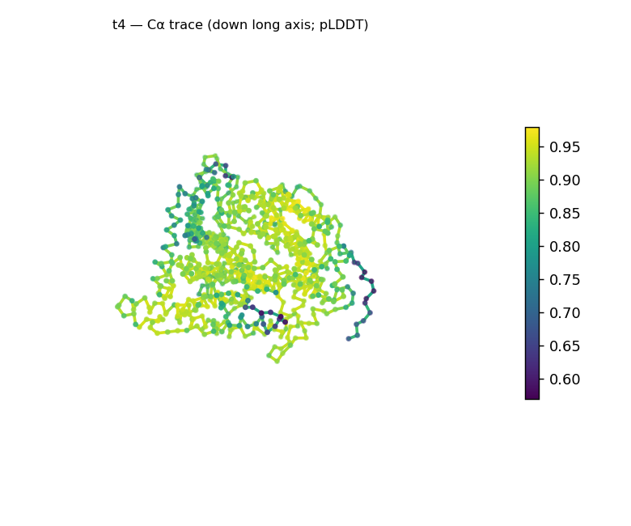
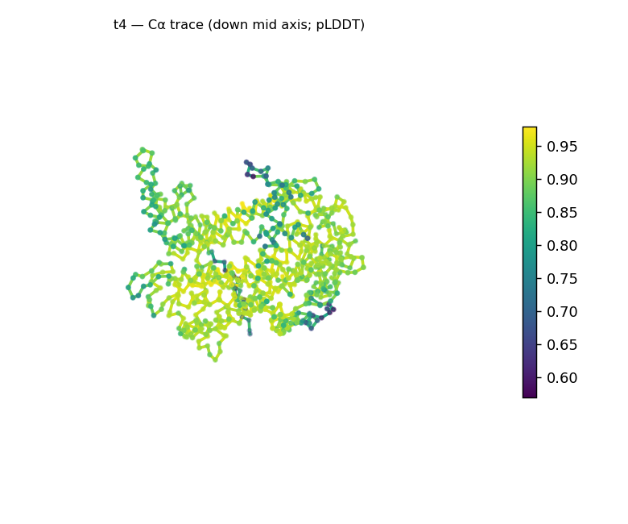
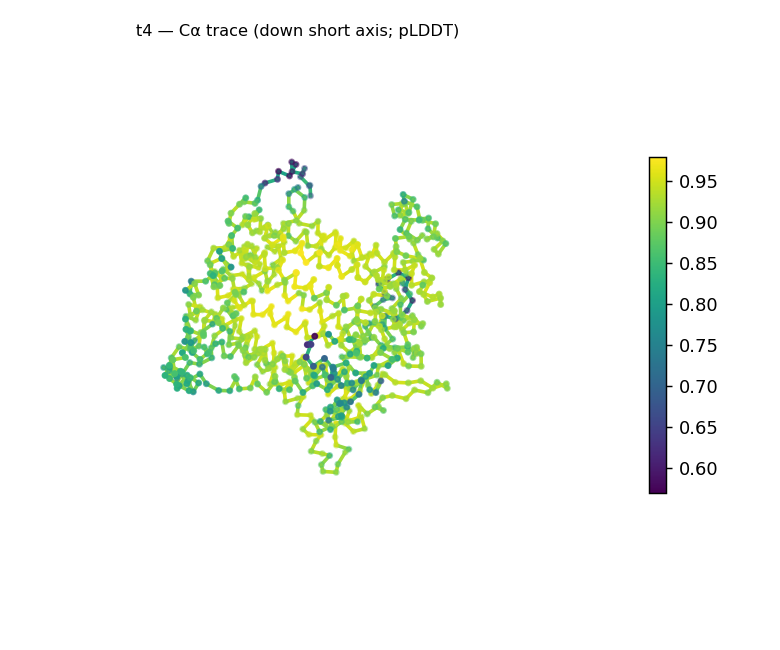
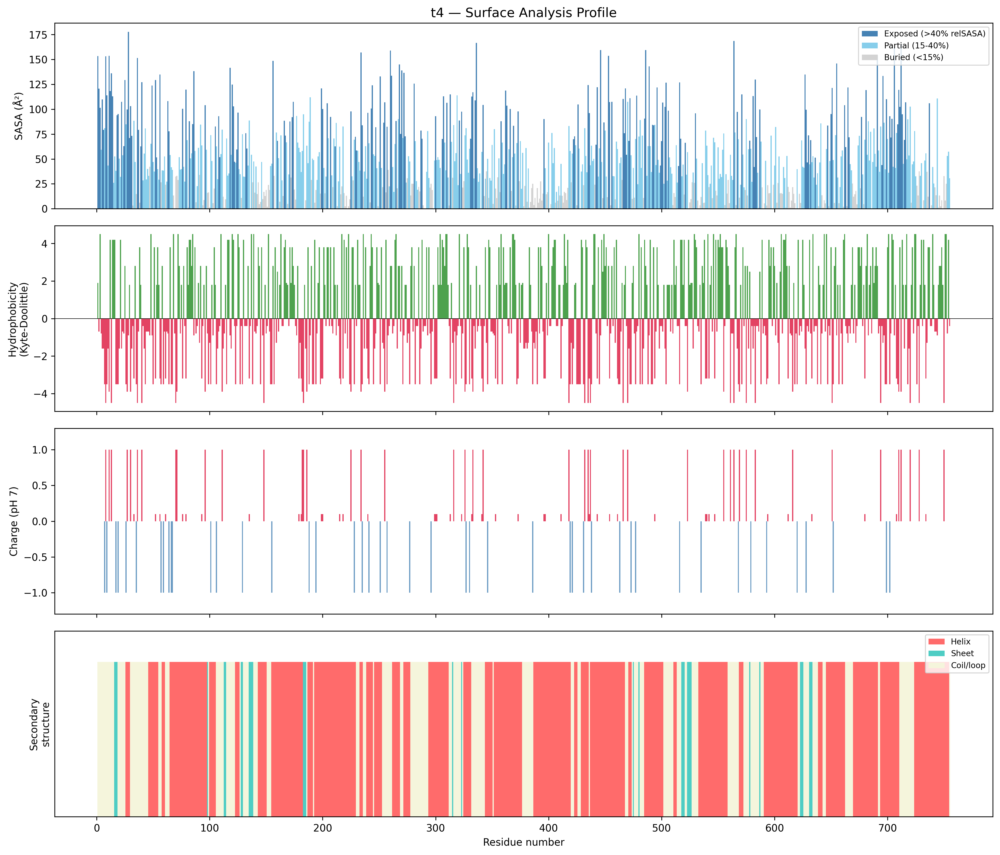
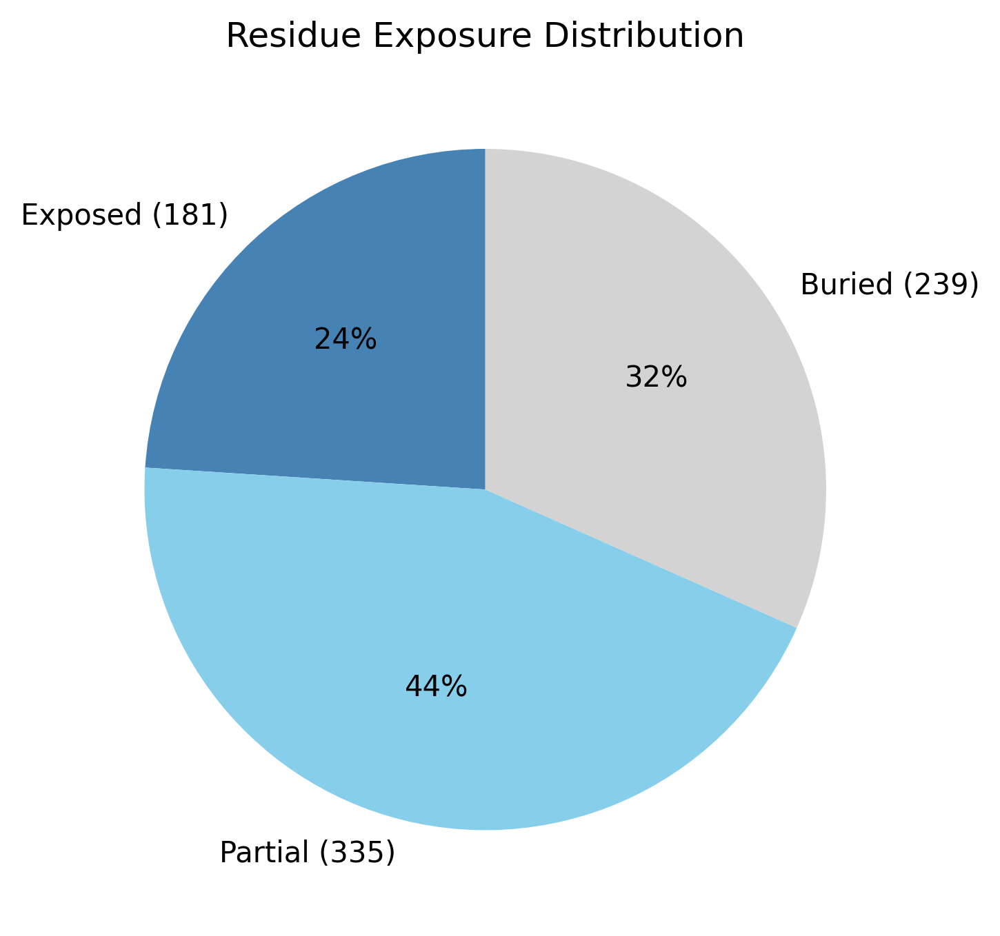

# Structural analysis — `t4`

> Facts are emitted deterministically from the measurement scripts. Sections marked with a SYNTHESIS comment are authored by the Claude session (judgment), kept visibly separate from the measured facts.

## Executive summary

A single-chain, 755-residue predicted model that is strongly α-helical: 62.4% helix against only 4.5% sheet (33.1% coil). Sheet sits at/below the ~5% presence floor, so the coarse class is **predominantly all-α** — with a minor (~4.5%) β component at the floor rather than strictly zero. The model is compact and globular (Rg 28.7 Å vs ~35.4 Å expected for 755 residues; asphericity 0.03); at 755 residues this is a whole-chain average over probable multiple domains. The standout feature is the surface: unusually hydrophobic for a soluble protein (mean surface KD −0.07) with **16 exposed hydrophobic patches** and a strongly electropositive net charge (+11.6 e). Confidence is high and tight (mean pLDDT 87.9, median 90.0, std 7.3).

## User-provided context

None provided. All observations below are derived from the structure alone.

## Structure overview

- **Source:** predicted model — pLDDT in the B-factor column
- **Chains:** 1 (single chain)
- **Residues / atoms:** 755 / 5897
- **Missing residues:** 0
- **Non-solvent ligands:** none
  - chain **A**: 755 res

## Structural views

_Cα backbone trace (Agent 2.2 matplotlib placeholder), down the long / mid / short principal axes; coloured by pLDDT._

## Shape & secondary structure

- **Shape:** spherical/globular (asphericity 0.03, Rg 28.65 Å)
- **Approx. dimensions:** 82.6 × 74.9 × 68.3 Å
- **Secondary structure:** helix 62.4%, sheet 4.5%, coil 33.1%

## Surface properties

- **Exposure:** buried 31.7%, partial 44.4%, exposed 24.0%
- **Total SASA:** 38721.5 Ų
- **Surface hydrophobicity (KD):** mean -0.07 ± 3.01
- **Surface charge (pH 7):** net 11.6 e (36 +, 10 −)
- **Hydrophobic patches:** 16:
  - residues 14–16 (len 3, mean KD 4.2)
  - residues 53–55 (len 3, mean KD 2.47)
  - residues 82–85 (len 4, mean KD 3.92)
  - residues 166–168 (len 3, mean KD 3.3)
  - residues 231–233 (len 3, mean KD 2.6)
  - residues 302–304 (len 3, mean KD 3.37)
  - residues 306–311 (len 6, mean KD 3.6)
  - residues 360–363 (len 4, mean KD 2.35)
  - residues 368–370 (len 3, mean KD 4.4)
  - residues 403–405 (len 3, mean KD 3.6)
  - residues 449–451 (len 3, mean KD 3.7)
  - residues 485–487 (len 3, mean KD 2.93)
  - residues 505–507 (len 3, mean KD 1.8)
  - residues 517–519 (len 3, mean KD 3.4)
  - residues 550–554 (len 5, mean KD 4.02)
  - residues 687–691 (len 5, mean KD 3.02)

## Prediction quality / structural coherence

Confidence is **reported, never gated** — these signals are inputs for the synthesis below, not a pass/fail.

- **pLDDT (chain A):** mean 87.92, median 90.01, range 56.99–97.93, std 7.3
- **Compactness:** Rg 28.65 Å vs ~35.4 Å expected for 755 residues (2.5·N^0.4) — consistent
- **Core present:** buried fraction 31.7%
- **Coil fraction:** 33.1%

### Coherence assessment

Strong agreement — this is the most confidently folded model in the set. Rg 28.7 Å vs ~35.4 Å expected, 31.7% buried, ~67% of residues in defined SS, and a tight pLDDT distribution (mean 87.9, median 90.0, std 7.3, min 57.0) all point to a well-determined, compact, helix-rich architecture.

## Expected-parameter comparison

_No expected-parameter profile supplied — this is the default for novel / low-homology targets. See the independent observations below._

## Independent observations

- **Predominantly all-α.** 62.4% helix vs 4.5% sheet; the sheet is at the presence floor, so "predominantly α with a minor β component" is more honest than a flat "all-α".
- **Unusually hydrophobic, patchy surface.** Mean surface KD −0.07 (most soluble proteins sit well below −0.5) with 16 distinct exposed hydrophobic patches — an exposed-hydrophobic profile consistent with a membrane-associated surface or extensive hydrophobic interfaces. Reported as a measured surface property, not an identification.
- **Strongly electropositive.** Net +11.6 e (36 +, 10 −) — a markedly basic surface.
- **Whole-chain average.** At 755 residues the all-α class spans probable multiple domains; individual folds are not resolved here.

## What cannot be determined from structure alone

- **Identity and function** — not established; the analysis is identity-agnostic.
- **Membrane vs soluble** — the hydrophobic, patchy surface is consistent with membrane association, but this pipeline does not predict membrane topology; treat it as a flag for follow-up, not a call.
- **Specific folds / domain architecture** — whole-chain all-α average; needs per-domain segmentation and database verification (Foldseek/CATH).
- **Mechanism** — no ligands detected; insufficient structural evidence to assign a function.

## Methods

- **Measurements (deterministic):** `parse_structure.py` (metadata, confidence stats), `surface_analysis.py` (Shrake–Rupley SASA, Kyte–Doolittle hydrophobicity, charge at pH 7, DSSP secondary structure, shape metrics), `render_trace.py` (Agent 2.2 Cα-trace figures; `render_views.py` Mol* cartoons when Agent 2.1 is available).
- **Report facts** below the synthesis sections are emitted verbatim from the above scripts' JSON by `assemble_report.py` — no transcription.
- **Synthesis** sections (executive summary, independent observations, coherence assessment, cannot-determine) are authored by Claude per `SKILL.md` Step 9, each claim cited to a measurement.
