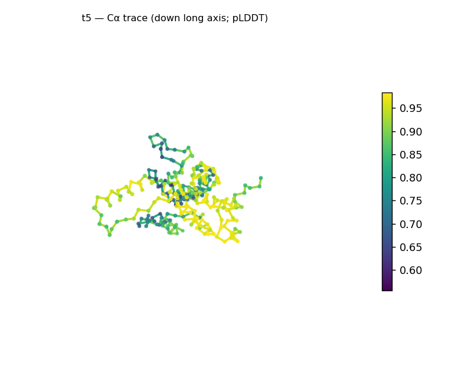
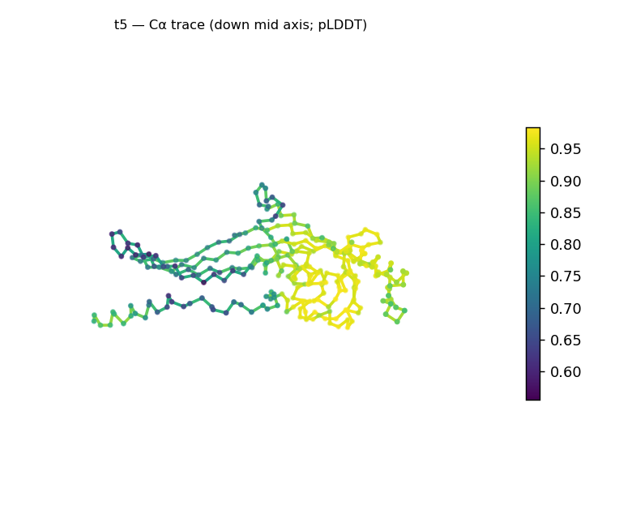
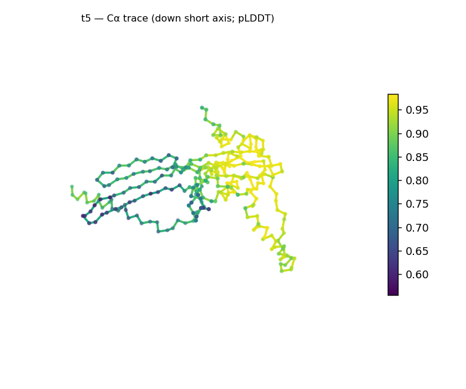
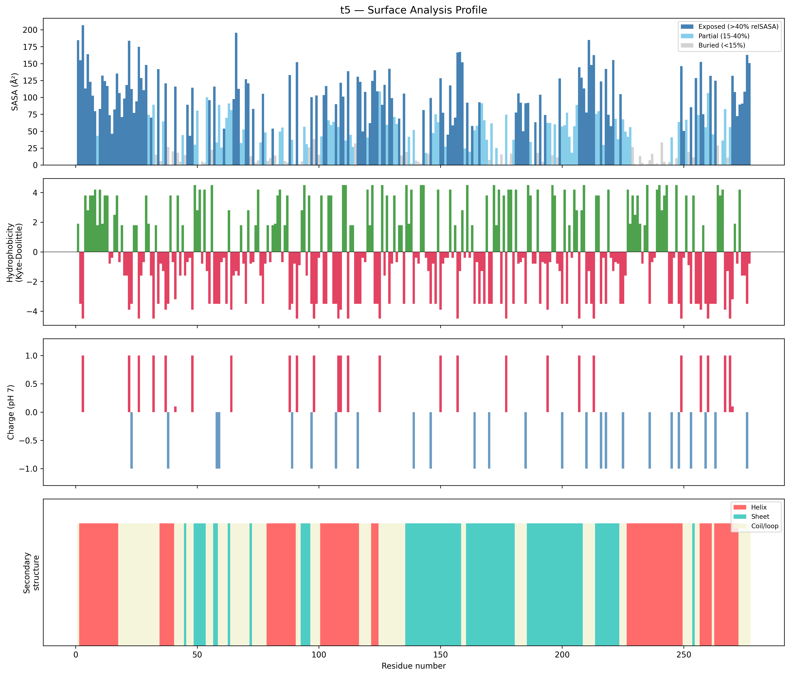
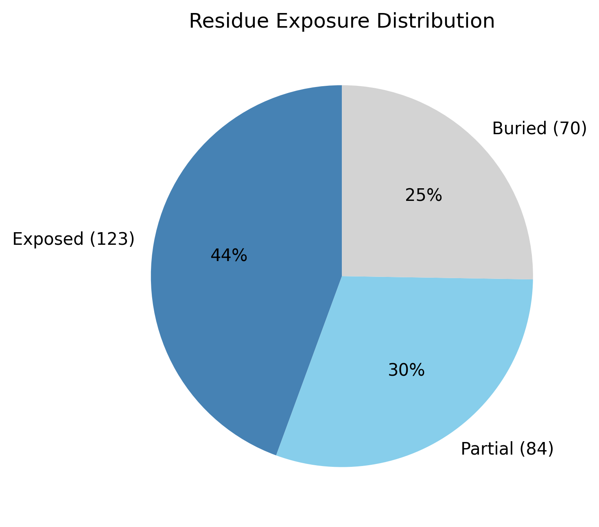

# Structural analysis — `t5`

> Facts are emitted deterministically from the measurement scripts. Sections marked with a SYNTHESIS comment are authored by the Claude session (judgment), kept visibly separate from the measured facts.

## Executive summary

A single-chain, 277-residue predicted model with balanced secondary structure — 32.9% helix and 32.9% sheet (34.3% coil) — giving a coarse class of **mixed α/β character** (α/β vs α+β unresolved; per-residue ordering ambiguous). The model is somewhat elongated (asphericity 0.28, ~6.6:1 long:short axis ratio) with a modest core (buried 25.3%) and Rg 26.0 Å, slightly above the ~23.7 Å expected for 277 residues — reported as shape characteristics, not inconsistencies. The surface is near charge-neutral (net +3.2 e) with a notable 10-residue hydrophobic patch at the N-terminus (residues 4–13). Confidence is good (mean pLDDT 84.3, median 88.7).

## User-provided context

None provided. All observations below are derived from the structure alone.

## Structure overview

- **Source:** predicted model — pLDDT in the B-factor column
- **Chains:** 1 (single chain)
- **Residues / atoms:** 277 / 2147
- **Missing residues:** 0
- **Non-solvent ligands:** none
  - chain **A**: 277 res

## Structural views

_Cα backbone trace (Agent 2.2 matplotlib placeholder), down the long / mid / short principal axes; coloured by pLDDT._

## Shape & secondary structure

- **Shape:** prolate (elongated) (asphericity 0.28, Rg 26 Å)
- **Approx. dimensions:** 85.6 × 62 × 40.1 Å
- **Secondary structure:** helix 32.9%, sheet 32.9%, coil 34.3%

## Surface properties

- **Exposure:** buried 25.3%, partial 30.3%, exposed 44.4%
- **Total SASA:** 18896.3 Ų
- **Surface hydrophobicity (KD):** mean -0.8 ± 2.95
- **Surface charge (pH 7):** net 3.2 e (17 +, 12 −)
- **Hydrophobic patches:** 2:
  - residues 4–13 (len 10, mean KD 3.39)
  - residues 120–122 (len 3, mean KD 3.5)

## Prediction quality / structural coherence

Confidence is **reported, never gated** — these signals are inputs for the synthesis below, not a pass/fail.

- **pLDDT (chain A):** mean 84.29, median 88.7, range 55.52–98.35, std 12.5
- **Compactness:** Rg 26 Å vs ~23.7 Å expected for 277 residues (2.5·N^0.4) — consistent
- **Core present:** buried fraction 25.3%
- **Coil fraction:** 34.3%

### Coherence assessment

Signals are consistent with a folded model of modest compactness. ~66% of residues are in defined SS and mean pLDDT is high (84.3, median 88.7), but the core is on the lighter side (25.3% buried) and the chain is somewhat elongated (asphericity 0.28; Rg 26.0 Å vs ~23.7 expected) — a folded but not tightly globular architecture, not a molten or disordered one.

## Expected-parameter comparison

_No expected-parameter profile supplied — this is the default for novel / low-homology targets. See the independent observations below._

## Independent observations

- **Balanced mixed α/β.** 32.9% helix / 32.9% sheet; coarse class mixed α/β-or-α+β, ordering ambiguous so the parallel-vs-antiparallel call is left open.
- **Somewhat elongated, modest core.** Asphericity 0.28 and 25.3% buried (44.4% exposed) — folded but looser-packed and non-globular; the elongation is a shape characteristic, not an inconsistency.
- **N-terminal hydrophobic stretch.** A 10-residue hydrophobic patch at residues 4–13 (mean KD 3.39) — an exposed hydrophobic segment at the very N-terminus; otherwise the surface is near-neutral (net +3.2 e).

## What cannot be determined from structure alone

- **Identity and function** — not established; the analysis is identity-agnostic.
- **Specific fold / α/β vs α+β** — balanced mixed class; topology needs database verification (Foldseek/CATH).
- **The N-terminal hydrophobic stretch's role** — structural, an interface, or a cleavable/targeting segment — is not determinable from structure alone.
- **Mechanism** — no ligands detected; insufficient structural evidence to assign a function.

## Methods

- **Measurements (deterministic):** `parse_structure.py` (metadata, confidence stats), `surface_analysis.py` (Shrake–Rupley SASA, Kyte–Doolittle hydrophobicity, charge at pH 7, DSSP secondary structure, shape metrics), `render_trace.py` (Agent 2.2 Cα-trace figures; `render_views.py` Mol* cartoons when Agent 2.1 is available).
- **Report facts** below the synthesis sections are emitted verbatim from the above scripts' JSON by `assemble_report.py` — no transcription.
- **Synthesis** sections (executive summary, independent observations, coherence assessment, cannot-determine) are authored by Claude per `SKILL.md` Step 9, each claim cited to a measurement.
