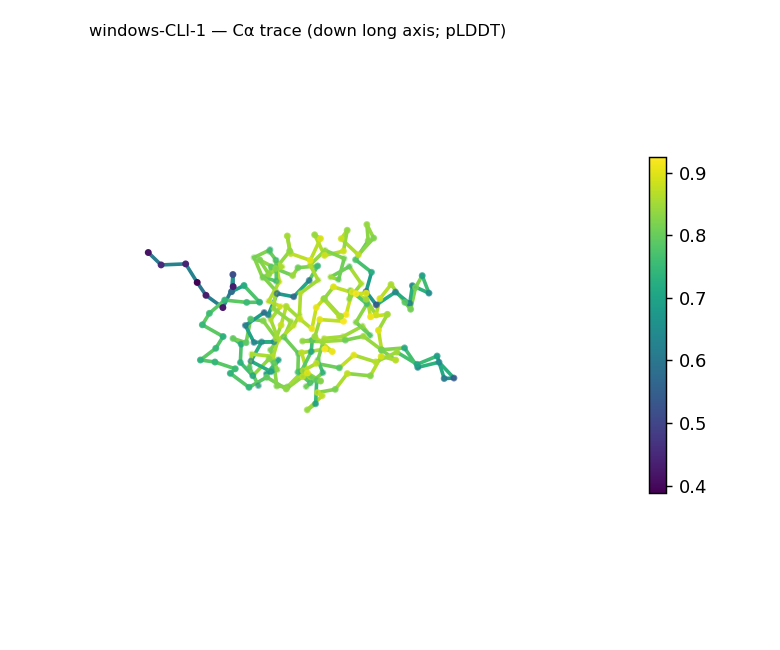
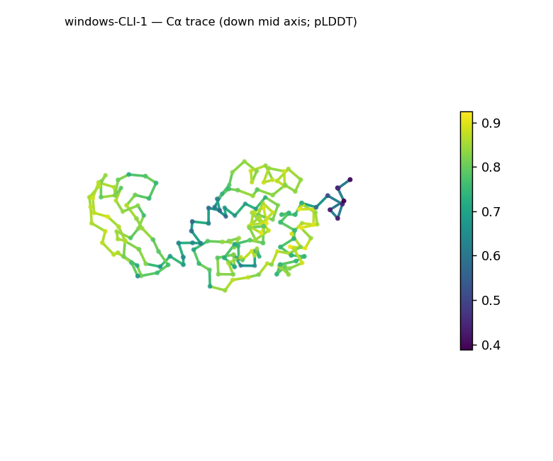
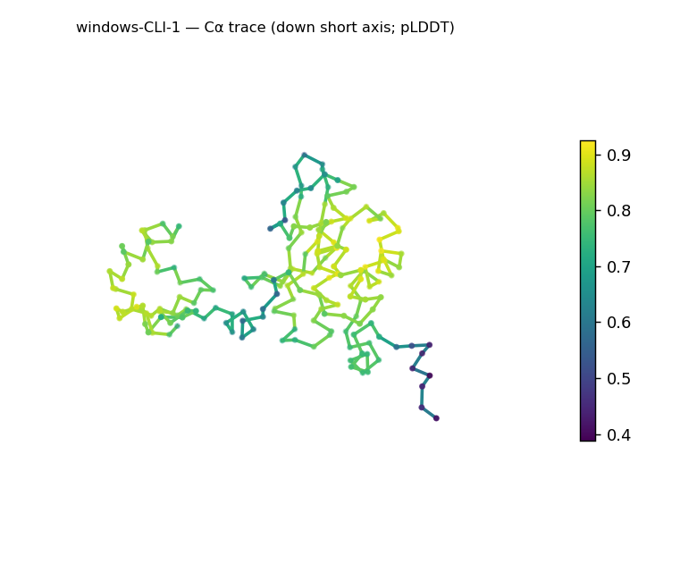
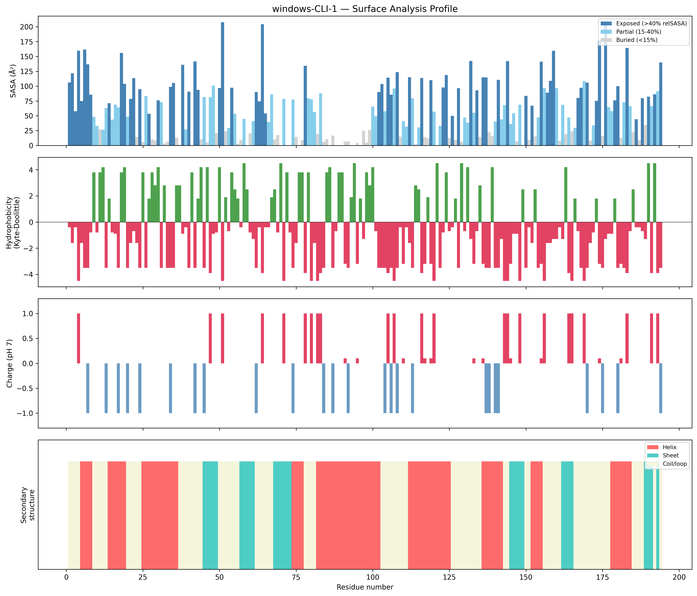
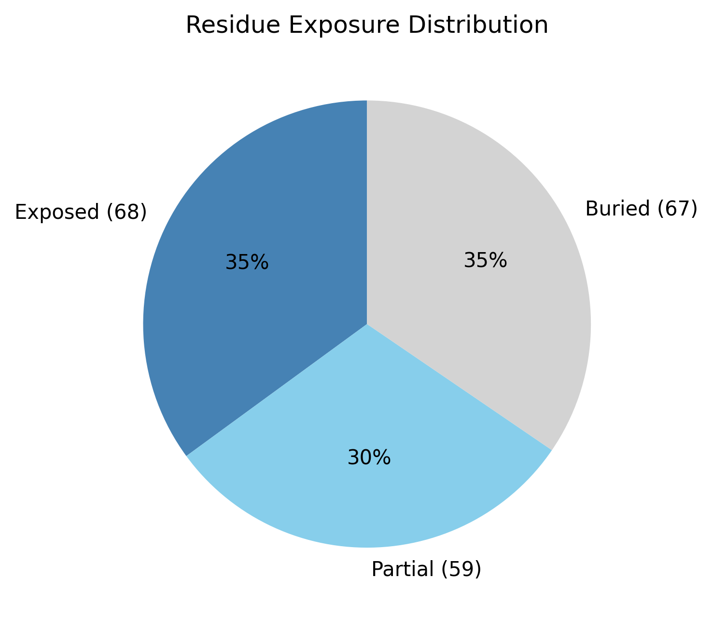

# Structural analysis — `windows-CLI-1`

> Facts are emitted deterministically from the measurement scripts. Sections marked with a SYNTHESIS comment are authored by the Claude session (judgment), kept visibly separate from the measured facts.

## Executive summary

Inferred coarse structural class: a **mixed α/β architecture, helix-predominant** — both helix (40.7%) and β-strand (14.9%) are present, and they interleave along the C-terminal half of the chain (…E45–49 · H74–77 · E145–149 · H152–155 · E162–165 · H178–184…). This is inference from the measured SS content and per-residue ordering, not a fold identification. The 194-residue chain is moderately elongated (asphericity 0.23, long:short axis ratio 4.97) yet appropriately compact for its length (Rg 19.41 Å vs the ~20.6 Å expected from 2.5·N^0.4). The surface is moderately polar (mean Kyte–Doolittle −1.42) and near-neutral (net −3.6 e, 12 positive / 12 negative residues) with no exposed hydrophobic patches. Confidence is moderate-to-good overall but uneven (mean pLDDT 77.95, range 38.79–92.5, std 11.69).

## User-provided context

None provided. No prior biological context (organism, function, or expected features) was supplied; all observations in this report derive from structural measurement alone.

## Structure overview

- **Source:** predicted model — pLDDT in the B-factor column
- **Chains:** 1 (single chain)
- **Residues / atoms:** 194 / 1597
- **Missing residues:** 0
- **Non-solvent ligands:** none
  - chain **A**: 194 res

## Structural views

_Cα backbone trace (Agent 2.2 matplotlib placeholder), down the long / mid / short principal axes; coloured by pLDDT._

## Shape & secondary structure

- **Shape:** prolate (elongated) (asphericity 0.23, Rg 19.41 Å)
- **Approx. dimensions:** 57.8 × 47.4 × 29.6 Å
- **Secondary structure:** helix 40.7%, sheet 14.9%, coil 44.3%

## Surface properties

- **Exposure:** buried 34.5%, partial 30.4%, exposed 35.1%
- **Total SASA:** 11588.2 Ų
- **Surface hydrophobicity (KD):** mean -1.42 ± 2.62
- **Surface charge (pH 7):** net -3.6 e (12 +, 12 −)
- **Hydrophobic patches:** 0

## Prediction quality / structural coherence

Confidence is **reported, never gated** — these signals are inputs for the synthesis below, not a pass/fail.

- **pLDDT (chain A):** mean 77.95, median 81.87, range 38.79–92.5, std 11.69
- **Compactness:** Rg 19.41 Å vs ~20.6 Å expected for 194 residues (2.5·N^0.4) — consistent
- **Core present:** buried fraction 34.5%
- **Coil fraction:** 44.3%

### Coherence assessment

The coherence signals agree with the confidence score and with each other. Compactness is on target (Rg 19.41 Å vs ~20.6 Å expected), a buried core is present (34.5%), and SS elements span the whole chain rather than clustering, so the 44.3% coil is distributed rather than one long unstructured stretch. The mean pLDDT (77.95) sits in the "confident" tier, and the wide range (38.79–92.5, std 11.69) localizes the uncertainty to a few low-confidence segments coexisting with a well-ordered core. Nothing here suggests the moderate confidence reflects a non-fold — the geometry is that of a folded, moderately elongated domain.

## Expected-parameter comparison

_No expected-parameter profile supplied — this is the default for novel / low-homology targets. See the independent observations below._

## Independent observations

Against the generic globular baseline in the interpretation guide (exposed 25–35%, buried 40–55%), the buried fraction is somewhat low (34.5%) and the exposed fraction sits at the top of the range (35.1%) — consistent with the moderately elongated shape (asphericity 0.23), which raises surface-to-volume. The elongation itself is not an inconsistency and does not contradict the mixed α/β class. The surface is unremarkable relative to baseline: near-neutral charge (net −3.6 e) and no hydrophobic patches. The clearest caveat is the pLDDT minimum (38.79), which flags at least one segment whose backbone should be treated cautiously. No measurements contradict one another.

## What cannot be determined from structure alone

This analysis describes the structure; it cannot establish the protein's identity, a specific fold or superfamily, its biological function, or any catalytic mechanism. The "mixed α/β" call is the coarse-class ceiling supported by the SS content and shape — naming a specific fold would require database verification (Foldseek/CATH/SCOP). Homology and evolutionary relationships are out of reach without sequence/structure search. Because this is a single-chain predicted model with no modeled ligands, oligomeric state, biological assembly, and any cofactor/ligand binding cannot be inferred here. There is insufficient structural evidence to assign a function.

## Methods

- **Measurements (deterministic):** `parse_structure.py` (metadata, confidence stats), `surface_analysis.py` (Shrake–Rupley SASA, Kyte–Doolittle hydrophobicity, charge at pH 7, DSSP secondary structure, shape metrics), `render_trace.py` (Agent 2.2 Cα-trace figures; `render_views.py` Mol* cartoons when Agent 2.1 is available).
- **Report facts** below the synthesis sections are emitted verbatim from the above scripts' JSON by `assemble_report.py` — no transcription.
- **Synthesis** sections (executive summary, independent observations, coherence assessment, cannot-determine) are authored by Claude per `SKILL.md` Step 9, each claim cited to a measurement.
