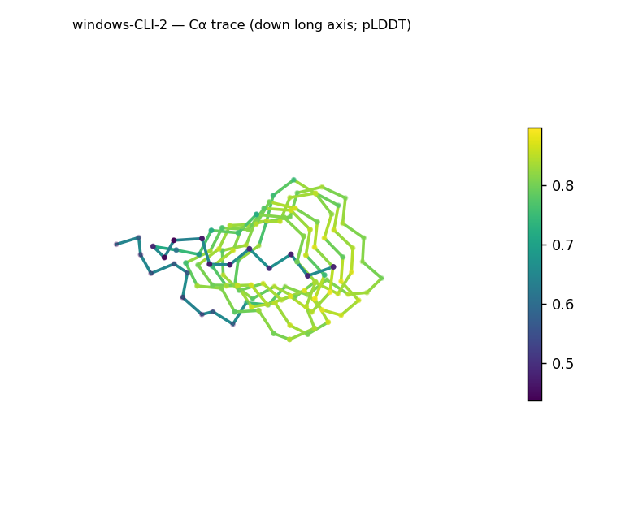
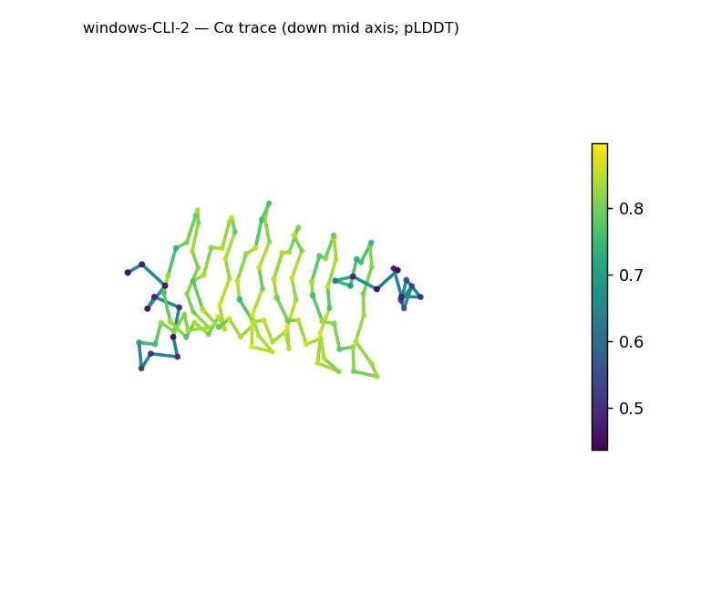
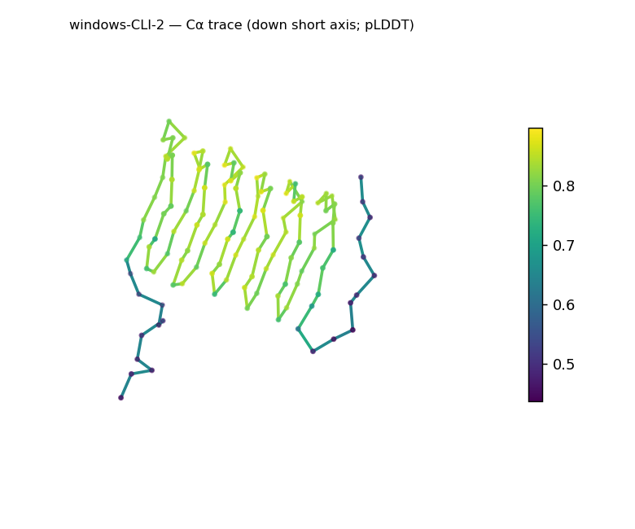
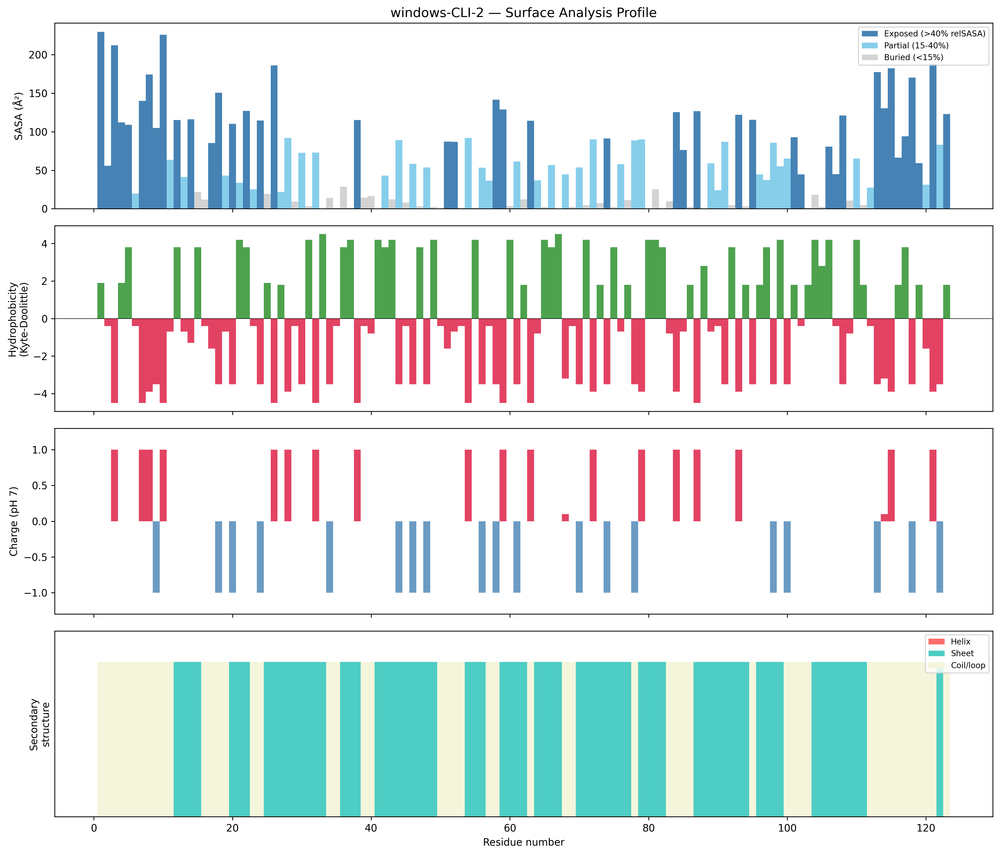
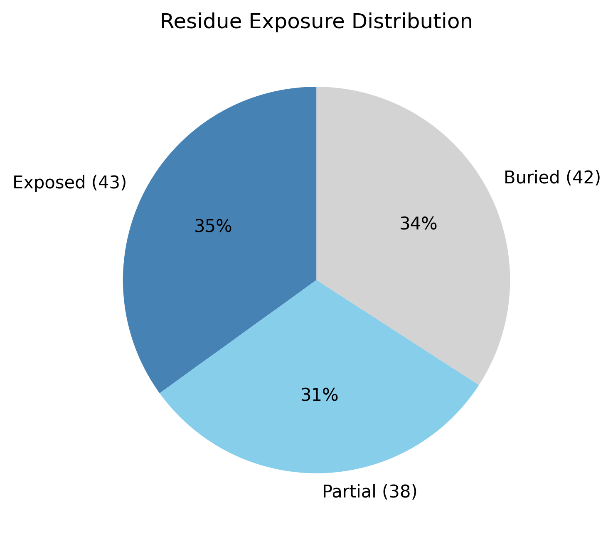

# Structural analysis — `windows-CLI-2`

> Facts are emitted deterministically from the measurement scripts. Sections marked with a SYNTHESIS comment are authored by the Claude session (judgment), kept visibly separate from the measured facts.

## Executive summary

Inferred coarse structural class: **all-β** — β-strand accounts for 58.5% of residues while helix is entirely absent (0.0%), a clean assignment built from 14 distinct strand segments spanning the chain. This is inference from the measured SS content, not a fold identification. The 123-residue chain is roughly globular and well-packed (asphericity 0.088; Rg 13.56 Å, slightly below the ~17.1 Å expected for its length, i.e. compact). The surface is moderately polar (mean Kyte–Doolittle −1.64) and net positive (+5.1 e, 14 positive / 8 negative residues), with no exposed hydrophobic patches. A buried core (34.1%) and a confident mean pLDDT (76.01) are consistent with a folded β protein.

## User-provided context

None provided. No prior biological context (organism, function, or expected features) was supplied; all observations in this report derive from structural measurement alone.

## Structure overview

- **Source:** predicted model — pLDDT in the B-factor column
- **Chains:** 1 (single chain)
- **Residues / atoms:** 123 / 919
- **Missing residues:** 0
- **Non-solvent ligands:** none
  - chain **A**: 123 res

## Structural views

_Cα backbone trace (Agent 2.2 matplotlib placeholder), down the long / mid / short principal axes; coloured by pLDDT._

## Shape & secondary structure

- **Shape:** roughly globular (asphericity 0.09, Rg 13.56 Å)
- **Approx. dimensions:** 38.8 × 35.4 × 22 Å
- **Secondary structure:** helix 0.0%, sheet 58.5%, coil 41.5%

## Surface properties

- **Exposure:** buried 34.1%, partial 30.9%, exposed 35.0%
- **Total SASA:** 7728.6 Ų
- **Surface hydrophobicity (KD):** mean -1.64 ± 2.89
- **Surface charge (pH 7):** net 5.1 e (14 +, 8 −)
- **Hydrophobic patches:** 0

## Prediction quality / structural coherence

Confidence is **reported, never gated** — these signals are inputs for the synthesis below, not a pass/fail.

- **pLDDT (chain A):** mean 76.01, median 81.54, range 43.68–89.69, std 14.11
- **Compactness:** Rg 13.56 Å vs ~17.1 Å expected for 123 residues (2.5·N^0.4) — consistent
- **Core present:** buried fraction 34.1%
- **Coil fraction:** 41.5%

### Coherence assessment

The coherence signals agree with the confidence score. Compactness is good (Rg 13.56 Å, below the ~17.1 Å expectation), a buried core is present (34.1%), and the chain is an ordered β architecture rather than coil-dominated (41.5% coil, 58.5% strand). The mean pLDDT (76.01) is in the "confident" tier; the range (43.68–89.69, std 14.11) indicates some lower-confidence regions but a coherent overall fold. This is the expected picture of a compact, well-packed all-β domain — the moderate pLDDT sits alongside a clearly coherent β fold rather than signalling a non-structure.

## Expected-parameter comparison

_No expected-parameter profile supplied — this is the default for novel / low-homology targets. See the independent observations below._

## Independent observations

The most notable feature relative to a near-neutral surface baseline is the net positive charge (+5.1 e, 14 positive vs 8 negative). The interpretation guide notes that a *strong* net-positive surface can accompany nucleic-acid binding, but +5.1 e is only a mild positive skew, so this is reported descriptively, not as a functional call. Against the generic globular baseline (buried 40–55%), the buried fraction is modestly low (34.1%), while the compact Rg (below the length-based expectation) indicates dense packing rather than an open conformation. No hydrophobic patches and no internal inconsistencies among the measurements.

## What cannot be determined from structure alone

This analysis cannot establish the protein's identity, a specific β fold or superfamily, its biological function, or any mechanism. The net-positive surface (+5.1 e) is a structural observation only — it cannot, on its own, assign nucleic-acid binding or any other function. The all-β call is the coarse-class ceiling from SS content; naming a specific fold would require database verification (Foldseek/CATH/SCOP). Homology and evolutionary relationships are out of reach without a sequence/structure search. As a single-chain predicted model with no modeled ligands, oligomeric state, biological assembly, and ligand/cofactor binding cannot be inferred. There is insufficient structural evidence to assign a function.

## Methods

- **Measurements (deterministic):** `parse_structure.py` (metadata, confidence stats), `surface_analysis.py` (Shrake–Rupley SASA, Kyte–Doolittle hydrophobicity, charge at pH 7, DSSP secondary structure, shape metrics), `render_trace.py` (Agent 2.2 Cα-trace figures; `render_views.py` Mol* cartoons when Agent 2.1 is available).
- **Report facts** below the synthesis sections are emitted verbatim from the above scripts' JSON by `assemble_report.py` — no transcription.
- **Synthesis** sections (executive summary, independent observations, coherence assessment, cannot-determine) are authored by Claude per `SKILL.md` Step 9, each claim cited to a measurement.
