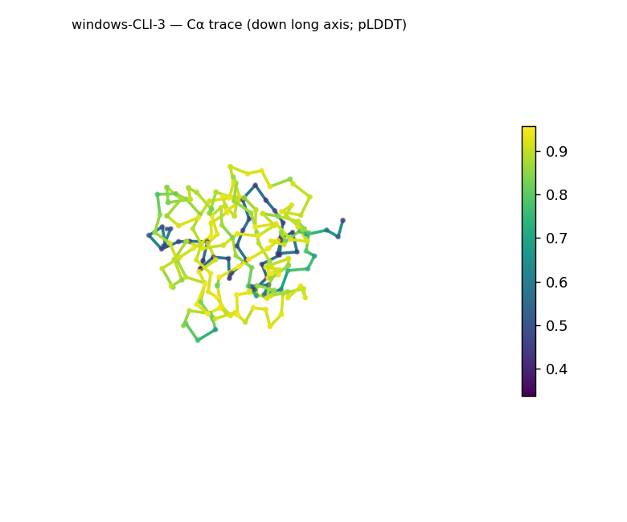
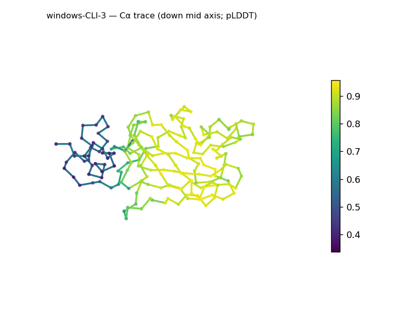
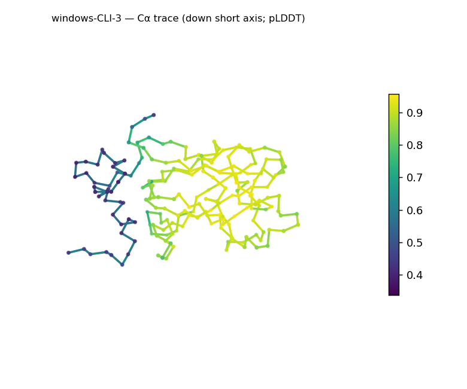
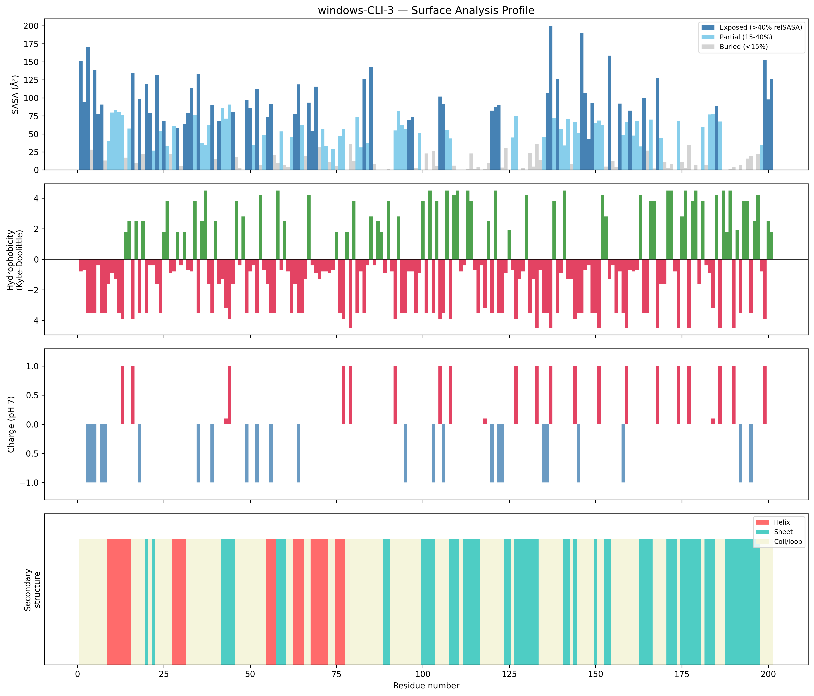
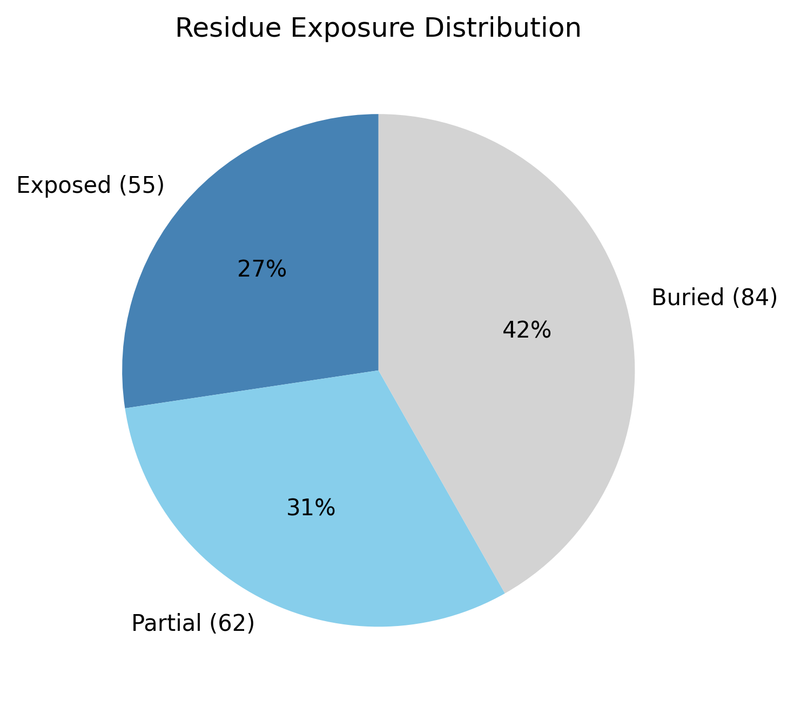

# Structural analysis — `windows-CLI-3`

> Facts are emitted deterministically from the measurement scripts. Sections marked with a SYNTHESIS comment are authored by the Claude session (judgment), kept visibly separate from the measured facts.

## Executive summary

This 201-residue single chain is a predicted model (pLDDT in the B-factor column) with **β-predominant** secondary-structure content — sheet 31.8% versus helix 12.4% (pydssp) — packed into a compact, well-buried core (Rg 16.68 Å vs ~20.9 Å expected; buried fraction 41.8%). Confidence is good but uneven: median pLDDT 88.42 with most of the chain confident, alongside a low minimum (33.74, std 20.3) that localizes uncertainty to part of the model. Because secondary structure here comes from the **pydssp fallback rather than mkdssp**, the 12.4% helix — six short segments (3–7 residues) confined to the N-terminal third — and the precise helix/coil split are provisional and may be over-called on the lower-confidence backbone; the robust signal is β-strand. The coarse class is therefore **β-predominant (mixed α/β at most), Moderate confidence** — whether residual helix makes this α+β or the chain is essentially all-β cannot be settled without mkdssp. The surface is strongly acidic (net −9 e) and moderately polar (mean KD −1.54), with no exposed hydrophobic patches.

## User-provided context

None provided. No organism, function, or expected structural features were supplied; all observations below derive from structural measurement alone.

## Structure overview

- **Source:** predicted model — pLDDT in the B-factor column
- **Chains:** 1 (single chain)
- **Residues / atoms:** 201 / 1617
- **Missing residues:** 0
- **Non-solvent ligands:** none
  - chain **A**: 201 res

## Structural views

_Cα backbone trace (Agent 2.2 matplotlib placeholder), down the long / mid / short principal axes; coloured by pLDDT._

## Shape & secondary structure

- **Shape:** prolate (elongated) (asphericity 0.19, Rg 16.68 Å)
- **Approx. dimensions:** 53 × 34.8 × 30.4 Å
- **Secondary structure:** helix 12.4%, sheet 31.8%, coil 55.7% _(method: pydssp)_
- **⚠ SS assigned by pydssp (fallback), not mkdssp** — pydssp is a simplified DSSP reimplementation and can over- or under-call short helix/sheet segments on imperfect (e.g. predicted) backbones. Treat fractions near the ~5% floor, the helix/sheet split, and any coil-vs-disorder reasoning as provisional; install mkdssp for reference-grade assignment.

## Surface properties

- **Exposure:** buried 41.8%, partial 30.8%, exposed 27.4%
- **Total SASA:** 10008.9 Ų
- **Surface hydrophobicity (KD):** mean -1.54 ± 2.35
- **Surface charge (pH 7):** net -9 e (5 +, 14 −)
- **Hydrophobic patches:** 0

## Prediction quality / structural coherence

Confidence is **reported, never gated** — these signals are inputs for the synthesis below, not a pass/fail.

- **pLDDT (chain A):** mean 78.82, median 88.42, range 33.74–95.63, std 20.3
- **Compactness:** Rg 16.68 Å vs ~20.9 Å expected for 201 residues (2.5·N^0.4) — consistent
- **Core present:** buried fraction 41.8%
- **Coil fraction:** 55.7%

### Coherence assessment

The coherence signals point to a genuinely folded core, not a disordered chain. A confident median pLDDT (88.42), a radius of gyration slightly below the globular expectation (16.68 Å vs ~20.9 Å — compact, not extended), and a substantial buried fraction (41.8%, within the 40–55% globular range) converge on a packed core, and there are no missing residues or chain breaks. The low mean (78.82), wide spread (std 20.3), and low minimum (33.74) indicate the uncertainty is **localized** — consistent with lower-confidence loops or termini rather than global disorder. I deliberately do not lean on the exact coil fraction (55.7%) here: it comes from the pydssp fallback, so the precise helix-vs-coil split is method-dependent, and a "high coil but not disorder" argument resting on that number would over-state the evidence. The disorder indicators that do not depend on the SS method — buried core present, compact dimensions, no missing residues — do not converge toward disorder; mkdssp would be needed to firm up the SS-derived part of this picture.

## Expected-parameter comparison

_No expected-parameter profile supplied — this is the default for novel / low-homology targets. See the independent observations below._

## Independent observations

The most distinctive measured feature is the surface charge: net −9 e (5 positive, 14 negative) is strongly acidic against the near-neutral baseline typical of soluble proteins, and there are zero exposed hydrophobic patches. Secondary structure is β-dominated — sheet 31.8% in several long runs (up to ~10 residues), against helix 12.4% in six short N-terminal runs (3–7 residues); the helix is the less robust of the two and, under the pydssp fallback, may be partly over-called, so the β-predominance is the firmer observation. The shape is moderately elongated (asphericity 0.19, long:short axis ratio 3.7) — an unusual-but-legitimate characteristic, not an inconsistency, and it does not bear on the fold class. The main internal caveat is the confidence spread (median pLDDT 88.42 vs minimum 33.74) compounded by the SS method (pydssp, not mkdssp), which concentrates uncertainty in the helix/coil split specifically; no measurements directly contradict one another. This is a structural description, not an identity, fold-name, or function call — there is insufficient structural evidence to assign function.

## Methods

- **Measurements (deterministic):** `parse_structure.py` (metadata, confidence stats), `surface_analysis.py` (Shrake–Rupley SASA, Kyte–Doolittle hydrophobicity, charge at pH 7, DSSP secondary structure, shape metrics), `render_trace.py` (Agent 2.2 Cα-trace figures; `render_views.py` Mol* cartoons when Agent 2.1 is available).
- **Report facts** below the synthesis sections are emitted verbatim from the above scripts' JSON by `assemble_report.py` — no transcription.
- **Synthesis** sections (executive summary, independent observations incl. the one-line scope statement, coherence assessment) are authored by Claude per `SKILL.md` Step 9, each claim cited to a measurement.
