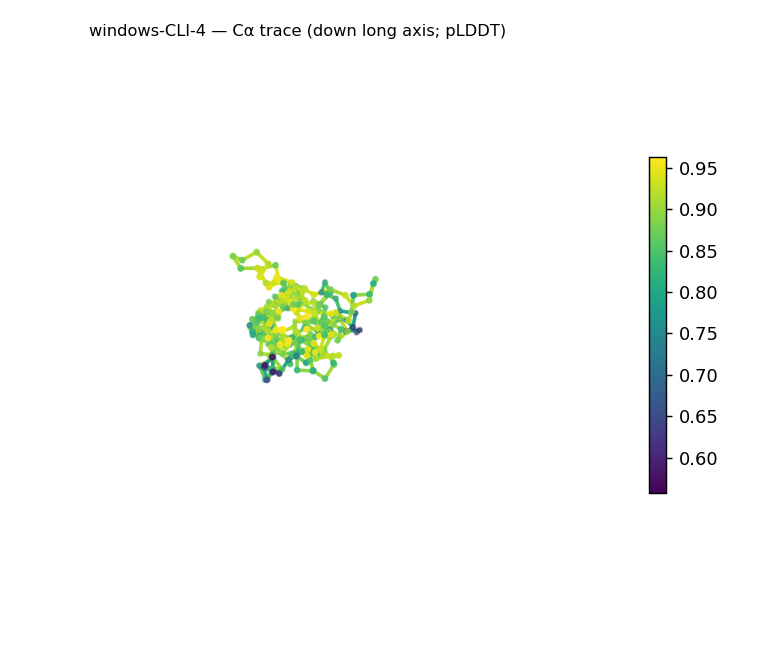
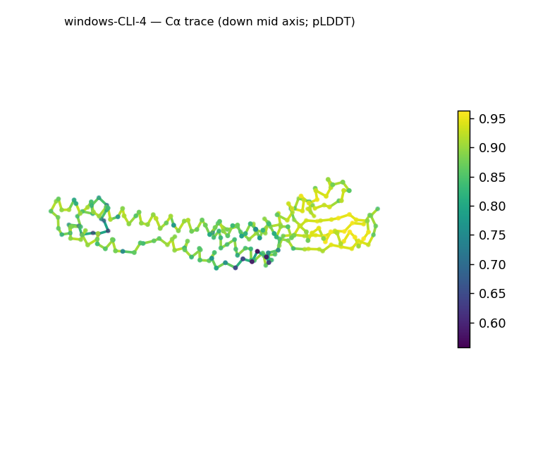
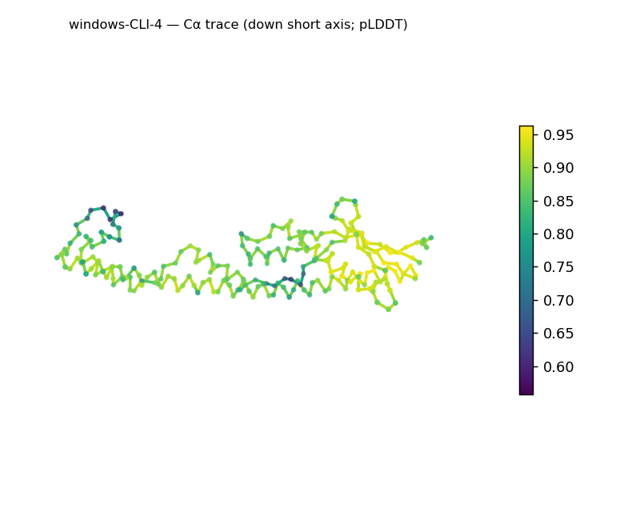
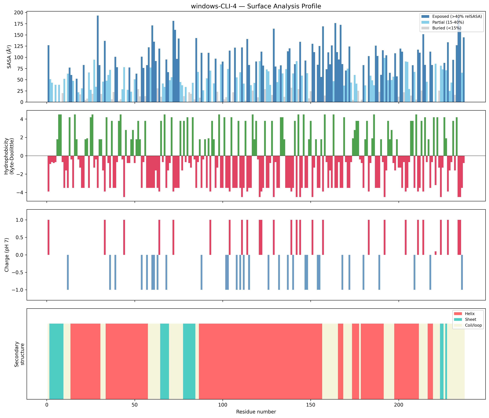
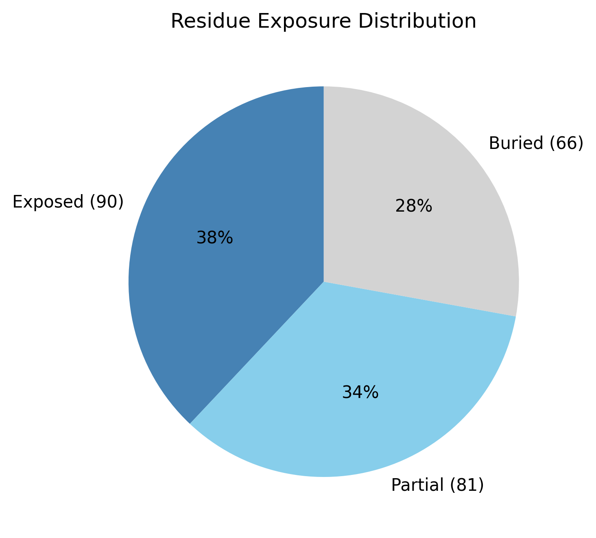

# Structural analysis — `windows-CLI-4`

> Facts are emitted deterministically from the measurement scripts. Sections marked with a SYNTHESIS comment are authored by the Claude session (judgment), kept visibly separate from the measured facts.

## Executive summary

Inferred coarse structural class: **predominantly all-α** — helix accounts for 62.4% of residues against only 9.7% β-strand (a handful of short edge strands near the termini), inferred from the measured SS content and ordering. The defining feature is extreme elongation: the 237-residue chain forms a ~105 Å rod (asphericity 0.78; approximate dimensions 105.4 × 30.7 × 28.1 Å; long:mid axis ratio 21.2; Rg 31.39 Å, well above the ~22.3 Å globular expectation), organized around one very long continuous helix spanning roughly residues 87–156. The surface is polar (mean Kyte–Doolittle −1.9) and near-neutral (net +2 e, 18 positive / 16 negative), with a single short hydrophobic patch (residues 194–196). Confidence is high and uniform (mean pLDDT 85.79, median 87.27, std 8.01, range 55.71–96.31).

## User-provided context

None provided. No prior biological context (organism, function, or expected features) was supplied; all observations in this report derive from structural measurement alone.

## Structure overview

- **Source:** predicted model — pLDDT in the B-factor column
- **Chains:** 1 (single chain)
- **Residues / atoms:** 237 / 1878
- **Missing residues:** 0
- **Non-solvent ligands:** none
  - chain **A**: 237 res

## Structural views

_Cα backbone trace (Agent 2.2 matplotlib placeholder), down the long / mid / short principal axes; coloured by pLDDT._

## Shape & secondary structure

- **Shape:** prolate (elongated) (asphericity 0.78, Rg 31.39 Å)
- **Approx. dimensions:** 105.4 × 30.7 × 28.1 Å
- **Secondary structure:** helix 62.4%, sheet 9.7%, coil 27.8%

## Surface properties

- **Exposure:** buried 27.8%, partial 34.2%, exposed 38.0%
- **Total SASA:** 14977.5 Ų
- **Surface hydrophobicity (KD):** mean -1.9 ± 2.64
- **Surface charge (pH 7):** net 2 e (18 +, 16 −)
- **Hydrophobic patches:** 1:
  - residues 194–196 (len 3, mean KD 2.8)

## Prediction quality / structural coherence

Confidence is **reported, never gated** — these signals are inputs for the synthesis below, not a pass/fail.

- **pLDDT (chain A):** mean 85.79, median 87.27, range 55.71–96.31, std 8.01
- **Compactness:** Rg 31.39 Å vs ~22.3 Å expected for 237 residues (2.5·N^0.4) — larger than expected
- **Core present:** buried fraction 27.8%
- **Coil fraction:** 27.8%

### Coherence assessment

The confidence is high and uniform (mean pLDDT 85.79, std 8.01), and the SS content confirms an ordered structure (62.4% helix, only 27.8% coil) — so the model is coherent. The one signal that looks atypical in isolation is the low buried fraction (27.8%), which the interpretation guide flags as a possible extended/disordered indicator. Here it is explained by geometry, not disorder: a ~105 Å × ~30 Å rod has a high surface-to-volume ratio, so few residues fully bury even when the chain is fully folded, and the high helix content plus tight pLDDT rule disorder out. The larger-than-expected Rg (31.39 Å vs ~22.3 Å) and the high asphericity (0.78) corroborate each other — both report the same elongated architecture — so the compactness and shape signals are mutually consistent rather than contradictory.

## Expected-parameter comparison

_No expected-parameter profile supplied — this is the default for novel / low-homology targets. See the independent observations below._

## Independent observations

The standout observation is the elongated, helix-dominated rod: asphericity 0.78 and a long:mid axis ratio of 21.2 are far above the globular baseline (asphericity < 0.05–0.15 for globular proteins in the interpretation guide), and the architecture rests on a single ~70-residue continuous helix (residues 87–156). Elongation this extreme is unusual for a single domain — most are globular — and is worth highlighting as a legitimate characteristic, not an inconsistency; per the framing it does not lower the fold-class confidence. The buried fraction (27.8%) sits just below the typical globular range (40–55%), consistent with the rod geometry rather than indicating an open or disordered chain (helix 62.4%, high uniform pLDDT). The single short hydrophobic patch (194–196, mean KD 2.8) is minor. No measurements contradict one another.

## What cannot be determined from structure alone

This analysis cannot establish the protein's identity, a specific fold or superfamily, its biological function, or any mechanism. The elongated all-α geometry is described, but whether the rod is a standalone fibrous/structural element, a coiled-coil, or one arm of a larger assembly cannot be determined from a single-chain predicted model — oligomeric state and biological assembly are not inferable here. The all-α call is the coarse-class ceiling from SS content; naming a specific fold would require database verification (Foldseek/CATH/SCOP). Homology is out of reach without a sequence/structure search, and there are no modeled ligands to support any binding or catalytic inference. There is insufficient structural evidence to assign a function.

## Methods

- **Measurements (deterministic):** `parse_structure.py` (metadata, confidence stats), `surface_analysis.py` (Shrake–Rupley SASA, Kyte–Doolittle hydrophobicity, charge at pH 7, DSSP secondary structure, shape metrics), `render_trace.py` (Agent 2.2 Cα-trace figures; `render_views.py` Mol* cartoons when Agent 2.1 is available).
- **Report facts** below the synthesis sections are emitted verbatim from the above scripts' JSON by `assemble_report.py` — no transcription.
- **Synthesis** sections (executive summary, independent observations, coherence assessment, cannot-determine) are authored by Claude per `SKILL.md` Step 9, each claim cited to a measurement.
