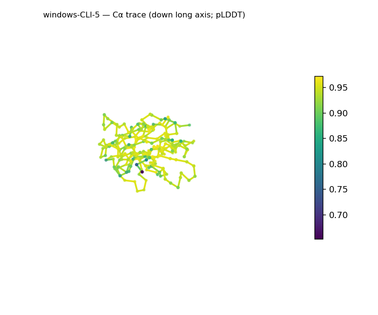
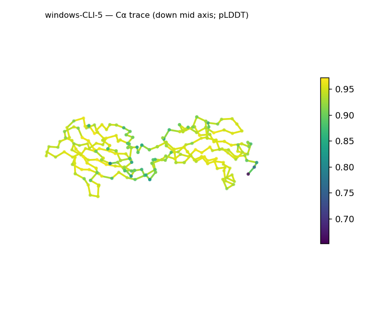
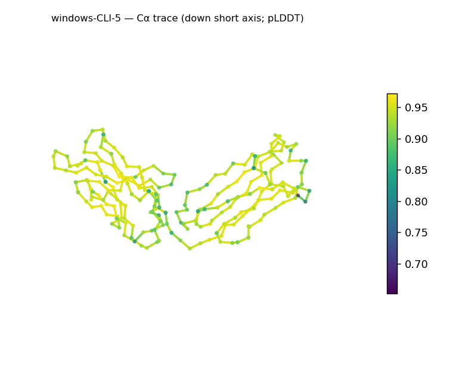
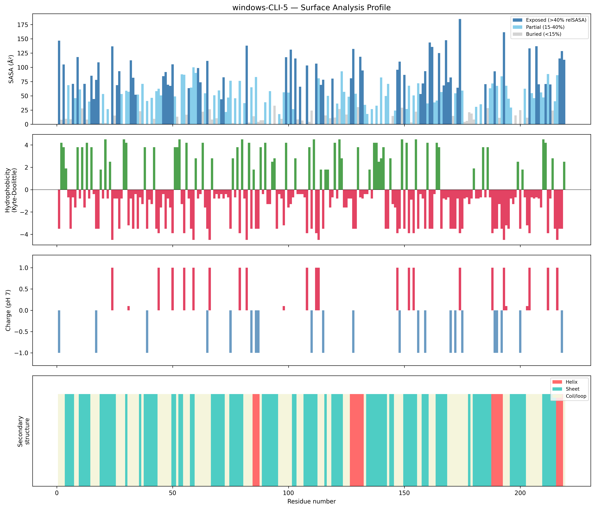
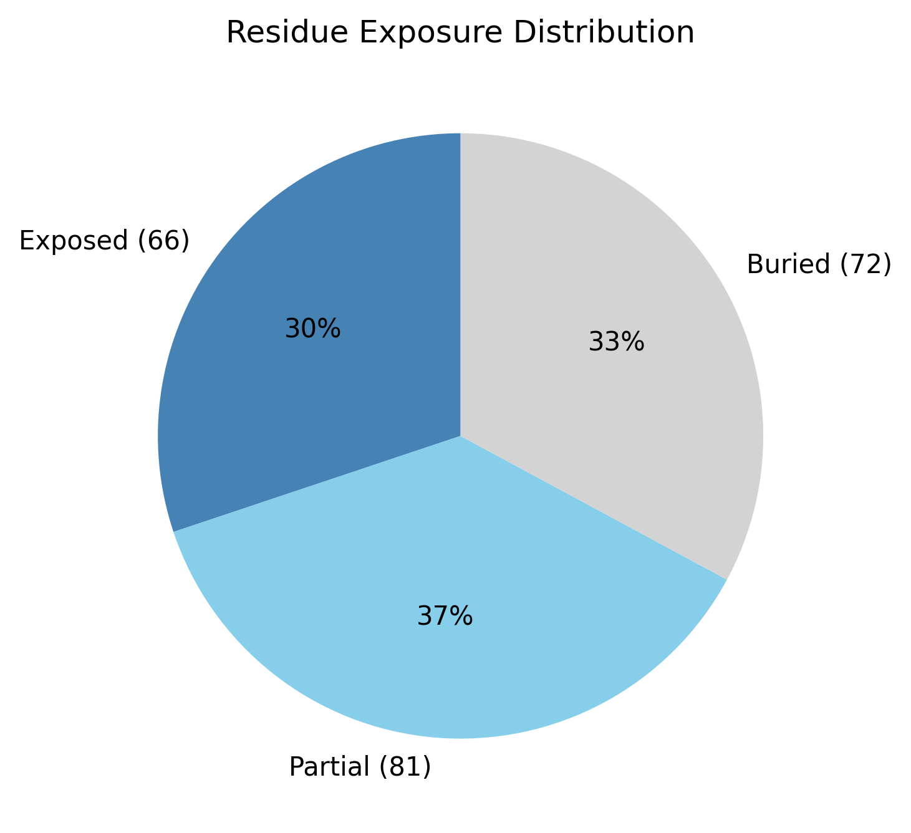

# Structural analysis — `windows-CLI-5`

> Facts are emitted deterministically from the measurement scripts. Sections marked with a SYNTHESIS comment are authored by the Claude session (judgment), kept visibly separate from the measured facts.

## Executive summary

Inferred coarse structural class: **predominantly all-β** — β-strand makes up 50.2% of residues against only 7.8% helix (a few short, scattered helical segments at residues ~85–87, 127–132, 188–192, 216–218), inferred from the measured SS content and ordering. The 219-residue chain is elongated (asphericity 0.51; ~75 Å long axis; long:short axis ratio 12.0), yet its radius of gyration (23.19 Å) matches the ~21.6 Å globular expectation. The surface is moderately polar (mean Kyte–Doolittle −1.39) and essentially neutral (net −1 e, 9 positive / 10 negative), with no exposed hydrophobic patches. This is the most confidently predicted model in the set (mean pLDDT 92.24, median 93.39, std 4.16, minimum 65.2).

## User-provided context

None provided. No prior biological context (organism, function, or expected features) was supplied; all observations in this report derive from structural measurement alone.

## Structure overview

- **Source:** predicted model — pLDDT in the B-factor column
- **Chains:** 1 (single chain)
- **Residues / atoms:** 219 / 1695
- **Missing residues:** 0
- **Non-solvent ligands:** none
  - chain **A**: 219 res

## Structural views

_Cα backbone trace (Agent 2.2 matplotlib placeholder), down the long / mid / short principal axes; coloured by pLDDT._

## Shape & secondary structure

- **Shape:** prolate (elongated) (asphericity 0.51, Rg 23.19 Å)
- **Approx. dimensions:** 75 × 34.6 × 27.8 Å
- **Secondary structure:** helix 7.8%, sheet 50.2%, coil 42.0%

## Surface properties

- **Exposure:** buried 32.9%, partial 37.0%, exposed 30.1%
- **Total SASA:** 11531.6 Ų
- **Surface hydrophobicity (KD):** mean -1.39 ± 2.38
- **Surface charge (pH 7):** net -1 e (9 +, 10 −)
- **Hydrophobic patches:** 0

## Prediction quality / structural coherence

Confidence is **reported, never gated** — these signals are inputs for the synthesis below, not a pass/fail.

- **pLDDT (chain A):** mean 92.24, median 93.39, range 65.2–97.17, std 4.16
- **Compactness:** Rg 23.19 Å vs ~21.6 Å expected for 219 residues (2.5·N^0.4) — consistent
- **Core present:** buried fraction 32.9%
- **Coil fraction:** 42.0%

### Coherence assessment

The coherence signals agree strongly with the confidence score — this is the cleanest model of the set. The pLDDT is both high and uniform (mean 92.24, std 4.16, minimum 65.2), compactness is on target (Rg 23.19 Å vs ~21.6 Å expected), a buried core is present (32.9%), and the chain is a dominant β architecture (50.2% strand). Every signal points the same way: a confident, coherent, well-packed β fold with nothing equivocal to reconcile.

## Expected-parameter comparison

_No expected-parameter profile supplied — this is the default for novel / low-homology targets. See the independent observations below._

## Independent observations

The interesting point relative to baseline is that, despite clear elongation (asphericity 0.51, ~75 Å long axis), the Rg (23.19 Å) still matches the length-based globular expectation (~21.6 Å) — i.e. the elongation is moderate enough that overall compactness is unremarkable. This is reported plainly, not as an inconsistency; per the framing, an elongated shape does not contradict the β class. The buried fraction (32.9%) is modestly below the typical globular range (40–55%), and the surface is neutral with no hydrophobic patches — both unremarkable. The high, uniform confidence (std 4.16) is itself the most notable feature here. No measurements contradict one another.

## What cannot be determined from structure alone

This analysis cannot establish the protein's identity, a specific β fold or superfamily, its biological function, or any mechanism — high prediction confidence speaks to model reliability, not to function. The all-β call is the coarse-class ceiling from SS content; naming a specific fold would require database verification (Foldseek/CATH/SCOP). Homology and evolutionary relationships are out of reach without a sequence/structure search. As a single-chain predicted model with no modeled ligands, oligomeric state, biological assembly, and ligand/cofactor binding cannot be inferred. There is insufficient structural evidence to assign a function.

## Methods

- **Measurements (deterministic):** `parse_structure.py` (metadata, confidence stats), `surface_analysis.py` (Shrake–Rupley SASA, Kyte–Doolittle hydrophobicity, charge at pH 7, DSSP secondary structure, shape metrics), `render_trace.py` (Agent 2.2 Cα-trace figures; `render_views.py` Mol* cartoons when Agent 2.1 is available).
- **Report facts** below the synthesis sections are emitted verbatim from the above scripts' JSON by `assemble_report.py` — no transcription.
- **Synthesis** sections (executive summary, independent observations, coherence assessment, cannot-determine) are authored by Claude per `SKILL.md` Step 9, each claim cited to a measurement.
