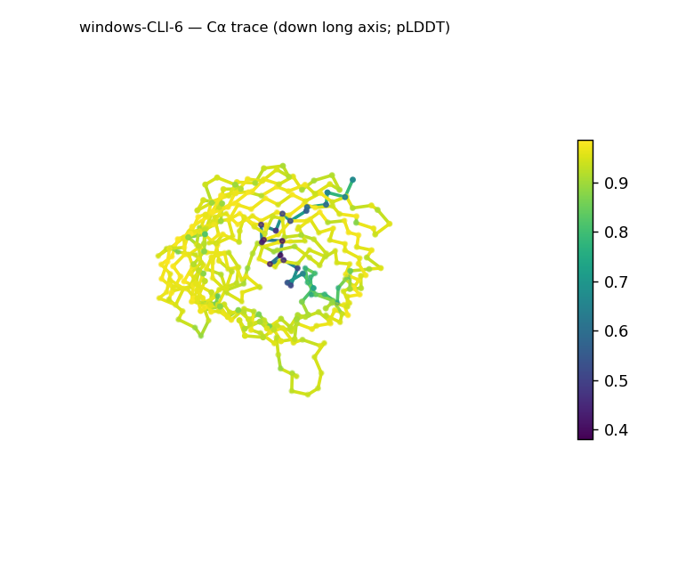
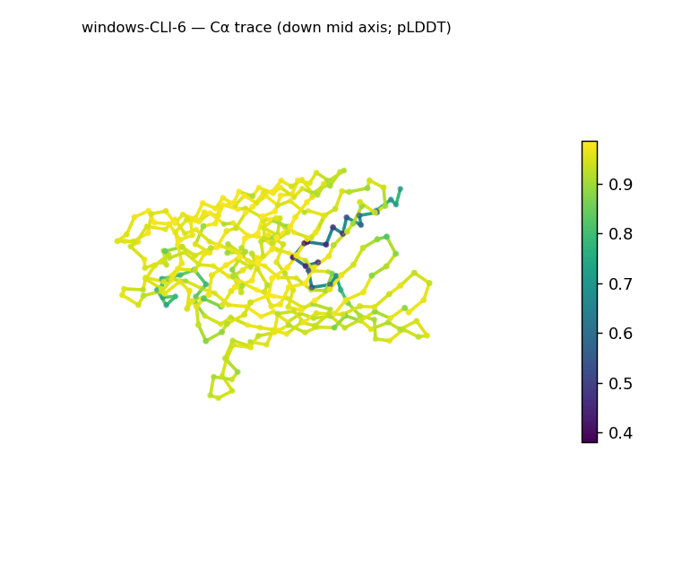
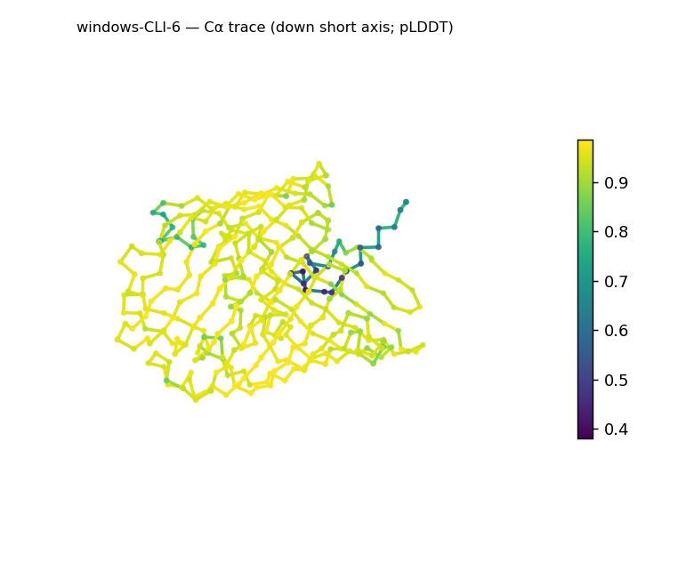
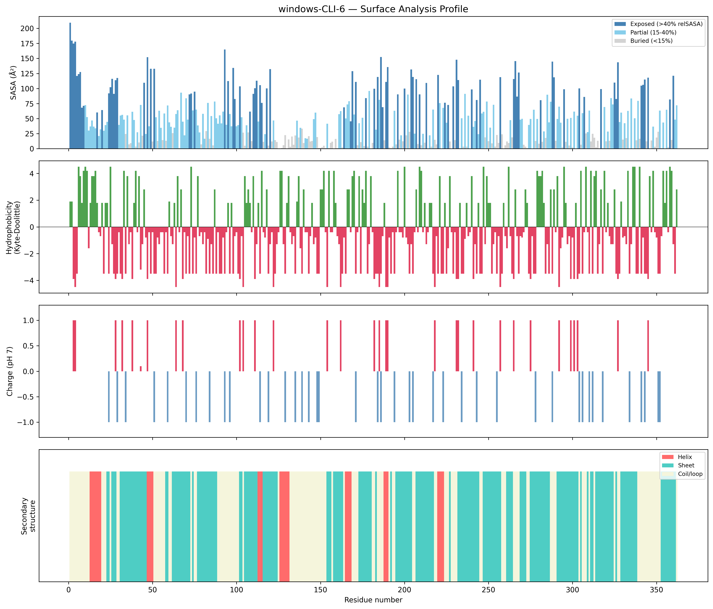
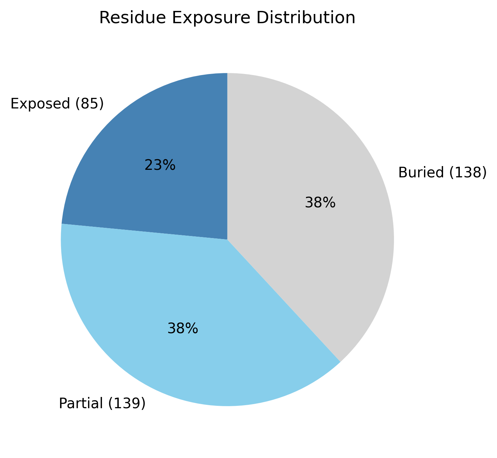

# Structural analysis — `windows-CLI-6`

> Facts are emitted deterministically from the measurement scripts. Sections marked with a SYNTHESIS comment are authored by the Claude session (judgment), kept visibly separate from the measured facts.

## Executive summary

Inferred coarse structural class: **predominantly β (all-β character)** — β-strand makes up 55.0% of residues against 8.6% helix, inferred from the measured SS content; at 362 residues this is best read as a whole-chain average that may span more than one domain, so per-domain segmentation would be needed to refine it (and to settle any α/β-vs-α+β sub-call). The chain is roughly globular (asphericity 0.05) and notably compact — Rg 20.31 Å is *smaller* than the ~26.4 Å expected for its length, with the lowest exposed fraction of the set (23.5%) and a substantial buried core (38.1%), i.e. dense packing. The surface is the least polar of the six (mean Kyte–Doolittle −0.68, in the mixed hydrophobic/polar band) and near-neutral (net +1 e, 15 positive / 14 negative), with two strong contiguous hydrophobic patches at the extreme N-terminus (residues 6–11 and 13–17, mean KD 3.83 and 3.08). Confidence is high overall (mean pLDDT 91.45, median 94.84) with a few low-confidence positions (range 38.01–98.61, std 10.93).

## User-provided context

None provided. No prior biological context (organism, function, or expected features) was supplied; all observations in this report derive from structural measurement alone.

## Structure overview

- **Source:** predicted model — pLDDT in the B-factor column
- **Chains:** 1 (single chain)
- **Residues / atoms:** 362 / 2782
- **Missing residues:** 0
- **Non-solvent ligands:** none
  - chain **A**: 362 res

## Structural views

_Cα backbone trace (Agent 2.2 matplotlib placeholder), down the long / mid / short principal axes; coloured by pLDDT._

## Shape & secondary structure

- **Shape:** roughly globular (asphericity 0.05, Rg 20.31 Å)
- **Approx. dimensions:** 59.9 × 45.9 × 45 Å
- **Secondary structure:** helix 8.6%, sheet 55.0%, coil 36.5%

## Surface properties

- **Exposure:** buried 38.1%, partial 38.4%, exposed 23.5%
- **Total SASA:** 17823.2 Ų
- **Surface hydrophobicity (KD):** mean -0.68 ± 3.23
- **Surface charge (pH 7):** net 1 e (15 +, 14 −)
- **Hydrophobic patches:** 2:
  - residues 6–11 (len 6, mean KD 3.83)
  - residues 13–17 (len 5, mean KD 3.08)

## Prediction quality / structural coherence

Confidence is **reported, never gated** — these signals are inputs for the synthesis below, not a pass/fail.

- **pLDDT (chain A):** mean 91.45, median 94.84, range 38.01–98.61, std 10.93
- **Compactness:** Rg 20.31 Å vs ~26.4 Å expected for 362 residues (2.5·N^0.4) — consistent
- **Core present:** buried fraction 38.1%
- **Coil fraction:** 36.5%

### Coherence assessment

The coherence signals agree with the high confidence for the bulk of the structure. The model is very compact (Rg 20.31 Å, below the ~26.4 Å expectation), has the lowest exposed fraction of the set (23.5%) and a solid buried core (38.1%), and is a dominant β architecture (55.0% strand, 36.5% coil) — all consistent with the high median pLDDT (94.84). The low minimum (38.01) and std 10.93 localize uncertainty to a few positions/loops rather than the fold as a whole. So compactness and core agree with the confidence score, and there is no low-pLDDT-versus-coherent-fold tension here — the model reads as a densely packed, well-ordered β-rich structure.

## Expected-parameter comparison

_No expected-parameter profile supplied — this is the default for novel / low-homology targets. See the independent observations below._

## Independent observations

Two features stand out against baseline. First, the surface is the least polar of the six (mean KD −0.68, in the −0.5 to +0.5 "mixed hydrophobic/polar" band of the interpretation guide, whereas the other models sit below −1.3), and it carries two strong contiguous hydrophobic patches at the very N-terminus (residues 6–11 and 13–17, mean KD 3.83 and 3.08) — the only multi-patch, high-KD surface in the set. Per the interpretation guide an N-terminal hydrophobic stretch can correspond to an N-terminal segment, a protein–protein interface, or an aggregation-prone region; this is reported descriptively, not assigned. Second, the structure is unusually compact — Rg below the length-based globular expectation (20.31 vs ~26.4 Å) makes it the most tightly packed model of the set. The large size (362 residues) means whole-chain shape and class metrics average over what may be multiple domains; this is flagged, not an inconsistency. No measurements contradict one another.

## What cannot be determined from structure alone

This analysis cannot establish the protein's identity, a specific fold or superfamily, its biological function, or any mechanism. The N-terminal hydrophobic patches (residues 6–17) are a structural observation only — whether they represent a signal peptide, a transmembrane segment, an interaction surface, or an aggregation-prone region cannot be decided here. Domain boundaries within this 362-residue chain are not resolved; per-domain segmentation would be Phase 2 work. The all-β call is the coarse-class ceiling from SS content; naming a specific fold would require database verification (Foldseek/CATH/SCOP). As a single-chain predicted model with no modeled ligands, oligomeric state, biological assembly, and ligand/cofactor binding cannot be inferred. There is insufficient structural evidence to assign a function.

## Methods

- **Measurements (deterministic):** `parse_structure.py` (metadata, confidence stats), `surface_analysis.py` (Shrake–Rupley SASA, Kyte–Doolittle hydrophobicity, charge at pH 7, DSSP secondary structure, shape metrics), `render_trace.py` (Agent 2.2 Cα-trace figures; `render_views.py` Mol* cartoons when Agent 2.1 is available).
- **Report facts** below the synthesis sections are emitted verbatim from the above scripts' JSON by `assemble_report.py` — no transcription.
- **Synthesis** sections (executive summary, independent observations, coherence assessment, cannot-determine) are authored by Claude per `SKILL.md` Step 9, each claim cited to a measurement.
