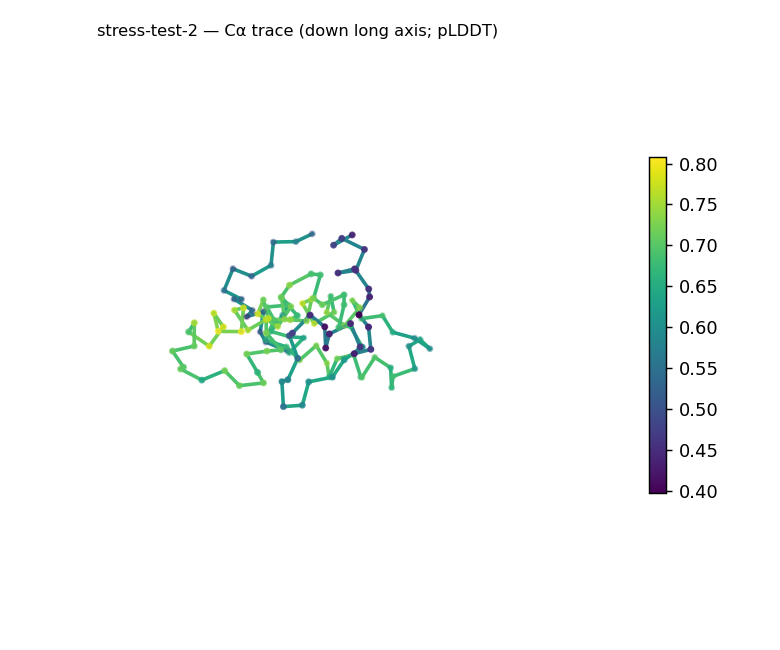
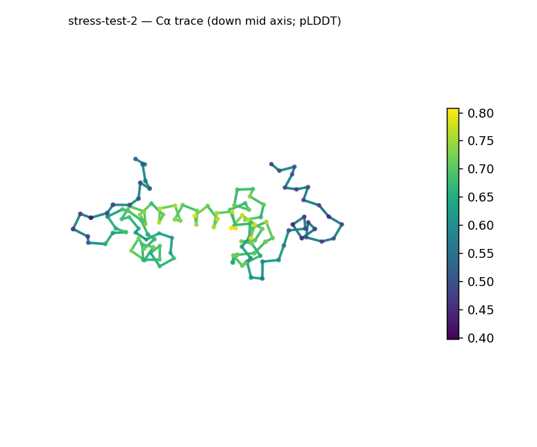
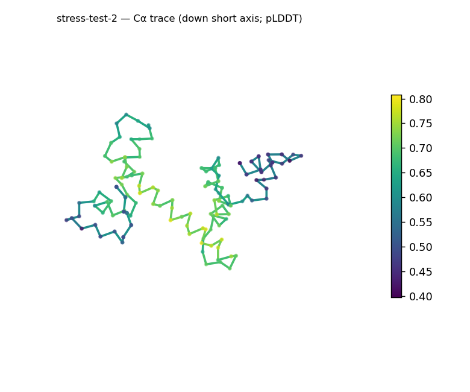
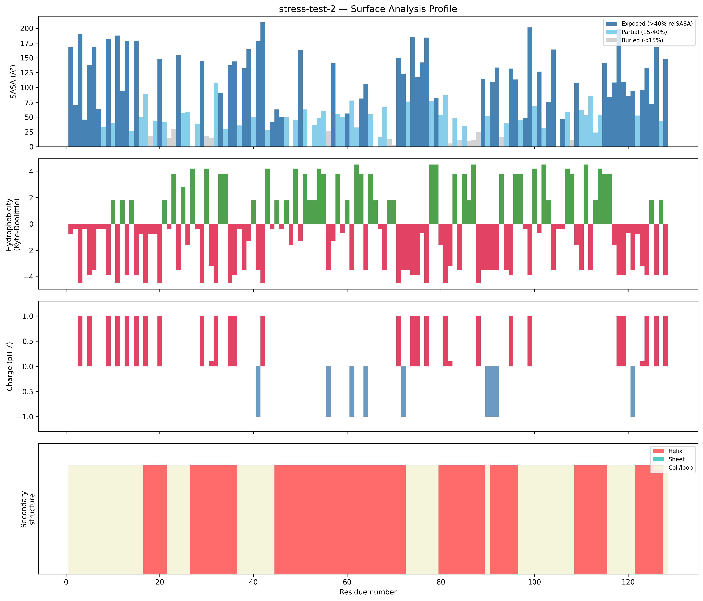
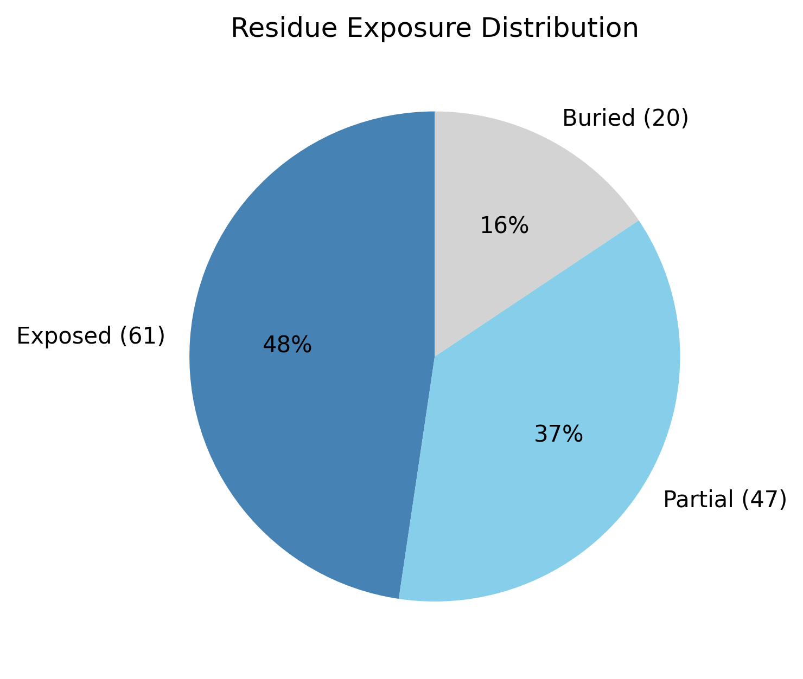

# Structural analysis — `stress-test-2`

> Facts are emitted deterministically from the measurement scripts. Sections marked with a SYNTHESIS comment are authored by the Claude session (judgment), kept visibly separate from the measured facts.

## Executive summary

Inferred coarse structural class: **all-α** — helix is the only secondary-structure type measured (helix 56.2%, sheet 0.0%), so the 128-residue chain reads as all-helical. This is inference from the measured SS content, not a fold identification, and because the assignment came from the pydssp fallback rather than mkdssp it is held at Moderate confidence. The chain is compact for its length (Rg 18.42 Å vs the ~17.4 Å expected from 2.5·N^0.4) yet elongated in shape (prolate, asphericity 0.29; ~60 × 40 × 27 Å). Its most distinctive feature is the surface: it is strongly electropositive (net +16.1 e, 23 positive vs 6 negative residues), far from the near-neutral charge typical of soluble proteins. The buried fraction is low (15.6%) and coil is high (43.8%), and confidence is the lowest of the set and uneven (mean pLDDT 63.02, range 39.74–80.77, std 11.69) — consistent with a thin hydrophobic core and at least one flexible, low-confidence segment accompanying the helical content.

## User-provided context

None provided. No prior biological context (organism, function, or expected features) was supplied; all observations in this report derive from structural measurement alone.

## Structure overview

- **Source:** predicted model — pLDDT in the B-factor column
- **Chains:** 1 (single chain)
- **Residues / atoms:** 128 / 973
- **Missing residues:** 0
- **Non-solvent ligands:** none
  - chain **A**: 128 res

## Structural views

_Cα backbone trace (Agent 2.2 matplotlib placeholder), down the long / mid / short principal axes; coloured by pLDDT._

## Shape & secondary structure

- **Shape:** prolate (elongated) (asphericity 0.29, Rg 18.42 Å)
- **Approx. dimensions:** 60.2 × 39.7 × 26.7 Å
- **Secondary structure:** helix 56.2%, sheet 0.0%, coil 43.8% _(method: pydssp)_
- **⚠ SS assigned by pydssp (fallback), not mkdssp** — pydssp is a simplified DSSP reimplementation and can over- or under-call short helix/sheet segments on imperfect (e.g. predicted) backbones. Treat fractions near the ~5% floor, the helix/sheet split, and any coil-vs-disorder reasoning as provisional; install mkdssp for reference-grade assignment.

## Surface properties

- **Exposure:** buried 15.6%, partial 36.7%, exposed 47.7%
- **Total SASA:** 10332.6 Ų
- **Surface hydrophobicity (KD):** mean -1.85 ± 2.67
- **Surface charge (pH 7):** net 16.1 e (23 +, 6 −)
- **Hydrophobic patches:** 2:
  - residues 53–55 (len 3, mean KD 3.27)
  - residues 113–116 (len 4, mean KD 3.4)

## Prediction quality / structural coherence

Confidence is **reported, never gated** — these signals are inputs for the synthesis below, not a pass/fail.

- **pLDDT (chain A):** mean 63.02, median 67.46, range 39.74–80.77, std 11.69
- **Compactness:** Rg 18.42 Å vs ~17.4 Å expected for 128 residues (2.5·N^0.4) — consistent
- **Core present:** buried fraction 15.6%
- **Coil fraction:** 43.8%

### Coherence assessment

The signals broadly agree that this is a folded structure rather than a non-fold, even though the mean pLDDT (63.02) is the lowest of the set: the chain is appropriately compact (Rg 18.42 Å vs ~17.4 Å expected) and carries substantial helical content (56.2%), the combination commonly seen when a coherent fold is predicted with only moderate confidence (typical of low-homology targets). The reservation is internal to the model rather than a contradiction — the buried fraction (15.6%) sits below the ~30% the guide treats as a packed-core floor, the coil fraction is high (43.8%), and the pLDDT minimum drops to 39.74 — together localizing the uncertainty to a thinly-buried, coil-rich, low-confidence region coexisting with the ordered helical core. Because the SS came from the pydssp fallback rather than mkdssp, the precise helix-versus-coil split is provisional, so I do not lean on it for an order-versus-disorder call.

## Expected-parameter comparison

_No expected-parameter profile supplied — this is the default for novel / low-homology targets. See the independent observations below._

## Independent observations

Against the generic globular baselines in the interpretation guide, two things stand out. First, the surface charge is far from the near-neutral expectation for soluble proteins: net +16.1 e, with positive residues outnumbering negative roughly 4:1 (23 vs 6) — a strongly electropositive surface that the guide associates with nucleic-acid or other polyanion binding, though that association is a generic structural prior, not a function established by this single-chain geometry. Second, the exposure profile is shifted toward solvent relative to baseline (buried 15.6% vs the typical 40–55%, exposed 47.7% vs 25–35%); some of this is expected for a small 128-residue chain with an elongated shape (asphericity 0.29), but the buried fraction is low even after allowing for both, indicating a thin core. The two hydrophobic patches (residues 53–55 and 113–116, 3–4 residues each) are small and unremarkable. No measurements directly contradict one another — the high coil, thin core, and low pLDDT minimum plausibly co-localize to a single flexible segment, and if that segment is extended it would inflate the asphericity, so the structured core may be more globular than 0.29 alone suggests. This is a structural description, not an identity, fold-name, or function call: there is insufficient structural evidence to assign a function.

## Methods

- **Measurements (deterministic):** `parse_structure.py` (metadata, confidence stats), `surface_analysis.py` (Shrake–Rupley SASA, Kyte–Doolittle hydrophobicity, charge at pH 7, DSSP secondary structure, shape metrics), `render_trace.py` (Agent 2.2 Cα-trace figures; `render_views.py` Mol* cartoons when Agent 2.1 is available).
- **Report facts** below the synthesis sections are emitted verbatim from the above scripts' JSON by `assemble_report.py` — no transcription.
- **Synthesis** sections (executive summary, independent observations incl. the one-line scope statement, coherence assessment) are authored by Claude per `SKILL.md` Step 9, each claim cited to a measurement.
