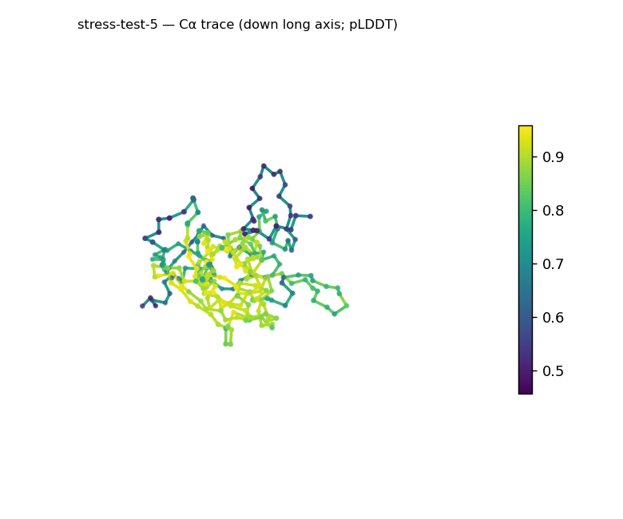
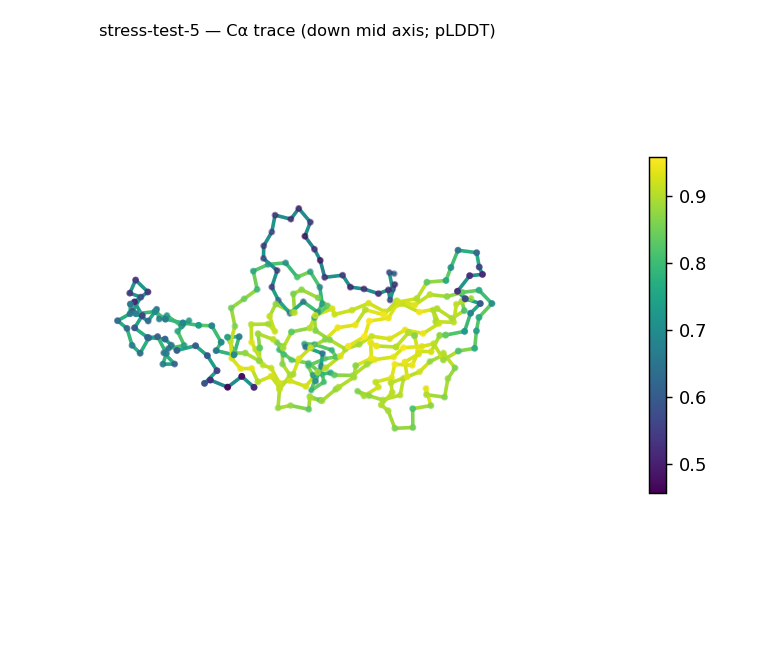
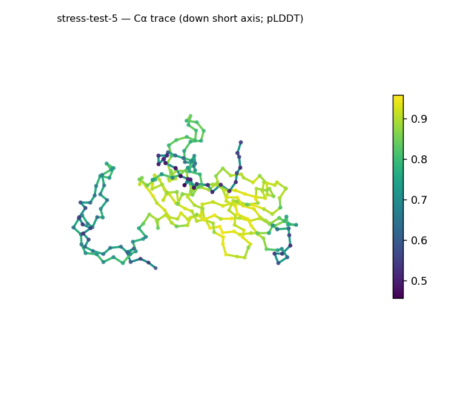
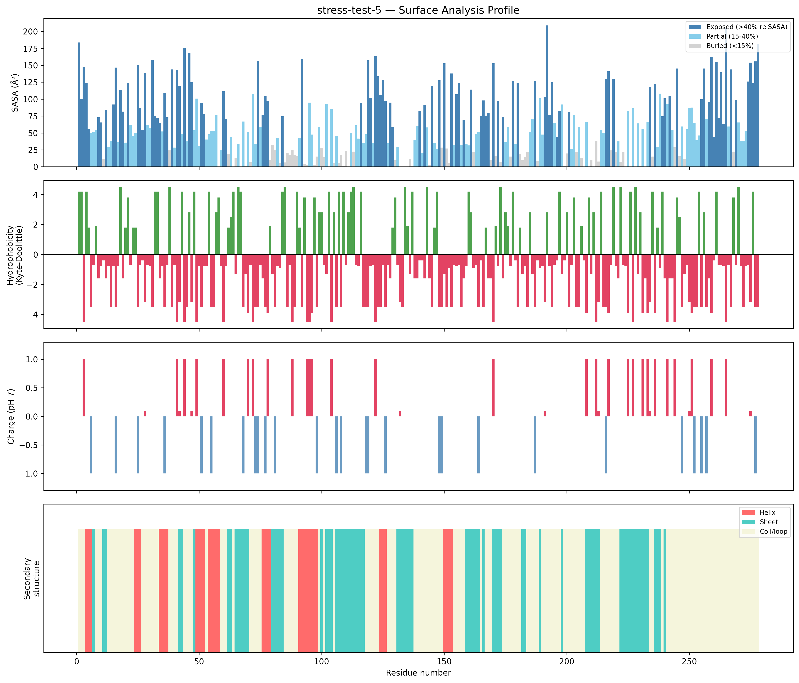
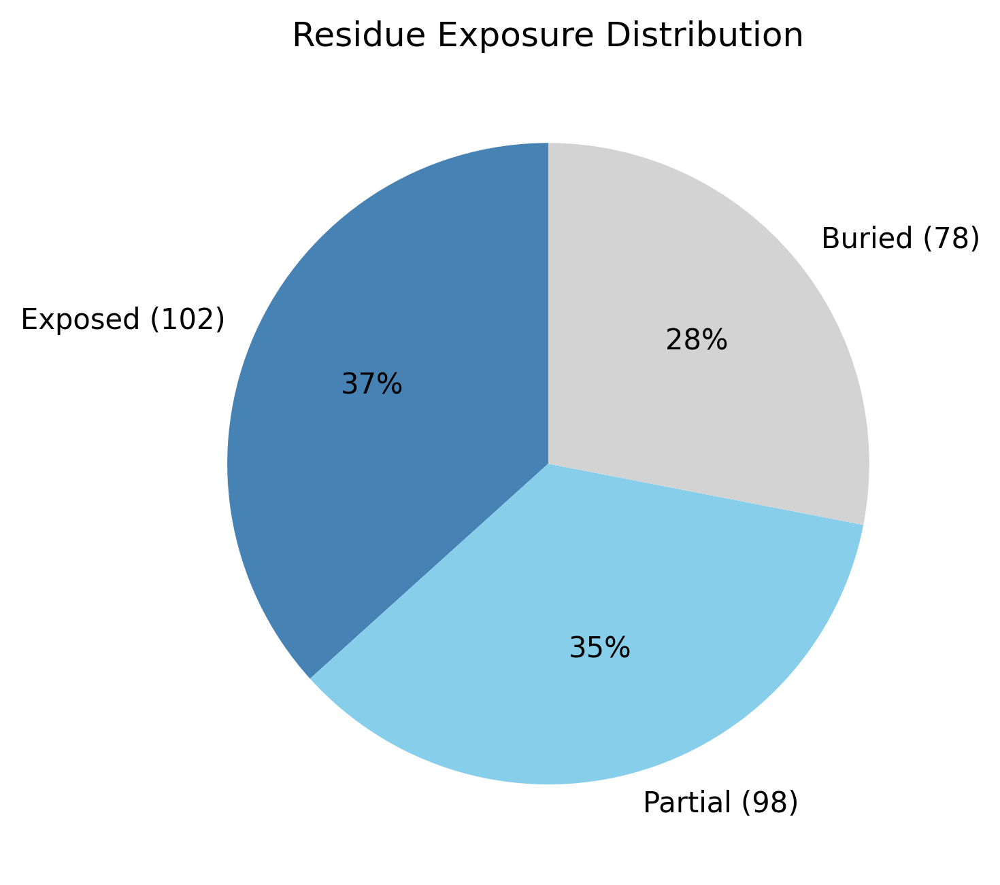

# Structural analysis — `stress-test-5`

> Facts are emitted deterministically from the measurement scripts. Sections marked with a SYNTHESIS comment are authored by the Claude session (judgment), kept visibly separate from the measured facts.

## Executive summary

Inferred coarse structural class: **mixed α/β character, β-predominant** — both strand and helix are present above the noise floor (sheet 28.4%, helix 13.7%), strand being the dominant ordered element. The per-residue ordering is mixed: helices and strands interleave through roughly the N-terminal two-thirds (e.g. …H4–6 · E11–12 · H24–26 · E42–48 · H49–58 · E62–70 · H91–98 · E106–117…), while the C-terminal third is almost entirely β, so the α/β-versus-α+β distinction is left open — resolving it needs the strand-pairing topology this pipeline does not compute. This is inference from SS content and ordering, not a fold identification, and is held at Moderate confidence because the assignment came from the pydssp fallback. The 278-residue chain is compact for its length (Rg 22.99 Å vs the ~23.7 Å expected from 2.5·N^0.4) and moderately elongated (prolate, asphericity 0.25; ~73 × 51 × 44 Å). The surface is unremarkable — near-neutral (net −1.4 e), moderately polar (mean Kyte–Doolittle −1.08), no exposed hydrophobic patches — and confidence is good overall but uneven (mean pLDDT 77.6, range 45.68–95.86, std 15.13).

## User-provided context

None provided. No prior biological context (organism, function, or expected features) was supplied; all observations in this report derive from structural measurement alone.

## Structure overview

- **Source:** predicted model — pLDDT in the B-factor column
- **Chains:** 1 (single chain)
- **Residues / atoms:** 278 / 2235
- **Missing residues:** 0
- **Non-solvent ligands:** none
  - chain **A**: 278 res

## Structural views

_Cα backbone trace (Agent 2.2 matplotlib placeholder), down the long / mid / short principal axes; coloured by pLDDT._

## Shape & secondary structure

- **Shape:** prolate (elongated) (asphericity 0.25, Rg 22.99 Å)
- **Approx. dimensions:** 73.2 × 51.3 × 43.9 Å
- **Secondary structure:** helix 13.7%, sheet 28.4%, coil 57.9% _(method: pydssp)_
- **⚠ SS assigned by pydssp (fallback), not mkdssp** — pydssp is a simplified DSSP reimplementation and can over- or under-call short helix/sheet segments on imperfect (e.g. predicted) backbones. Treat fractions near the ~5% floor, the helix/sheet split, and any coil-vs-disorder reasoning as provisional; install mkdssp for reference-grade assignment.

## Surface properties

- **Exposure:** buried 28.1%, partial 35.3%, exposed 36.7%
- **Total SASA:** 17679.9 Ų
- **Surface hydrophobicity (KD):** mean -1.08 ± 2.85
- **Surface charge (pH 7):** net -1.4 e (17 +, 13 −)
- **Hydrophobic patches:** 0

## Prediction quality / structural coherence

Confidence is **reported, never gated** — these signals are inputs for the synthesis below, not a pass/fail.

- **pLDDT (chain A):** mean 77.6, median 83.88, range 45.68–95.86, std 15.13
- **Compactness:** Rg 22.99 Å vs ~23.7 Å expected for 278 residues (2.5·N^0.4) — consistent
- **Core present:** buried fraction 28.1%
- **Coil fraction:** 57.9%

### Coherence assessment

The coherence signals agree with the confidence score and with each other. The chain is compact on target (Rg 22.99 Å vs ~23.7 Å expected), a buried core is present (28.1%), and the mean pLDDT (77.6) sits in the confident tier, with the wide range (45.68–95.86, std 15.13) localizing uncertainty to a few segments rather than indicating a global non-fold. The coil fraction is high (57.9%), but for a β-predominant structure assigned by the pydssp fallback this is expected and should be read cautiously: pydssp tends to under-call strand edges and short segments, so part of that "coil" is likely turns and loops between strands rather than disorder. Nothing here suggests the moderate-to-good confidence reflects anything other than a folded, β-rich domain.

## Expected-parameter comparison

_No expected-parameter profile supplied — this is the default for novel / low-homology targets. See the independent observations below._

## Independent observations

Measured against the generic globular baselines in the guide, the structure is largely typical. The exposure profile is mildly shifted toward solvent (buried 28.1% vs the typical 40–55%, exposed 36.7% vs 25–35%), consistent with the moderate elongation (asphericity 0.25) raising surface-to-volume, and not by itself notable. The surface is unremarkable relative to baseline: near-neutral charge (net −1.4 e, 17 positive / 13 negative), moderately polar (mean Kyte–Doolittle −1.08, at the polar/mixed boundary), and no hydrophobic patches. The one point that warrants a caveat rather than a contradiction is the SS itself: at 57.9% coil with 28.4% strand and 13.7% helix from the pydssp fallback, the true ordered fraction is probably higher than reported, so the β-predominant call is sound but its exact magnitude is provisional pending mkdssp. No measurements contradict one another. This is a structural description, not an identity, fold-name, or function call: there is insufficient structural evidence to assign a function.

## Methods

- **Measurements (deterministic):** `parse_structure.py` (metadata, confidence stats), `surface_analysis.py` (Shrake–Rupley SASA, Kyte–Doolittle hydrophobicity, charge at pH 7, DSSP secondary structure, shape metrics), `render_trace.py` (Agent 2.2 Cα-trace figures; `render_views.py` Mol* cartoons when Agent 2.1 is available).
- **Report facts** below the synthesis sections are emitted verbatim from the above scripts' JSON by `assemble_report.py` — no transcription.
- **Synthesis** sections (executive summary, independent observations incl. the one-line scope statement, coherence assessment) are authored by Claude per `SKILL.md` Step 9, each claim cited to a measurement.
