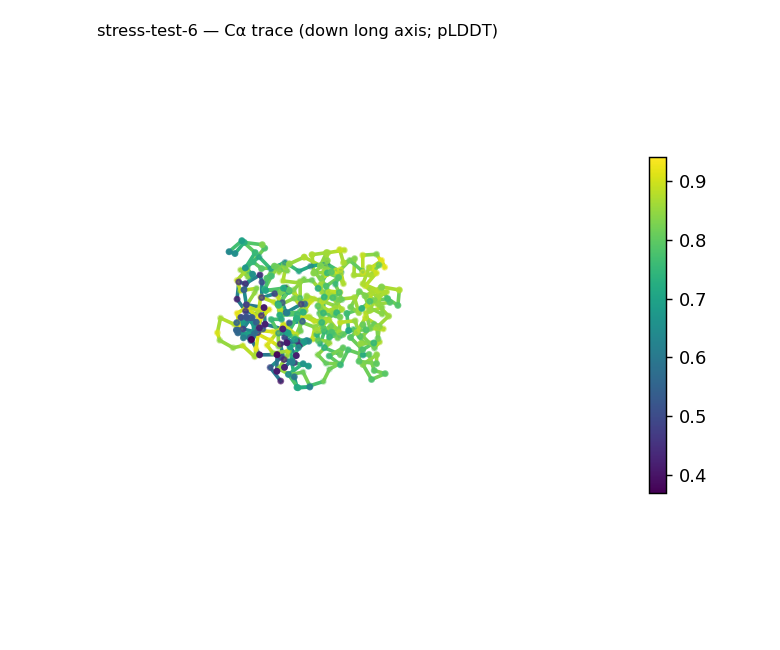
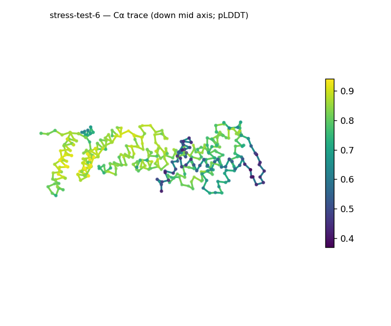
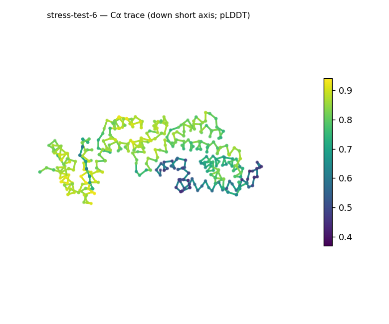
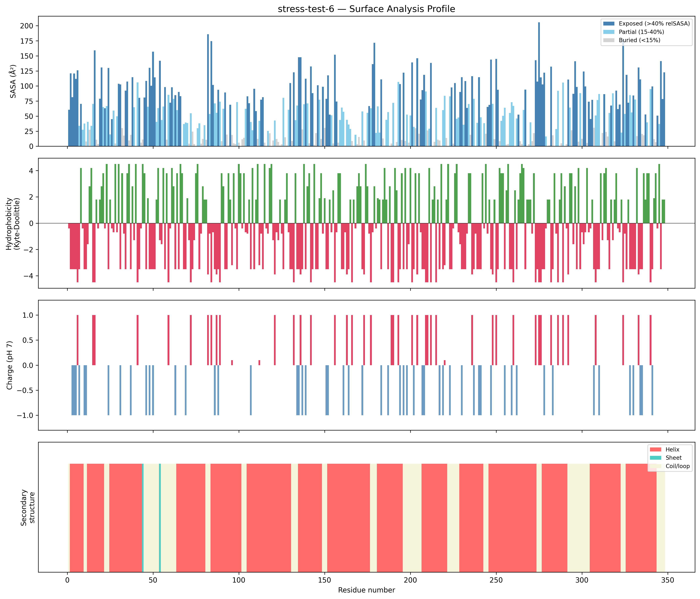
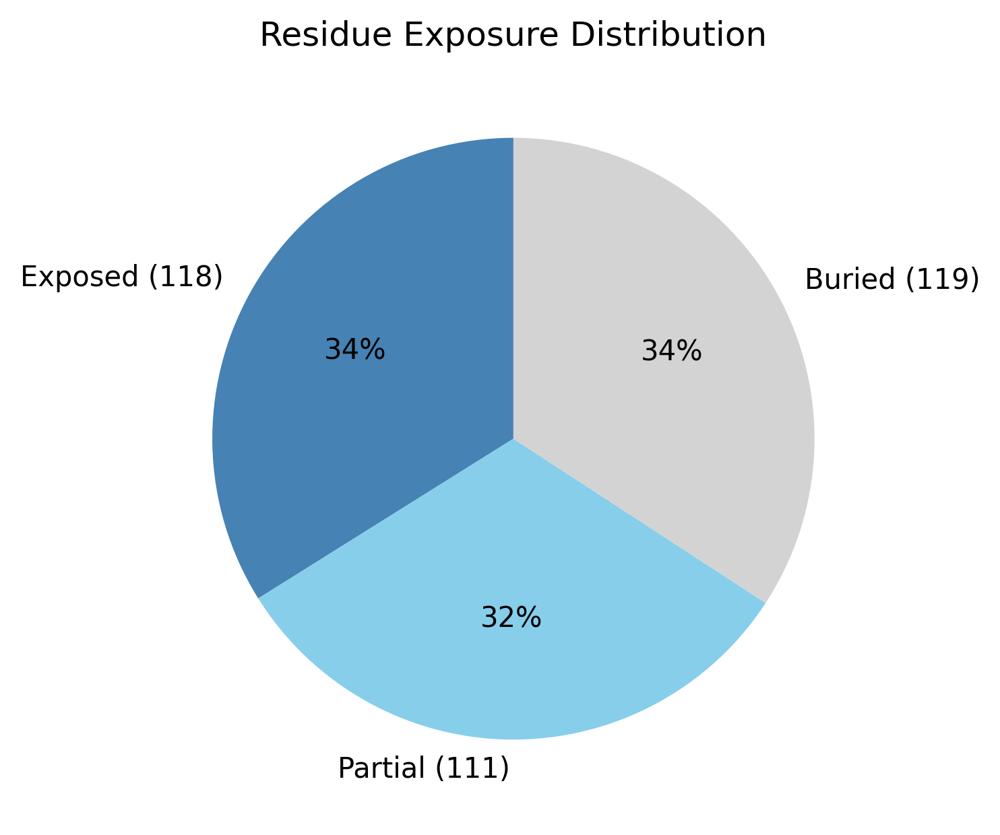

# Structural analysis — `stress-test-6`

> Facts are emitted deterministically from the measurement scripts. Sections marked with a SYNTHESIS comment are authored by the Claude session (judgment), kept visibly separate from the measured facts.

## Executive summary

Inferred coarse structural class: **all-α** — helix dominates and strand is effectively absent (helix 74.7%, sheet 0.6%, the latter below the ~5% noise floor), so the 348-residue chain reads as all-helical. This is inference from the measured SS content, not a fold identification, held at Moderate confidence because the assignment came from the pydssp fallback. Its most distinctive feature is shape: the chain is strongly elongated (prolate, asphericity 0.55; ~95 × 39 × 31 Å, the long axis roughly three times the mid axis) — unusual for a single compact domain and more typical of extended helical or multi-segment arrangements, though no specific fold is named from shape. It nonetheless remains about as compact as expected for its length (Rg 28.12 Å vs the ~26.0 Å expected from 2.5·N^0.4), the small excess being consistent with the elongation rather than a packing problem. The surface is mildly net-negative (−6 e) and moderately polar (mean Kyte–Doolittle −1.71) with a single small hydrophobic patch (residues 19–21), and confidence is good but uneven (mean pLDDT 75.64, range 36.9–94.06, std 14.35).

## User-provided context

None provided. No prior biological context (organism, function, or expected features) was supplied; all observations in this report derive from structural measurement alone.

## Structure overview

- **Source:** predicted model — pLDDT in the B-factor column
- **Chains:** 1 (single chain)
- **Residues / atoms:** 348 / 2770
- **Missing residues:** 0
- **Non-solvent ligands:** none
  - chain **A**: 348 res

## Structural views

_Cα backbone trace (Agent 2.2 matplotlib placeholder), down the long / mid / short principal axes; coloured by pLDDT._

## Shape & secondary structure

- **Shape:** prolate (elongated) (asphericity 0.55, Rg 28.12 Å)
- **Approx. dimensions:** 95 × 39.2 × 31.2 Å
- **Secondary structure:** helix 74.7%, sheet 0.6%, coil 24.7% _(method: pydssp)_
- **⚠ SS assigned by pydssp (fallback), not mkdssp** — pydssp is a simplified DSSP reimplementation and can over- or under-call short helix/sheet segments on imperfect (e.g. predicted) backbones. Treat fractions near the ~5% floor, the helix/sheet split, and any coil-vs-disorder reasoning as provisional; install mkdssp for reference-grade assignment.

## Surface properties

- **Exposure:** buried 34.2%, partial 31.9%, exposed 33.9%
- **Total SASA:** 19564.2 Ų
- **Surface hydrophobicity (KD):** mean -1.71 ± 2.69
- **Surface charge (pH 7):** net -6 e (20 +, 26 −)
- **Hydrophobic patches:** 1:
  - residues 19–21 (len 3, mean KD 2.8)

## Prediction quality / structural coherence

Confidence is **reported, never gated** — these signals are inputs for the synthesis below, not a pass/fail.

- **pLDDT (chain A):** mean 75.64, median 80.45, range 36.9–94.06, std 14.35
- **Compactness:** Rg 28.12 Å vs ~26.0 Å expected for 348 residues (2.5·N^0.4) — consistent
- **Core present:** buried fraction 34.2%
- **Coil fraction:** 24.7%

### Coherence assessment

The coherence signals agree well and support a folded structure. A buried core is present (34.2%), coil is low (24.7%), helix is high (74.7%), and the mean pLDDT (75.64) is in the confident tier, with the spread (range 36.9–94.06, std 14.35) localizing uncertainty to one or a few segments rather than the whole chain. The radius of gyration slightly exceeds the globular expectation (28.12 Å vs ~26.0 Å), but this tracks the strong elongation (asphericity 0.55) and is not a compactness inconsistency — per the guide, elongation never contradicts the fold class. As with the others, the SS came from the pydssp fallback rather than mkdssp, so the exact helix-versus-coil split is provisional, but the overwhelmingly helical assignment and low coil leave little ambiguity about the all-α character.

## Expected-parameter comparison

_No expected-parameter profile supplied — this is the default for novel / low-homology targets. See the independent observations below._

## Independent observations

The standout observation, measured against the generic baselines, is the shape: an asphericity of 0.55 with a long axis roughly three times the mid axis and a ~95 Å long dimension places this well into the prolate/elongated regime, whereas most single globular domains sit near-spherical. The guide treats this as an unusual-but-legitimate characteristic — extended helical bundles and multi-segment strings occupy this regime — and explicitly not as an inconsistency, so it does not lower the all-α call; for a 348-residue chain the class is best read as a whole-chain average that may span more than one helical segment. The exposure profile is close to baseline once elongation is accounted for (buried 34.2% vs the typical 40–55%, the modest shortfall consistent with the higher surface-to-volume of an elongated body). The surface is otherwise unremarkable: mildly net-negative (−6 e, 20 positive / 26 negative), moderately polar (mean Kyte–Doolittle −1.71), with one short hydrophobic patch (residues 19–21). No measurements contradict one another. This is a structural description, not an identity, fold-name, or function call: there is insufficient structural evidence to assign a function.

## Methods

- **Measurements (deterministic):** `parse_structure.py` (metadata, confidence stats), `surface_analysis.py` (Shrake–Rupley SASA, Kyte–Doolittle hydrophobicity, charge at pH 7, DSSP secondary structure, shape metrics), `render_trace.py` (Agent 2.2 Cα-trace figures; `render_views.py` Mol* cartoons when Agent 2.1 is available).
- **Report facts** below the synthesis sections are emitted verbatim from the above scripts' JSON by `assemble_report.py` — no transcription.
- **Synthesis** sections (executive summary, independent observations incl. the one-line scope statement, coherence assessment) are authored by Claude per `SKILL.md` Step 9, each claim cited to a measurement.
