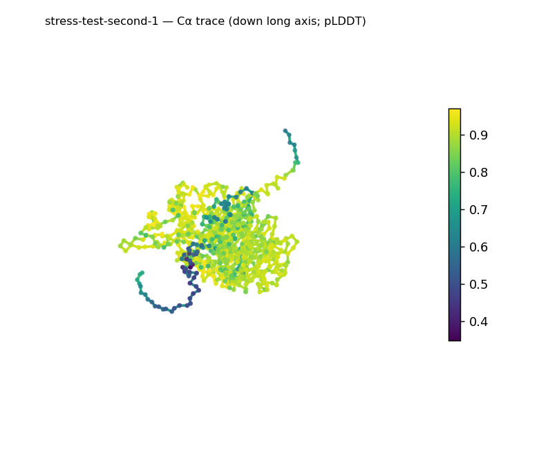
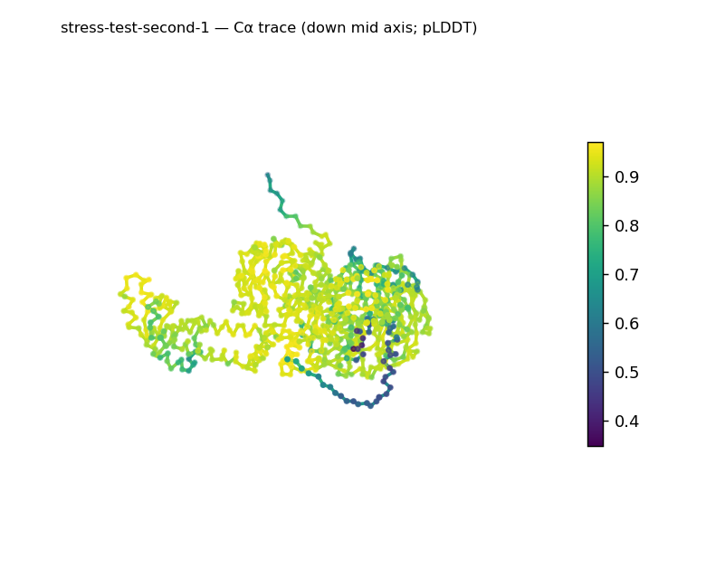
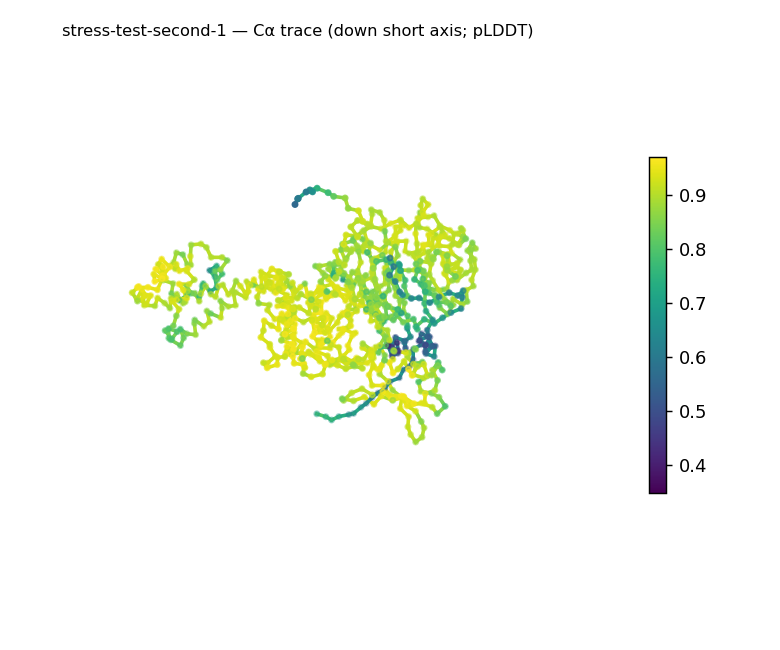
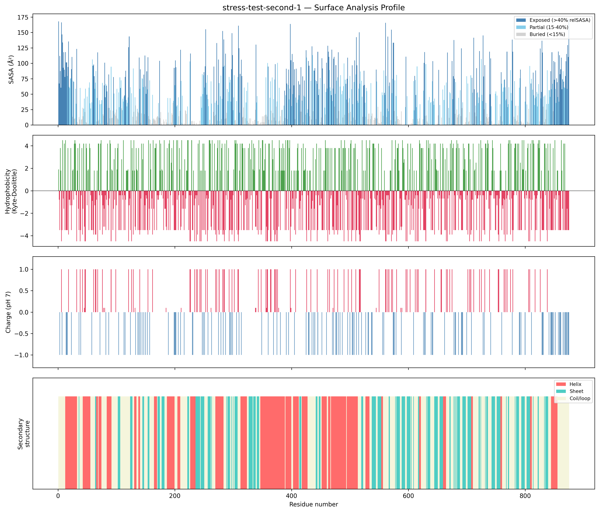
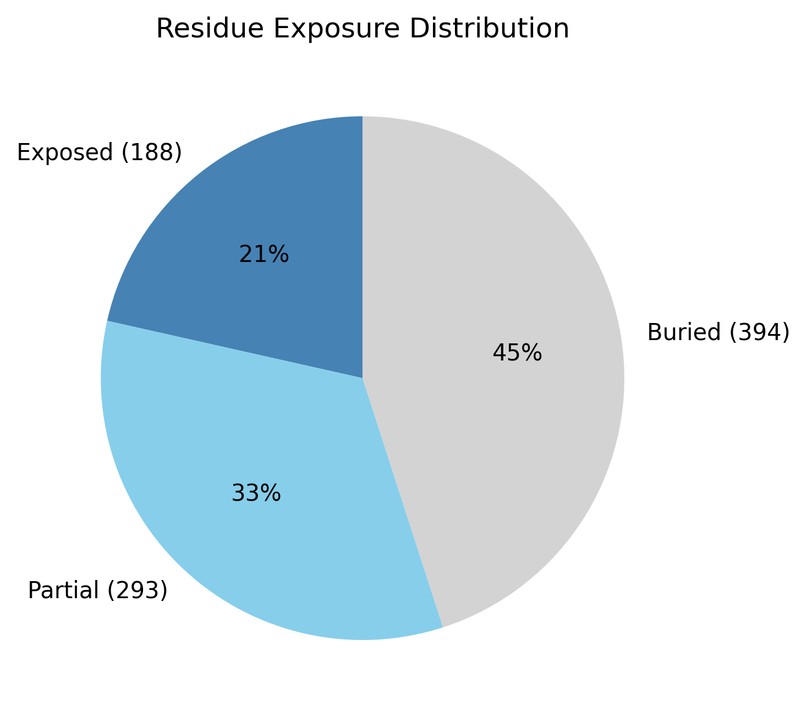

# Structural analysis — `stress-test-second-1`

> Facts are emitted deterministically from the measurement scripts. Sections marked with a SYNTHESIS comment are authored by the Claude session (judgment), kept visibly separate from the measured facts.

## Executive summary

This is a large single chain (875 residues, one chain, no ligands; metadata) containing substantial amounts of both helix (32.1%) and sheet (24.6%), with the balance coil (43.3%) — a mixed α+β architecture (secondary-structure content, pydssp). Whole-chain shape is elongated (prolate, asphericity 0.21; long:short axis ratio 4.22; ~107.5 × 79.9 × 78.1 Å), but the radius of gyration (32.08 Å) is below the ~37.6 Å expected for 875 residues, 45% of residues are buried, and the long-axis render shows a single compact high-confidence core with two protruding low-confidence extensions — so the bulk of the chain is well-packed and the extensions inflate the elongation (shape, exposure, confidence stats, render). The exposed surface is moderately polar (mean Kyte–Doolittle −1.8) and strongly net-negative (−30.6 e; 63 acidic vs 36 basic surface residues), with only two short hydrophobic patches (residues 117–120 and 421–423) (surface properties). Mean pLDDT is high at 86.4 (confidence stats).

## User-provided context

None provided.

## Structure overview

- **Source:** predicted model — pLDDT in the B-factor column
- **Chains:** 1 (single chain)
- **Residues / atoms:** 875 / 6809
- **Missing residues:** 0
- **Non-solvent ligands:** none
  - chain **A**: 875 res

## Structural views

_Cα backbone trace (Agent 2.2 matplotlib placeholder), down the long / mid / short principal axes; coloured by pLDDT._

## Shape & secondary structure

- **Shape:** prolate (elongated) (asphericity 0.21, Rg 32.08 Å)
- **Approx. dimensions:** 107.5 × 79.9 × 78.1 Å
- **Secondary structure:** helix 32.1%, sheet 24.6%, coil 43.3% _(method: pydssp)_
- **⚠ SS assigned by pydssp (fallback), not mkdssp** — pydssp is a simplified DSSP reimplementation and can over- or under-call short helix/sheet segments on imperfect (e.g. predicted) backbones. Treat fractions near the ~5% floor, the helix/sheet split, and any coil-vs-disorder reasoning as provisional; install mkdssp for reference-grade assignment.

## Surface properties

- **Exposure:** buried 45.0%, partial 33.5%, exposed 21.5%
- **Total SASA:** 38053 Ų
- **Surface hydrophobicity (KD):** mean -1.8 ± 2.69
- **Surface charge (pH 7):** net -30.6 e (36 +, 63 −)
- **Hydrophobic patches:** 2:
  - residues 117–120 (len 4, mean KD 1.83)
  - residues 421–423 (len 3, mean KD 1.83)

## Prediction quality / structural coherence

Confidence is **reported, never gated** — these signals are inputs for the synthesis below, not a pass/fail.

- **pLDDT (chain A):** mean 86.42, median 90.02, range 34.82–96.99, std 10.93
- **Compactness:** Rg 32.08 Å vs ~37.6 Å expected for 875 residues (2.5·N^0.4) — consistent
- **Core present:** buried fraction 45.0%
- **Coil fraction:** 43.3%

### Coherence assessment

The structural-coherence signals agree with the high confidence score: mean pLDDT is 86.4 (median 90.0), the radius of gyration (32.08 Å) is consistent with — slightly more compact than — the ~37.6 Å globular expectation for 875 residues, and 45% of residues form a buried core (compactness, exposure). This is a coherent, well-ordered fold, not the low-pLDDT-but-coherent case typical of some low-homology targets. The pLDDT range extends down to 34.82, and the long-axis render localizes that low confidence to two extensions protruding from an otherwise high-confidence core; if these are flexible termini they would account for both the low minimum and the inflated asphericity, so the ordered core is likely more compact and less elongated than the whole-chain shape metrics indicate (confidence stats, shape, render).

## Expected-parameter comparison

_No expected-parameter profile supplied — this is the default for novel / low-homology targets. See the independent observations below._

## Independent observations

Two measured features stand out against generic baselines. The surface net charge of −30.6 e (63 acidic vs 36 basic exposed residues) is far from the near-neutral surface typical of soluble globular proteins; a strongly electronegative surface of this magnitude is associated with cation binding or electrostatic repulsion of like-charged partners, though that is an association, not an assignment (surface charge). And despite a large total surface area (38,053 Ų), only two short hydrophobic patches are exposed (residues 117–120 and 421–423; each mean KD ~1.83), pointing to a well-packed, predominantly polar surface (hydrophobic patches, surface hydrophobicity). No measurement contradicts another — both helix and sheet are well represented, the chain is compact, and the elongation is an expected descriptive feature, not an inconsistency; the only hedge is methodological, as SS was assigned by pydssp rather than mkdssp. On fold class, the substantial helix (32.1%) and sheet (24.6%) make this a mixed α+β chain, but at 875 residues — large enough to span several structural domains — the whole-chain SS is an average and the α/β-versus-α+β (parallel-vs-antiparallel) distinction cannot be made without per-domain segmentation (low confidence for the sub-class); this is a structural-class inference from SS and shape, not a fold name, which would require database verification (SCOP/CATH/Foldseek). This is structural description, not an identity, fold-name, or function call — there is insufficient structural evidence to assign a function.

## Methods

- **Measurements (deterministic):** `parse_structure.py` (metadata, confidence stats), `surface_analysis.py` (Shrake–Rupley SASA, Kyte–Doolittle hydrophobicity, charge at pH 7, DSSP secondary structure, shape metrics), `render_trace.py` (Agent 2.2 Cα-trace figures; `render_views.py` Mol* cartoons when Agent 2.1 is available).
- **Report facts** below the synthesis sections are emitted verbatim from the above scripts' JSON by `assemble_report.py` — no transcription.
- **Synthesis** sections (executive summary, independent observations incl. the one-line scope statement, coherence assessment) are authored by Claude per `SKILL.md` Step 9, each claim cited to a measurement.
