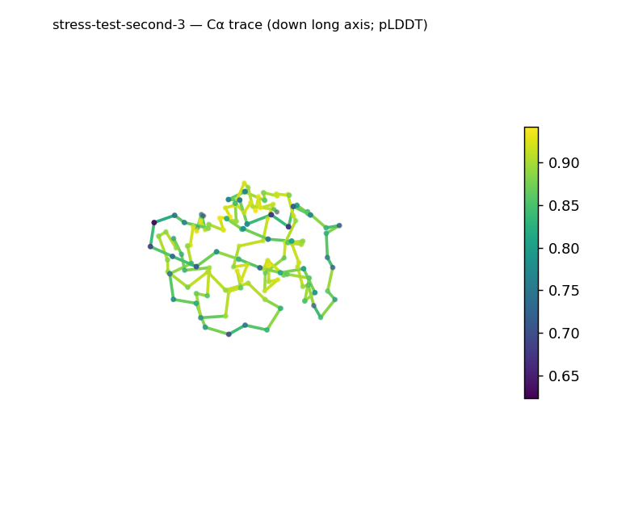
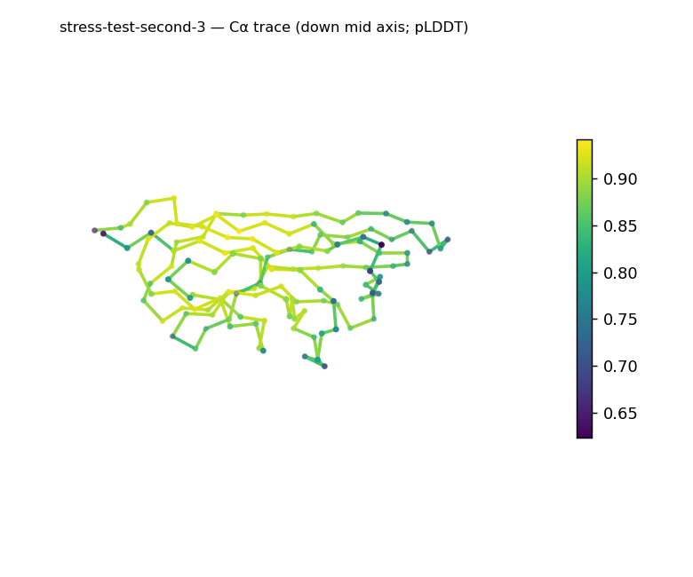
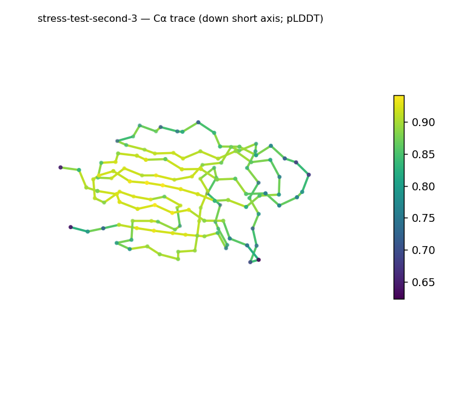
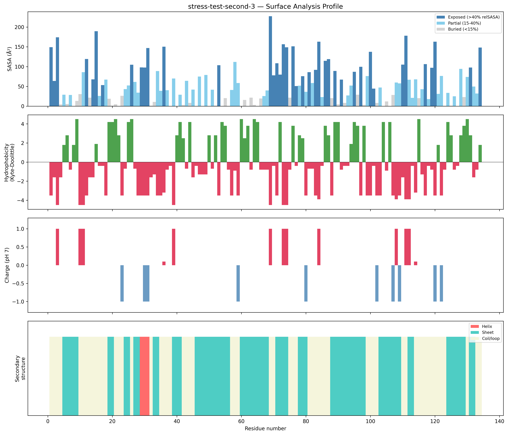
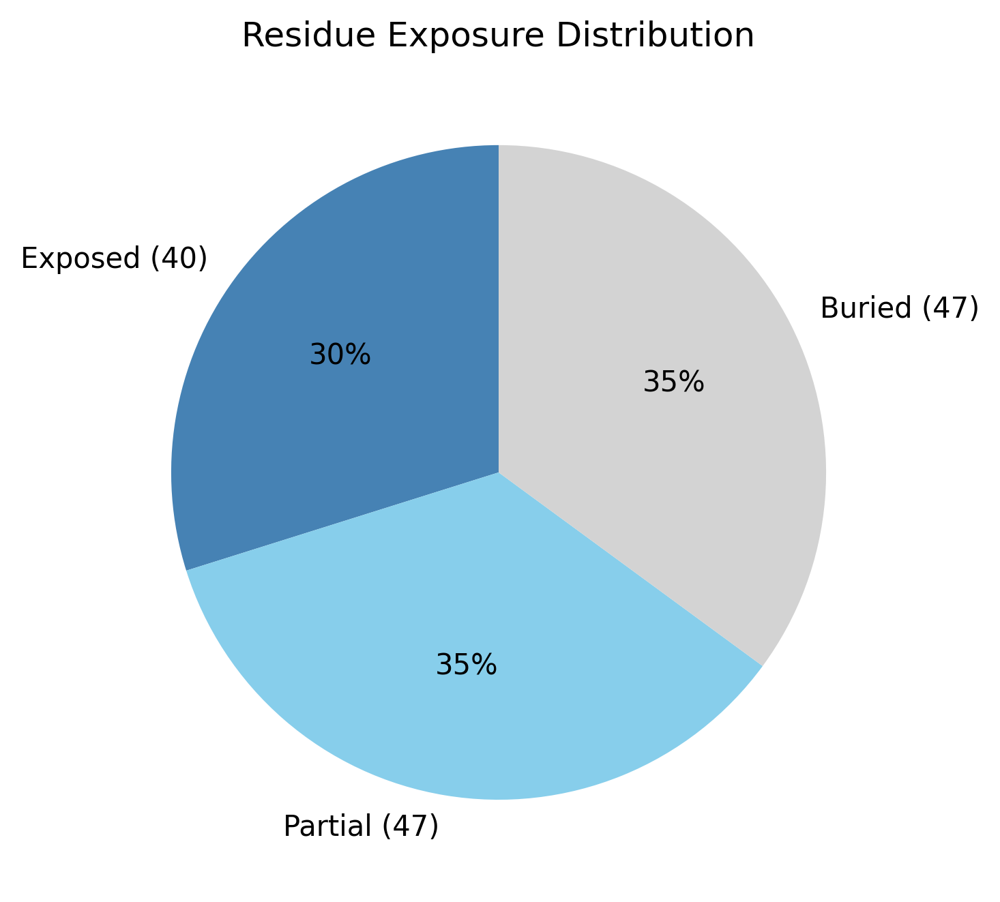

# Structural analysis — `stress-test-second-3`

> Facts are emitted deterministically from the measurement scripts. Sections marked with a SYNTHESIS comment are authored by the Claude session (judgment), kept visibly separate from the measured facts.

## Executive summary

This is a small single chain (134 residues, one chain, no ligands; metadata) dominated by β-sheet (53.0%) with essentially no helix (2.2%) and the remainder coil (44.8%) — an all-β architecture (secondary-structure content, pydssp). The domain is elongated (prolate, asphericity 0.19; long:short axis ratio 4.29; ~48.1 × 27.4 × 22.6 Å) but compact, with a radius of gyration (14.23 Å) below the ~17.7 Å globular expectation for 134 residues and a buried core (35.1% buried) (shape, exposure). The exposed surface is moderately polar (mean Kyte–Doolittle −1.08) with a mild net positive charge (+3.1 e; 7 basic vs 3 acidic surface residues) and no hydrophobic patches (surface properties). Mean pLDDT is 84.4 (confidence stats).

## User-provided context

None provided.

## Structure overview

- **Source:** predicted model — pLDDT in the B-factor column
- **Chains:** 1 (single chain)
- **Residues / atoms:** 134 / 1056
- **Missing residues:** 0
- **Non-solvent ligands:** none
  - chain **A**: 134 res

## Structural views

_Cα backbone trace (Agent 2.2 matplotlib placeholder), down the long / mid / short principal axes; coloured by pLDDT._

## Shape & secondary structure

- **Shape:** prolate (elongated) (asphericity 0.19, Rg 14.23 Å)
- **Approx. dimensions:** 48.1 × 27.4 × 22.6 Å
- **Secondary structure:** helix 2.2%, sheet 53.0%, coil 44.8% _(method: pydssp)_
- **⚠ SS assigned by pydssp (fallback), not mkdssp** — pydssp is a simplified DSSP reimplementation and can over- or under-call short helix/sheet segments on imperfect (e.g. predicted) backbones. Treat fractions near the ~5% floor, the helix/sheet split, and any coil-vs-disorder reasoning as provisional; install mkdssp for reference-grade assignment.

## Surface properties

- **Exposure:** buried 35.1%, partial 35.1%, exposed 29.9%
- **Total SASA:** 7405 Ų
- **Surface hydrophobicity (KD):** mean -1.08 ± 3.01
- **Surface charge (pH 7):** net 3.1 e (7 +, 3 −)
- **Hydrophobic patches:** 0

## Prediction quality / structural coherence

Confidence is **reported, never gated** — these signals are inputs for the synthesis below, not a pass/fail.

- **pLDDT (chain A):** mean 84.35, median 86.1, range 62.36–94.14, std 7.79
- **Compactness:** Rg 14.23 Å vs ~17.7 Å expected for 134 residues (2.5·N^0.4) — consistent
- **Core present:** buried fraction 35.1%
- **Coil fraction:** 44.8%

### Coherence assessment

The coherence signals agree with the confidence score: mean pLDDT is 84.4 over a tight range (62.4–94.1, so no very-low-confidence stretch), the radius of gyration (14.23 Å) is consistent with — slightly more compact than — the ~17.7 Å expected for 134 residues, and 35.1% of residues are buried, indicating a real core (compactness, exposure). This is a coherent, well-ordered β-domain. Coil at 44.8% reflects the loops and turns connecting strands in a β-rich fold, not disorder, given the compact dimensions and the buried core (secondary-structure content, shape, exposure).

## Expected-parameter comparison

_No expected-parameter profile supplied — this is the default for novel / low-homology targets. See the independent observations below._

## Independent observations

Against generic baselines the structure is unremarkable and internally consistent: a compact, elongated, β-dominant domain with a modest buried core, a mildly cationic and moderately polar surface, and no exposed hydrophobic patches — no measurement contradicts another (shape, exposure, surface properties). The one point worth flagging is methodological rather than biological: helix sits at only 2.2% (below the ~5% floor), so the assignment is all-β, but because secondary structure came from pydssp rather than mkdssp the precise helix-versus-coil split near the floor is provisional (secondary-structure content). On fold class, sheet present with helix effectively absent indicates an all-β class — an inference from SS content and shape at moderate confidence (pydssp, not reference-grade DSSP), with the coarse class as the ceiling, not a specific fold (which would require database verification such as SCOP/CATH/Foldseek). This is structural description, not an identity, fold-name, or function call — there is insufficient structural evidence to assign a function.

## Methods

- **Measurements (deterministic):** `parse_structure.py` (metadata, confidence stats), `surface_analysis.py` (Shrake–Rupley SASA, Kyte–Doolittle hydrophobicity, charge at pH 7, DSSP secondary structure, shape metrics), `render_trace.py` (Agent 2.2 Cα-trace figures; `render_views.py` Mol* cartoons when Agent 2.1 is available).
- **Report facts** below the synthesis sections are emitted verbatim from the above scripts' JSON by `assemble_report.py` — no transcription.
- **Synthesis** sections (executive summary, independent observations incl. the one-line scope statement, coherence assessment) are authored by Claude per `SKILL.md` Step 9, each claim cited to a measurement.
