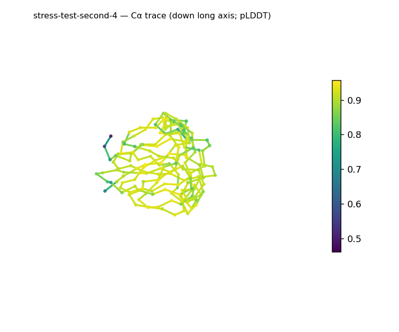
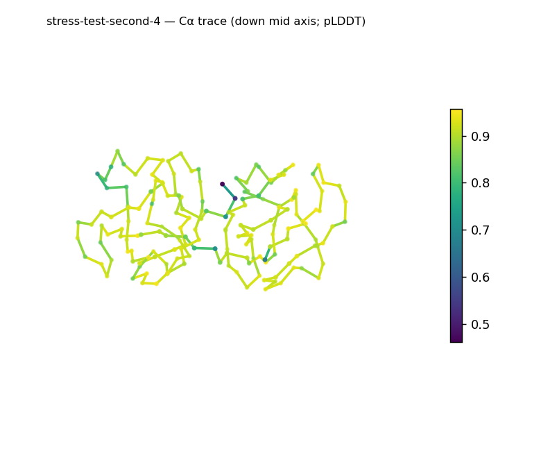
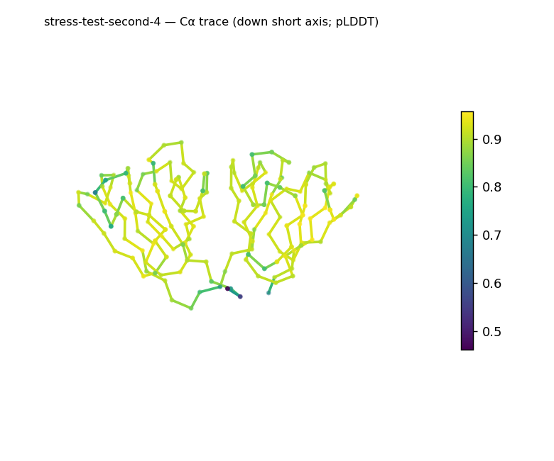
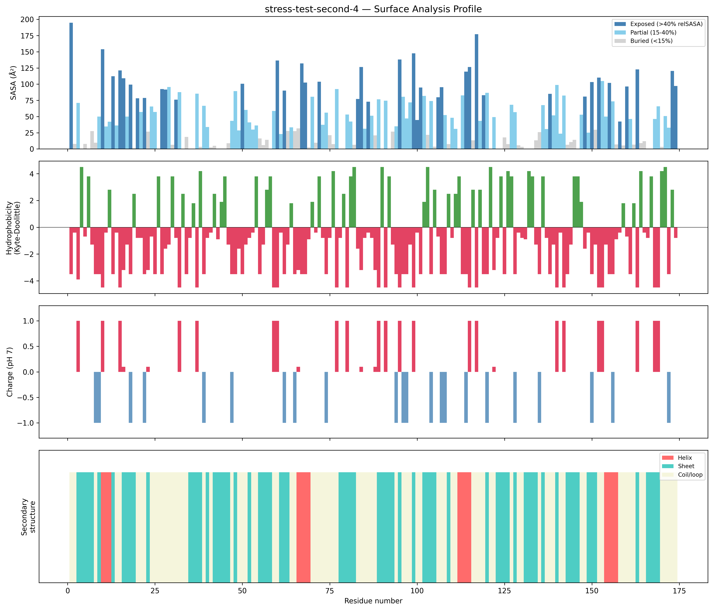
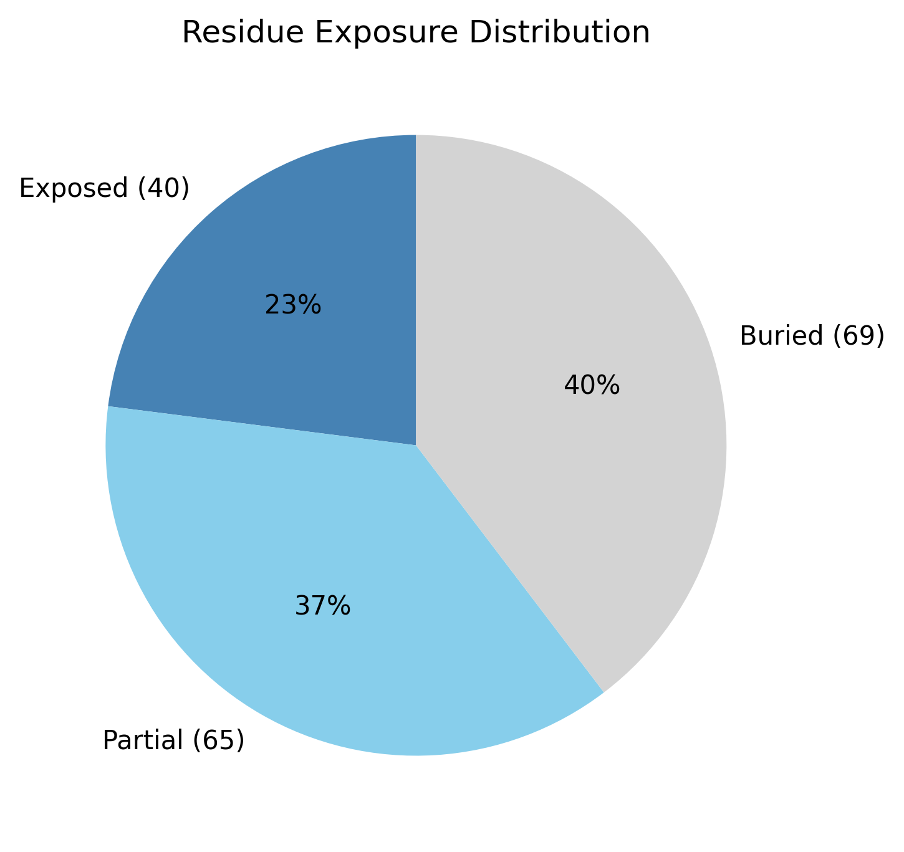

# Structural analysis — `stress-test-second-4`

> Facts are emitted deterministically from the measurement scripts. Sections marked with a SYNTHESIS comment are authored by the Claude session (judgment), kept visibly separate from the measured facts.

## Executive summary

This is a small single chain (174 residues, one chain, no ligands; metadata) dominated by β-sheet (41.4%) with a minor helical component (8.6%) and the balance coil (50.0%) — a β-rich, α+β-leaning architecture (secondary-structure content, pydssp). The domain is elongated (prolate, asphericity 0.23; long:short axis ratio 4.05; ~49 × 29.4 × 25.1 Å) yet compact, with a radius of gyration (15.67 Å) below the ~19.7 Å globular expectation for 174 residues and a buried core (39.7% buried) (shape, exposure). The exposed surface is highly polar (mean Kyte–Doolittle −2.65, the most polar of this run) with a mild net positive charge (+3.2 e; 11 basic vs 6 acidic surface residues) and no hydrophobic patches (surface properties). Mean pLDDT is the highest of the three structures at 89.2 (confidence stats).

## User-provided context

None provided.

## Structure overview

- **Source:** predicted model — pLDDT in the B-factor column
- **Chains:** 1 (single chain)
- **Residues / atoms:** 174 / 1459
- **Missing residues:** 0
- **Non-solvent ligands:** none
  - chain **A**: 174 res

## Structural views

_Cα backbone trace (Agent 2.2 matplotlib placeholder), down the long / mid / short principal axes; coloured by pLDDT._

## Shape & secondary structure

- **Shape:** prolate (elongated) (asphericity 0.23, Rg 15.67 Å)
- **Approx. dimensions:** 49 × 29.4 × 25.1 Å
- **Secondary structure:** helix 8.6%, sheet 41.4%, coil 50.0% _(method: pydssp)_
- **⚠ SS assigned by pydssp (fallback), not mkdssp** — pydssp is a simplified DSSP reimplementation and can over- or under-call short helix/sheet segments on imperfect (e.g. predicted) backbones. Treat fractions near the ~5% floor, the helix/sheet split, and any coil-vs-disorder reasoning as provisional; install mkdssp for reference-grade assignment.

## Surface properties

- **Exposure:** buried 39.7%, partial 37.4%, exposed 23.0%
- **Total SASA:** 8464.7 Ų
- **Surface hydrophobicity (KD):** mean -2.65 ± 1.94
- **Surface charge (pH 7):** net 3.2 e (11 +, 6 −)
- **Hydrophobic patches:** 0

## Prediction quality / structural coherence

Confidence is **reported, never gated** — these signals are inputs for the synthesis below, not a pass/fail.

- **pLDDT (chain A):** mean 89.18, median 91.42, range 46.1–95.68, std 6.93
- **Compactness:** Rg 15.67 Å vs ~19.7 Å expected for 174 residues (2.5·N^0.4) — consistent
- **Core present:** buried fraction 39.7%
- **Coil fraction:** 50.0%

### Coherence assessment

The coherence signals agree with — and are the strongest of this run's — confidence score: mean pLDDT is 89.2 (median 91.4), the radius of gyration (15.67 Å) is consistent with the ~19.7 Å expected for 174 residues, and 39.7% of residues are buried (compactness, exposure). This is a coherent, well-ordered fold. Coil at 50.0% is on the high side, but with substantial β-sheet content and a real buried core it reflects the loops and turns of a β-rich domain rather than disorder; the single low-confidence point (pLDDT minimum 46.1) is a localized exception against an otherwise high-confidence chain (secondary-structure content, exposure, confidence stats).

## Expected-parameter comparison

_No expected-parameter profile supplied — this is the default for novel / low-homology targets. See the independent observations below._

## Independent observations

Measured against generic baselines, the surface is notably polar (mean Kyte–Doolittle −2.65, past the −2.0 mark that flags a highly polar/charged surface) and carries no hydrophobic patches despite a moderate total surface area (8,464.7 Ų) — consistent with a well-solvated, soluble domain (surface hydrophobicity, hydrophobic patches). The measurements are otherwise internally consistent, and the elongation is a descriptive feature of the shape, not a contradiction of the SS content. On fold class, both sheet (41.4%) and a minor helix fraction (8.6%) are present, so the chain is α+β in character; the helices are short (≈3–4 residues each) and dispersed among the strands, but because the helix fraction sits only a few points above the ~5% floor and was assigned by pydssp rather than mkdssp, the helix component is provisional and the α/β-versus-α+β split is not firmly determinable here — a moderate-confidence structural-class inference from SS and shape, not a fold name (which would require database verification such as SCOP/CATH/Foldseek). This is structural description, not an identity, fold-name, or function call — there is insufficient structural evidence to assign a function.

## Methods

- **Measurements (deterministic):** `parse_structure.py` (metadata, confidence stats), `surface_analysis.py` (Shrake–Rupley SASA, Kyte–Doolittle hydrophobicity, charge at pH 7, DSSP secondary structure, shape metrics), `render_trace.py` (Agent 2.2 Cα-trace figures; `render_views.py` Mol* cartoons when Agent 2.1 is available).
- **Report facts** below the synthesis sections are emitted verbatim from the above scripts' JSON by `assemble_report.py` — no transcription.
- **Synthesis** sections (executive summary, independent observations incl. the one-line scope statement, coherence assessment) are authored by Claude per `SKILL.md` Step 9, each claim cited to a measurement.
