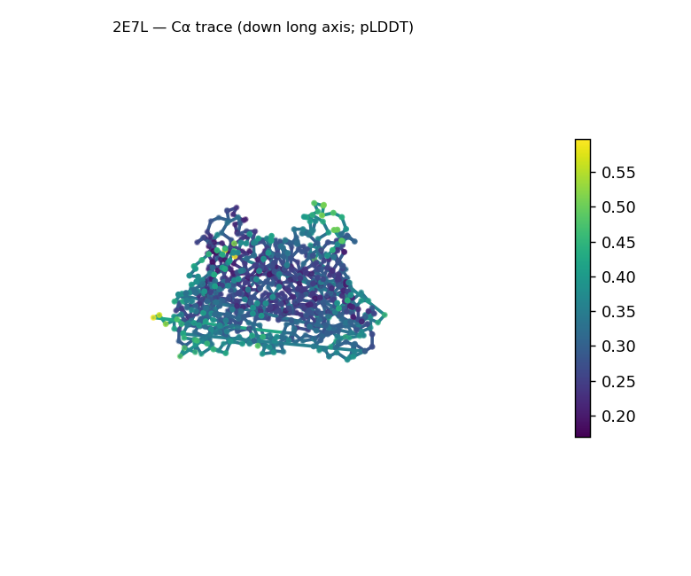
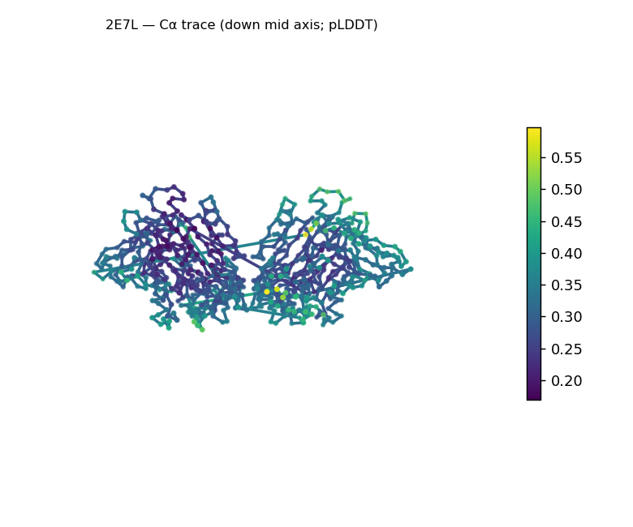
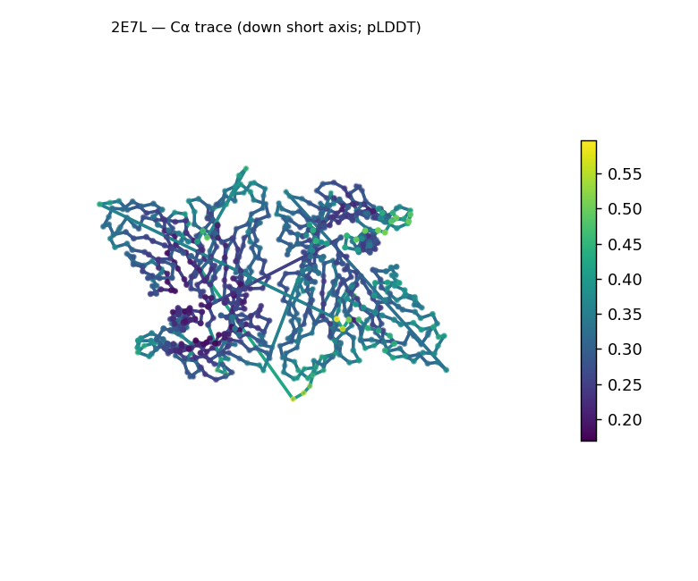
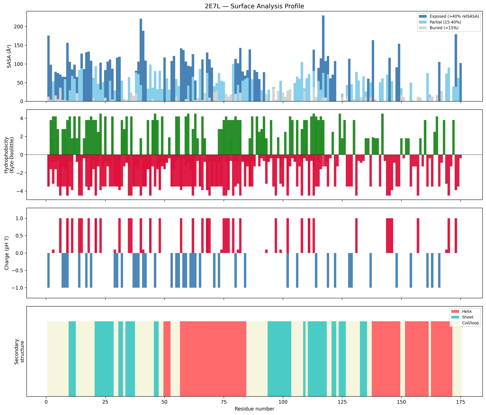
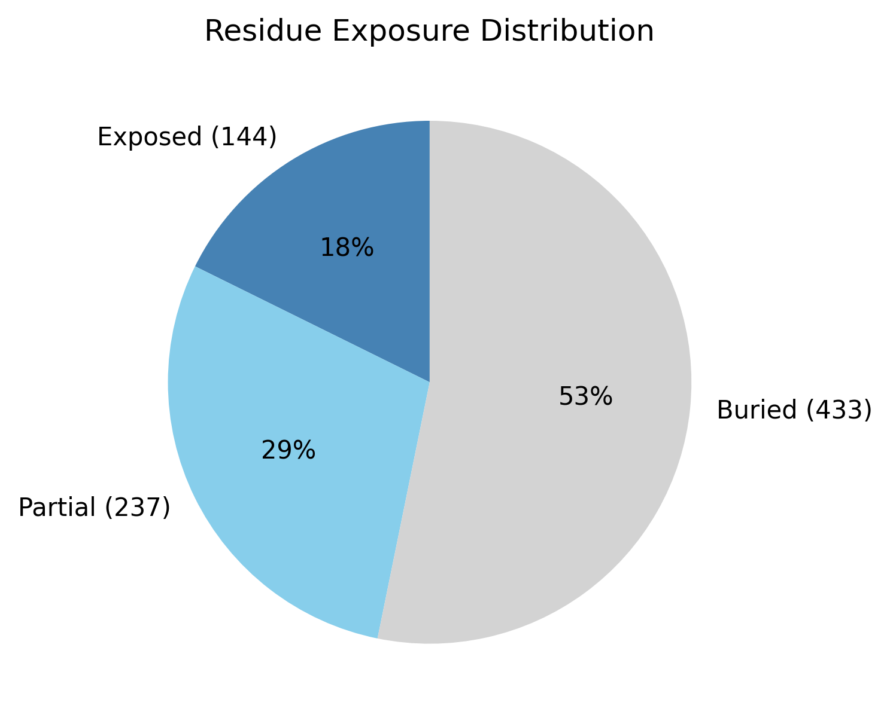

# Structural analysis — `2E7L`

> Facts are emitted deterministically from the measurement scripts. Sections marked with a SYNTHESIS comment are authored by the Claude session (judgment), kept visibly separate from the measured facts.

## Executive summary

This is an experimental X-ray structure (2.5 Å) of an eight-chain oligomeric assembly (814 residues, 6,682 atoms) that is well-ordered throughout — 53.2% of residues are buried in a packed core, the radius of gyration (31.34 Å) is no larger than the ~36.5 Å expected for 814 residues, and per-chain B-factor means (21.5–35.2) lie within the normal band for this resolution. By secondary-structure content the assembly is β-predominant with a subordinate helical component (sheet 40.8%, helix 17.4%, coil 41.8%) — a mixed α-and-β character; the α/β-vs-α+β distinction is left open because this is a whole-assembly average over heterogeneous chains, assigned by the pydssp fallback rather than reference-grade DSSP. The eight chains resolve into four sequence groups — two ~110-residue chains (A/B), two ~112-residue chains of a distinct sequence (C/D), two 175-residue chains (E/F), and two 9-residue peptides (P/Q) — i.e. two copies of a four-component protomer. The particle is markedly elongated (104.9 × 70.4 × 46.3 Å; asphericity 0.22, lo\run_pipeline.ps1 -Input data\demo\rbp.fasta -Prompt prompts\report.mdng/short axis ratio 5.96), as expected for a multi-subunit complex rather than a single globular domain. Its surface is polar (mean Kyte–Doolittle −1.66), near-neutral (net −1.9 e; 23 positive, 24 negative), and carries no exposed hydrophobic patches — all consistent with a soluble assembled complex.

## User-provided context

None provided. No organism, expected function, known structural features, or analysis goals were supplied in the user-context block; every statement in this report is derived from the structural measurements alone.

## Structure overview

- **Source:** experimental (resolution 2.5 Å)
- **Chains:** 8 (oligomeric)
- **Residues / atoms:** 814 / 6682
- **Missing residues:** 24
- **Non-solvent ligands:** none
  - chain **A**: 112 res, 1 chain break(s)
  - chain **B**: 110 res, 1 chain break(s)
  - chain **C**: 112 res, 2 chain break(s)
  - chain **D**: 112 res, 2 chain break(s)
  - chain **E**: 175 res
  - chain **F**: 175 res
  - chain **P**: 9 res
  - chain **Q**: 9 res

## Structural views

_Cα backbone trace (Agent 2.2 matplotlib placeholder), down the long / mid / short principal axes; coloured by pLDDT._

## Shape & secondary structure

- **Shape:** prolate (elongated) (asphericity 0.22, Rg 31.34 Å)
- **Approx. dimensions:** 104.9 × 70.4 × 46.3 Å
- **Secondary structure:** helix 17.4%, sheet 40.8%, coil 41.8% _(method: pydssp)_
- **⚠ SS assigned by pydssp (fallback), not mkdssp** — pydssp is a simplified DSSP reimplementation and can over- or under-call short helix/sheet segments on imperfect (e.g. predicted) backbones. Treat fractions near the ~5% floor, the helix/sheet split, and any coil-vs-disorder reasoning as provisional; install mkdssp for reference-grade assignment.

## Surface properties

- **Exposure:** buried 53.2%, partial 29.1%, exposed 17.7%
- **Total SASA:** 30057.1 Ų
- **Surface hydrophobicity (KD):** mean -1.66 ± 2.24
- **Surface charge (pH 7):** net -1.9 e (23 +, 24 −)
- **Hydrophobic patches:** 0

## Prediction quality / structural coherence

Confidence is **reported, never gated** — these signals are inputs for the synthesis below, not a pass/fail.

- **B-factor (chain A):** mean 34.34, median 33.28, range 21.75–59.64, std 7.56
- **B-factor (chain B):** mean 30.42, median 30.24, range 18.34–46.26, std 6.82
- **B-factor (chain C):** mean 28.74, median 27.82, range 17.5–49.67, std 7.04
- **B-factor (chain D):** mean 35.24, median 35.72, range 20–59.71, std 6.65
- **B-factor (chain E):** mean 31.2, median 29.86, range 20–50.98, std 7.29
- **B-factor (chain F):** mean 27.1, median 25.58, range 16.93–49.03, std 7.13
- **B-factor (chain P):** mean 21.54, median 19.47, range 18.87–28.94, std 3.37
- **B-factor (chain Q):** mean 26.91, median 26.99, range 23.78–31.71, std 2.42
- **Compactness:** Rg 31.34 Å vs ~36.5 Å expected for 814 residues (2.5·N^0.4) — consistent
- **Core present:** buried fraction 53.2%
- **Coil fraction:** 41.8%

### Coherence assessment

This is an experimental crystallographic structure (X-ray, 2.5 Å; `is_predicted` = false), so the B-factor columns are atomic displacement parameters, not pLDDT — the "low prediction confidence sitting alongside a coherent fold" situation common to low-homology *predicted* targets does not arise here. The coherence signals are mutually consistent and point to a well-ordered fold: buried fraction 53.2% (a genuine packed core), coil at a moderate 41.8% (not the >80% that would signal disorder), and a radius of gyration (31.34 Å) at or just below the ~36.5 Å single-chain globular expectation — that heuristic only loosely applies to an eight-chain particle, but it rules out gross expansion. The per-chain B-factor means (21.5–35.2 Ų, all maxima ≤59.7) sit inside the typical 25–60 Ų range for 2.5 Å data and well under the ~80 Ų high-B threshold, so no chain reads as poorly ordered. Compactness, core, and coil therefore agree with one another and with the moderate B-factors, and the backbone trace is trustworthy at this resolution.

## Expected-parameter comparison

_No expected-parameter profile supplied — this is the default for novel / low-homology targets. See the independent observations below._

## Independent observations

Against generic globular-protein baselines, two things stand out. First, the exposure distribution is shifted toward burial — exposed 17.7% versus the ~25–35% typical of a globular protein, with buried at the top of the ~40–55% range (53.2%); for an eight-chain assembly this is the expected consequence of residues buried at inter-subunit interfaces, not anomalous packing within any single chain. Second, the composition is heterogeneous — the eight chains form four sequence groups (A/B ~110 res; C/D ~112 res, distinct sequence; E/F 175 res; P/Q 9 res) present as two copies of a four-component protomer — and the two 9-residue peptide chains are well-ordered (B-factor means 21.5 and 26.9) and packed against the larger subunits rather than free in solvent. The remaining surface descriptors are unremarkable for a soluble complex: polar (mean KD −1.66), near-neutral (net −1.9 e), and free of exposed hydrophobic patches (none detected). The pronounced elongation (asphericity 0.22, long/short 5.96) is a property of the multi-subunit particle and, per the analysis rules, neither contradicts the structural class nor counts as an internal inconsistency — and no other measurements conflict. With only a whole-assembly pydssp SS average over a heterogeneous eight-chain complex and no per-component segmentation, this is a structural description, not an identity, fold-name, or function call, and there is insufficient structural evidence to assign a specific fold or function.

## Methods

- **Measurements (deterministic):** `parse_structure.py` (metadata, confidence stats), `surface_analysis.py` (Shrake–Rupley SASA, Kyte–Doolittle hydrophobicity, charge at pH 7, DSSP secondary structure, shape metrics), `render_trace.py` (Agent 2.2 Cα-trace figures; `render_views.py` Mol* cartoons when Agent 2.1 is available).
- **Report facts** below the synthesis sections are emitted verbatim from the above scripts' JSON by `assemble_report.py` — no transcription.
- **Synthesis** sections (executive summary, independent observations incl. the one-line scope statement, coherence assessment) are authored by Claude per `SKILL.md` Step 9, each claim cited to a measurement.
