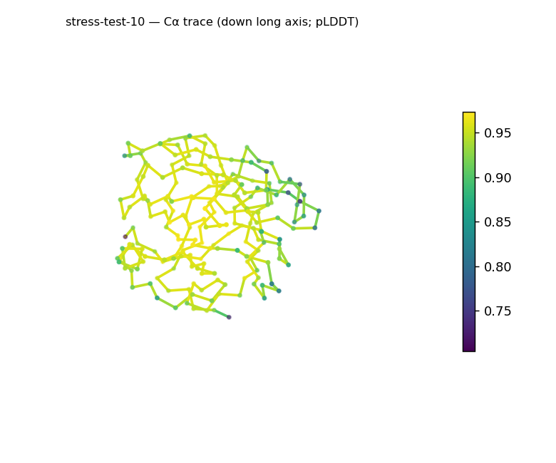
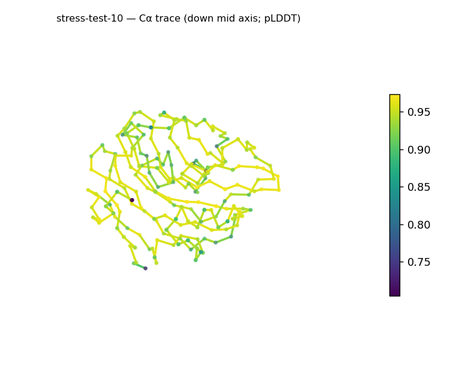
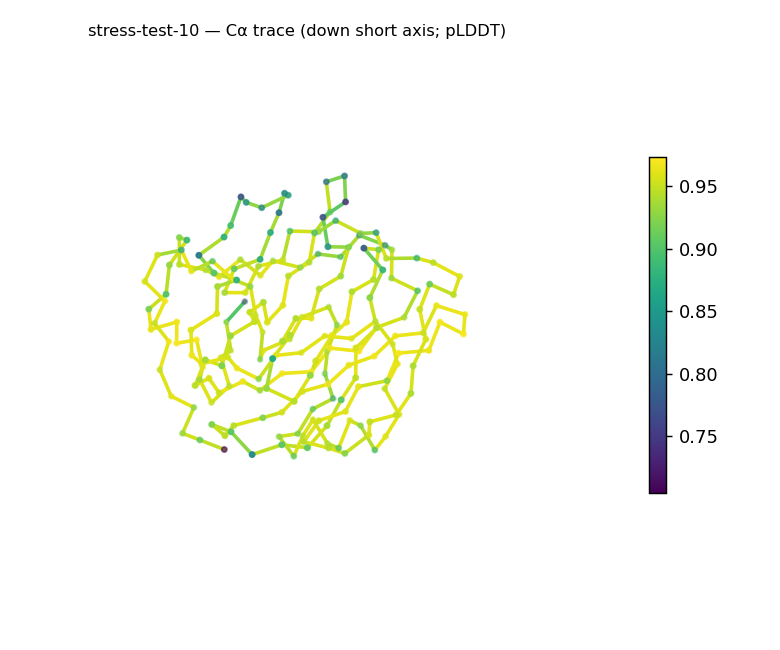
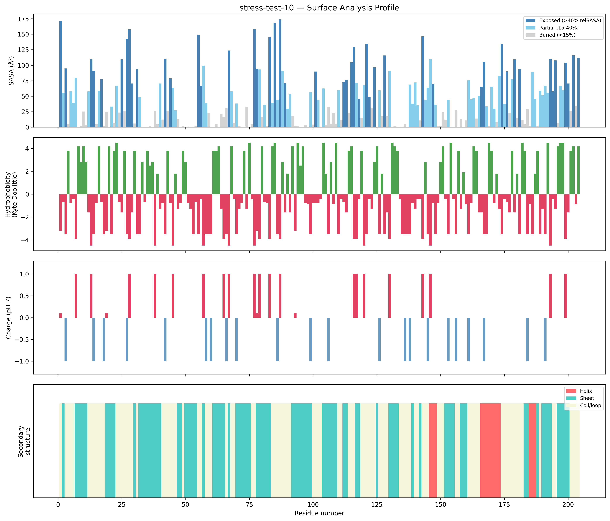
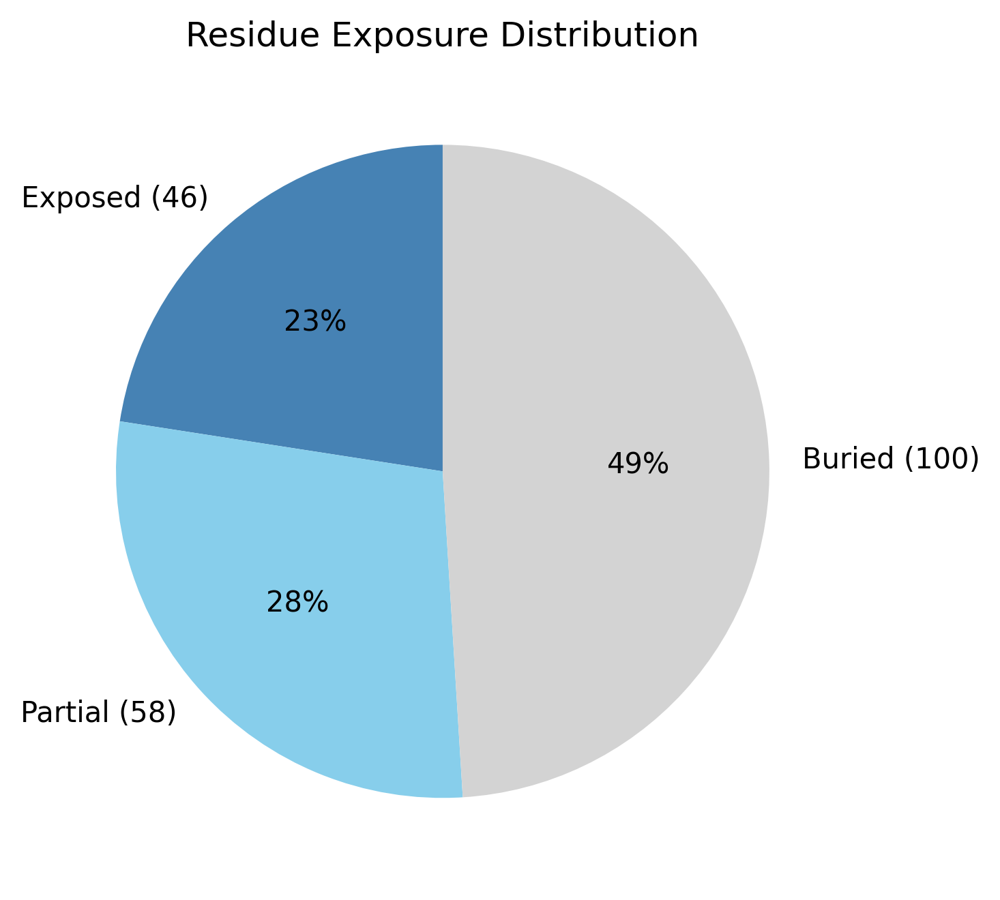

# Structural analysis — `stress-test-10`

> Facts are emitted deterministically from the measurement scripts. Sections marked with a SYNTHESIS comment are authored by the Claude session (judgment), kept visibly separate from the measured facts.

## Executive summary

A single-chain 204-residue predicted model (metadata): a compact, spherical, β-predominant globular protein at high uniform confidence. pydssp assigns sheet 44.1% / helix 6.9% / coil 49.0%; sheet dominates and helix sits just above the ~5% defining floor, so the coarse class is β-rich (all-β-leaning) — the small helix fraction is provisional under the pydssp fallback. The shape is spherical/globular (asphericity 0.01; approx. 40 × 35 × 32 Å) and compact (Rg 15.04 Å, below the ~21.0 Å expected for 204 residues, 2.5·N^0.4), with a large buried core (49.0%). The surface is polar and mildly basic (mean KD −1.85; net +5.2 e, 12 +/5 −) with no hydrophobic patches. Confidence is high and uniform (mean pLDDT 92.24, median 93.99, range 70.5–97.3, std 4.93).

## User-provided context

None provided. All observations below are derived from the structure alone.

## Structure overview

- **Source:** predicted model — pLDDT in the B-factor column
- **Chains:** 1 (single chain)
- **Residues / atoms:** 204 / 1648
- **Missing residues:** 0
- **Non-solvent ligands:** none
  - chain **A**: 204 res

## Structural views

_Cα backbone trace (Agent 2.2 matplotlib placeholder), down the long / mid / short principal axes; coloured by pLDDT._

## Shape & secondary structure

- **Shape:** spherical/globular (asphericity 0.01, Rg 15.04 Å)
- **Approx. dimensions:** 39.8 × 35 × 32.4 Å
- **Secondary structure:** helix 6.9%, sheet 44.1%, coil 49.0% _(method: pydssp)_
- **⚠ SS assigned by pydssp (fallback), not mkdssp** — pydssp is a simplified DSSP reimplementation and can over- or under-call short helix/sheet segments on imperfect (e.g. predicted) backbones. Treat fractions near the ~5% floor, the helix/sheet split, and any coil-vs-disorder reasoning as provisional; install mkdssp for reference-grade assignment.

## Surface properties

- **Exposure:** buried 49.0%, partial 28.4%, exposed 22.5%
- **Total SASA:** 9095.5 Ų
- **Surface hydrophobicity (KD):** mean -1.85 ± 2.44
- **Surface charge (pH 7):** net 5.2 e (12 +, 5 −)
- **Hydrophobic patches:** 0

## Prediction quality / structural coherence

Confidence is **reported, never gated** — these signals are inputs for the synthesis below, not a pass/fail.

- **pLDDT (chain A):** mean 92.24, median 93.99, range 70.46–97.3, std 4.93
- **Compactness:** Rg 15.04 Å vs ~21.0 Å expected for 204 residues (2.5·N^0.4) — consistent
- **Core present:** buried fraction 49.0%
- **Coil fraction:** 49.0%

### Coherence assessment

Every coherence signal and the high pLDDT agree on a compact, well-folded model. Rg 15.04 Å is below the ~21.0 Å expectation for 204 residues, asphericity 0.01 is near-perfectly spherical, and the buried core is large (49.0%). Mean pLDDT 92.24 (median 93.99, std 4.93, min 70.5) is uniformly high — there is no disorder signal and no low-confidence region.

## Expected-parameter comparison

_No expected-parameter profile supplied — this is the default for novel / low-homology targets. See the independent observations below._

## Independent observations

- **Compact and spherical.** Rg 15.04 Å is well under the ~21.0 Å globular expectation for 204 residues and asphericity 0.01 is essentially spherical — a small, tightly packed globule (49.0% buried).
- **β-predominant.** Sheet 44.1% vs helix 6.9% (just above the ~5% floor) → a β-rich class; the small helix fraction is provisional under pydssp.
- **Polar, mildly basic, patch-free surface.** Mean KD −1.85 and net +5.2 e with zero hydrophobic patches.

This is structural description, not an identity, fold-name, or function call; with no ligands and only fold-class evidence, there is insufficient structural evidence to assign a function.

## Methods

- **Measurements (deterministic):** `parse_structure.py` (metadata, confidence stats), `surface_analysis.py` (Shrake–Rupley SASA, Kyte–Doolittle hydrophobicity, charge at pH 7, DSSP secondary structure, shape metrics), `render_trace.py` (Agent 2.2 Cα-trace figures; `render_views.py` Mol* cartoons when Agent 2.1 is available).
- **Report facts** below the synthesis sections are emitted verbatim from the above scripts' JSON by `assemble_report.py` — no transcription.
- **Synthesis** sections (executive summary, independent observations incl. the one-line scope statement, coherence assessment) are authored by Claude per `SKILL.md` Step 9, each claim cited to a measurement.
