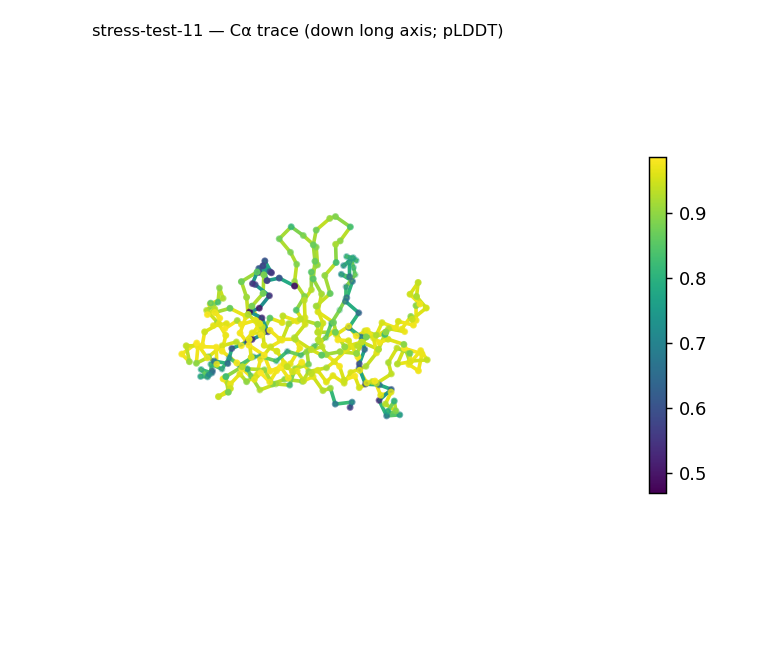
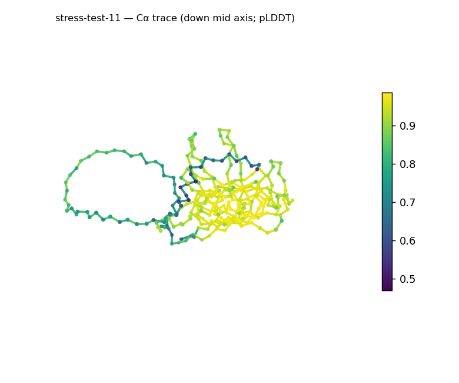
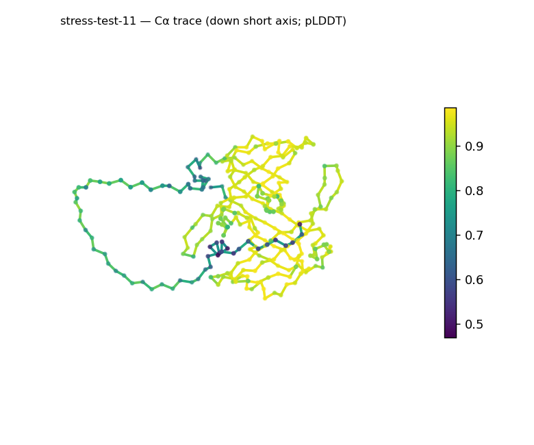
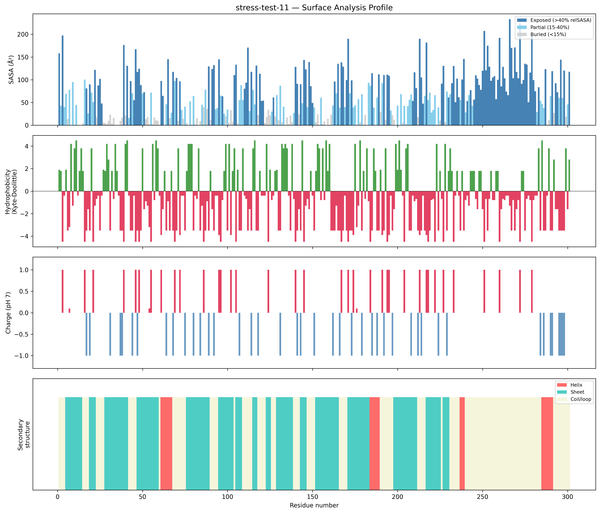
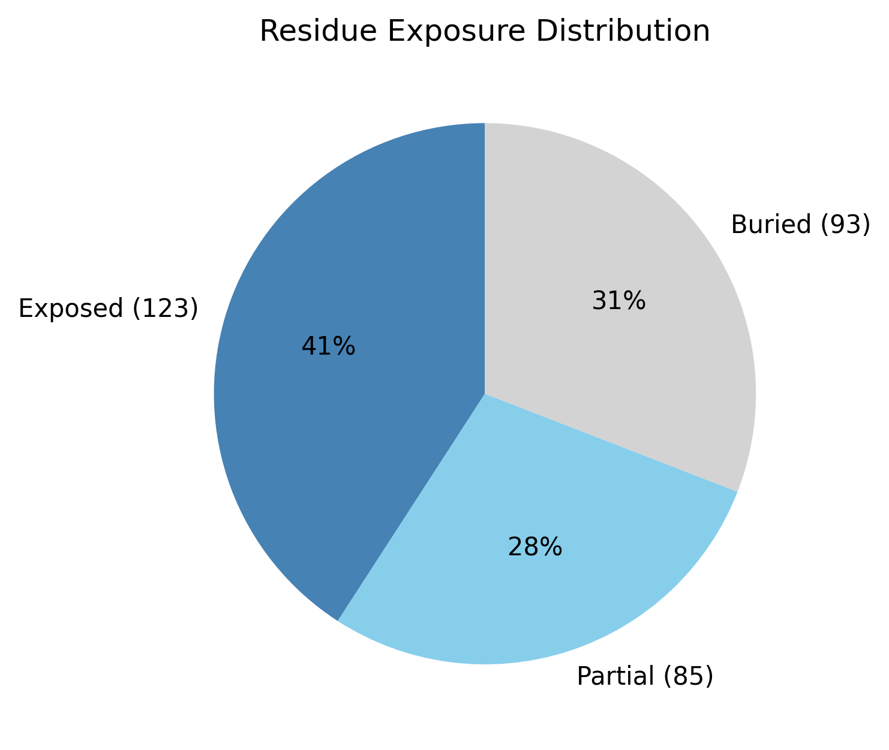

# Structural analysis — `stress-test-11`

> Facts are emitted deterministically from the measurement scripts. Sections marked with a SYNTHESIS comment are authored by the Claude session (judgment), kept visibly separate from the measured facts.

## Executive summary

A single-chain 301-residue predicted model (metadata): a roughly globular, β-predominant protein. pydssp assigns sheet 47.2% / helix 7.6% / coil 45.2%; sheet dominates and helix sits just above the ~5% defining floor, so the coarse class is β-rich (all-β-leaning), the small helix fraction being provisional under the pydssp fallback. The shape is roughly globular (asphericity 0.14; approx. 81 × 50 × 41 Å) with Rg 22.92 Å close to the ~24.5 Å expected for 301 residues (2.5·N^0.4); exposure is core-bearing but surface-rich (30.9% buried, 40.9% exposed). The surface is polar and mildly basic (mean KD −1.69; net +6 e, 22 +/16 −) with two short hydrophobic patches (KD 1.8–2.5). Confidence is confident-to-high but non-uniform (mean pLDDT 86.67, median 91.96, range 47.0–98.7, std 12.94).

## User-provided context

None provided. All observations below are derived from the structure alone.

## Structure overview

- **Source:** predicted model — pLDDT in the B-factor column
- **Chains:** 1 (single chain)
- **Residues / atoms:** 301 / 2298
- **Missing residues:** 0
- **Non-solvent ligands:** none
  - chain **A**: 301 res

## Structural views

_Cα backbone trace (Agent 2.2 matplotlib placeholder), down the long / mid / short principal axes; coloured by pLDDT._

## Shape & secondary structure

- **Shape:** roughly globular (asphericity 0.14, Rg 22.92 Å)
- **Approx. dimensions:** 80.9 × 49.5 × 40.8 Å
- **Secondary structure:** helix 7.6%, sheet 47.2%, coil 45.2% _(method: pydssp)_
- **⚠ SS assigned by pydssp (fallback), not mkdssp** — pydssp is a simplified DSSP reimplementation and can over- or under-call short helix/sheet segments on imperfect (e.g. predicted) backbones. Treat fractions near the ~5% floor, the helix/sheet split, and any coil-vs-disorder reasoning as provisional; install mkdssp for reference-grade assignment.

## Surface properties

- **Exposure:** buried 30.9%, partial 28.2%, exposed 40.9%
- **Total SASA:** 19287.2 Ų
- **Surface hydrophobicity (KD):** mean -1.69 ± 2.25
- **Surface charge (pH 7):** net 6 e (22 +, 16 −)
- **Hydrophobic patches:** 2:
  - residues 230–232 (len 3, mean KD 2.47)
  - residues 243–245 (len 3, mean KD 1.8)

## Prediction quality / structural coherence

Confidence is **reported, never gated** — these signals are inputs for the synthesis below, not a pass/fail.

- **pLDDT (chain A):** mean 86.67, median 91.96, range 46.99–98.66, std 12.94
- **Compactness:** Rg 22.92 Å vs ~24.5 Å expected for 301 residues (2.5·N^0.4) — consistent
- **Core present:** buried fraction 30.9%
- **Coil fraction:** 45.2%

### Coherence assessment

The coherence signals support an ordered, compact model and agree with the confident pLDDT. Rg 22.92 Å is close to the ~24.5 Å expectation for 301 residues, a core is present (30.9% buried), and sheet+helix cover ~55% of residues. Mean pLDDT 86.67 (median 91.96, std 12.94) is confident-to-high; the gap between mean and median plus the low minimum (47.0) localizes uncertainty to a minority of positions, leaving the compact β-rich body well determined.

## Expected-parameter comparison

_No expected-parameter profile supplied — this is the default for novel / low-homology targets. See the independent observations below._

## Independent observations

- **β-predominant, roughly globular.** Sheet 47.2% vs helix 7.6% (just above the ~5% floor) → β-rich; asphericity 0.14 and Rg 22.92 Å (≈ the 24.5 Å expectation) describe a compact, near-globular body.
- **Surface-rich exposure.** Exposed fraction 40.9% exceeds the 25–35% globular norm while buried (30.9%) is at the low end — a comparatively surface-exposed packing, though still cored.
- **Polar, mildly basic surface.** Mean KD −1.69 and net +6 e with two short, weak hydrophobic patches (KD 1.8–2.5).

This is structural description, not an identity, fold-name, or function call; with no ligands and only fold-class evidence, there is insufficient structural evidence to assign a function.

## Methods

- **Measurements (deterministic):** `parse_structure.py` (metadata, confidence stats), `surface_analysis.py` (Shrake–Rupley SASA, Kyte–Doolittle hydrophobicity, charge at pH 7, DSSP secondary structure, shape metrics), `render_trace.py` (Agent 2.2 Cα-trace figures; `render_views.py` Mol* cartoons when Agent 2.1 is available).
- **Report facts** below the synthesis sections are emitted verbatim from the above scripts' JSON by `assemble_report.py` — no transcription.
- **Synthesis** sections (executive summary, independent observations incl. the one-line scope statement, coherence assessment) are authored by Claude per `SKILL.md` Step 9, each claim cited to a measurement.
