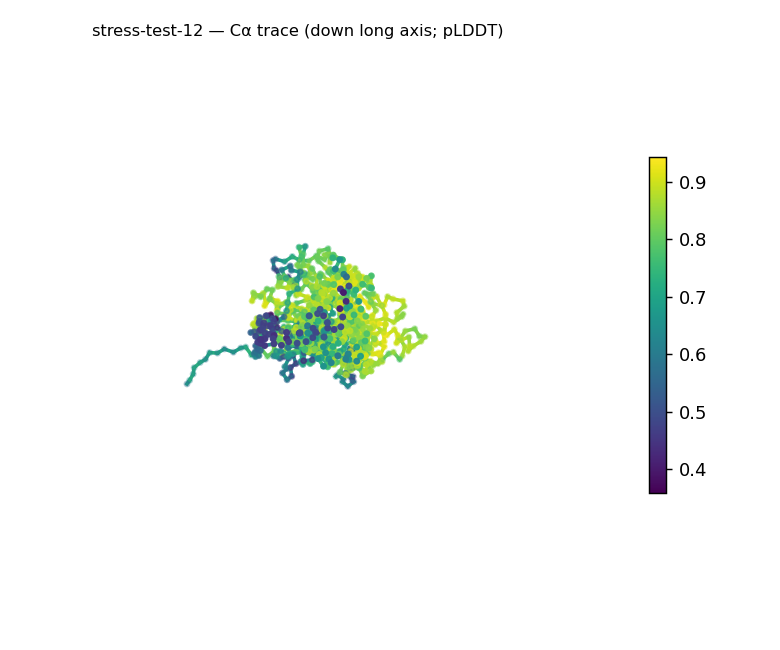
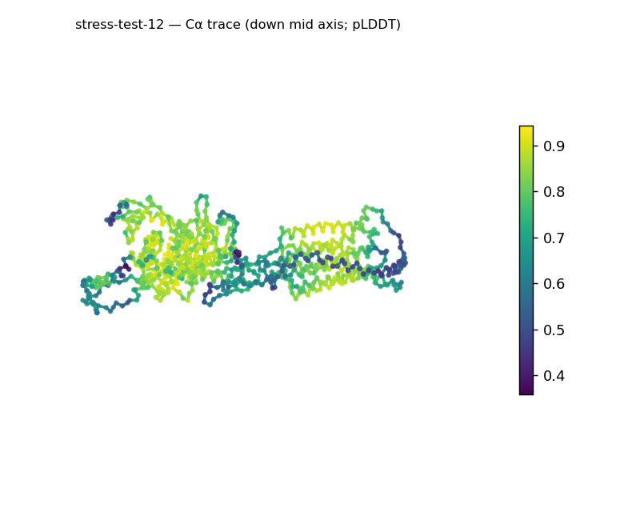
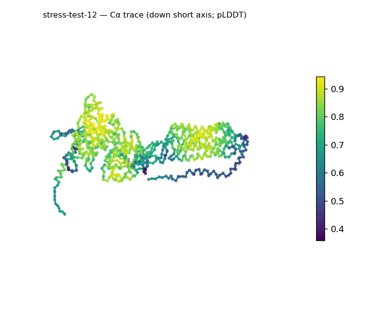
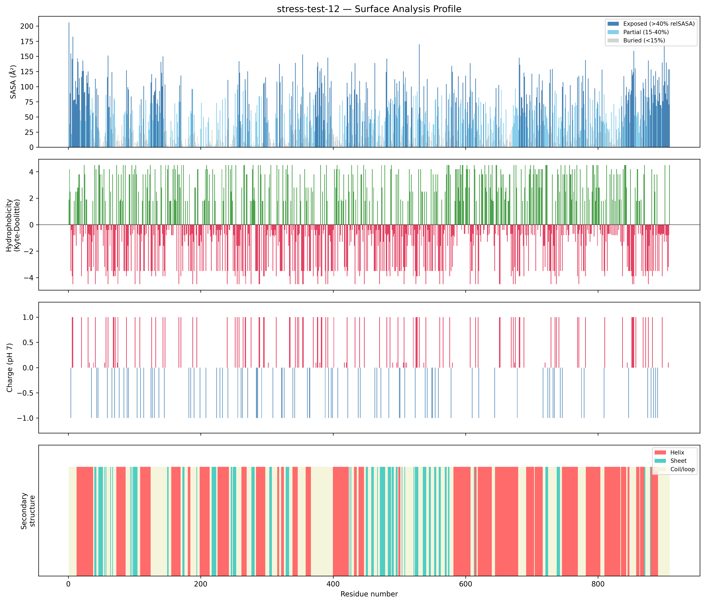
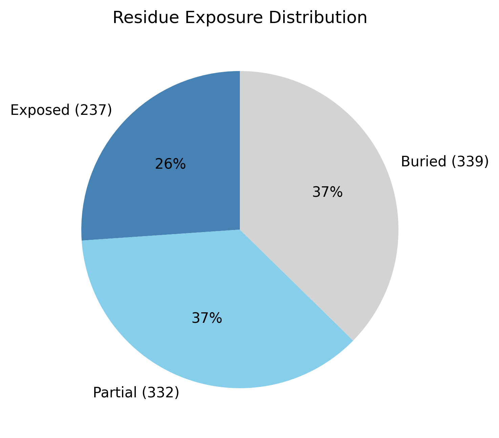

# Structural analysis — `stress-test-12`

> Facts are emitted deterministically from the measurement scripts. Sections marked with a SYNTHESIS comment are authored by the Claude session (judgment), kept visibly separate from the measured facts.

## Executive summary

A large single-chain 908-residue predicted model (metadata): a helix-leaning, markedly elongated multidomain protein. pydssp assigns helix 44.2% / sheet 13.9% / coil 42.0%; both elements are present (sheet above the ~5% floor) → a mixed α/β-or-α+β (helix-leaning) class, which at 908 residues is a whole-chain average across probable multiple domains (parallel-vs-antiparallel not resolvable). The shape is strongly prolate/elongated (asphericity 0.58; approx. 147 × 90 × 52 Å) with Rg 42.63 Å slightly above the ~38.1 Å expected for 908 residues (2.5·N^0.4) and a defined core (37.3% buried). The surface is basic and moderately polar (net +16.0 e, 54 +/29 −; mean KD −0.85) with many short hydrophobic patches (12, KD 2.9–4.5). Confidence is confident but non-uniform (mean pLDDT 76.63, median 81.54, range 35.8–94.3, std 13.87).

## User-provided context

None provided. All observations below are derived from the structure alone.

## Structure overview

- **Source:** predicted model — pLDDT in the B-factor column
- **Chains:** 1 (single chain)
- **Residues / atoms:** 908 / 7148
- **Missing residues:** 0
- **Non-solvent ligands:** none
  - chain **A**: 908 res

## Structural views

_Cα backbone trace (Agent 2.2 matplotlib placeholder), down the long / mid / short principal axes; coloured by pLDDT._

## Shape & secondary structure

- **Shape:** prolate (elongated) (asphericity 0.58, Rg 42.63 Å)
- **Approx. dimensions:** 146.9 × 90 × 52.3 Å
- **Secondary structure:** helix 44.2%, sheet 13.9%, coil 42.0% _(method: pydssp)_
- **⚠ SS assigned by pydssp (fallback), not mkdssp** — pydssp is a simplified DSSP reimplementation and can over- or under-call short helix/sheet segments on imperfect (e.g. predicted) backbones. Treat fractions near the ~5% floor, the helix/sheet split, and any coil-vs-disorder reasoning as provisional; install mkdssp for reference-grade assignment.

## Surface properties

- **Exposure:** buried 37.3%, partial 36.6%, exposed 26.1%
- **Total SASA:** 46200.8 Ų
- **Surface hydrophobicity (KD):** mean -0.85 ± 3.04
- **Surface charge (pH 7):** net 16.0 e (54 +, 29 −)
- **Hydrophobic patches:** 12:
  - residues 1–3 (len 3, mean KD 2.87)
  - residues 13–17 (len 5, mean KD 3.14)
  - residues 122–124 (len 3, mean KD 3.37)
  - residues 588–590 (len 3, mean KD 3.73)
  - residues 595–597 (len 3, mean KD 3.6)
  - residues 696–698 (len 3, mean KD 4.17)
  - residues 710–712 (len 3, mean KD 3.73)
  - residues 714–716 (len 3, mean KD 3.73)
  - residues 721–723 (len 3, mean KD 4.5)
  - residues 749–751 (len 3, mean KD 3.6)
  - residues 840–843 (len 4, mean KD 4.08)
  - residues 858–860 (len 3, mean KD 3.4)

## Prediction quality / structural coherence

Confidence is **reported, never gated** — these signals are inputs for the synthesis below, not a pass/fail.

- **pLDDT (chain A):** mean 76.63, median 81.54, range 35.84–94.27, std 13.87
- **Compactness:** Rg 42.63 Å vs ~38.1 Å expected for 908 residues (2.5·N^0.4) — consistent
- **Core present:** buried fraction 37.3%
- **Coil fraction:** 42.0%

### Coherence assessment

The coherence signals indicate a genuinely folded model and agree with the confident pLDDT despite the chain's size. Rg 42.63 Å is close to (slightly above) the ~38.1 Å expectation for 908 residues, a core is present (37.3% buried), and helix+sheet cover ~58% of residues (coil 42.0%). Mean pLDDT 76.63 (median 81.54, std 13.87, min 35.8) is confident with a low-confidence minority — expected for a very large MSA-free prediction whose domain cores resolve better than inter-domain linkers; the slightly elevated Rg is consistent with the elongated, multidomain layout, not expansion.

## Expected-parameter comparison

_No expected-parameter profile supplied — this is the default for novel / low-homology targets. See the independent observations below._

## Independent observations

- **Large and markedly elongated.** Asphericity 0.58 is far into the prolate range and axes reach ~147 × 90 × 52 Å; Rg 42.63 Å is only slightly above the ~38.1 Å globular expectation for 908 residues, so the body is elongated yet still packed (37.3% buried).
- **Whole-chain SS average.** Helix 44.2% / sheet 13.9% is averaged across probable multiple domains at 908 residues; with pydssp not mkdssp the split is provisional, and per-domain segmentation would be needed to call any single fold.
- **Basic surface, many short patches.** Net +16.0 e (54 +/29 −) is a pronounced positive surface charge, and 12 short hydrophobic patches (KD 2.9–4.5) are distributed along the chain, each individually small.

This is structural description, not an identity, fold-name, or function call; with no ligands detected and only whole-chain fold-class evidence, there is insufficient structural evidence to assign a function.

## Methods

- **Measurements (deterministic):** `parse_structure.py` (metadata, confidence stats), `surface_analysis.py` (Shrake–Rupley SASA, Kyte–Doolittle hydrophobicity, charge at pH 7, DSSP secondary structure, shape metrics), `render_trace.py` (Agent 2.2 Cα-trace figures; `render_views.py` Mol* cartoons when Agent 2.1 is available).
- **Report facts** below the synthesis sections are emitted verbatim from the above scripts' JSON by `assemble_report.py` — no transcription.
- **Synthesis** sections (executive summary, independent observations incl. the one-line scope statement, coherence assessment) are authored by Claude per `SKILL.md` Step 9, each claim cited to a measurement.
