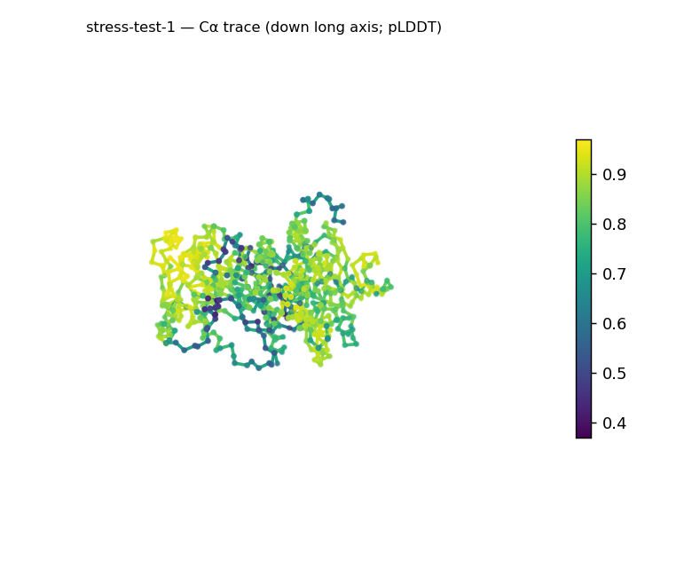
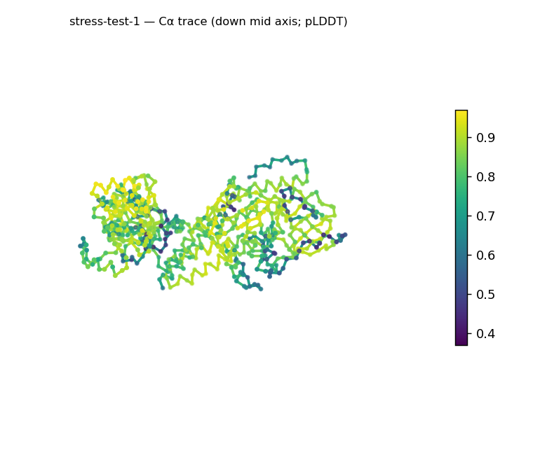
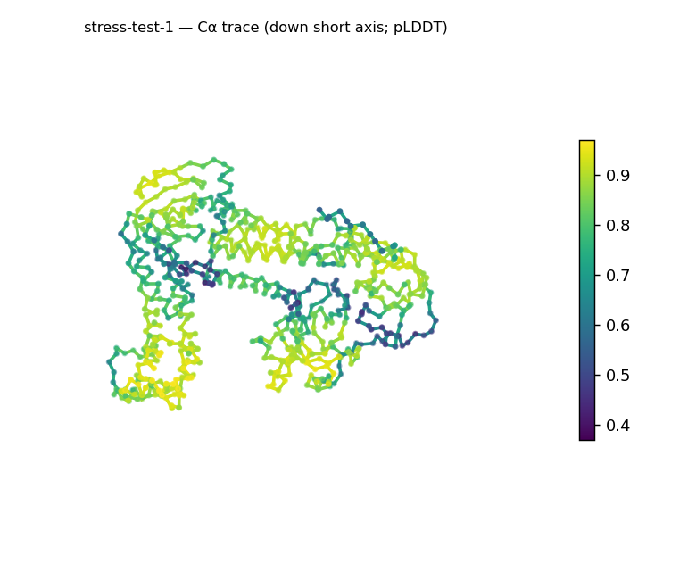
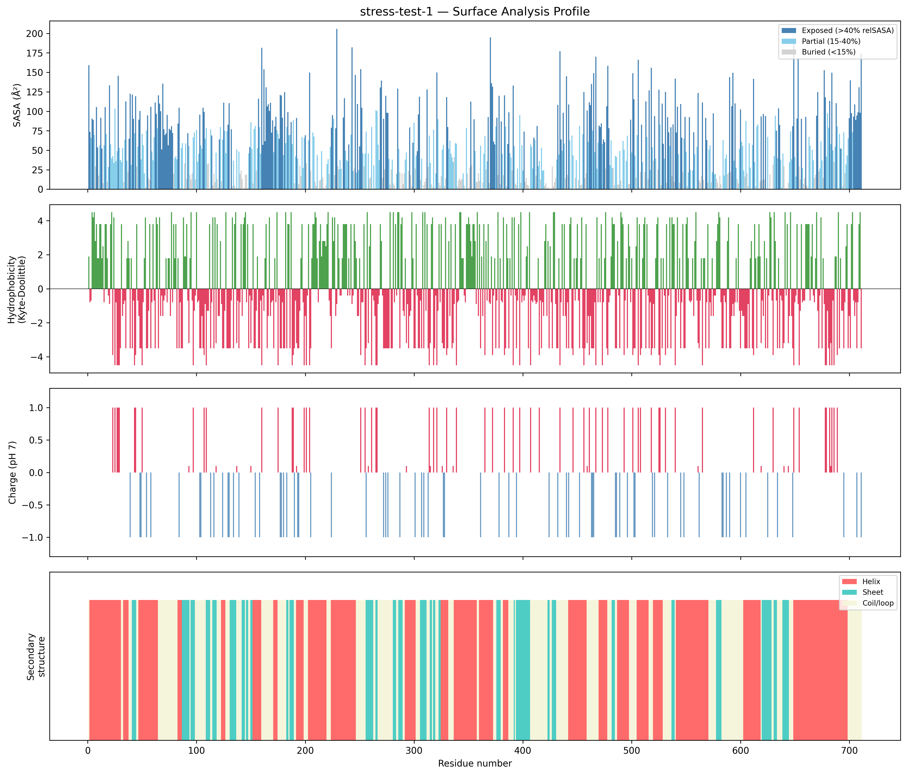
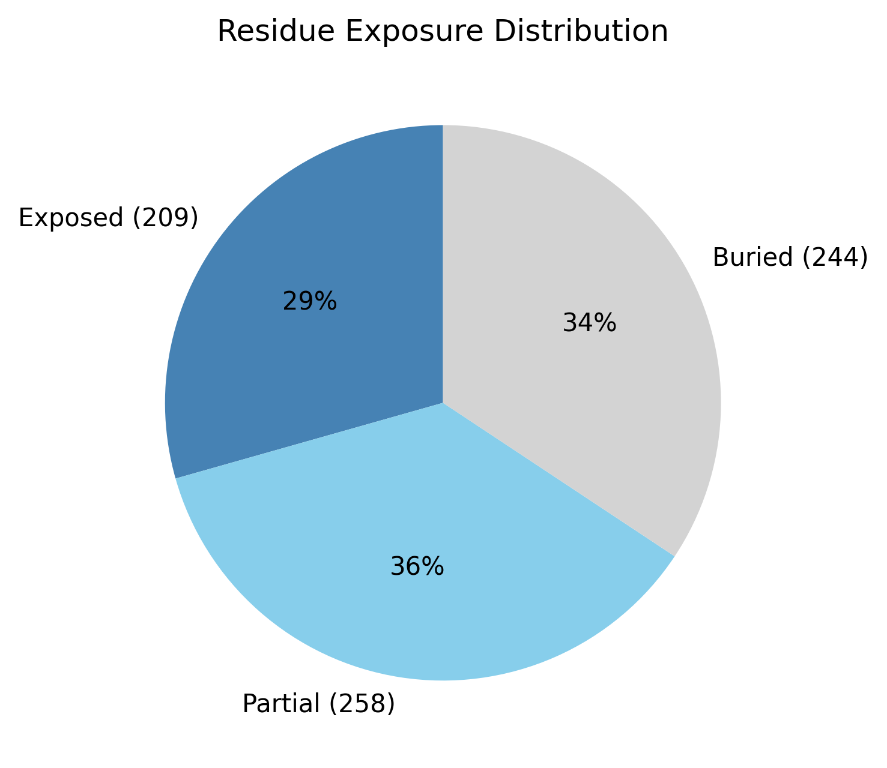

# Structural analysis — `stress-test-1`

> Facts are emitted deterministically from the measurement scripts. Sections marked with a SYNTHESIS comment are authored by the Claude session (judgment), kept visibly separate from the measured facts.

## Executive summary

A single-chain 711-residue predicted model (metadata) that reads as a compact but elongated, multidomain globular protein. pydssp assigns helix 46.0% / sheet 17.3% / coil 36.7%, so both elements are present and the coarse class is a mixed α/β-or-α+β, helix-leaning — but at 711 residues this is a whole-chain average across what are almost certainly several domains, and the parallel-vs-antiparallel (α/β vs α+β) distinction is not resolvable from whole-chain data. The shape is prolate/elongated (asphericity 0.21; approx. 95 × 72 × 49 Å), yet Rg 32.08 Å sits just below the ~34.6 Å expected for 711 residues (2.5·N^0.4) and a defined core is present (34.3% buried) — a packed but elongated body, not an extended one. The solvent-exposed surface is essentially neutral and moderately polar (net −0.6 e, 32 +/29 −; mean Kyte–Doolittle −1.04) with only three short hydrophobic patches (3–4 residues, KD 3.1–4.4). Confidence is in the confident tier but non-uniform (mean pLDDT 78.89, median 83.34, range 37.0–96.9, std 13.82), and no ligands or metals were detected (metadata).

## User-provided context

None provided. All observations below are derived from the structure alone.

## Structure overview

- **Source:** predicted model — pLDDT in the B-factor column
- **Chains:** 1 (single chain)
- **Residues / atoms:** 711 / 5601
- **Missing residues:** 0
- **Non-solvent ligands:** none
  - chain **A**: 711 res

## Structural views

_Cα backbone trace (Agent 2.2 matplotlib placeholder), down the long / mid / short principal axes; coloured by pLDDT._

## Shape & secondary structure

- **Shape:** prolate (elongated) (asphericity 0.21, Rg 32.08 Å)
- **Approx. dimensions:** 95.3 × 71.7 × 49 Å
- **Secondary structure:** helix 46.0%, sheet 17.3%, coil 36.7% _(method: pydssp)_
- **⚠ SS assigned by pydssp (fallback), not mkdssp** — pydssp is a simplified DSSP reimplementation and can over- or under-call short helix/sheet segments on imperfect (e.g. predicted) backbones. Treat fractions near the ~5% floor, the helix/sheet split, and any coil-vs-disorder reasoning as provisional; install mkdssp for reference-grade assignment.

## Surface properties

- **Exposure:** buried 34.3%, partial 36.3%, exposed 29.4%
- **Total SASA:** 37864.9 Ų
- **Surface hydrophobicity (KD):** mean -1.04 ± 2.8
- **Surface charge (pH 7):** net -0.6 e (32 +, 29 −)
- **Hydrophobic patches:** 3:
  - residues 4–6 (len 3, mean KD 4.4)
  - residues 11–13 (len 3, mean KD 3.13)
  - residues 235–238 (len 4, mean KD 3.8)

## Prediction quality / structural coherence

Confidence is **reported, never gated** — these signals are inputs for the synthesis below, not a pass/fail.

- **pLDDT (chain A):** mean 78.89, median 83.34, range 37.04–96.9, std 13.82
- **Compactness:** Rg 32.08 Å vs ~34.6 Å expected for 711 residues (2.5·N^0.4) — consistent
- **Core present:** buried fraction 34.3%
- **Coil fraction:** 36.7%

### Coherence assessment

The coherence signals support a genuinely folded model and agree with the confident pLDDT. Compactness is in the folded range (Rg 32.08 Å vs the ~34.6 Å globular expectation for 711 residues), a defined core is present (34.3% buried), and ~63% of residues are in helix or sheet (coil 36.7%) — none of the disorder indicators (no core, extended dimensions, overwhelming coil) is met. Mean pLDDT 78.89 (median 83.34) is confident; the wide spread (37.0–96.9, std 13.82) localizes uncertainty to a minority of positions — expected for a large MSA-free prediction — without contradicting the compact, cored architecture.

## Expected-parameter comparison

_No expected-parameter profile supplied — this is the default for novel / low-homology targets. See the independent observations below._

## Independent observations

- **Elongated but compact.** Asphericity 0.21 places the body in the prolate/elongated range (>0.15), yet Rg 32.08 Å is at or below the ~34.6 Å globular expectation for 711 residues — elongation here is shape, not expansion.
- **Defined core, near-neutral surface.** Buried fraction 34.3% is within the globular range; the exposed surface is essentially uncharged (net −0.6 e) and moderately polar (mean KD −1.04), with only three short hydrophobic patches (KD 3.1–4.4), none long enough to read as an extended exposed hydrophobic surface.
- **Whole-chain SS average.** At 711 residues the helix 46.0% / sheet 17.3% split is averaged across probable multiple domains; with pydssp used in place of mkdssp, the precise split and any single-fold reading are provisional, and per-domain segmentation would be needed to go further.

This is structural description, not an identity, fold-name, or function call; with no ligands detected and only whole-chain fold-class evidence, there is insufficient structural evidence to assign a function.

## Methods

- **Measurements (deterministic):** `parse_structure.py` (metadata, confidence stats), `surface_analysis.py` (Shrake–Rupley SASA, Kyte–Doolittle hydrophobicity, charge at pH 7, DSSP secondary structure, shape metrics), `render_trace.py` (Agent 2.2 Cα-trace figures; `render_views.py` Mol* cartoons when Agent 2.1 is available).
- **Report facts** below the synthesis sections are emitted verbatim from the above scripts' JSON by `assemble_report.py` — no transcription.
- **Synthesis** sections (executive summary, independent observations incl. the one-line scope statement, coherence assessment) are authored by Claude per `SKILL.md` Step 9, each claim cited to a measurement.
