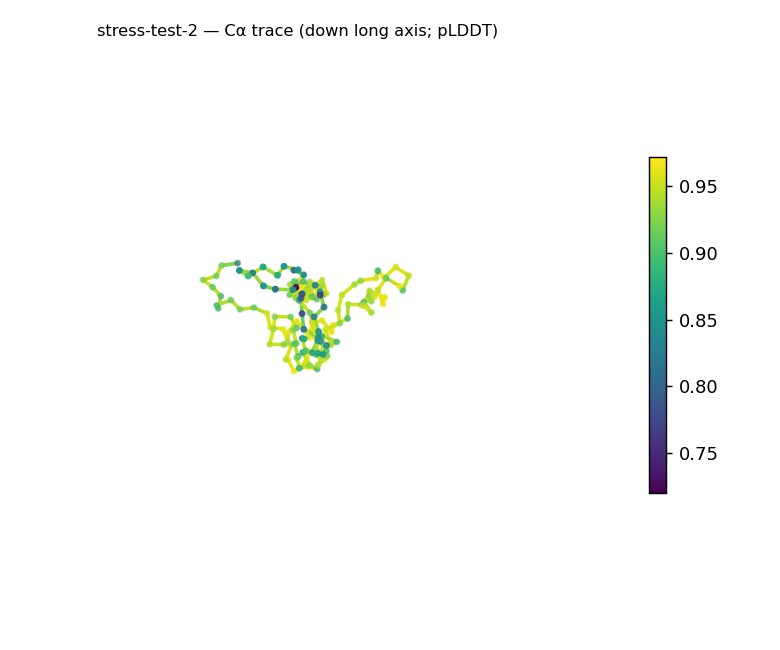
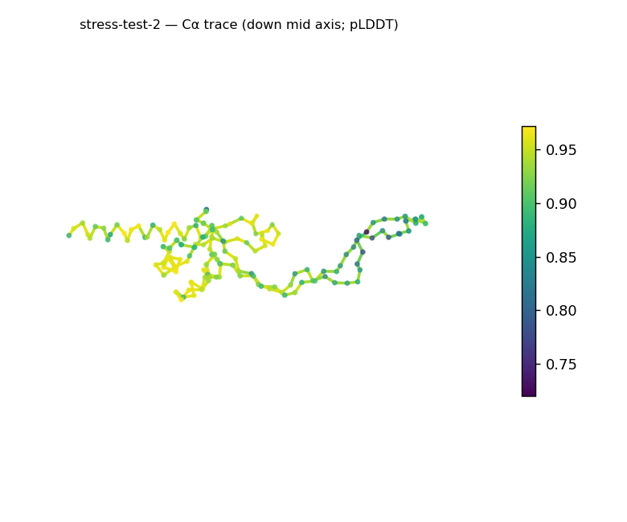
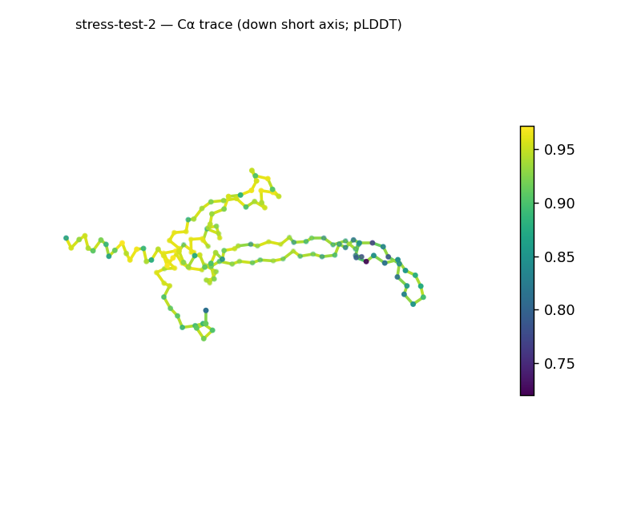
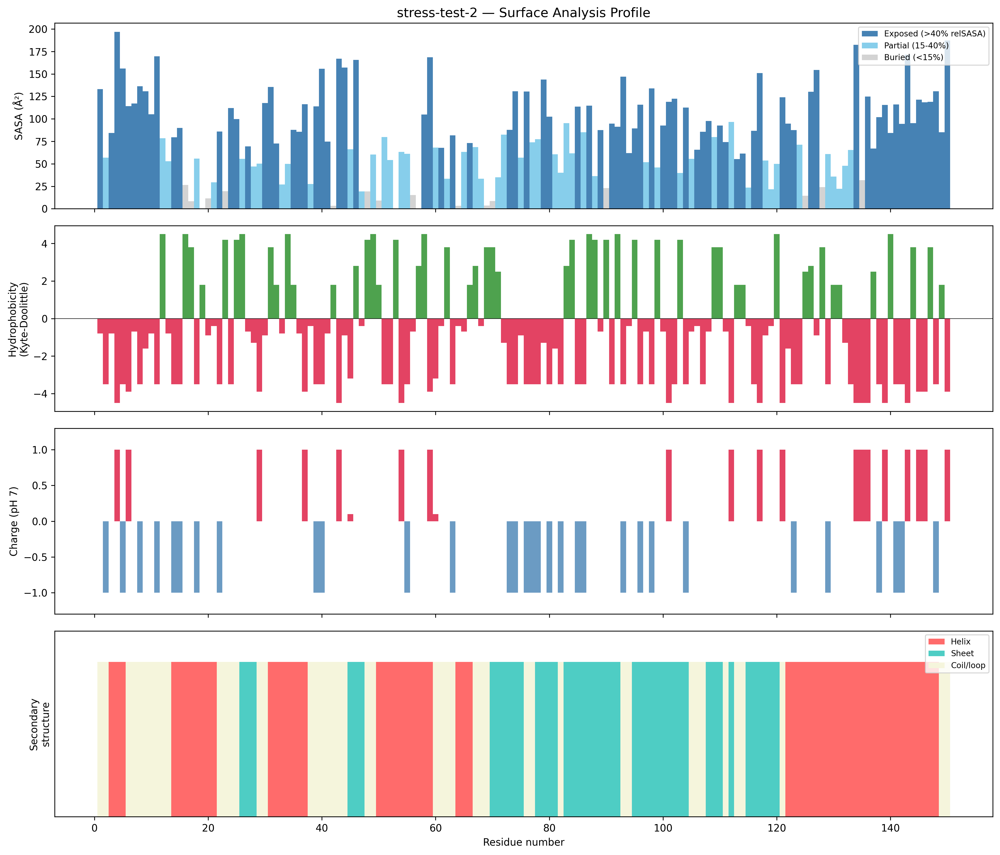
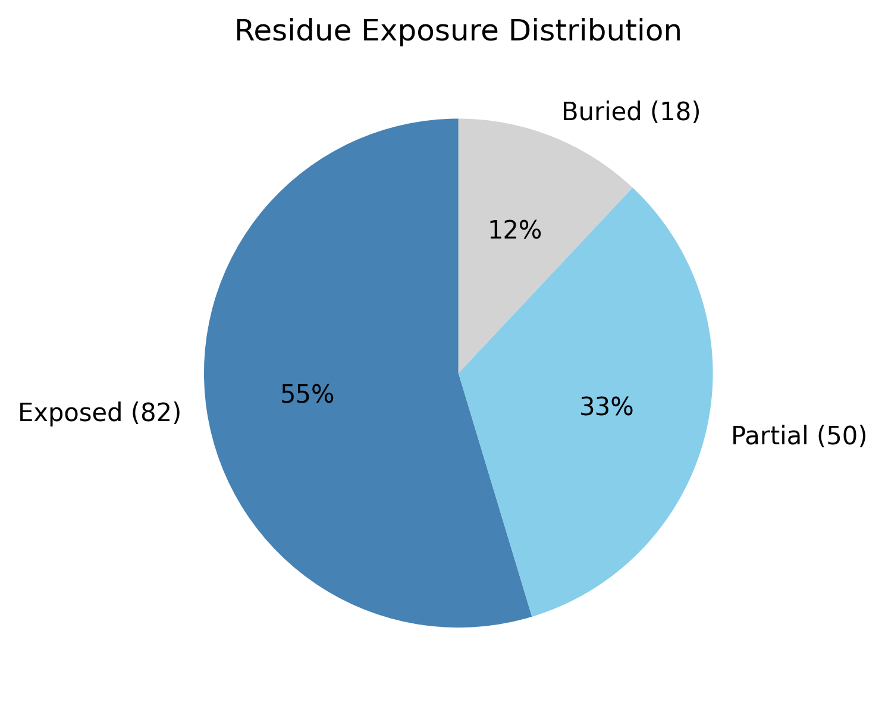

# Structural analysis — `stress-test-2`

> Facts are emitted deterministically from the measurement scripts. Sections marked with a SYNTHESIS comment are authored by the Claude session (judgment), kept visibly separate from the measured facts.

## Executive summary

A small single-chain 150-residue predicted model (metadata) with an unusually elongated, low-core architecture that is nonetheless high-confidence and ordered. pydssp assigns helix 38.7% / sheet 30.7% / coil 30.7%, both elements well represented, giving a mixed α/β-or-α+β class (parallel-vs-antiparallel not resolvable here). The shape is strongly prolate (asphericity 0.53; approx. 101 × 47 × 25 Å) and Rg 26.32 Å is well above the ~18.6 Å expected for 150 residues (2.5·N^0.4) — an extended body. Only 12.0% of residues are buried (well below the 40–55% globular norm), with zero hydrophobic patches and a net acidic surface (−8 e, 15 +/23 −; mean KD −1.44). Despite the small core and extended dimensions, confidence is high and uniform (mean pLDDT 90.68, median 91.99, range 72.0–97.2, std 5.06), so this reads as an ordered elongated fold rather than a disordered chain.

## User-provided context

None provided. All observations below are derived from the structure alone.

## Structure overview

- **Source:** predicted model — pLDDT in the B-factor column
- **Chains:** 1 (single chain)
- **Residues / atoms:** 150 / 1219
- **Missing residues:** 0
- **Non-solvent ligands:** none
  - chain **A**: 150 res

## Structural views

_Cα backbone trace (Agent 2.2 matplotlib placeholder), down the long / mid / short principal axes; coloured by pLDDT._

## Shape & secondary structure

- **Shape:** prolate (elongated) (asphericity 0.53, Rg 26.32 Å)
- **Approx. dimensions:** 100.6 × 47.2 × 25.2 Å
- **Secondary structure:** helix 38.7%, sheet 30.7%, coil 30.7% _(method: pydssp)_
- **⚠ SS assigned by pydssp (fallback), not mkdssp** — pydssp is a simplified DSSP reimplementation and can over- or under-call short helix/sheet segments on imperfect (e.g. predicted) backbones. Treat fractions near the ~5% floor, the helix/sheet split, and any coil-vs-disorder reasoning as provisional; install mkdssp for reference-grade assignment.

## Surface properties

- **Exposure:** buried 12.0%, partial 33.3%, exposed 54.7%
- **Total SASA:** 12145.3 Ų
- **Surface hydrophobicity (KD):** mean -1.44 ± 2.88
- **Surface charge (pH 7):** net -8 e (15 +, 23 −)
- **Hydrophobic patches:** 0

## Prediction quality / structural coherence

Confidence is **reported, never gated** — these signals are inputs for the synthesis below, not a pass/fail.

- **pLDDT (chain A):** mean 90.68, median 91.99, range 72.01–97.16, std 5.06
- **Compactness:** Rg 26.32 Å vs ~18.6 Å expected for 150 residues (2.5·N^0.4) — larger than expected
- **Core present:** buried fraction 12.0%
- **Coil fraction:** 30.7%

### Coherence assessment

Confidence and coherence both point to an ordered model, but the architecture is extended rather than compact-globular. Mean pLDDT 90.68 (median 91.99, std 5.06, min 72.0) is uniformly high and coil is only 30.7%, so the disorder indicators do not converge. The two atypical signals — Rg 26.32 Å against the ~18.6 Å expectation, and a 12.0% buried fraction below the 40–55% globular norm — reflect an elongated shape with a small packed core, consistent with the high pLDDT, not low-confidence disorder.

## Expected-parameter comparison

_No expected-parameter profile supplied — this is the default for novel / low-homology targets. See the independent observations below._

## Independent observations

- **Extended for its size.** Rg 26.32 Å is ~1.4× the ~18.6 Å expected for 150 residues, and asphericity 0.53 is firmly in the prolate range (>0.30) — the model is rod-like, not globular.
- **Low buried fraction without disorder.** At 12.0% buried (vs the 40–55% globular norm) the core is minimal, but coil is only 30.7% and pLDDT is uniformly high (std 5.06), so this is ordered-extended, not disordered.
- **Acidic, patch-free surface.** Net −8 e (15 +/23 −) and mean surface KD −1.44 with zero hydrophobic patches — a polar, acidic exterior.

This is structural description, not an identity, fold-name, or function call; with no ligands and only fold-class evidence, there is insufficient structural evidence to assign a function.

## Methods

- **Measurements (deterministic):** `parse_structure.py` (metadata, confidence stats), `surface_analysis.py` (Shrake–Rupley SASA, Kyte–Doolittle hydrophobicity, charge at pH 7, DSSP secondary structure, shape metrics), `render_trace.py` (Agent 2.2 Cα-trace figures; `render_views.py` Mol* cartoons when Agent 2.1 is available).
- **Report facts** below the synthesis sections are emitted verbatim from the above scripts' JSON by `assemble_report.py` — no transcription.
- **Synthesis** sections (executive summary, independent observations incl. the one-line scope statement, coherence assessment) are authored by Claude per `SKILL.md` Step 9, each claim cited to a measurement.
