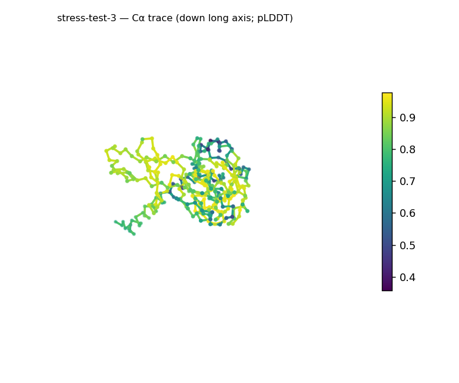
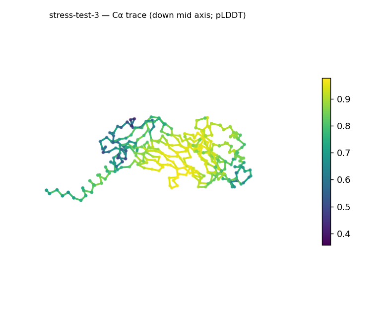
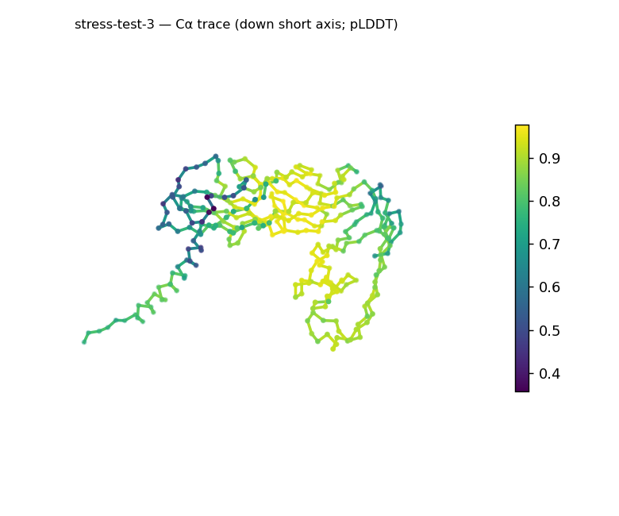
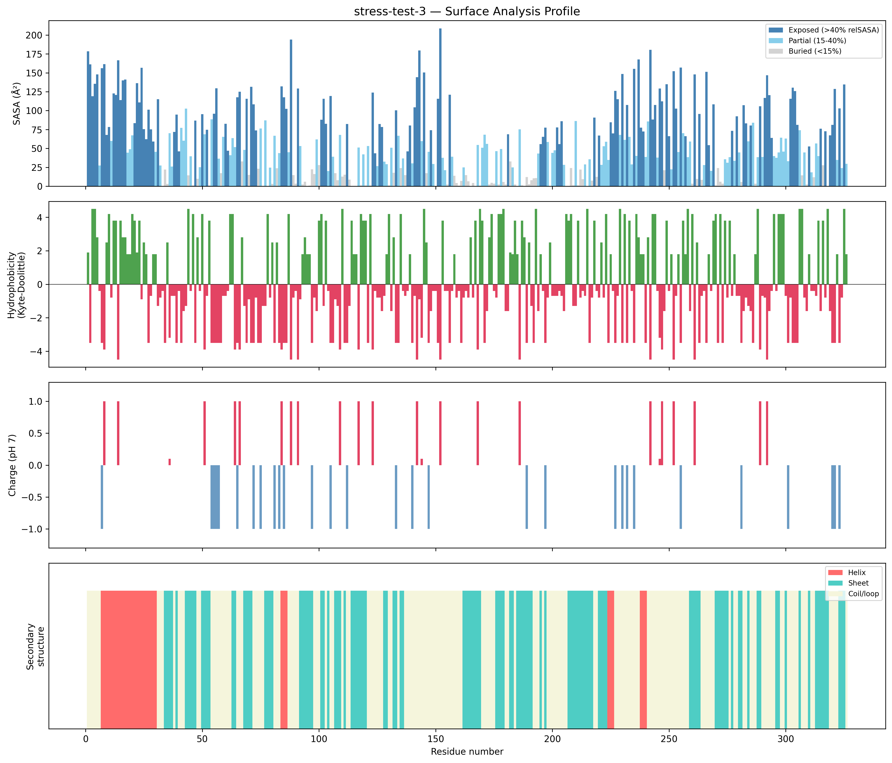
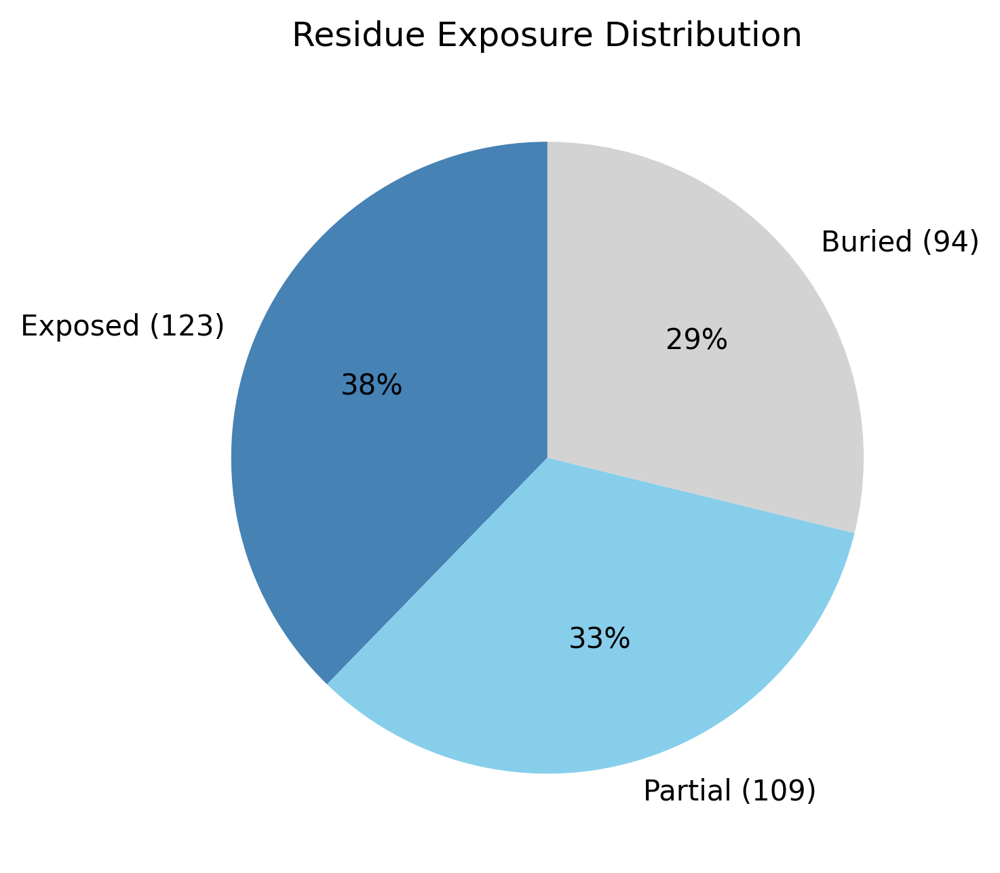

# Structural analysis — `stress-test-3`

> Facts are emitted deterministically from the measurement scripts. Sections marked with a SYNTHESIS comment are authored by the Claude session (judgment), kept visibly separate from the measured facts.

## Executive summary

A single-chain 326-residue predicted model (metadata), β-predominant and moderately elongated. pydssp assigns sheet 36.5% / helix 10.1% / coil 53.4%; sheet dominates while helix sits above but not far above the ~5% defining floor, so the coarse class is a β-rich mixed α/β-or-α+β — provisional given the pydssp fallback. The shape is prolate/elongated (asphericity 0.22; approx. 90 × 53 × 37 Å) with Rg 25.47 Å matching the ~25.3 Å expected for 326 residues (2.5·N^0.4). Exposure is core-bearing but surface-rich (28.8% buried, 37.7% exposed); the surface is near-neutral and moderately polar (net −2.9 e, 16 +/18 −; mean KD −0.83) with five short hydrophobic patches, including one 9-residue stretch (residues 15–23, mean KD 2.97). Confidence is confident but non-uniform (mean pLDDT 80.83, median 84.84, range 35.7–97.8, std 14.52).

## User-provided context

None provided. All observations below are derived from the structure alone.

## Structure overview

- **Source:** predicted model — pLDDT in the B-factor column
- **Chains:** 1 (single chain)
- **Residues / atoms:** 326 / 2434
- **Missing residues:** 0
- **Non-solvent ligands:** none
  - chain **A**: 326 res

## Structural views

_Cα backbone trace (Agent 2.2 matplotlib placeholder), down the long / mid / short principal axes; coloured by pLDDT._

## Shape & secondary structure

- **Shape:** prolate (elongated) (asphericity 0.22, Rg 25.47 Å)
- **Approx. dimensions:** 89.8 × 52.9 × 36.8 Å
- **Secondary structure:** helix 10.1%, sheet 36.5%, coil 53.4% _(method: pydssp)_
- **⚠ SS assigned by pydssp (fallback), not mkdssp** — pydssp is a simplified DSSP reimplementation and can over- or under-call short helix/sheet segments on imperfect (e.g. predicted) backbones. Treat fractions near the ~5% floor, the helix/sheet split, and any coil-vs-disorder reasoning as provisional; install mkdssp for reference-grade assignment.

## Surface properties

- **Exposure:** buried 28.8%, partial 33.4%, exposed 37.7%
- **Total SASA:** 19060 Ų
- **Surface hydrophobicity (KD):** mean -0.83 ± 2.87
- **Surface charge (pH 7):** net -2.9 e (16 +, 18 −)
- **Hydrophobic patches:** 5:
  - residues 3–5 (len 3, mean KD 3.93)
  - residues 15–23 (len 9, mean KD 2.97)
  - residues 236–239 (len 4, mean KD 2.65)
  - residues 256–258 (len 3, mean KD 3.37)
  - residues 297–299 (len 3, mean KD 4.2)

## Prediction quality / structural coherence

Confidence is **reported, never gated** — these signals are inputs for the synthesis below, not a pass/fail.

- **pLDDT (chain A):** mean 80.83, median 84.84, range 35.67–97.75, std 14.52
- **Compactness:** Rg 25.47 Å vs ~25.3 Å expected for 326 residues (2.5·N^0.4) — consistent
- **Core present:** buried fraction 28.8%
- **Coil fraction:** 53.4%

### Coherence assessment

The signals are consistent with an ordered, compact model and agree with the confident pLDDT. Rg 25.47 Å matches the ~25.3 Å expectation for 326 residues, a core is present (28.8% buried), and helix+sheet account for ~47% of residues. Coil is high at 53.4%, but with pydssp (not mkdssp) the precise coil fraction is provisional and — given the matching Rg and a present core — does not by itself indicate disorder; mean pLDDT 80.83 (median 84.84) is confident, with a low-confidence minority (min 35.7, std 14.52).

## Expected-parameter comparison

_No expected-parameter profile supplied — this is the default for novel / low-homology targets. See the independent observations below._

## Independent observations

- **β-dominant with modest helix.** Sheet 36.5% vs helix 10.1% gives a β-rich body; helix is above the ~5% floor but the split is provisional under pydssp.
- **Compact yet elongated.** Rg 25.47 Å matches the ~25.3 Å globular expectation for 326 residues while asphericity 0.22 places the overall body in the elongated range — packed but not spherical.
- **One extended exposed hydrophobic patch.** Of five patches, residues 15–23 (9 residues, mean KD 2.97) is markedly longer than the 3–4-residue patches and the only one approaching interface/membrane-patch length; the surface is otherwise near-neutral (net −2.9 e) and polar (mean KD −0.83).

This is structural description, not an identity, fold-name, or function call; with no ligands and only fold-class evidence, there is insufficient structural evidence to assign a function.

## Methods

- **Measurements (deterministic):** `parse_structure.py` (metadata, confidence stats), `surface_analysis.py` (Shrake–Rupley SASA, Kyte–Doolittle hydrophobicity, charge at pH 7, DSSP secondary structure, shape metrics), `render_trace.py` (Agent 2.2 Cα-trace figures; `render_views.py` Mol* cartoons when Agent 2.1 is available).
- **Report facts** below the synthesis sections are emitted verbatim from the above scripts' JSON by `assemble_report.py` — no transcription.
- **Synthesis** sections (executive summary, independent observations incl. the one-line scope statement, coherence assessment) are authored by Claude per `SKILL.md` Step 9, each claim cited to a measurement.
