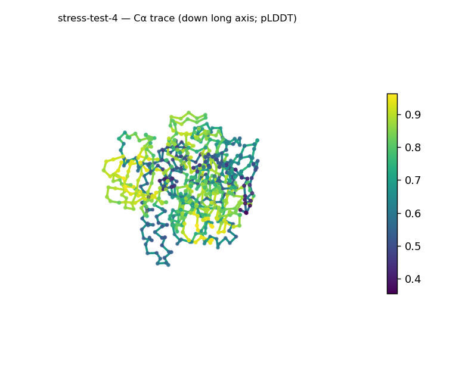
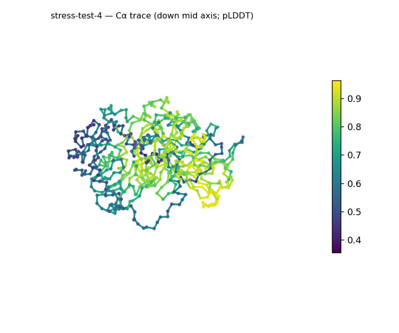
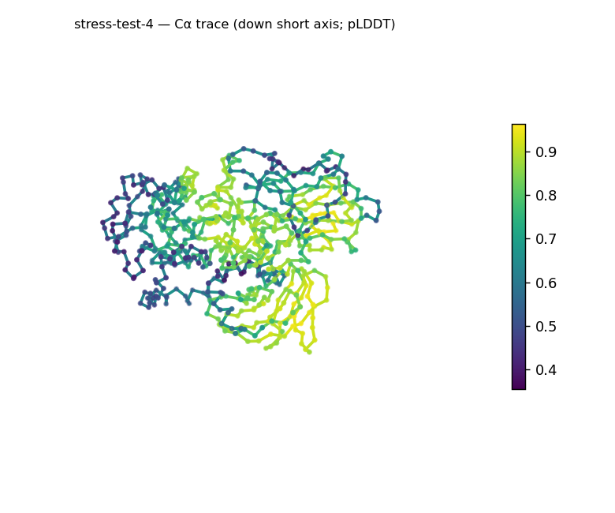
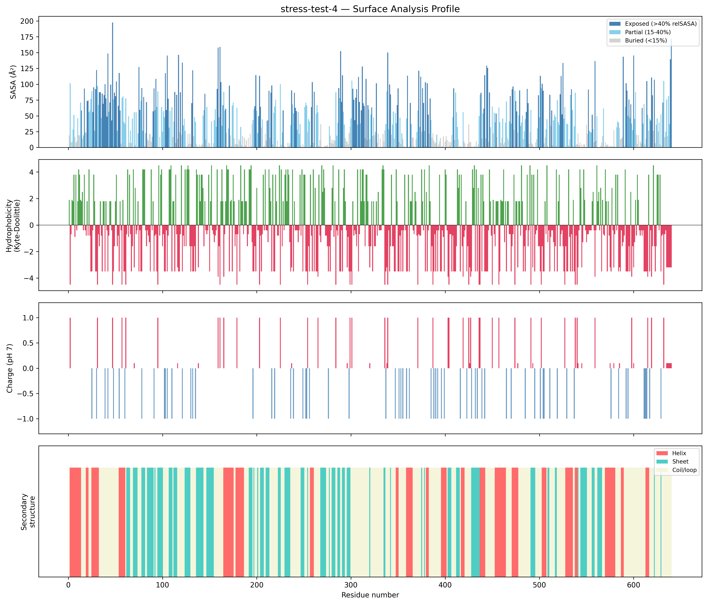
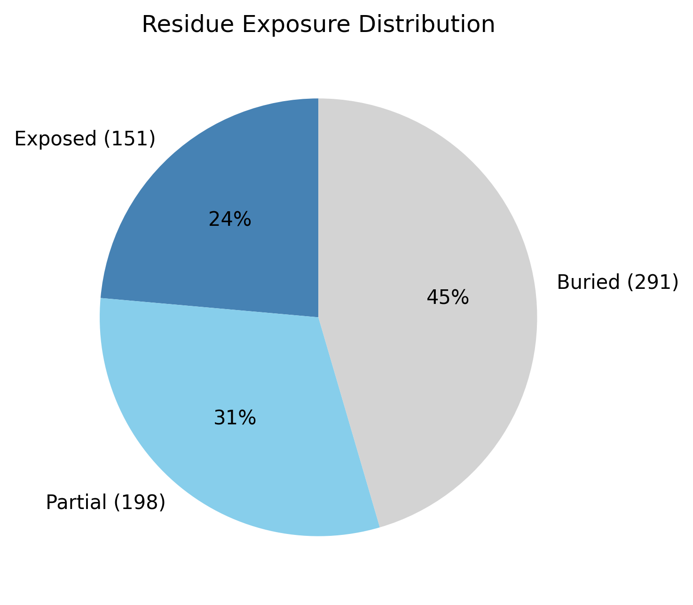

# Structural analysis — `stress-test-4`

> Facts are emitted deterministically from the measurement scripts. Sections marked with a SYNTHESIS comment are authored by the Claude session (judgment), kept visibly separate from the measured facts.

## Executive summary

A single-chain 640-residue predicted model (metadata) that reads as a compact, well-cored multidomain globular protein with mixed secondary structure. pydssp assigns helix 21.2% / sheet 24.4% / coil 54.4%, both elements present in similar measure → a mixed α/β-or-α+β class, which at 640 residues is a whole-chain average across probable multiple domains (parallel-vs-antiparallel not resolvable). The shape is roughly globular (asphericity 0.08; approx. 75 × 55 × 55 Å) and notably compact — Rg 24.1 Å well below the ~33.1 Å expected for 640 residues (2.5·N^0.4) — with a substantial buried core (45.5%). The surface is acidic and moderately polar (net −9.6 e, 11 +/17 −; mean KD −0.72) with two short hydrophobic patches (KD 2.6–3.2). Confidence is the lowest among this model's signals but still mostly confident (mean pLDDT 69.76, median 73.4, range 35.5–96.3, std 17.76).

## User-provided context

None provided. All observations below are derived from the structure alone.

## Structure overview

- **Source:** predicted model — pLDDT in the B-factor column
- **Chains:** 1 (single chain)
- **Residues / atoms:** 640 / 4733
- **Missing residues:** 0
- **Non-solvent ligands:** none
  - chain **A**: 640 res

## Structural views

_Cα backbone trace (Agent 2.2 matplotlib placeholder), down the long / mid / short principal axes; coloured by pLDDT._

## Shape & secondary structure

- **Shape:** roughly globular (asphericity 0.08, Rg 24.1 Å)
- **Approx. dimensions:** 74.9 × 55.2 × 55 Å
- **Secondary structure:** helix 21.2%, sheet 24.4%, coil 54.4% _(method: pydssp)_
- **⚠ SS assigned by pydssp (fallback), not mkdssp** — pydssp is a simplified DSSP reimplementation and can over- or under-call short helix/sheet segments on imperfect (e.g. predicted) backbones. Treat fractions near the ~5% floor, the helix/sheet split, and any coil-vs-disorder reasoning as provisional; install mkdssp for reference-grade assignment.

## Surface properties

- **Exposure:** buried 45.5%, partial 30.9%, exposed 23.6%
- **Total SASA:** 26279.4 Ų
- **Surface hydrophobicity (KD):** mean -0.72 ± 2.49
- **Surface charge (pH 7):** net -9.6 e (11 +, 17 −)
- **Hydrophobic patches:** 2:
  - residues 162–164 (len 3, mean KD 2.6)
  - residues 310–314 (len 5, mean KD 3.24)

## Prediction quality / structural coherence

Confidence is **reported, never gated** — these signals are inputs for the synthesis below, not a pass/fail.

- **pLDDT (chain A):** mean 69.76, median 73.4, range 35.53–96.25, std 17.76
- **Compactness:** Rg 24.1 Å vs ~33.1 Å expected for 640 residues (2.5·N^0.4) — consistent
- **Core present:** buried fraction 45.5%
- **Coil fraction:** 54.4%

### Coherence assessment

Despite the modest mean pLDDT, the coherence signals point to a genuinely folded model — a low-confidence-yet-coherent case typical of low-homology targets. Compactness is strong (Rg 24.1 Å vs the ~33.1 Å expectation for 640 residues) and the buried core is large (45.5%, top of the globular range), so the model is packed, not extended or molten. Mean pLDDT 69.76 sits at the confident/low-confidence boundary with a wide spread (median 73.4, min 35.5, std 17.76); the uncertainty is concentrated in a minority of positions while the compact, well-buried body is the dominant signal.

## Expected-parameter comparison

_No expected-parameter profile supplied — this is the default for novel / low-homology targets. See the independent observations below._

## Independent observations

- **Compact for its size.** Rg 24.1 Å is well under the ~33.1 Å expected for 640 residues, and the buried fraction is 45.5% (top of the 40–55% globular range) — a tightly packed body, not extended.
- **Balanced mixed SS, whole-chain average.** Helix 21.2% and sheet 24.4% are comparable; at 640 residues this is averaged across probable multiple domains, and with pydssp not mkdssp the split is provisional — per-domain segmentation would be needed to call a single fold.
- **Acidic surface, small patches.** Net −9.6 e (11 +/17 −) and mean KD −0.72, with only two short hydrophobic patches (KD 2.6–3.2).

This is structural description, not an identity, fold-name, or function call; with no ligands detected and only whole-chain fold-class evidence, there is insufficient structural evidence to assign a function.

## Methods

- **Measurements (deterministic):** `parse_structure.py` (metadata, confidence stats), `surface_analysis.py` (Shrake–Rupley SASA, Kyte–Doolittle hydrophobicity, charge at pH 7, DSSP secondary structure, shape metrics), `render_trace.py` (Agent 2.2 Cα-trace figures; `render_views.py` Mol* cartoons when Agent 2.1 is available).
- **Report facts** below the synthesis sections are emitted verbatim from the above scripts' JSON by `assemble_report.py` — no transcription.
- **Synthesis** sections (executive summary, independent observations incl. the one-line scope statement, coherence assessment) are authored by Claude per `SKILL.md` Step 9, each claim cited to a measurement.
