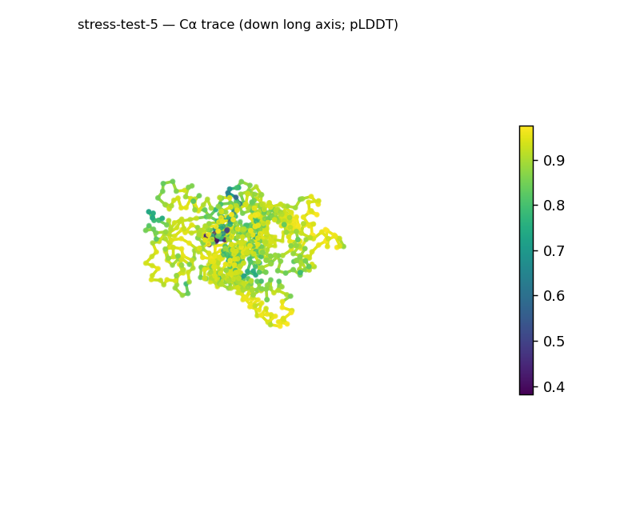
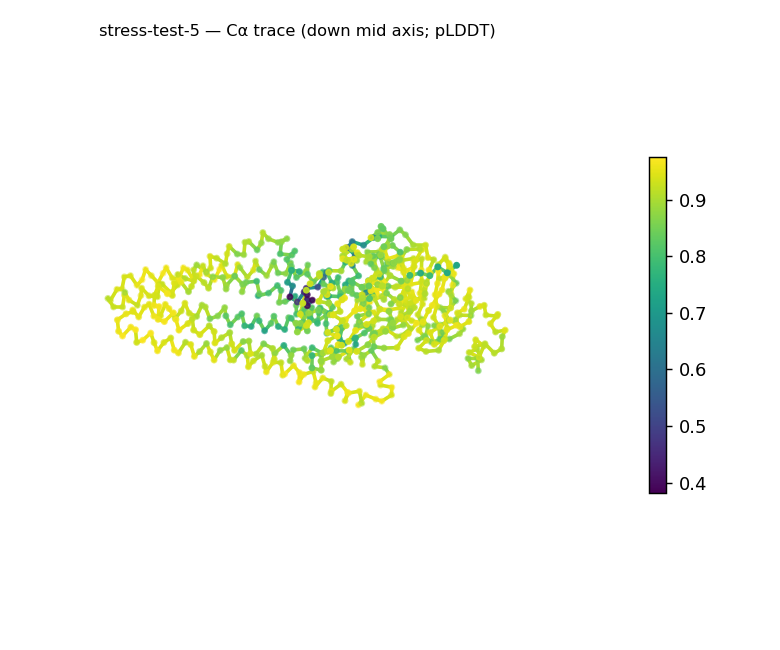
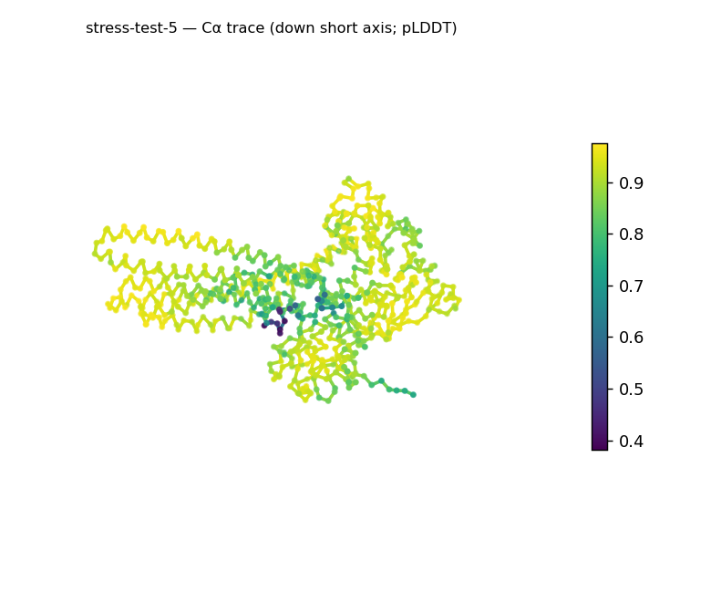
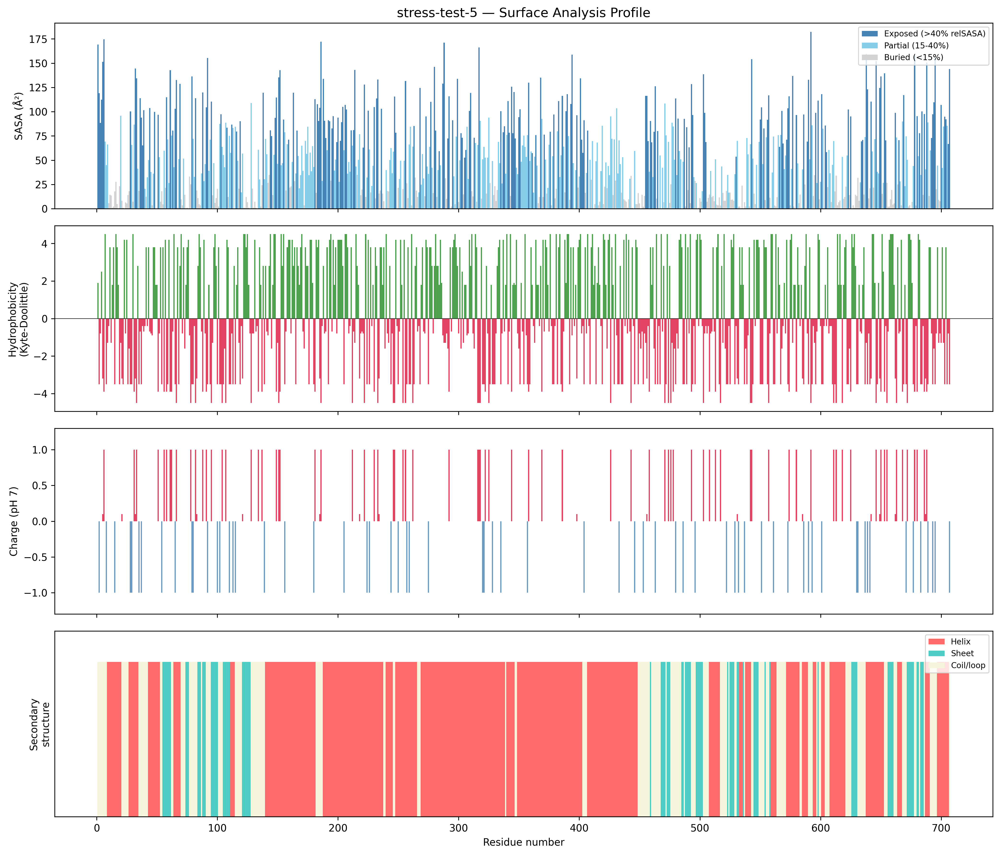
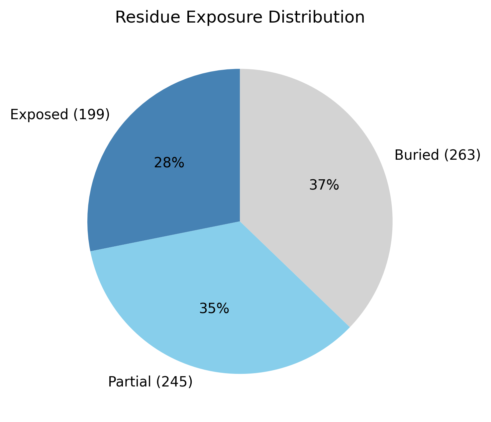

# Structural analysis — `stress-test-5`

> Facts are emitted deterministically from the measurement scripts. Sections marked with a SYNTHESIS comment are authored by the Claude session (judgment), kept visibly separate from the measured facts.

## Executive summary

A single-chain 707-residue predicted model (metadata): a helix-rich, elongated, strongly basic multidomain protein. pydssp assigns helix 59.3% / sheet 13.0% / coil 27.7% — helix dominates but sheet is above the ~5% defining floor, so the coarse class is an α-rich mixed α/β-or-α+β, a whole-chain average at 707 residues across probable multiple domains. The shape is prolate/elongated (asphericity 0.31; approx. 116 × 70 × 51 Å) with Rg 32.25 Å close to the ~34.5 Å expected for 707 residues (2.5·N^0.4) and a defined core (37.2% buried). The exposed surface is markedly basic (net +21.8 e, 48 +/19 −) and moderately polar (mean KD −0.74), carrying an unusually large number of short hydrophobic patches (12, KD 2.4–4.3). Confidence is high (mean pLDDT 88.53, median 90.95, range 38.2–97.5, std 8.61).

## User-provided context

None provided. All observations below are derived from the structure alone.

## Structure overview

- **Source:** predicted model — pLDDT in the B-factor column
- **Chains:** 1 (single chain)
- **Residues / atoms:** 707 / 5617
- **Missing residues:** 0
- **Non-solvent ligands:** none
  - chain **A**: 707 res

## Structural views

_Cα backbone trace (Agent 2.2 matplotlib placeholder), down the long / mid / short principal axes; coloured by pLDDT._

## Shape & secondary structure

- **Shape:** prolate (elongated) (asphericity 0.31, Rg 32.25 Å)
- **Approx. dimensions:** 115.7 × 70.4 × 51.4 Å
- **Secondary structure:** helix 59.3%, sheet 13.0%, coil 27.7% _(method: pydssp)_
- **⚠ SS assigned by pydssp (fallback), not mkdssp** — pydssp is a simplified DSSP reimplementation and can over- or under-call short helix/sheet segments on imperfect (e.g. predicted) backbones. Treat fractions near the ~5% floor, the helix/sheet split, and any coil-vs-disorder reasoning as provisional; install mkdssp for reference-grade assignment.

## Surface properties

- **Exposure:** buried 37.2%, partial 34.7%, exposed 28.1%
- **Total SASA:** 36580.3 Ų
- **Surface hydrophobicity (KD):** mean -0.74 ± 3.17
- **Surface charge (pH 7):** net 21.8 e (48 +, 19 −)
- **Hydrophobic patches:** 12:
  - residues 153–155 (len 3, mean KD 3.93)
  - residues 166–170 (len 5, mean KD 3.34)
  - residues 173–175 (len 3, mean KD 3.13)
  - residues 177–179 (len 3, mean KD 3.43)
  - residues 196–198 (len 3, mean KD 3.27)
  - residues 200–204 (len 5, mean KD 3.92)
  - residues 206–208 (len 3, mean KD 4.27)
  - residues 276–278 (len 3, mean KD 3.47)
  - residues 283–285 (len 3, mean KD 2.93)
  - residues 345–348 (len 4, mean KD 2.42)
  - residues 389–391 (len 3, mean KD 3.63)
  - residues 459–461 (len 3, mean KD 3.13)

## Prediction quality / structural coherence

Confidence is **reported, never gated** — these signals are inputs for the synthesis below, not a pass/fail.

- **pLDDT (chain A):** mean 88.53, median 90.95, range 38.15–97.51, std 8.61
- **Compactness:** Rg 32.25 Å vs ~34.5 Å expected for 707 residues (2.5·N^0.4) — consistent
- **Core present:** buried fraction 37.2%
- **Coil fraction:** 27.7%

### Coherence assessment

The coherence signals and the high pLDDT agree on an ordered, folded model. Rg 32.25 Å is near the ~34.5 Å expectation for 707 residues, a core is present (37.2% buried), and helix+sheet account for ~72% of residues (coil only 27.7%). Mean pLDDT 88.53 (median 90.95, std 8.61) is high and fairly uniform; the low minimum (38.2) marks a small low-confidence subset that does not affect the compact, cored, helix-rich whole.

## Expected-parameter comparison

_No expected-parameter profile supplied — this is the default for novel / low-homology targets. See the independent observations below._

## Independent observations

- **Strongly basic surface.** Net +21.8 e (48 positive vs 19 negative surface residues) is far from the near-zero charge typical of soluble proteins — a pronounced excess of positive surface charge.
- **Helix-dominated, elongated, multidomain.** Helix 59.3% vs sheet 13.0% (above the ~5% floor); at 707 residues the split is a whole-chain average over probable domains, and the prolate shape (asphericity 0.31) is a legitimate elongated architecture, not an inconsistency with the class.
- **Many short hydrophobic patches.** 12 exposed patches (KD 2.4–4.3), all short (3–5 residues) — numerous but individually small relative to an extended interface patch.

This is structural description, not an identity, fold-name, or function call; with no ligands detected and only whole-chain fold-class evidence, there is insufficient structural evidence to assign a function.

## Methods

- **Measurements (deterministic):** `parse_structure.py` (metadata, confidence stats), `surface_analysis.py` (Shrake–Rupley SASA, Kyte–Doolittle hydrophobicity, charge at pH 7, DSSP secondary structure, shape metrics), `render_trace.py` (Agent 2.2 Cα-trace figures; `render_views.py` Mol* cartoons when Agent 2.1 is available).
- **Report facts** below the synthesis sections are emitted verbatim from the above scripts' JSON by `assemble_report.py` — no transcription.
- **Synthesis** sections (executive summary, independent observations incl. the one-line scope statement, coherence assessment) are authored by Claude per `SKILL.md` Step 9, each claim cited to a measurement.
