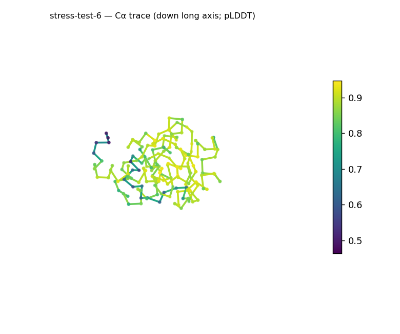
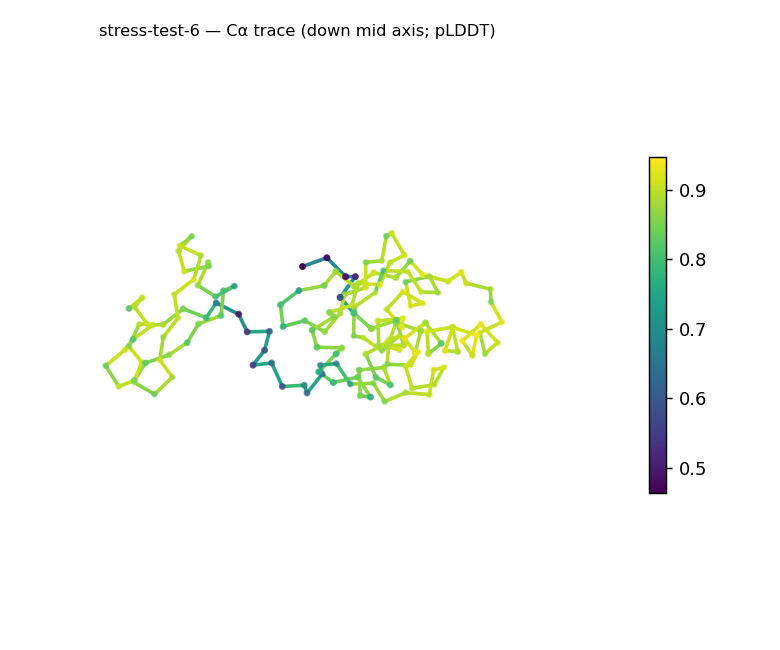
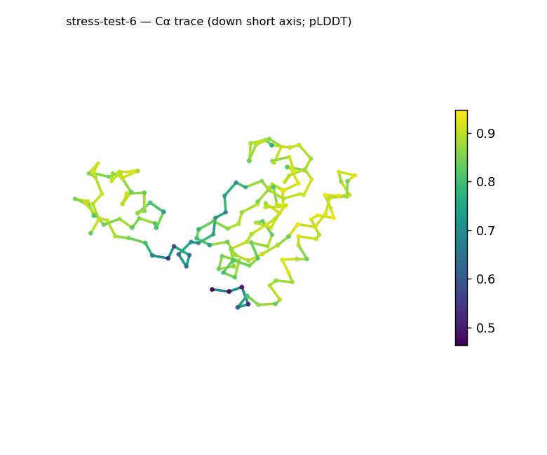
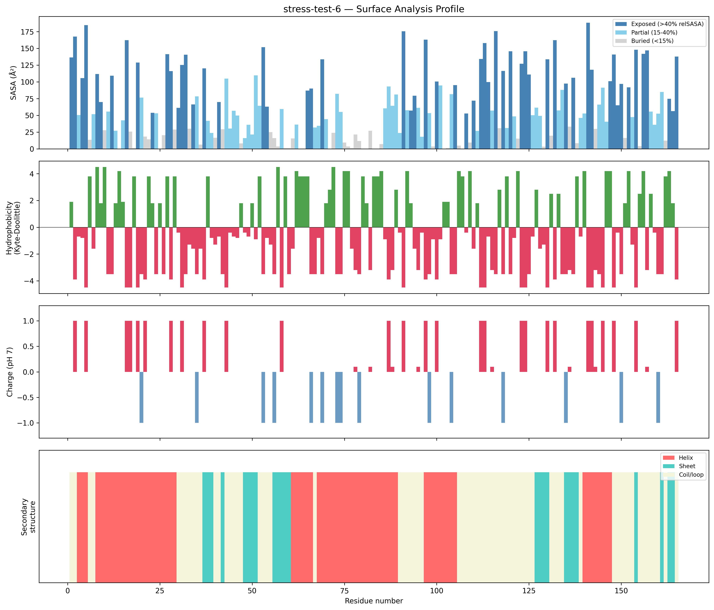
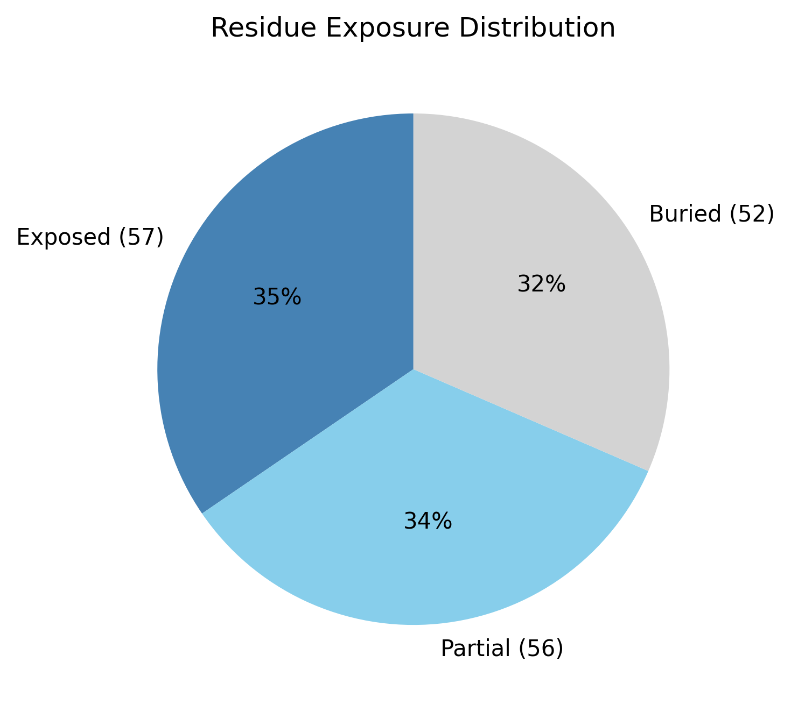

# Structural analysis — `stress-test-6`

> Facts are emitted deterministically from the measurement scripts. Sections marked with a SYNTHESIS comment are authored by the Claude session (judgment), kept visibly separate from the measured facts.

## Executive summary

A small single-chain 165-residue predicted model (metadata), helix-leaning and strongly basic. pydssp assigns helix 42.4% / sheet 15.2% / coil 42.4%; both elements are present (sheet above the ~5% floor), giving a mixed α/β-or-α+β class with helix predominating (parallel-vs-antiparallel not resolvable here). The shape is prolate/elongated (asphericity 0.31; approx. 59 × 36 × 25 Å) with Rg 18.62 Å matching the ~19.3 Å expected for 165 residues (2.5·N^0.4) and a core present (31.5% buried). The exposed surface is strongly basic (net +15.1 e, 22 +/6 −) and notably polar (mean KD −1.93) with no hydrophobic patches. Confidence is high (mean pLDDT 83.86, median 87.54, range 46.4–94.7, std 10.64).

## User-provided context

None provided. All observations below are derived from the structure alone.

## Structure overview

- **Source:** predicted model — pLDDT in the B-factor column
- **Chains:** 1 (single chain)
- **Residues / atoms:** 165 / 1361
- **Missing residues:** 0
- **Non-solvent ligands:** none
  - chain **A**: 165 res

## Structural views

_Cα backbone trace (Agent 2.2 matplotlib placeholder), down the long / mid / short principal axes; coloured by pLDDT._

## Shape & secondary structure

- **Shape:** prolate (elongated) (asphericity 0.31, Rg 18.62 Å)
- **Approx. dimensions:** 59.1 × 35.5 × 25 Å
- **Secondary structure:** helix 42.4%, sheet 15.2%, coil 42.4% _(method: pydssp)_
- **⚠ SS assigned by pydssp (fallback), not mkdssp** — pydssp is a simplified DSSP reimplementation and can over- or under-call short helix/sheet segments on imperfect (e.g. predicted) backbones. Treat fractions near the ~5% floor, the helix/sheet split, and any coil-vs-disorder reasoning as provisional; install mkdssp for reference-grade assignment.

## Surface properties

- **Exposure:** buried 31.5%, partial 33.9%, exposed 34.5%
- **Total SASA:** 10293.3 Ų
- **Surface hydrophobicity (KD):** mean -1.93 ± 2.94
- **Surface charge (pH 7):** net 15.1 e (22 +, 6 −)
- **Hydrophobic patches:** 0

## Prediction quality / structural coherence

Confidence is **reported, never gated** — these signals are inputs for the synthesis below, not a pass/fail.

- **pLDDT (chain A):** mean 83.86, median 87.54, range 46.38–94.68, std 10.64
- **Compactness:** Rg 18.62 Å vs ~19.3 Å expected for 165 residues (2.5·N^0.4) — consistent
- **Core present:** buried fraction 31.5%
- **Coil fraction:** 42.4%

### Coherence assessment

Coherence signals and pLDDT agree on an ordered, compact model. Rg 18.62 Å matches the ~19.3 Å expectation for 165 residues, a core is present (31.5% buried), and helix+sheet cover ~58% of residues. Mean pLDDT 83.86 (median 87.54, std 10.64) is in the confident-to-high range; the minimum 46.4 flags a small low-confidence region but does not contradict the compact, cored body.

## Expected-parameter comparison

_No expected-parameter profile supplied — this is the default for novel / low-homology targets. See the independent observations below._

## Independent observations

- **Strongly basic, very polar surface.** Net +15.1 e (22 positive vs 6 negative) and mean surface KD −1.93 — a markedly basic, polar exterior far from the near-neutral norm; zero hydrophobic patches.
- **Compact, modestly elongated.** Rg 18.62 Å matches the globular expectation for 165 residues while asphericity 0.31 places it just into the prolate range — compact but not spherical.
- **Helix-leaning mixed SS.** Helix 42.4% vs sheet 15.2% (above the ~5% floor); the split is provisional under pydssp.

This is structural description, not an identity, fold-name, or function call; with no ligands and only fold-class evidence, there is insufficient structural evidence to assign a function.

## Methods

- **Measurements (deterministic):** `parse_structure.py` (metadata, confidence stats), `surface_analysis.py` (Shrake–Rupley SASA, Kyte–Doolittle hydrophobicity, charge at pH 7, DSSP secondary structure, shape metrics), `render_trace.py` (Agent 2.2 Cα-trace figures; `render_views.py` Mol* cartoons when Agent 2.1 is available).
- **Report facts** below the synthesis sections are emitted verbatim from the above scripts' JSON by `assemble_report.py` — no transcription.
- **Synthesis** sections (executive summary, independent observations incl. the one-line scope statement, coherence assessment) are authored by Claude per `SKILL.md` Step 9, each claim cited to a measurement.
