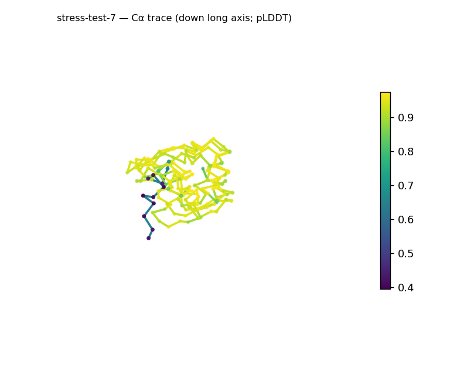
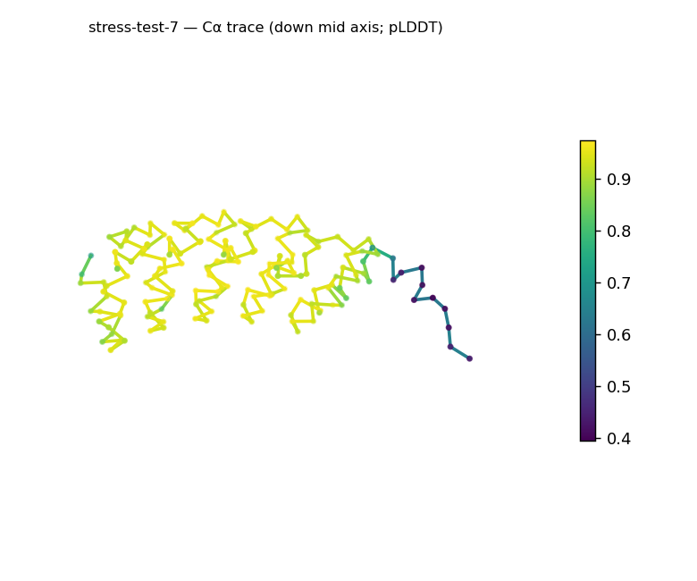
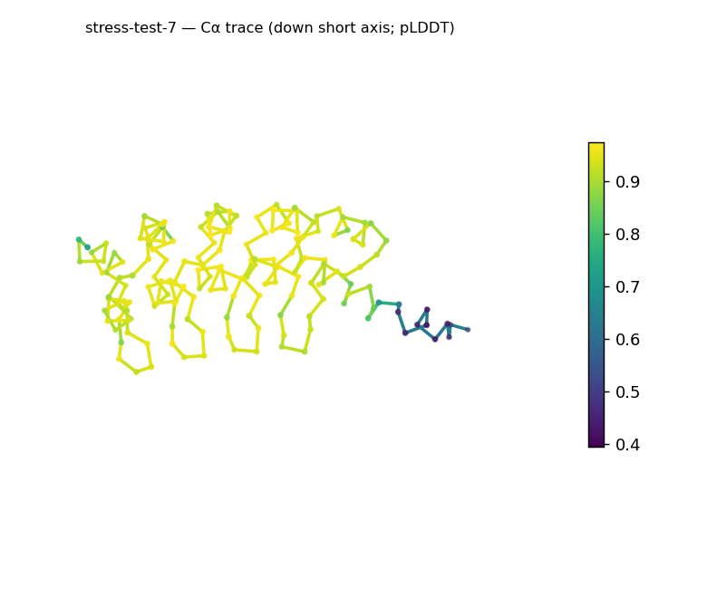
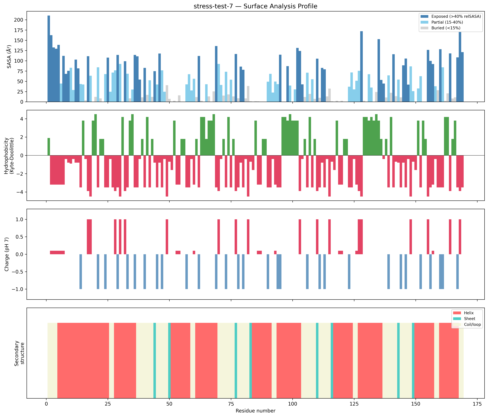
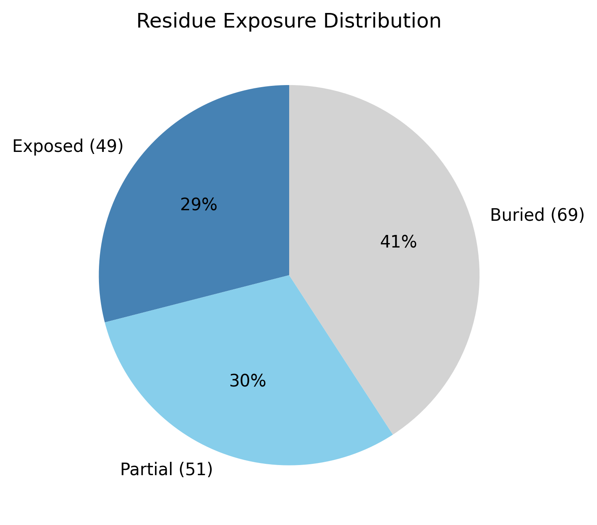

# Structural analysis — `stress-test-7`

> Facts are emitted deterministically from the measurement scripts. Sections marked with a SYNTHESIS comment are authored by the Claude session (judgment), kept visibly separate from the measured facts.

## Executive summary

A small single-chain 169-residue predicted model (metadata) that is essentially all-α and elongated. pydssp assigns helix 58.6% / sheet 4.7% / coil 36.7%; the sheet fraction sits at the ~5% defining floor, so the coarse class reads as all-α — the trace of sheet is provisional under the pydssp fallback. The shape is prolate/elongated (asphericity 0.41; approx. 63 × 27 × 24 Å) with Rg 17.3 Å close to the ~19.5 Å expected for 169 residues (2.5·N^0.4) and a substantial core (40.8% buried). The surface is strongly polar and near-neutral (mean KD −2.14; net −2.4 e, 15 +/12 −) with no hydrophobic patches. Confidence is high (mean pLDDT 89.74, median 93.85, range 39.5–97.4, std 13.07).

## User-provided context

None provided. All observations below are derived from the structure alone.

## Structure overview

- **Source:** predicted model — pLDDT in the B-factor column
- **Chains:** 1 (single chain)
- **Residues / atoms:** 169 / 1274
- **Missing residues:** 0
- **Non-solvent ligands:** none
  - chain **A**: 169 res

## Structural views

_Cα backbone trace (Agent 2.2 matplotlib placeholder), down the long / mid / short principal axes; coloured by pLDDT._

## Shape & secondary structure

- **Shape:** prolate (elongated) (asphericity 0.41, Rg 17.3 Å)
- **Approx. dimensions:** 63 × 26.7 × 23.9 Å
- **Secondary structure:** helix 58.6%, sheet 4.7%, coil 36.7% _(method: pydssp)_
- **⚠ SS assigned by pydssp (fallback), not mkdssp** — pydssp is a simplified DSSP reimplementation and can over- or under-call short helix/sheet segments on imperfect (e.g. predicted) backbones. Treat fractions near the ~5% floor, the helix/sheet split, and any coil-vs-disorder reasoning as provisional; install mkdssp for reference-grade assignment.

## Surface properties

- **Exposure:** buried 40.8%, partial 30.2%, exposed 29.0%
- **Total SASA:** 8543 Ų
- **Surface hydrophobicity (KD):** mean -2.14 ± 2.2
- **Surface charge (pH 7):** net -2.4 e (15 +, 12 −)
- **Hydrophobic patches:** 0

## Prediction quality / structural coherence

Confidence is **reported, never gated** — these signals are inputs for the synthesis below, not a pass/fail.

- **pLDDT (chain A):** mean 89.74, median 93.85, range 39.51–97.42, std 13.07
- **Compactness:** Rg 17.3 Å vs ~19.5 Å expected for 169 residues (2.5·N^0.4) — consistent
- **Core present:** buried fraction 40.8%
- **Coil fraction:** 36.7%

### Coherence assessment

The coherence signals support an ordered, compact helical model and agree with the high pLDDT. Rg 17.3 Å is near the ~19.5 Å expectation for 169 residues, the core is substantial (40.8% buried), and coil is moderate (36.7%). Mean pLDDT 89.74 (median 93.85, std 13.07) is high; the low minimum (39.5) marks a short low-confidence segment — most plausibly a terminus or loop — against an otherwise well-determined helical body.

## Expected-parameter comparison

_No expected-parameter profile supplied — this is the default for novel / low-homology targets. See the independent observations below._

## Independent observations

- **All-α with elongation.** Helix 58.6% with sheet at the ~5% floor (4.7%) → an α class; asphericity 0.41 (prolate) marks a legitimately elongated helical body, not an inconsistency with the class.
- **Polar, patch-free, near-neutral surface.** Mean surface KD −2.14 (strongly polar) and net −2.4 e with zero hydrophobic patches — a soluble-type polar exterior.
- **Compact core despite the outline.** Buried fraction 40.8% is within the globular range and Rg 17.3 Å matches the size expectation, so the chain is packed even though its outline is elongated.

This is structural description, not an identity, fold-name, or function call; with no ligands and only fold-class evidence, there is insufficient structural evidence to assign a function.

## Methods

- **Measurements (deterministic):** `parse_structure.py` (metadata, confidence stats), `surface_analysis.py` (Shrake–Rupley SASA, Kyte–Doolittle hydrophobicity, charge at pH 7, DSSP secondary structure, shape metrics), `render_trace.py` (Agent 2.2 Cα-trace figures; `render_views.py` Mol* cartoons when Agent 2.1 is available).
- **Report facts** below the synthesis sections are emitted verbatim from the above scripts' JSON by `assemble_report.py` — no transcription.
- **Synthesis** sections (executive summary, independent observations incl. the one-line scope statement, coherence assessment) are authored by Claude per `SKILL.md` Step 9, each claim cited to a measurement.
