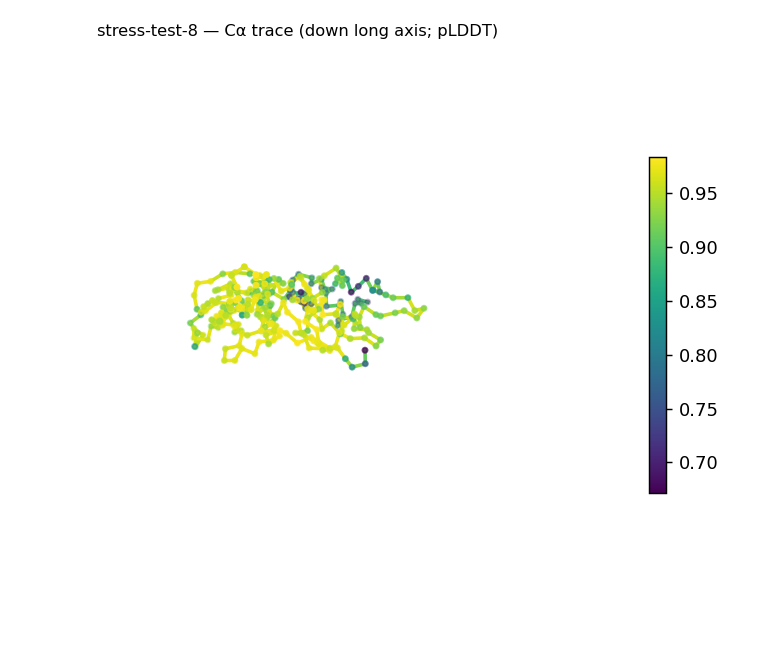
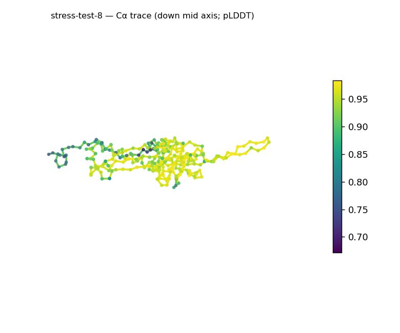
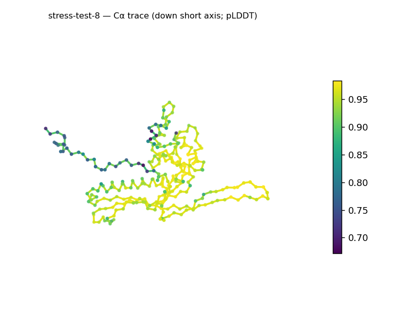
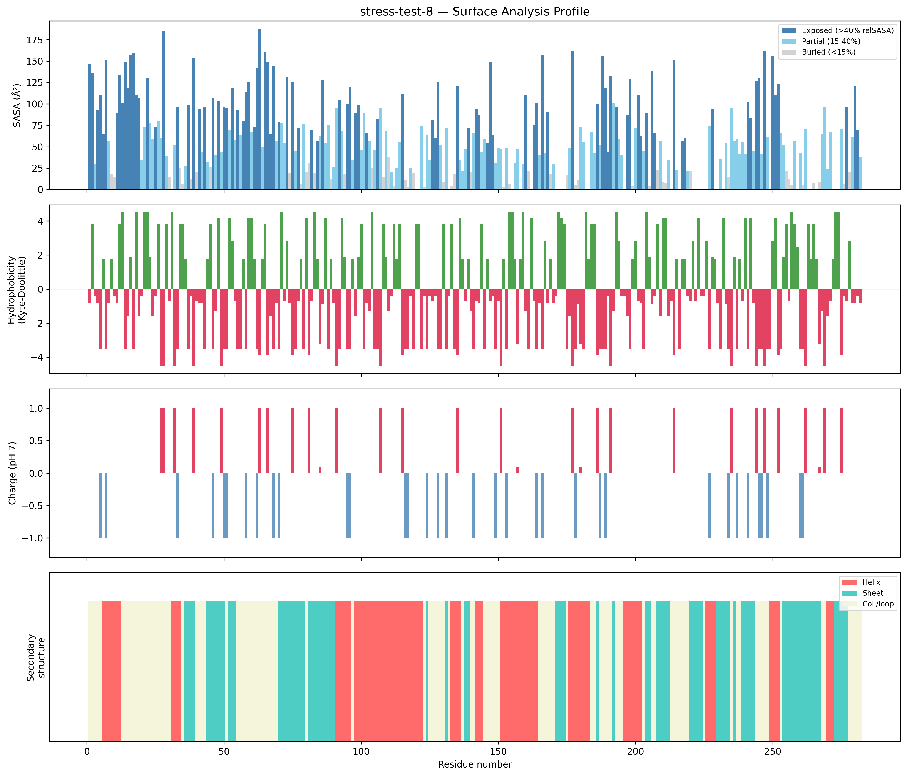
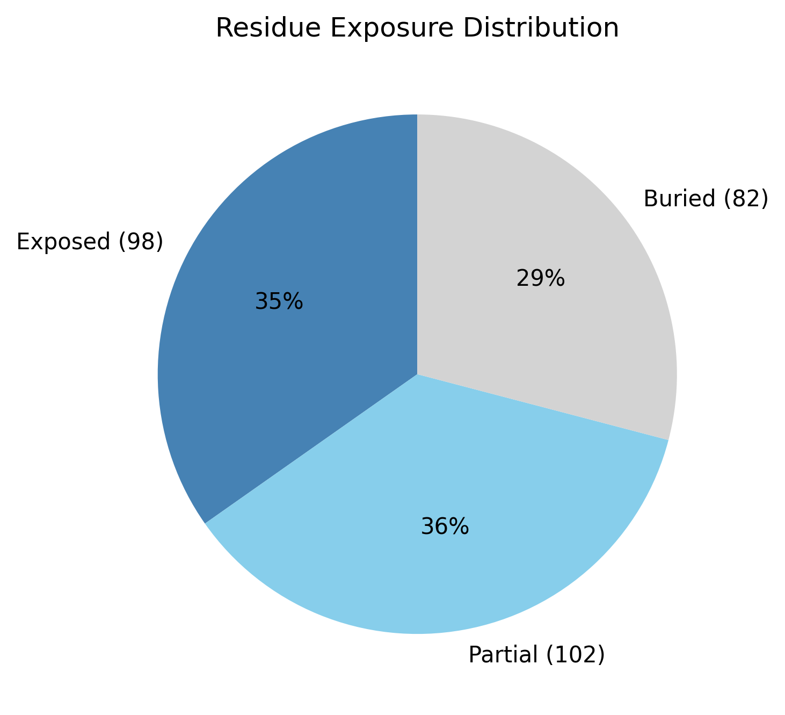

# Structural analysis — `stress-test-8`

> Facts are emitted deterministically from the measurement scripts. Sections marked with a SYNTHESIS comment are authored by the Claude session (judgment), kept visibly separate from the measured facts.

## Executive summary

A single-chain 282-residue predicted model (metadata) with balanced secondary structure and a flat, elongated outline, predicted at high and uniform confidence. pydssp assigns helix 31.6% / sheet 30.5% / coil 37.9% — both elements equally represented → a mixed α/β-or-α+β class (parallel-vs-antiparallel not resolvable here). The shape is prolate/elongated (asphericity 0.30) with strongly unequal axes (approx. 110 × 60 × 25 Å), yet Rg 25.85 Å is close to the ~23.9 Å expected for 282 residues (2.5·N^0.4). Exposure is core-bearing (29.1% buried) with a near-neutral, moderately polar surface (net −4 e, 14 +/18 −; mean KD −1.02) and two short hydrophobic patches (KD 3.4–3.6). Confidence is high and uniform (mean pLDDT 91.66, median 94.42, range 67.2–98.4, std 7.32).

## User-provided context

None provided. All observations below are derived from the structure alone.

## Structure overview

- **Source:** predicted model — pLDDT in the B-factor column
- **Chains:** 1 (single chain)
- **Residues / atoms:** 282 / 2161
- **Missing residues:** 0
- **Non-solvent ligands:** none
  - chain **A**: 282 res

## Structural views

_Cα backbone trace (Agent 2.2 matplotlib placeholder), down the long / mid / short principal axes; coloured by pLDDT._

## Shape & secondary structure

- **Shape:** prolate (elongated) (asphericity 0.3, Rg 25.85 Å)
- **Approx. dimensions:** 109.7 × 60.4 × 25 Å
- **Secondary structure:** helix 31.6%, sheet 30.5%, coil 37.9% _(method: pydssp)_
- **⚠ SS assigned by pydssp (fallback), not mkdssp** — pydssp is a simplified DSSP reimplementation and can over- or under-call short helix/sheet segments on imperfect (e.g. predicted) backbones. Treat fractions near the ~5% floor, the helix/sheet split, and any coil-vs-disorder reasoning as provisional; install mkdssp for reference-grade assignment.

## Surface properties

- **Exposure:** buried 29.1%, partial 36.2%, exposed 34.8%
- **Total SASA:** 16750.8 Ų
- **Surface hydrophobicity (KD):** mean -1.02 ± 2.81
- **Surface charge (pH 7):** net -4 e (14 +, 18 −)
- **Hydrophobic patches:** 2:
  - residues 21–23 (len 3, mean KD 3.63)
  - residues 59–61 (len 3, mean KD 3.4)

## Prediction quality / structural coherence

Confidence is **reported, never gated** — these signals are inputs for the synthesis below, not a pass/fail.

- **pLDDT (chain A):** mean 91.66, median 94.42, range 67.15–98.36, std 7.32
- **Compactness:** Rg 25.85 Å vs ~23.9 Å expected for 282 residues (2.5·N^0.4) — consistent
- **Core present:** buried fraction 29.1%
- **Coil fraction:** 37.9%

### Coherence assessment

Coherence signals and the high pLDDT agree on an ordered model. Rg 25.85 Å is close to the ~23.9 Å expectation for 282 residues, a core is present (29.1% buried), and helix+sheet cover ~62% of residues (coil 37.9%). Mean pLDDT 91.66 (median 94.42, std 7.32, min 67.2) is high and tightly distributed, so confidence is uniform across the chain with no low-confidence outlier region.

## Expected-parameter comparison

_No expected-parameter profile supplied — this is the default for novel / low-homology targets. See the independent observations below._

## Independent observations

- **Flat/elongated outline.** Axes ~110 × 60 × 25 Å and asphericity 0.30 give a markedly anisotropic, plate-/rod-like body, though Rg 25.85 Å still matches the globular size expectation for 282 residues.
- **Balanced mixed SS.** Helix 31.6% ≈ sheet 30.5%; the even split is provisional under pydssp and the α/β-vs-α+β distinction is not computed here.
- **Near-neutral polar surface.** Net −4 e and mean KD −1.02 with two short hydrophobic patches (KD 3.4–3.6).

This is structural description, not an identity, fold-name, or function call; with no ligands and only fold-class evidence, there is insufficient structural evidence to assign a function.

## Methods

- **Measurements (deterministic):** `parse_structure.py` (metadata, confidence stats), `surface_analysis.py` (Shrake–Rupley SASA, Kyte–Doolittle hydrophobicity, charge at pH 7, DSSP secondary structure, shape metrics), `render_trace.py` (Agent 2.2 Cα-trace figures; `render_views.py` Mol* cartoons when Agent 2.1 is available).
- **Report facts** below the synthesis sections are emitted verbatim from the above scripts' JSON by `assemble_report.py` — no transcription.
- **Synthesis** sections (executive summary, independent observations incl. the one-line scope statement, coherence assessment) are authored by Claude per `SKILL.md` Step 9, each claim cited to a measurement.
