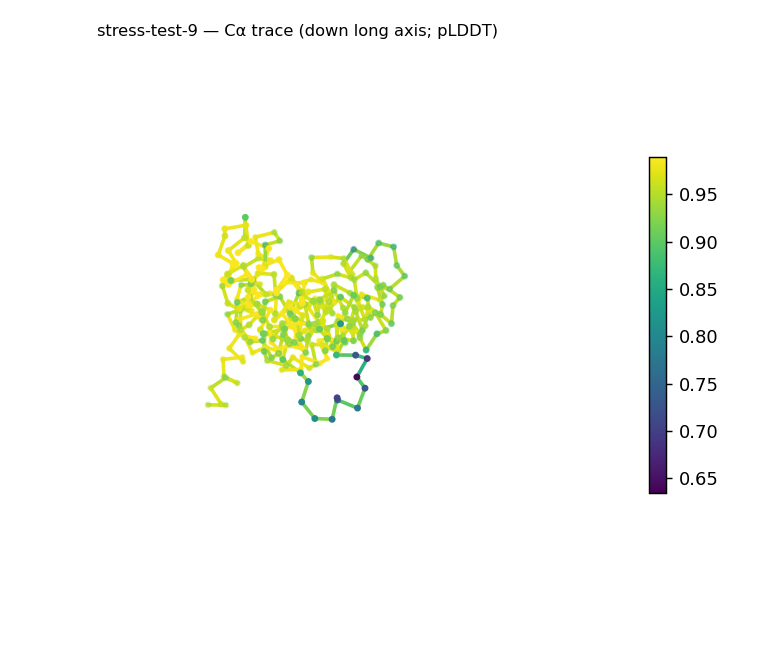
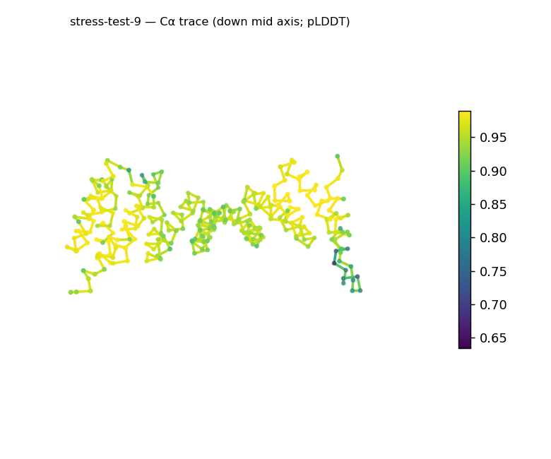
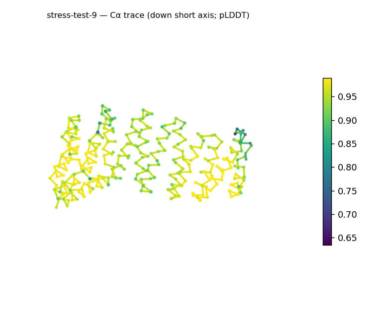
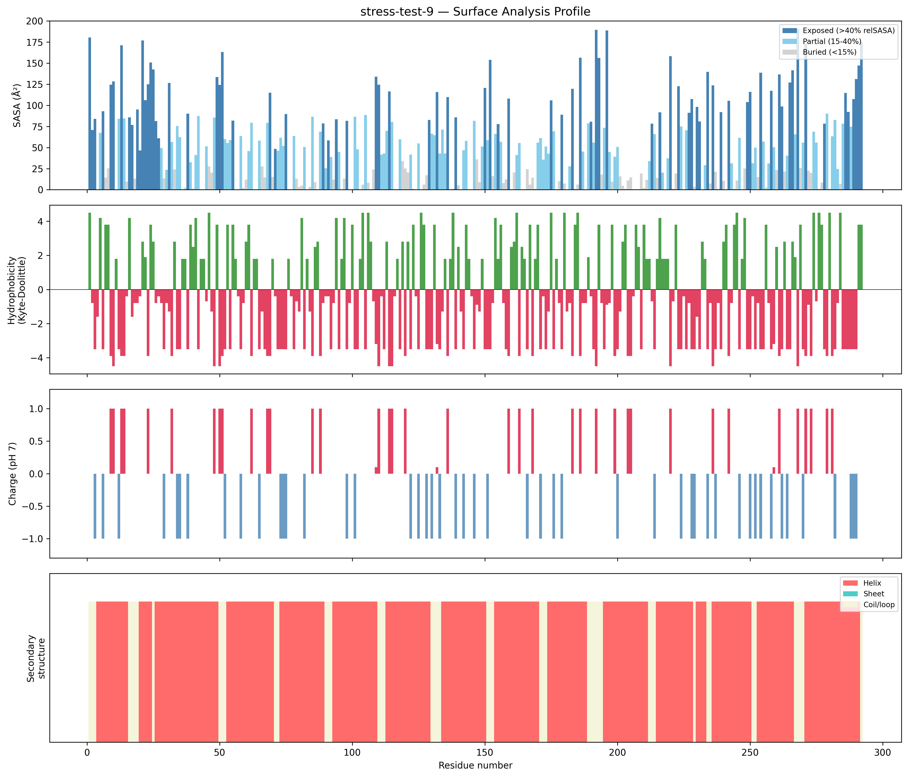
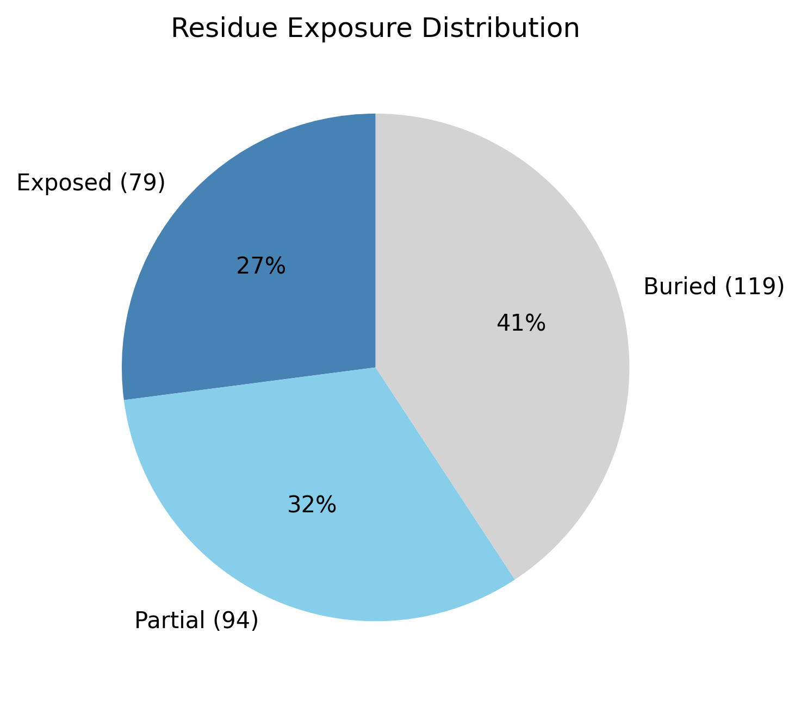

# Structural analysis — `stress-test-9`

> Facts are emitted deterministically from the measurement scripts. Sections marked with a SYNTHESIS comment are authored by the Claude session (judgment), kept visibly separate from the measured facts.

## Executive summary

A single-chain 292-residue predicted model (metadata) that is strongly α-helical and elongated, predicted at high uniform confidence. pydssp assigns helix 83.6% / sheet 0.0% / coil 16.4% — sheet is absent, so the coarse class is all-α, with very little coil. The shape is strongly prolate/elongated (asphericity 0.48; approx. 75 × 38 × 34 Å) while Rg 24.53 Å matches the ~24.2 Å expected for 292 residues (2.5·N^0.4), and the core is substantial (40.8% buried). The surface is polar and mildly basic (mean KD −1.72; net +5.2 e, 22 +/15 −) with a single short hydrophobic patch (residues 154–156, mean KD 3.27). Confidence is high and uniform (mean pLDDT 93.48, median 93.99, range 63.4–98.9, std 5.31).

## User-provided context

None provided. All observations below are derived from the structure alone.

## Structure overview

- **Source:** predicted model — pLDDT in the B-factor column
- **Chains:** 1 (single chain)
- **Residues / atoms:** 292 / 2305
- **Missing residues:** 0
- **Non-solvent ligands:** none
  - chain **A**: 292 res

## Structural views

_Cα backbone trace (Agent 2.2 matplotlib placeholder), down the long / mid / short principal axes; coloured by pLDDT._

## Shape & secondary structure

- **Shape:** prolate (elongated) (asphericity 0.48, Rg 24.53 Å)
- **Approx. dimensions:** 75.1 × 37.5 × 34.4 Å
- **Secondary structure:** helix 83.6%, sheet 0.0%, coil 16.4% _(method: pydssp)_
- **⚠ SS assigned by pydssp (fallback), not mkdssp** — pydssp is a simplified DSSP reimplementation and can over- or under-call short helix/sheet segments on imperfect (e.g. predicted) backbones. Treat fractions near the ~5% floor, the helix/sheet split, and any coil-vs-disorder reasoning as provisional; install mkdssp for reference-grade assignment.

## Surface properties

- **Exposure:** buried 40.8%, partial 32.2%, exposed 27.1%
- **Total SASA:** 15373.5 Ų
- **Surface hydrophobicity (KD):** mean -1.72 ± 2.92
- **Surface charge (pH 7):** net 5.2 e (22 +, 15 −)
- **Hydrophobic patches:** 1:
  - residues 154–156 (len 3, mean KD 3.27)

## Prediction quality / structural coherence

Confidence is **reported, never gated** — these signals are inputs for the synthesis below, not a pass/fail.

- **pLDDT (chain A):** mean 93.48, median 93.99, range 63.43–98.91, std 5.31
- **Compactness:** Rg 24.53 Å vs ~24.2 Å expected for 292 residues (2.5·N^0.4) — consistent
- **Core present:** buried fraction 40.8%
- **Coil fraction:** 16.4%

### Coherence assessment

All coherence signals and the high pLDDT agree on a well-ordered helical model. Coil is only 16.4%, the buried core is substantial (40.8%), and Rg 24.53 Å matches the ~24.2 Å expectation for 292 residues. Mean pLDDT 93.48 (median 93.99, std 5.31, min 63.4) is uniformly high — there is no low-confidence region of note, and none of the disorder indicators is present.

## Expected-parameter comparison

_No expected-parameter profile supplied — this is the default for novel / low-homology targets. See the independent observations below._

## Independent observations

- **Predominantly helical.** Helix 83.6% with no detected sheet (0.0%) → an all-α body; coil is low at 16.4%.
- **Elongated but compact and cored.** Asphericity 0.48 is well into the prolate range, yet Rg 24.53 Å matches the size expectation and 40.8% of residues are buried — an elongated helical body with a real core, not an extended chain.
- **Polar, mildly basic surface.** Mean KD −1.72 and net +5.2 e with a single short hydrophobic patch (KD 3.27).

This is structural description, not an identity, fold-name, or function call; with no ligands and only fold-class evidence, there is insufficient structural evidence to assign a function.

## Methods

- **Measurements (deterministic):** `parse_structure.py` (metadata, confidence stats), `surface_analysis.py` (Shrake–Rupley SASA, Kyte–Doolittle hydrophobicity, charge at pH 7, DSSP secondary structure, shape metrics), `render_trace.py` (Agent 2.2 Cα-trace figures; `render_views.py` Mol* cartoons when Agent 2.1 is available).
- **Report facts** below the synthesis sections are emitted verbatim from the above scripts' JSON by `assemble_report.py` — no transcription.
- **Synthesis** sections (executive summary, independent observations incl. the one-line scope statement, coherence assessment) are authored by Claude per `SKILL.md` Step 9, each claim cited to a measurement.
