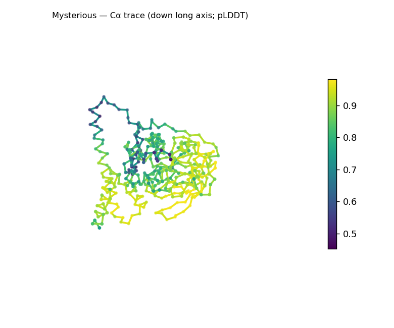
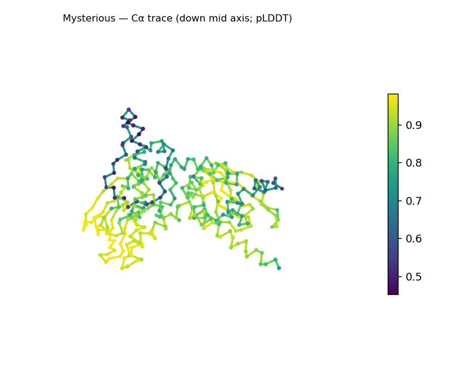
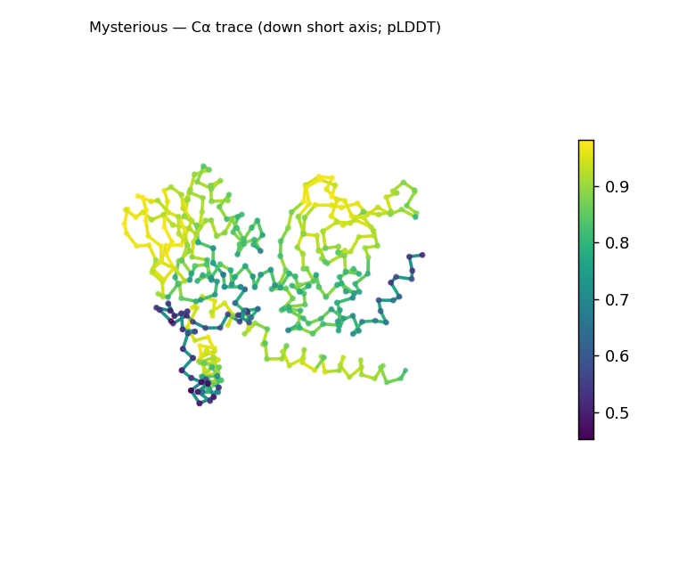
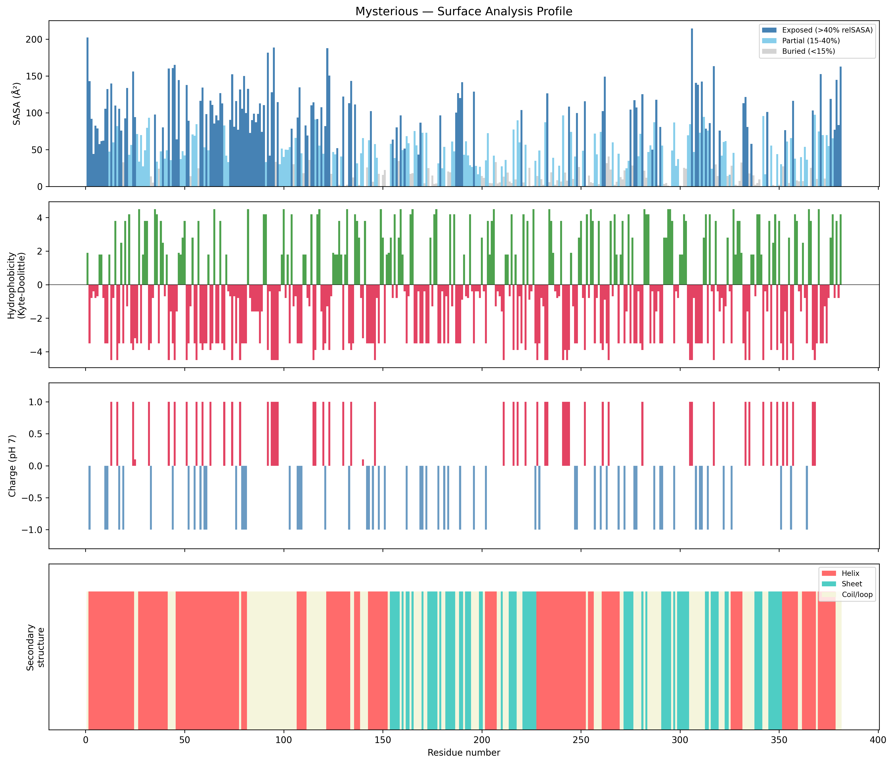
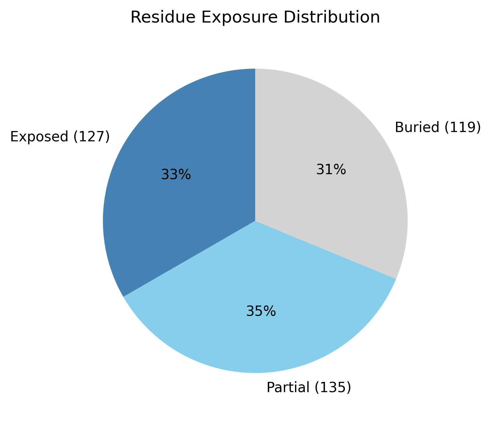

# Structural analysis — `Mysterious`

> Facts are emitted deterministically from the measurement scripts. Sections marked with a SYNTHESIS comment are authored by the Claude session (judgment), kept visibly separate from the measured facts.

## Executive summary

A single-chain predicted model of 381 residues (no missing residues, no non-solvent ligands) that is compact and roughly globular — asphericity 0.091, with a radius of gyration (23.83 Å) close to the ~26.9 Å expected for a folded chain of this length (2.5·N^0.4) and overall dimensions of 67 × 52 × 52 Å. Both secondary-structure types are present (helix 46.2%, sheet 20.5%, coil 33.3%; pydssp), and along the chain the helices concentrate in the N-terminal ~150 residues while the β-strands fall in a central/C-terminal region — an SS content and per-residue ordering consistent with an α+β (or α/β) class, offered as inference from SS and shape rather than a fold identification. The surface is moderately polar (mean Kyte–Doolittle −1.59), carries a near-neutral net charge (+2.1 e; 28 positive, 25 negative), and presents three short hydrophobic patches (residues 29–31, 47–50, 125–127); a buried core is present though modest (buried 31.2%). The model is predicted at good overall confidence (mean pLDDT 81.7). Because the secondary structure rests on the pydssp fallback, the helix/sheet split and the class call are provisional (confidence Moderate); naming a specific fold would require database verification (SCOP/CATH/Foldseek).

## User-provided context

None provided. No organism, expected function, or known structural features were supplied with this run; every observation here and below derives from the structure alone.

## Structure overview

- **Source:** predicted model — pLDDT in the B-factor column
- **Chains:** 1 (single chain)
- **Residues / atoms:** 381 / 3023
- **Missing residues:** 0
- **Non-solvent ligands:** none
  - chain **A**: 381 res

## Structural views

_Cα backbone trace (Agent 2.2 matplotlib placeholder), down the long / mid / short principal axes; coloured by pLDDT._

## Shape & secondary structure

- **Shape:** roughly globular (asphericity 0.09, Rg 23.83 Å)
- **Approx. dimensions:** 67.3 × 52 × 51.6 Å
- **Secondary structure:** helix 46.2%, sheet 20.5%, coil 33.3% _(method: pydssp)_
- **⚠ SS assigned by pydssp (fallback), not mkdssp** — pydssp is a simplified DSSP reimplementation and can over- or under-call short helix/sheet segments on imperfect (e.g. predicted) backbones. Treat fractions near the ~5% floor, the helix/sheet split, and any coil-vs-disorder reasoning as provisional; install mkdssp for reference-grade assignment.

## Surface properties

- **Exposure:** buried 31.2%, partial 35.4%, exposed 33.3%
- **Total SASA:** 22440.5 Ų
- **Surface hydrophobicity (KD):** mean -1.59 ± 2.83
- **Surface charge (pH 7):** net 2.1 e (28 +, 25 −)
- **Hydrophobic patches:** 3:
  - residues 29–31 (len 3, mean KD 3.13)
  - residues 47–50 (len 4, mean KD 2.58)
  - residues 125–127 (len 3, mean KD 1.83)

## Prediction quality / structural coherence

Confidence is **reported, never gated** — these signals are inputs for the synthesis below, not a pass/fail.

- **pLDDT (chain A):** mean 81.7, median 86.38, range 45.25–98.14, std 13.74
- **Compactness:** Rg 23.83 Å vs ~26.9 Å expected for 381 residues (2.5·N^0.4) — consistent
- **Core present:** buried fraction 31.2%
- **Coil fraction:** 33.3%

### Coherence assessment

The structural-coherence signals agree with the confidence score and converge on an ordered fold. Compactness is consistent (Rg 23.83 Å vs ~26.9 Å expected), a buried core is present (buried fraction 31.2%), and coil is moderate (33.3%) rather than dominant — all hallmarks of a folded chain — and these sit alongside a mean pLDDT of 81.7 (Confident tier). Confidence is not uniform (per-residue pLDDT spans 45.25–98.14), so individual low-confidence stretches exist, but the whole-chain signals are mutually consistent and do not indicate disorder. This is a structural-coherence reading, not a quality gate.

## Expected-parameter comparison

_No expected-parameter profile supplied — this is the default for novel / low-homology targets. See the independent observations below._

## Independent observations

- **Buried core present but on the loose side (buried 31.2%).** Against the generic globular baseline of ~40–55% buried residues, the core is modest, and the partially-buried and exposed fractions are nearly equal (partial 35.4%, exposed 33.3%). It is, however, a genuine core rather than a sign of disorder — Rg matches the globular expectation (23.83 Å vs ~26.9 Å), helix and sheet are both substantial, and there are no missing residues, so the low-disorder reading holds.
- **Two-region secondary-structure layout.** The helices concentrate in the N-terminal ~150 residues and the β-strands in a central/C-terminal stretch (per-residue ss order). This is ordinary fold character, not an internal inconsistency; at 381 residues the whole-chain helix/sheet fractions are best read as an average that may straddle more than one domain, so a per-domain segmentation would be needed to firm up the α/β-vs-α+β distinction.
- **Unremarkable surface.** A near-neutral net charge (+2.1 e) and moderately polar character (mean KD −1.59) are typical of a soluble protein; the three hydrophobic patches are short (3–4 residues each).
- The secondary-structure assignment is from pydssp, so the helix/sheet split (and any coil-based reasoning) should be treated as provisional until confirmed with mkdssp. No measurements directly contradict one another.

This is a structural description, not an identity, fold-name, or function call; on the present measurements there is insufficient structural evidence to assign function.

## Methods

- **Measurements (deterministic):** `parse_structure.py` (metadata, confidence stats), `surface_analysis.py` (Shrake–Rupley SASA, Kyte–Doolittle hydrophobicity, charge at pH 7, DSSP secondary structure, shape metrics), `render_trace.py` (Agent 2.2 Cα-trace figures; `render_views.py` Mol* cartoons when Agent 2.1 is available).
- **Report facts** below the synthesis sections are emitted verbatim from the above scripts' JSON by `assemble_report.py` — no transcription.
- **Synthesis** sections (executive summary, independent observations incl. the one-line scope statement, coherence assessment) are authored by Claude per `SKILL.md` Step 9, each claim cited to a measurement.
