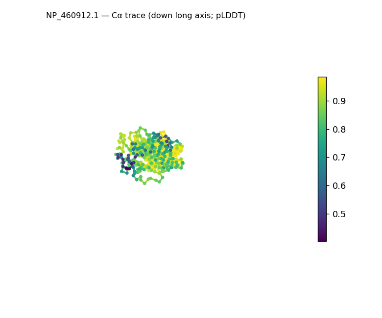
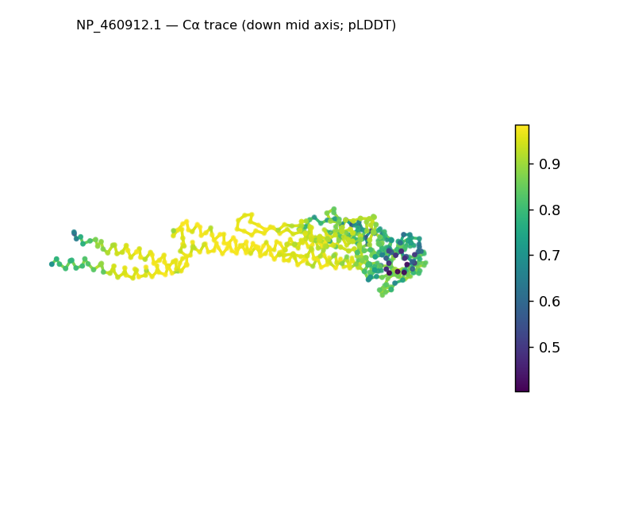
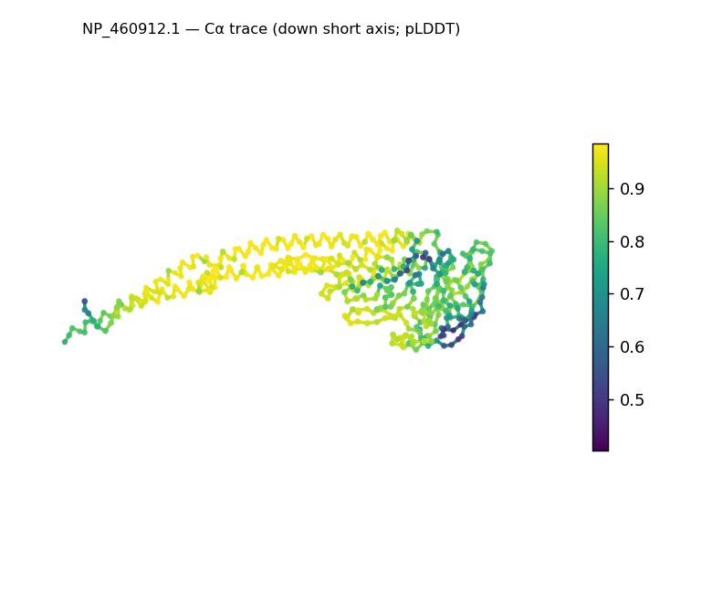
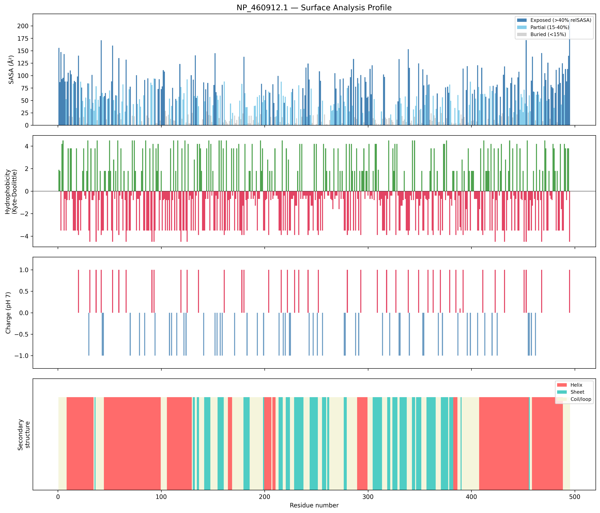
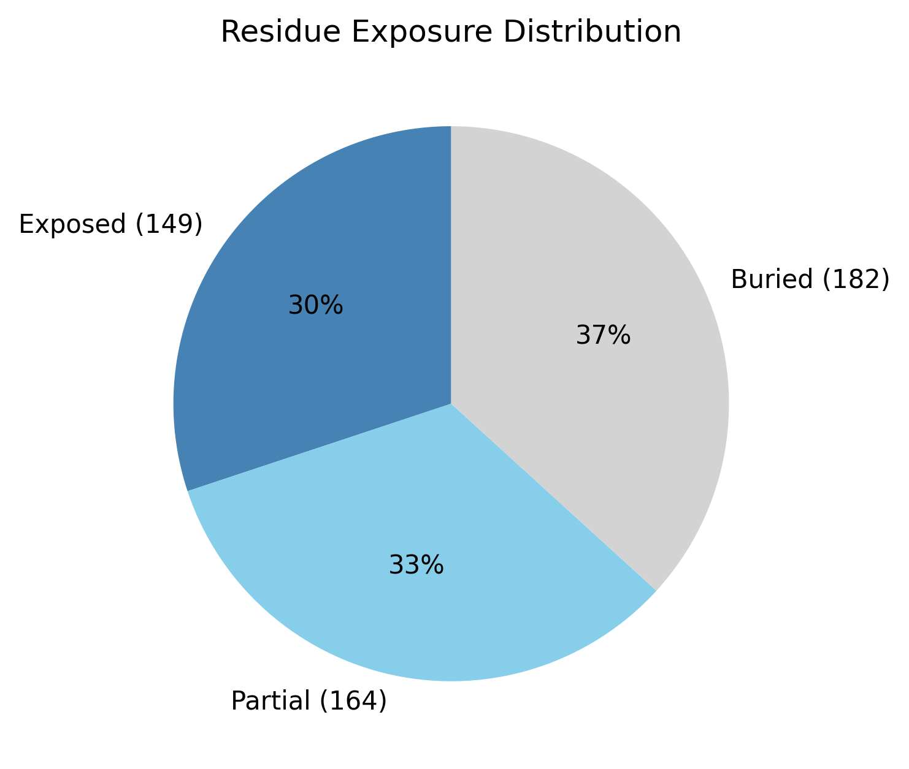

# Structural analysis — `NP_460912.1`

> Facts are emitted deterministically from the measurement scripts. Sections marked with a SYNTHESIS comment are authored by the Claude session (judgment), kept visibly separate from the measured facts.

## Executive summary

A single-chain predicted model of 495 residues (no missing residues, no non-solvent ligands) whose most distinctive feature is its shape: it is strongly elongated/prolate (asphericity 0.75; dimensions 156 × 43 × 36 Å), with a radius of gyration (41.62 Å) far above the ~29.9 Å expected for a compact chain of this length — pointing to an extended, probably multi-domain architecture rather than a single globular domain. Both secondary-structure types are present (helix 42.6%, sheet 22.6%, coil 34.7%; pydssp), indicating an α/β or α+β character, but for a chain this large and multi-lobed the fractions are a whole-chain average and the α/β-vs-α+β distinction would need per-domain segmentation. A buried core is present (buried 36.8%), the surface is moderately polar (mean Kyte–Doolittle −1.1) with a near-neutral net charge (−1 e; 15 positive, 16 negative), and there is a single short hydrophobic patch near the C-terminus (residues 479–481). The model is predicted at good confidence (mean pLDDT 86.14, the highest of this run). Class and shape are reported as inference from the measurements; the pydssp fallback caps the class confidence at Moderate, and naming a specific fold would require database verification (SCOP/CATH/Foldseek).

## User-provided context

None provided. No organism, expected function, or known structural features were supplied with this run; every observation here and below derives from the structure alone.

## Structure overview

- **Source:** predicted model — pLDDT in the B-factor column
- **Chains:** 1 (single chain)
- **Residues / atoms:** 495 / 3622
- **Missing residues:** 0
- **Non-solvent ligands:** none
  - chain **A**: 495 res

## Structural views

_Cα backbone trace (Agent 2.2 matplotlib placeholder), down the long / mid / short principal axes; coloured by pLDDT._

## Shape & secondary structure

- **Shape:** prolate (elongated) (asphericity 0.75, Rg 41.62 Å)
- **Approx. dimensions:** 156.4 × 43.3 × 35.9 Å
- **Secondary structure:** helix 42.6%, sheet 22.6%, coil 34.7% _(method: pydssp)_
- **⚠ SS assigned by pydssp (fallback), not mkdssp** — pydssp is a simplified DSSP reimplementation and can over- or under-call short helix/sheet segments on imperfect (e.g. predicted) backbones. Treat fractions near the ~5% floor, the helix/sheet split, and any coil-vs-disorder reasoning as provisional; install mkdssp for reference-grade assignment.

## Surface properties

- **Exposure:** buried 36.8%, partial 33.1%, exposed 30.1%
- **Total SASA:** 24209.7 Ų
- **Surface hydrophobicity (KD):** mean -1.1 ± 2.63
- **Surface charge (pH 7):** net -1 e (15 +, 16 −)
- **Hydrophobic patches:** 1:
  - residues 479–481 (len 3, mean KD 3.27)

## Prediction quality / structural coherence

Confidence is **reported, never gated** — these signals are inputs for the synthesis below, not a pass/fail.

- **pLDDT (chain A):** mean 86.14, median 89.85, range 40.26–98.47, std 12.43
- **Compactness:** Rg 41.62 Å vs ~29.9 Å expected for 495 residues (2.5·N^0.4) — larger than expected
- **Core present:** buried fraction 36.8%
- **Coil fraction:** 34.7%

### Coherence assessment

The structural-coherence signals agree with the confidence score and indicate an ordered fold. Mean pLDDT is 86.14 (Confident tier, the highest in this run), a buried core is present (buried fraction 36.8%), and coil is moderate (34.7%) — consistent with a well-folded chain. The radius of gyration is much larger than the globular expectation (41.62 Å vs ~29.9 Å), but that reflects an elongated shape, not incoherence or disorder: extension is a legitimate architectural property and does not bear on whether the fold is coherent. Taken together, the signals describe a confidently-predicted, ordered, extended (probably multi-domain) structure.

## Expected-parameter comparison

_No expected-parameter profile supplied — this is the default for novel / low-homology targets. See the independent observations below._

## Independent observations

- **Strongly elongated for its size (the standout measurement).** Relative to the compact-globular baseline (Rg ≈ 2.5·N^0.4 ≈ 29.9 Å; asphericity < ~0.15), this chain is far more extended: Rg 41.62 Å and asphericity 0.75, with a ~156 Å long axis against a ~36–43 Å cross-section. Per the interpretation guide this signals an extended or multi-domain architecture. It is unusual-but-legitimate (single domains are usually globular) and is explicitly not an internal inconsistency.
- **Ordered, not disordered, despite the extension.** Coil is 34.7% (well below the >80% disorder signal), a buried core exists (36.8%), there are no missing residues, and both SS types are abundant — so the elongation reflects real extended architecture rather than an absence of structure.
- **Whole-chain averages.** At 495 residues across a multi-lobed envelope, the SS fractions and overall shape metrics are averages over probable domains; per-domain analysis would be needed to characterise the individual units and their relative arrangement.
- **Unremarkable surface chemistry.** Near-neutral net charge (−1 e), a moderately polar surface (mean KD −1.1), and a single short C-terminal hydrophobic patch (479–481). Secondary structure is from pydssp and should be confirmed with mkdssp; no measurements directly contradict one another.

This is a structural description, not an identity, fold-name, or function call; on the present measurements there is insufficient structural evidence to assign function.

## Methods

- **Measurements (deterministic):** `parse_structure.py` (metadata, confidence stats), `surface_analysis.py` (Shrake–Rupley SASA, Kyte–Doolittle hydrophobicity, charge at pH 7, DSSP secondary structure, shape metrics), `render_trace.py` (Agent 2.2 Cα-trace figures; `render_views.py` Mol* cartoons when Agent 2.1 is available).
- **Report facts** below the synthesis sections are emitted verbatim from the above scripts' JSON by `assemble_report.py` — no transcription.
- **Synthesis** sections (executive summary, independent observations incl. the one-line scope statement, coherence assessment) are authored by Claude per `SKILL.md` Step 9, each claim cited to a measurement.
