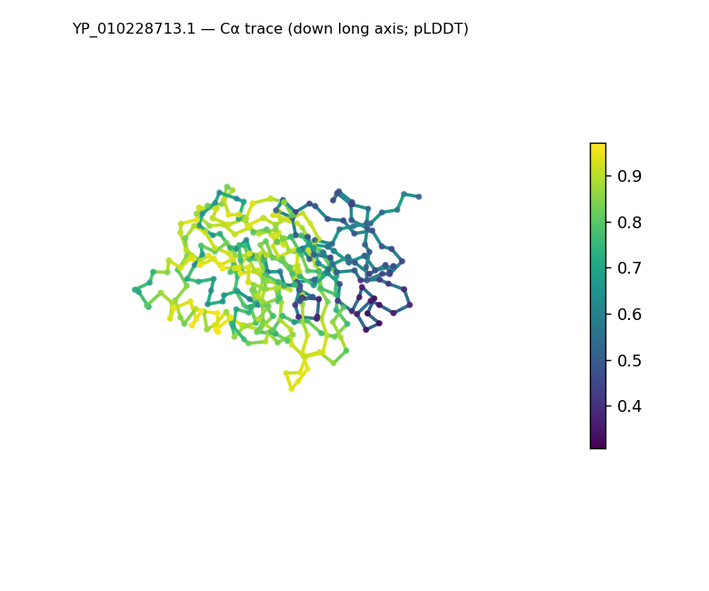
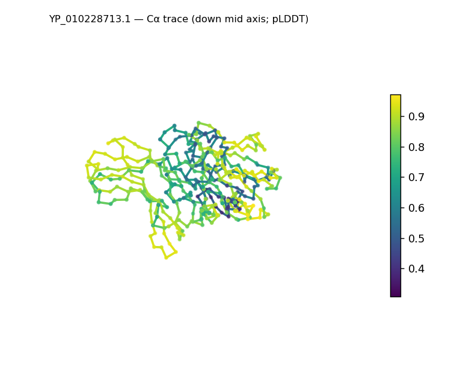
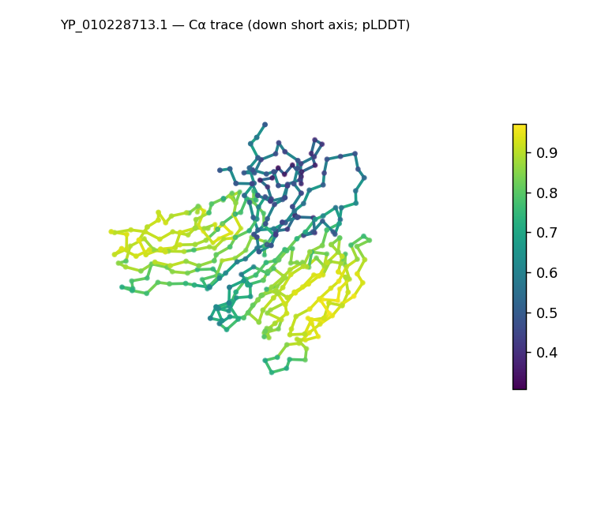
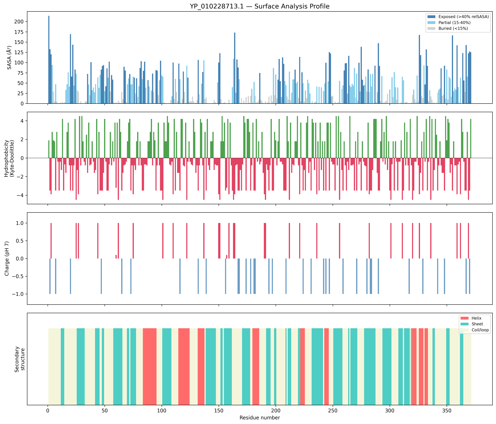
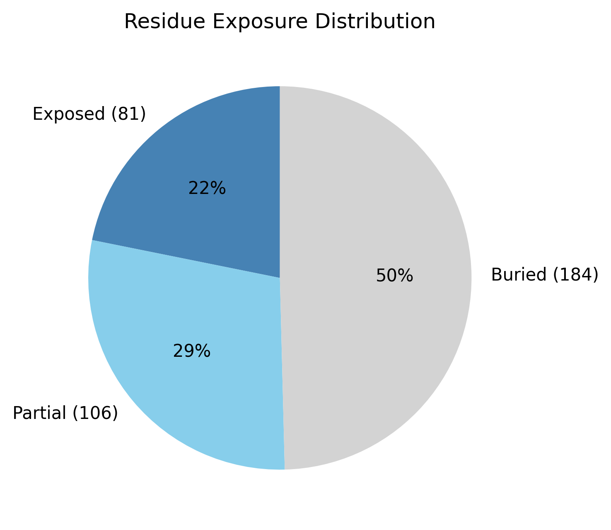

# Structural analysis — `YP_010228713.1`

> Facts are emitted deterministically from the measurement scripts. Sections marked with a SYNTHESIS comment are authored by the Claude session (judgment), kept visibly separate from the measured facts.

## Executive summary

A single-chain predicted model of 371 residues (no missing residues, no non-solvent ligands) that is compact and roughly globular — asphericity 0.07, with a radius of gyration (19.81 Å) actually below the ~26.6 Å expected for a folded chain of this length, i.e. more tightly packed than the globular baseline; dimensions 60 × 57 × 41 Å. Secondary structure is β-dominated (sheet 36.9% vs helix 14.3%, coil 48.8%; pydssp), with short helices interspersed among the strands along the chain rather than segregated into a separate region — an SS content consistent with a predominantly-β α/β (or α+β) class, offered as inference from SS and shape. The structure has a strong buried core (buried 49.6%, the high end of the globular range), indicating tight packing; the surface is moderately polar (mean Kyte–Doolittle −1.11) and slightly net-negative (−2 e; 9 positive, 11 negative), with two short hydrophobic patches (residues 70–72, 217–219). It is the lowest-confidence model of the run on average (mean pLDDT 73.34) yet still Confident-tier overall. Because the secondary structure rests on the pydssp fallback, the helix/sheet/coil split and the class call are provisional (confidence Moderate); naming a specific fold would require database verification (SCOP/CATH/Foldseek).

## User-provided context

None provided. No organism, expected function, or known structural features were supplied with this run; every observation here and below derives from the structure alone.

## Structure overview

- **Source:** predicted model — pLDDT in the B-factor column
- **Chains:** 1 (single chain)
- **Residues / atoms:** 371 / 2825
- **Missing residues:** 0
- **Non-solvent ligands:** none
  - chain **A**: 371 res

## Structural views

_Cα backbone trace (Agent 2.2 matplotlib placeholder), down the long / mid / short principal axes; coloured by pLDDT._

## Shape & secondary structure

- **Shape:** roughly globular (asphericity 0.07, Rg 19.81 Å)
- **Approx. dimensions:** 59.5 × 56.8 × 41 Å
- **Secondary structure:** helix 14.3%, sheet 36.9%, coil 48.8% _(method: pydssp)_
- **⚠ SS assigned by pydssp (fallback), not mkdssp** — pydssp is a simplified DSSP reimplementation and can over- or under-call short helix/sheet segments on imperfect (e.g. predicted) backbones. Treat fractions near the ~5% floor, the helix/sheet split, and any coil-vs-disorder reasoning as provisional; install mkdssp for reference-grade assignment.

## Surface properties

- **Exposure:** buried 49.6%, partial 28.6%, exposed 21.8%
- **Total SASA:** 14807.8 Ų
- **Surface hydrophobicity (KD):** mean -1.11 ± 2.55
- **Surface charge (pH 7):** net -2 e (9 +, 11 −)
- **Hydrophobic patches:** 2:
  - residues 70–72 (len 3, mean KD 3.27)
  - residues 217–219 (len 3, mean KD 2.7)

## Prediction quality / structural coherence

Confidence is **reported, never gated** — these signals are inputs for the synthesis below, not a pass/fail.

- **pLDDT (chain A):** mean 73.34, median 79.45, range 30.71–97.12, std 18.66
- **Compactness:** Rg 19.81 Å vs ~26.6 Å expected for 371 residues (2.5·N^0.4) — consistent
- **Core present:** buried fraction 49.6%
- **Coil fraction:** 48.8%

### Coherence assessment

This is the case where a coherent fold sits alongside the lowest confidence of the run, common for low-homology targets. Mean pLDDT is 73.34 — the lowest here and the most variable (std 18.66; per-residue range 30.71–97.12) — yet the structural-coherence signals point firmly to a well-ordered fold: the radius of gyration (19.81 Å) is even more compact than the ~26.6 Å globular expectation, the buried fraction (49.6%) is at the high end of the globular range (a strongly packed core), and sheet content is substantial (36.9%). The coherence signals therefore do not track the moderate confidence score — they indicate a compact, well-cored fold despite it. The high coil fraction (48.8%) is consistent with a strand-and-loop β architecture rather than disorder given the strong buried core, but because the assignment is from pydssp this coil-vs-disorder reading should be confirmed with mkdssp. Confidence is reported here as context, not a gate.

## Expected-parameter comparison

_No expected-parameter profile supplied — this is the default for novel / low-homology targets. See the independent observations below._

## Independent observations

- **Unusually compact and well-cored (the standout measurements).** Against the globular baseline, both the buried fraction (49.6% vs the typical 40–55%, at the high end) and the radius of gyration (19.81 Å vs ~26.6 Å expected) point to a tightly packed structure — the opposite of an extended or disordered chain.
- **High coil fraction (48.8%), read against the core.** Nearly half the chain is assigned coil, but with a strong buried core and a compact Rg this reads as a loop-rich β fold (many turns connecting strands) rather than disorder; the disorder indicators do not converge. Because secondary structure is from pydssp (which can over-call coil on predicted backbones), the precise split is provisional and mkdssp would be needed to confirm it.
- **β-dominated with interspersed helices.** Strands form the framework throughout the chain with short helices between them (per-residue ss order), leaning α/β, though the parallel-vs-antiparallel and precise interleaving call needs topology this pipeline does not compute.
- **Unremarkable surface chemistry.** Slightly net-negative (−2 e), moderately polar (mean KD −1.11), two short hydrophobic patches. No measurements directly contradict one another.

This is a structural description, not an identity, fold-name, or function call; on the present measurements there is insufficient structural evidence to assign function.

## Methods

- **Measurements (deterministic):** `parse_structure.py` (metadata, confidence stats), `surface_analysis.py` (Shrake–Rupley SASA, Kyte–Doolittle hydrophobicity, charge at pH 7, DSSP secondary structure, shape metrics), `render_trace.py` (Agent 2.2 Cα-trace figures; `render_views.py` Mol* cartoons when Agent 2.1 is available).
- **Report facts** below the synthesis sections are emitted verbatim from the above scripts' JSON by `assemble_report.py` — no transcription.
- **Synthesis** sections (executive summary, independent observations incl. the one-line scope statement, coherence assessment) are authored by Claude per `SKILL.md` Step 9, each claim cited to a measurement.
