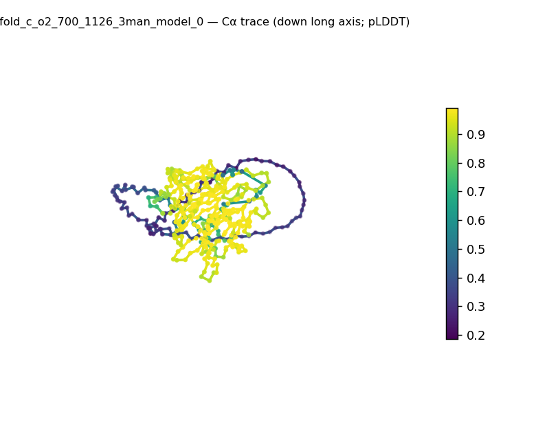
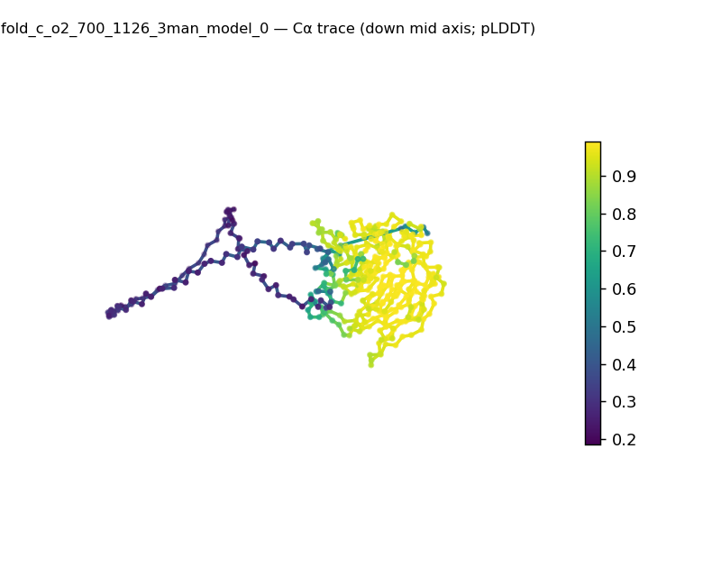
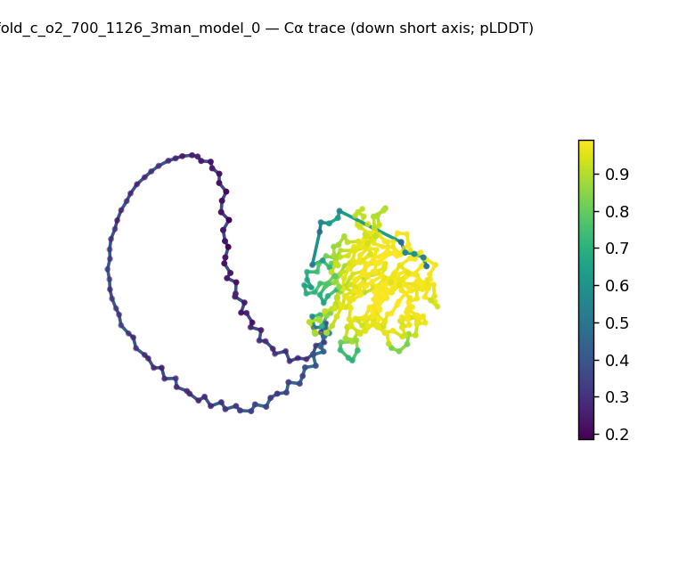
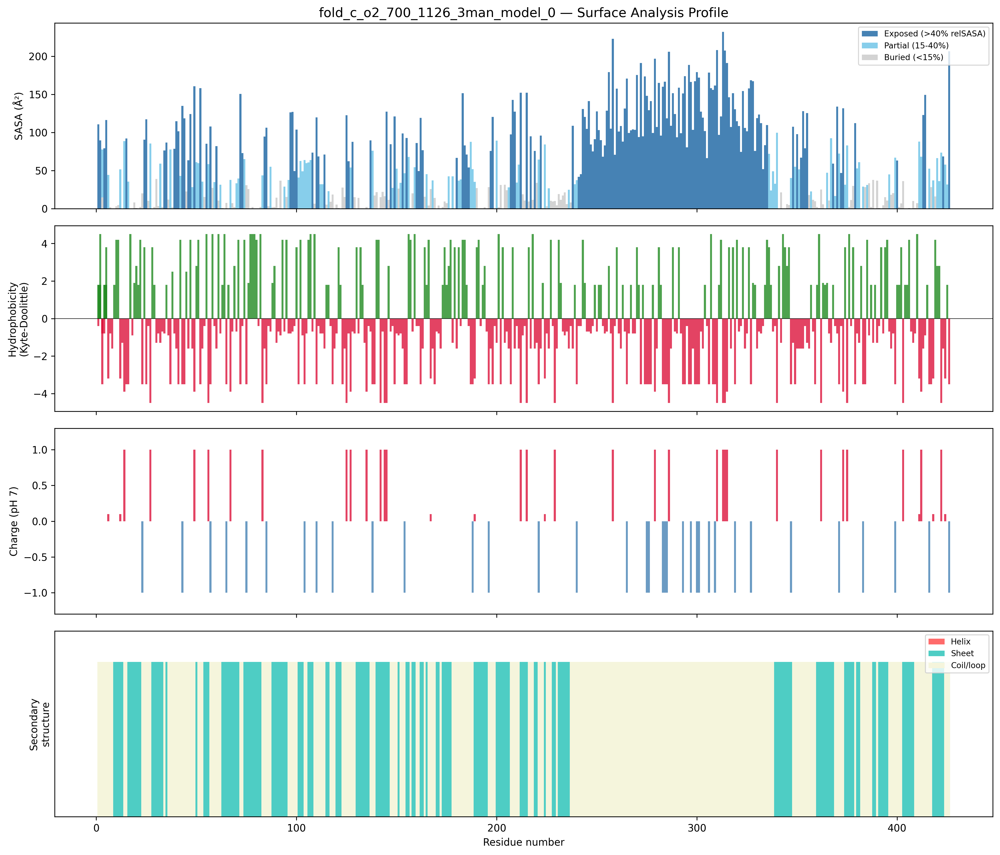
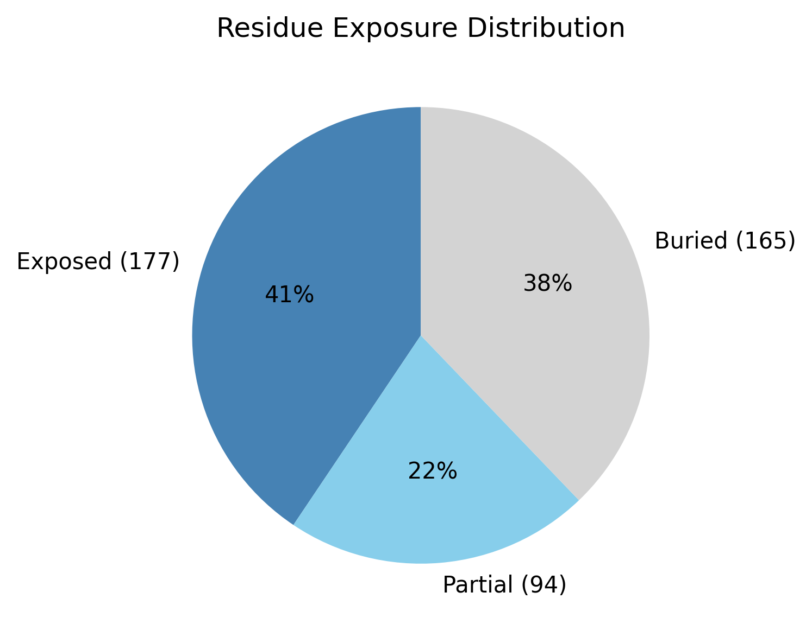

# Structural analysis — `fold_c_o2_700_1126_3man_model_0`

> Facts are emitted deterministically from the measurement scripts. Sections marked with a SYNTHESIS comment are authored by the Claude session (judgment), kept visibly separate from the measured facts.

## Executive summary

<!-- SYNTHESIS (Claude, per SKILL.md Step 9): 3–5 sentences: the most notable structural observations. Structural observations only; cite the measurement(s) each claim rests on. Replace this comment. -->

## User-provided context

<!-- SYNTHESIS (Claude, per SKILL.md Step 9): State any context the user gave (organism, goal, expected features), verbatim and clearly separated from observations; else "None provided." Structural observations only; cite the measurement(s) each claim rests on. Replace this comment. -->

## Structure overview

- **Source:** predicted model — pLDDT in the B-factor column
- **Chains:** 5 (oligomeric)
- **Residues / atoms:** 436 / 3355
- **Missing residues:** 0
- **Non-solvent ligands:** MAN
  - chain **A**: 426 res
  - chain **B**: 5 res
  - chain **C**: 5 res
  - chain **D**: 0 res
  - chain **E**: 0 res

## Structural views

_Cα backbone trace (Agent 2.2 matplotlib placeholder), down the long / mid / short principal axes; coloured by pLDDT._

## Shape & secondary structure

- **Shape:** prolate (elongated) (asphericity 0.23, Rg 32.61 Å)
- **Approx. dimensions:** 112.2 × 85.7 × 52.7 Å
- **Secondary structure:** helix 0.0%, sheet 37.4%, coil 62.6% _(method: pydssp)_
- **⚠ SS assigned by pydssp (fallback), not mkdssp** — pydssp is a simplified DSSP reimplementation and can over- or under-call short helix/sheet segments on imperfect (e.g. predicted) backbones. Treat fractions near the ~5% floor, the helix/sheet split, and any coil-vs-disorder reasoning as provisional; install mkdssp for reference-grade assignment.

## Surface properties

- **Exposure:** buried 37.8%, partial 21.6%, exposed 40.6%
- **Total SASA:** 26884.4 Ų
- **Surface hydrophobicity (KD):** mean -0.74 ± 2.53
- **Surface charge (pH 7):** net -6 e (13 +, 19 −)
- **Hydrophobic patches:** 3:
  - residues 183–185 (len 3, mean KD 3.4)
  - residues 334–337 (len 4, mean KD 2.9)
  - residues 4–2 (len 4, mean KD 1.8)

## Prediction quality / structural coherence

Confidence is **reported, never gated** — these signals are inputs for the synthesis below, not a pass/fail.

- **pLDDT (chain A):** mean 77.81, median 94.14, range 18.59–98.99, std 28.69
- **pLDDT (chain B):** mean 55.08, median 55.1, range 44.77–61.21, std 5.86
- **pLDDT (chain C):** mean 52.27, median 52.11, range 45.61–59.7, std 5.07
- **Compactness:** Rg 32.61 Å vs ~28.4 Å expected for 436 residues (2.5·N^0.4) — consistent
- **Core present:** buried fraction 37.8%
- **Coil fraction:** 62.6%

### Coherence assessment

<!-- SYNTHESIS (Claude, per SKILL.md Step 9): Do the structural-coherence signals (compactness, core, coil) agree with the confidence score, or does a low pLDDT sit alongside a coherent fold (common for low-homology targets)? State which, citing the signals above. Structural observations only; cite the measurement(s) each claim rests on. Replace this comment. -->

## Expected-parameter comparison

_No expected-parameter profile supplied — this is the default for novel / low-homology targets. See the independent observations below._

## Independent observations

<!-- SYNTHESIS (Claude, per SKILL.md Step 9): What is notable or unexpected from the measurements + generic physical baselines ALONE (do NOT consult the expected-parameter profiles here). Flag internal inconsistencies. Anchor 'unexpected' to a stated baseline. Close with ONE sentence stating the scope limit: this is structural description, not an identity / fold-name / function call — say 'insufficient structural evidence to assign function' when the structure does not support one. Keep it to one line; the generic limits of structural analysis live in the README, so do not re-enumerate identity / homology / mechanism here. Structural observations only; cite the measurement(s) each claim rests on. Replace this comment. -->

## Methods

- **Measurements (deterministic):** `parse_structure.py` (metadata, confidence stats), `surface_analysis.py` (Shrake–Rupley SASA, Kyte–Doolittle hydrophobicity, charge at pH 7, DSSP secondary structure, shape metrics), `render_trace.py` (Agent 2.2 Cα-trace figures; `render_views.py` Mol* cartoons when Agent 2.1 is available).
- **Report facts** below the synthesis sections are emitted verbatim from the above scripts' JSON by `assemble_report.py` — no transcription.
- **Synthesis** sections (executive summary, independent observations incl. the one-line scope statement, coherence assessment) are authored by Claude per `SKILL.md` Step 9, each claim cited to a measurement.
