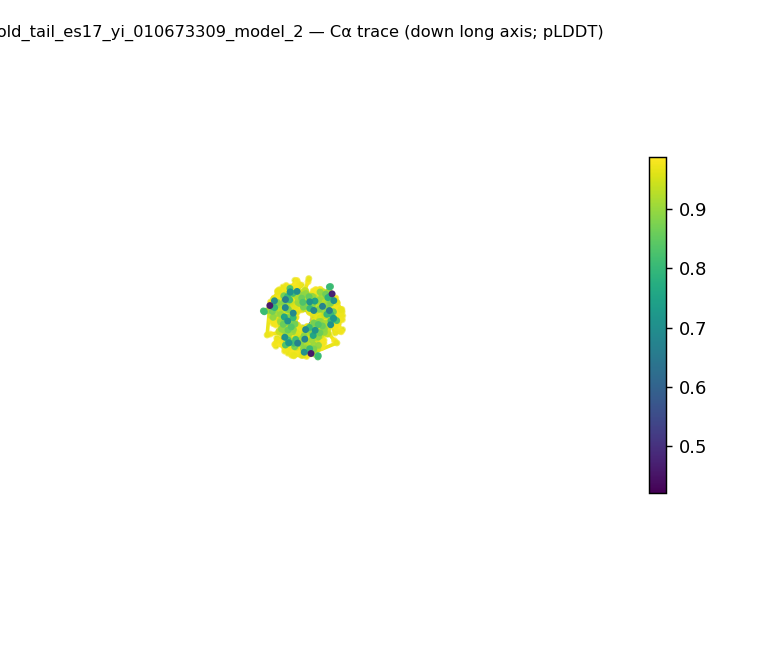
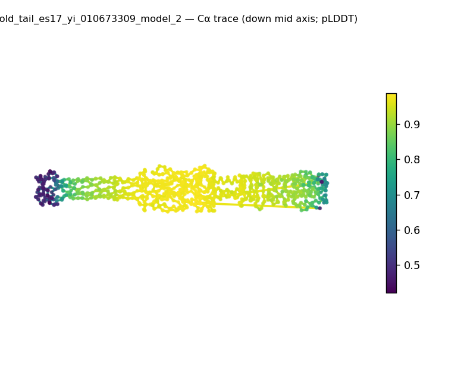
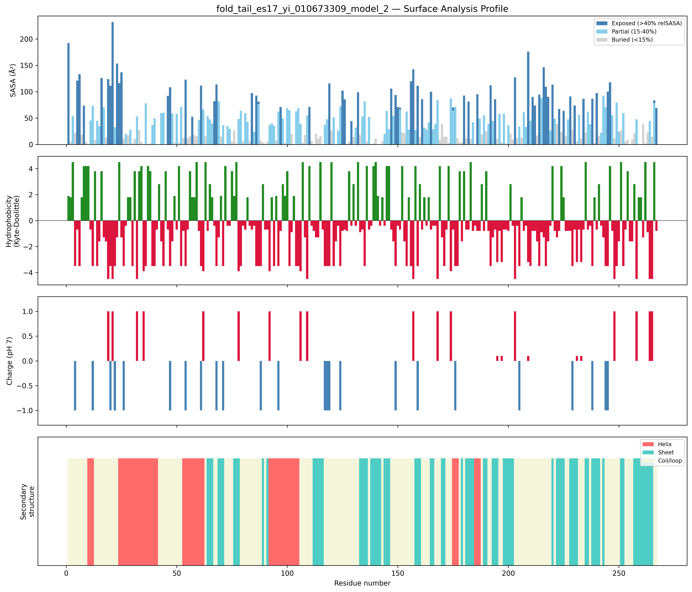
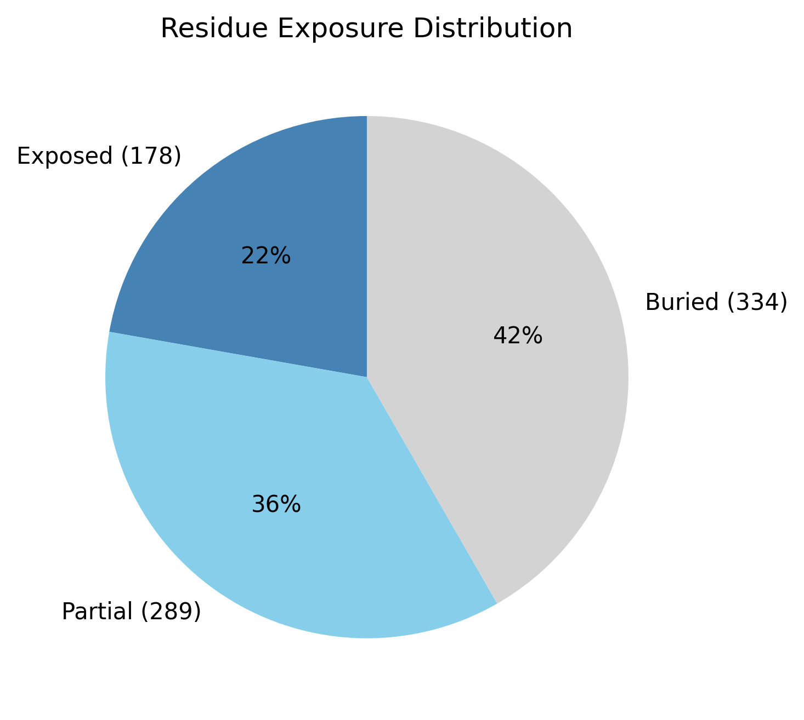

# Structural analysis — `fold_tail_es17_yi_010673309_model_2`

> Facts are emitted deterministically from the measurement scripts. Sections marked with a SYNTHESIS comment are authored by the Claude session (judgment), kept visibly separate from the measured facts.

## Executive summary

<!-- SYNTHESIS (Claude, per SKILL.md Step 9): 3–5 sentences: the most notable structural observations. Structural observations only; cite the measurement(s) each claim rests on. Replace this comment. -->

## User-provided context

<!-- SYNTHESIS (Claude, per SKILL.md Step 9): State any context the user gave (organism, goal, expected features), verbatim and clearly separated from observations; else "None provided." Structural observations only; cite the measurement(s) each claim rests on. Replace this comment. -->

## Structure overview

- **Source:** predicted model — pLDDT in the B-factor column
- **Chains:** 4 (oligomeric)
- **Residues / atoms:** 801 / 6130
- **Missing residues:** 0
- **Non-solvent ligands:** none
  - chain **A**: 267 res
  - chain **B**: 267 res
  - chain **C**: 267 res
  - chain **D**: 0 res

## Structural views

_Cα backbone trace (Agent 2.2 matplotlib placeholder), down the long / mid / short principal axes; coloured by pLDDT._

## Shape & secondary structure

- **Shape:** prolate (elongated) (asphericity 0.91, Rg 59.31 Å)
- **Approx. dimensions:** 210.8 × 33.5 × 33.3 Å
- **Secondary structure:** helix 19.1%, sheet 29.2%, coil 51.7% _(method: pydssp)_
- **⚠ SS assigned by pydssp (fallback), not mkdssp** — pydssp is a simplified DSSP reimplementation and can over- or under-call short helix/sheet segments on imperfect (e.g. predicted) backbones. Treat fractions near the ~5% floor, the helix/sheet split, and any coil-vs-disorder reasoning as provisional; install mkdssp for reference-grade assignment.

## Surface properties

- **Exposure:** buried 41.7%, partial 36.1%, exposed 22.2%
- **Total SASA:** 35914.6 Ų
- **Surface hydrophobicity (KD):** mean -1.1 ± 2.55
- **Surface charge (pH 7):** net -17.7 e (15 +, 30 −)
- **Hydrophobic patches:** 0

## Prediction quality / structural coherence

Confidence is **reported, never gated** — these signals are inputs for the synthesis below, not a pass/fail.

- **pLDDT (chain A):** mean 88.91, median 95.02, range 42.54–98.73, std 14.2
- **pLDDT (chain B):** mean 88.82, median 94.71, range 42.12–98.63, std 14.17
- **pLDDT (chain C):** mean 88.96, median 95.09, range 42.24–98.62, std 14.2
- **Compactness:** Rg 59.31 Å vs ~36.3 Å expected for 801 residues (2.5·N^0.4) — larger than expected
- **Core present:** buried fraction 41.7%
- **Coil fraction:** 51.7%

### Coherence assessment

<!-- SYNTHESIS (Claude, per SKILL.md Step 9): Do the structural-coherence signals (compactness, core, coil) agree with the confidence score, or does a low pLDDT sit alongside a coherent fold (common for low-homology targets)? State which, citing the signals above. Structural observations only; cite the measurement(s) each claim rests on. Replace this comment. -->

## Expected-parameter comparison

_No expected-parameter profile supplied — this is the default for novel / low-homology targets. See the independent observations below._

## Independent observations

<!-- SYNTHESIS (Claude, per SKILL.md Step 9): What is notable or unexpected from the measurements + generic physical baselines ALONE (do NOT consult the expected-parameter profiles here). Flag internal inconsistencies. Anchor 'unexpected' to a stated baseline. Close with ONE sentence stating the scope limit: this is structural description, not an identity / fold-name / function call — say 'insufficient structural evidence to assign function' when the structure does not support one. Keep it to one line; the generic limits of structural analysis live in the README, so do not re-enumerate identity / homology / mechanism here. Structural observations only; cite the measurement(s) each claim rests on. Replace this comment. -->

## Methods

- **Measurements (deterministic):** `parse_structure.py` (metadata, confidence stats), `surface_analysis.py` (Shrake–Rupley SASA, Kyte–Doolittle hydrophobicity, charge at pH 7, DSSP secondary structure, shape metrics), `render_trace.py` (Agent 2.2 Cα-trace figures; `render_views.py` Mol* cartoons when Agent 2.1 is available).
- **Report facts** below the synthesis sections are emitted verbatim from the above scripts' JSON by `assemble_report.py` — no transcription.
- **Synthesis** sections (executive summary, independent observations incl. the one-line scope statement, coherence assessment) are authored by Claude per `SKILL.md` Step 9, each claim cited to a measurement.
