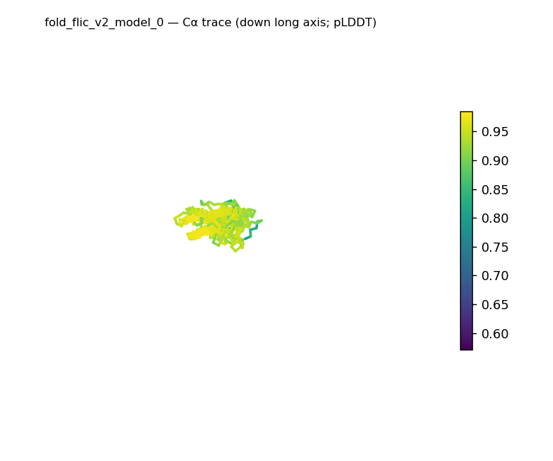
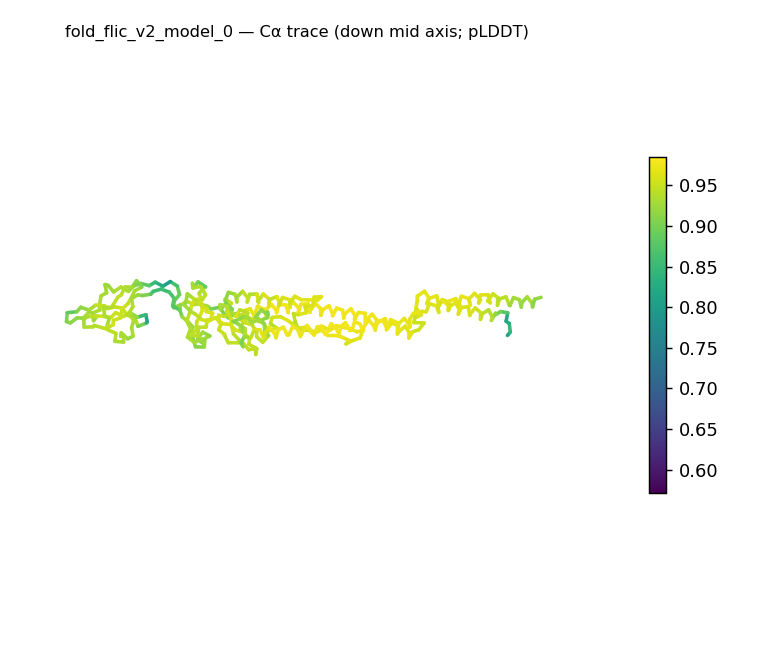
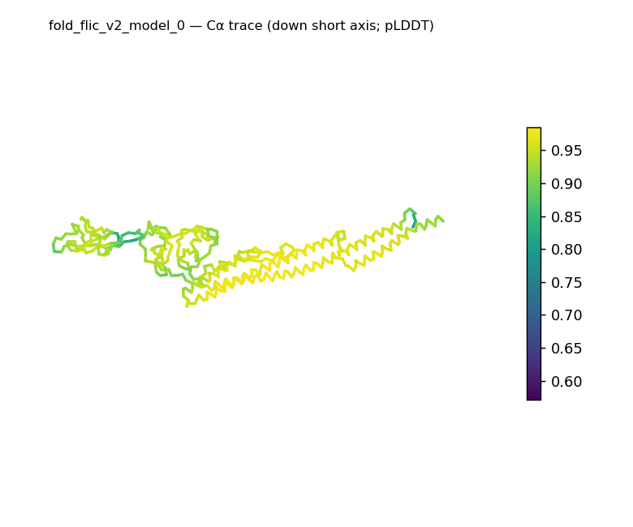
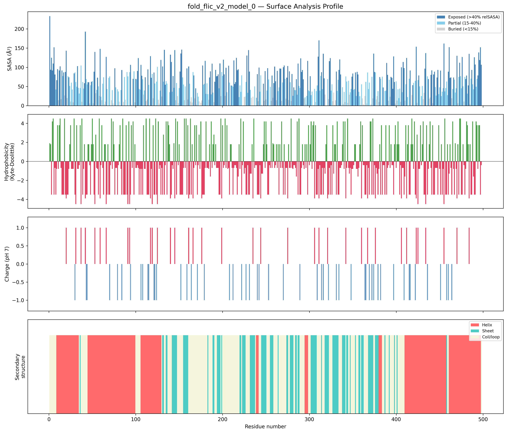
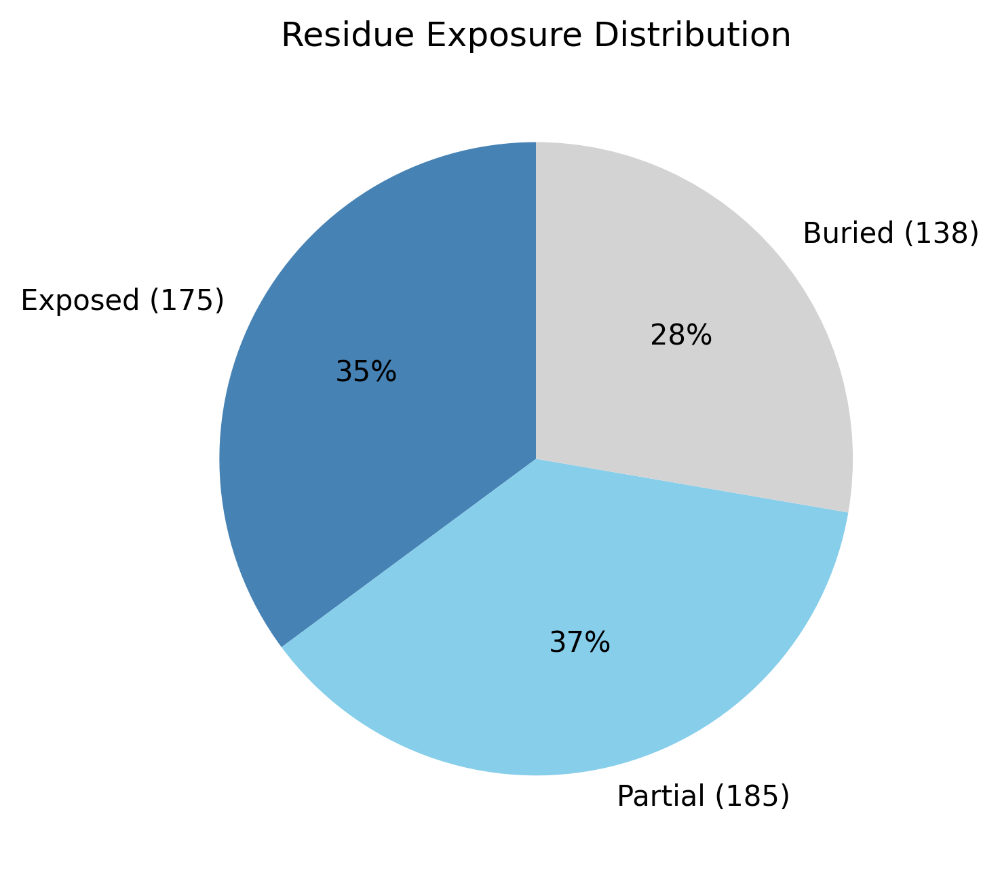

# Structural analysis — `fold_flic_v2_model_0`

> Facts are emitted deterministically from the measurement scripts. Sections marked with a SYNTHESIS comment are authored by the Claude session (judgment), kept visibly separate from the measured facts.

## Executive summary

A single 498-residue chain (no missing residues, no ligands) folds into a strikingly elongated, prolate architecture: asphericity 0.85, radius of gyration 52.6 Å, and approximate dimensions of 207.4 × 51.9 × 32.1 Å (long axis ~6.5× the short axis). Both helix (40.4%) and sheet (21.3%) are present alongside 38.4% coil, so the chain is substantially ordered rather than disordered, but its dimensions place it far outside the compact-globular range. The surface is moderately polar (mean Kyte–Doolittle −1.31) and close to neutral (net −3 e; 18 positive, 21 negative residues), and across 28,123 Ų of surface only a single short hydrophobic patch is exposed (residues 481–483, length 3). The buried fraction is a modest 27.7% — a smaller core than the 40–55% typical of globular proteins — which is consistent with the very high surface-to-volume ratio of such an elongated shape. Taken together, the measurements describe an ordered but markedly extended, mixed α/β-or-α+β chain.

## User-provided context

No prior biological context provided.

## Structure overview

- **Source:** predicted model — pLDDT in the B-factor column
- **Chains:** 1 (single chain)
- **Residues / atoms:** 498 / 3596
- **Missing residues:** 0
- **Non-solvent ligands:** none
  - chain **A**: 498 res

## Structural views

_Cα backbone trace (Agent 2.2 matplotlib placeholder), down the long / mid / short principal axes; coloured by pLDDT._

## Shape & secondary structure

- **Shape:** prolate (elongated) (asphericity 0.85, Rg 52.6 Å)
- **Approx. dimensions:** 207.4 × 51.9 × 32.1 Å
- **Secondary structure:** helix 40.4%, sheet 21.3%, coil 38.4% _(method: pydssp)_
- **⚠ SS assigned by pydssp (fallback), not mkdssp** — pydssp is a simplified DSSP reimplementation and can over- or under-call short helix/sheet segments on imperfect (e.g. predicted) backbones. Treat fractions near the ~5% floor, the helix/sheet split, and any coil-vs-disorder reasoning as provisional; install mkdssp for reference-grade assignment.

## Surface properties

- **Exposure:** buried 27.7%, partial 37.1%, exposed 35.1%
- **Total SASA:** 28123.3 Ų
- **Surface hydrophobicity (KD):** mean -1.31 ± 2.36
- **Surface charge (pH 7):** net -3 e (18 +, 21 −)
- **Hydrophobic patches:** 1:
  - residues 481–483 (len 3, mean KD 3.27)

## Prediction quality / structural coherence

Confidence is **reported, never gated** — these signals are inputs for the synthesis below, not a pass/fail.

- **pLDDT (chain A):** mean 90.32, median 91.88, range 57.11–98.46, std 7.02
- **Compactness:** Rg 52.6 Å vs ~30.0 Å expected for 498 residues (2.5·N^0.4) — larger than expected
- **Core present:** buried fraction 27.7%
- **Coil fraction:** 38.4%

### Coherence assessment

This is a bring-your-own structure, so there is no pipeline-generated confidence score to cross-check; the assessment is limited to whether the structural-coherence signals are internally consistent. They are, and they describe an ordered but highly extended chain. Substantial ordered secondary structure (helix 40.4% + sheet 21.3% = 61.7%, only 38.4% coil) and a present hydrophobic core (buried fraction 27.7%) both indicate a folded chain, while the radius of gyration (52.6 Å against the ~30.0 Å expected for 498 residues) and asphericity (0.85) mark it as far more elongated than a compact globular protein. The slightly-below-globular buried fraction (27.7% vs the usual 40–55%) does not contradict this: it is the expected consequence of the elongated geometry's high surface-to-volume ratio, not a sign of disorder given the high ordered-SS content. The signals are mutually consistent — ordered, but extended.

## Expected-parameter comparison

_No expected-parameter profile supplied — this is the default for novel / low-homology targets. See the independent observations below._

## Independent observations

- **Extreme elongation is the dominant feature.** Against the generic globular baseline of Rg ≈ 2.5·N^0.4 (≈30 Å for 498 residues), the measured Rg of 52.6 Å is ~1.75× larger; asphericity 0.85 sits far above the >0.30 prolate/fibrous range, and the long/short axis ratio is 63.9 (long axis 207.4 Å). For a single chain this is well outside compact-globular expectations and is the kind of geometry seen in fibrous, coiled-coil, or beads-on-a-string multi-domain arrangements (descriptive — not a fold call).
- **A very polar surface with almost no exposed hydrophobicity.** For a 498-residue chain presenting 28,123 Ų of surface, only one short hydrophobic patch is exposed (residues 481–483, length 3, mean KD 3.27); the mean surface hydrophobicity (−1.31) and near-neutral net charge (−3 e) are unremarkable on their own, but having essentially a single small patch across so large a surface is notable against the expectation that larger surfaces expose more hydrophobic patches.
- **Mixed secondary structure, no internal contradiction.** Both helix (40.4%) and sheet (21.3%) are present, so the content is mixed α/β-or-α+β; the aggregate fractions cannot resolve interleaved-vs-segregated topology, and the pydssp fallback caveat applies, so the coarse class is the ceiling here. The SS content and the elongated shape are compatible (an extended multi-domain chain can carry both), so no internal inconsistency is flagged.

This is a structural description of an ordered, markedly elongated, mixed α/β-or-α+β chain — not an identity, named-fold, or function call; the measurements provide insufficient structural evidence to assign function.

## Methods

- **Measurements (deterministic):** `parse_structure.py` (metadata, confidence stats), `surface_analysis.py` (Shrake–Rupley SASA, Kyte–Doolittle hydrophobicity, charge at pH 7, DSSP secondary structure, shape metrics), `render_trace.py` (Agent 2.2 Cα-trace figures; `render_views.py` Mol* cartoons when Agent 2.1 is available).
- **Report facts** below the synthesis sections are emitted verbatim from the above scripts' JSON by `assemble_report.py` — no transcription.
- **Synthesis** sections (executive summary, independent observations incl. the one-line scope statement, coherence assessment) are authored by Claude per `SKILL.md` Step 9, each claim cited to a measurement.
