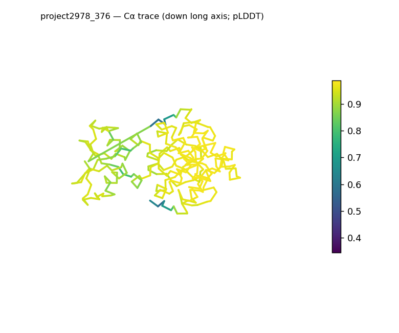
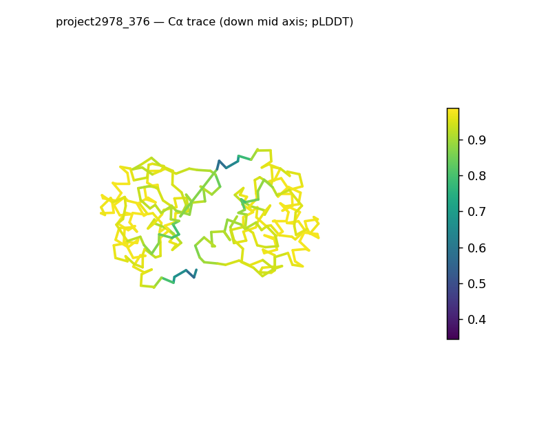
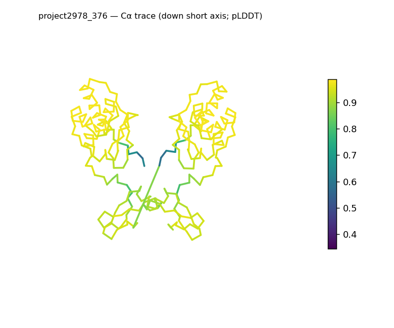
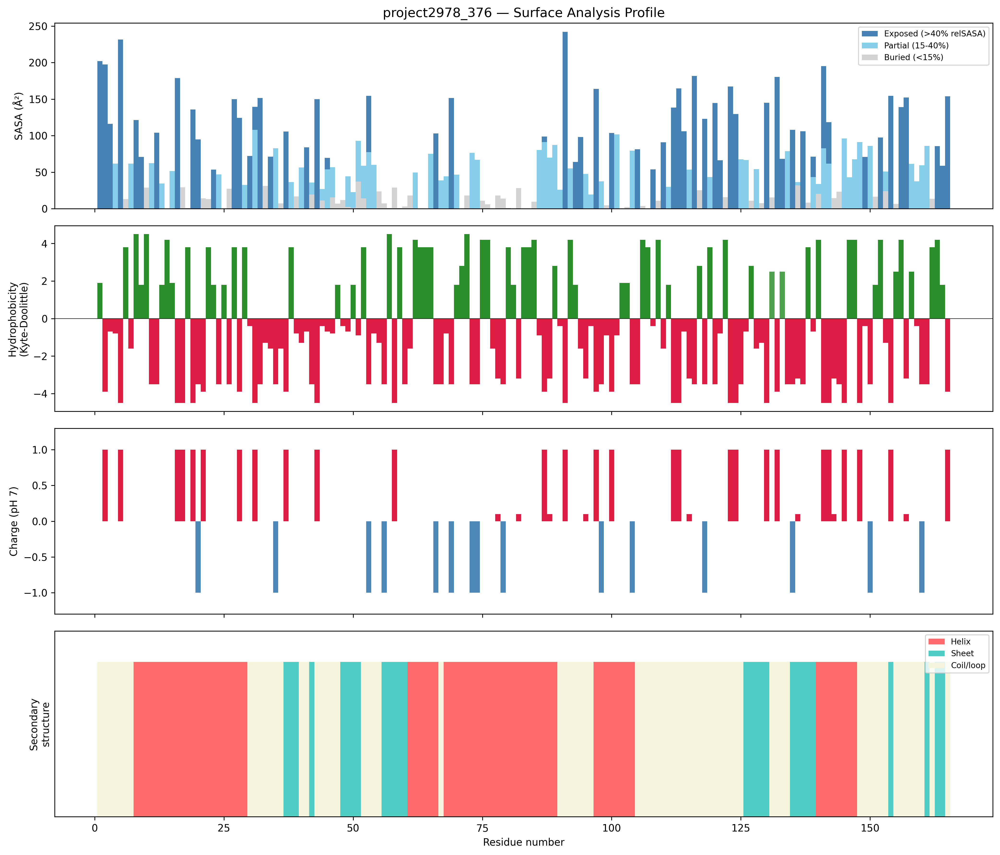
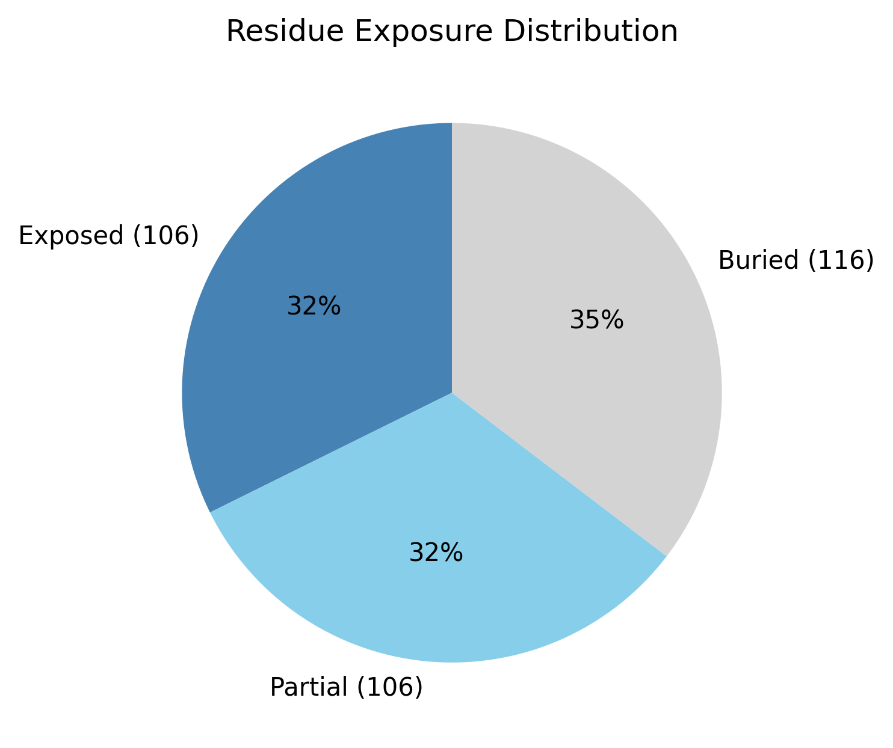

# Structural analysis — `project2978_376`

> Facts are emitted deterministically from the measurement scripts. Sections marked with a SYNTHESIS comment are authored by the Claude session (judgment), kept visibly separate from the measured facts.

## Executive summary

The model contains four chains, but only two resolve to protein: chains A (163 residues) and B (165 residues), which are near-identical in sequence; chains C and D contribute 243 atoms each yet parse to zero residues and are not flagged as ligands, metals, or water, so the measured surface, shape, and secondary-structure values reflect the 328-residue A+B protein only. That protein portion is compact and roughly globular — asphericity 0.11 and radius of gyration 25.3 Å, essentially matching the ~25.4 Å expected for 328 residues — with both helix (40.2%) and sheet (16.2%) present alongside 43.6% coil. Its most distinctive feature is a strongly cationic surface: net +29.2 e with 42 positive versus only 11 negative surface residues, a highly polar mean surface hydrophobicity (−2.01), and no exposed hydrophobic patches. A defined hydrophobic core is present (buried fraction 35.4%), consistent with a folded globular assembly.

## User-provided context

No prior biological context provided.

## Structure overview

- **Source:** predicted model — pLDDT in the B-factor column
- **Chains:** 4 (oligomeric)
- **Residues / atoms:** 328 / 3208
- **Missing residues:** 2
- **Non-solvent ligands:** none
  - chain **A**: 163 res, 2 chain break(s)
  - chain **B**: 165 res
  - chain **C**: 0 res
  - chain **D**: 0 res

## Structural views

_Cα backbone trace (Agent 2.2 matplotlib placeholder), down the long / mid / short principal axes; coloured by pLDDT._

## Shape & secondary structure

- **Shape:** roughly globular (asphericity 0.11, Rg 25.3 Å)
- **Approx. dimensions:** 62.2 × 61.1 × 38.9 Å
- **Secondary structure:** helix 40.2%, sheet 16.2%, coil 43.6% _(method: pydssp)_
- **⚠ SS assigned by pydssp (fallback), not mkdssp** — pydssp is a simplified DSSP reimplementation and can over- or under-call short helix/sheet segments on imperfect (e.g. predicted) backbones. Treat fractions near the ~5% floor, the helix/sheet split, and any coil-vs-disorder reasoning as provisional; install mkdssp for reference-grade assignment.

## Surface properties

- **Exposure:** buried 35.4%, partial 32.3%, exposed 32.3%
- **Total SASA:** 19998.1 Ų
- **Surface hydrophobicity (KD):** mean -2.01 ± 2.82
- **Surface charge (pH 7):** net 29.2 e (42 +, 11 −)
- **Hydrophobic patches:** 0

## Prediction quality / structural coherence

Confidence is **reported, never gated** — these signals are inputs for the synthesis below, not a pass/fail.

- **pLDDT (chain A):** mean 92.44, median 95.79, range 34.45–98.7, std 9.51
- **pLDDT (chain B):** mean 92.66, median 95.65, range 36.18–98.7, std 9.63
- **Compactness:** Rg 25.3 Å vs ~25.4 Å expected for 328 residues (2.5·N^0.4) — consistent
- **Core present:** buried fraction 35.4%
- **Coil fraction:** 43.6%

### Coherence assessment

This is a bring-your-own structure, so there is no pipeline-generated confidence score to cross-check; the assessment is limited to whether the structural-coherence signals are internally consistent. They are, and they point to a well-ordered globular fold: the radius of gyration (25.3 Å) essentially matches the ~25.4 Å expected for 328 residues, a defined core is present (buried fraction 35.4%), and asphericity 0.11 is squarely in the globular range. The coil fraction (43.6%) is on the higher side, but should be read against the pydssp fallback caveat noted above rather than as evidence of disorder, since compactness and core both indicate a folded chain. None of the compactness, core, or shape signals contradict one another.

## Expected-parameter comparison

_No expected-parameter profile supplied — this is the default for novel / low-homology targets. See the independent observations below._

## Independent observations

- **A strongly cationic surface is the standout deviation.** Against the baseline that soluble proteins carry a net surface charge near zero, this surface is net +29.2 e, with 42 positive versus only 11 negative surface residues — a large excess of basic over acidic exposed residues. As inference from structure (not a function call), a strongly cationic surface of this kind is the sort of feature associated with binding of polyanionic partners; the measurements alone do not establish such a role.
- **The chain count overstates the parsed protein.** Two of the four modeled chains (C and D) contribute 243 atoms each but resolve to zero residues and are not recognized as ligands, metals, or water, so "4 chains" in the overview corresponds to only two parsed protein chains (A, B). This is worth surfacing because every surface/shape/SS number here describes A+B (328 residues) only.
- **A and B are near-identical copies; A carries minor breaks.** The two protein chains share essentially the same sequence (a likely homodimeric pair), with chain A showing two internal chain breaks (after residues 130 and 132, gap size 1 each) that B does not — minor and localized.
- **Otherwise unremarkable for a soluble protein.** Compact and globular (Rg matches expected, asphericity 0.11), highly polar surface (KD −2.01), and zero exposed hydrophobic patches are all consistent with a soluble protein; the strong positive charge is the one clear departure.

This is a structural description of a compact, globular, strongly cationic protein assembly — not an identity, named-fold, or function call; the measurements provide insufficient structural evidence to assign function.

## Methods

- **Measurements (deterministic):** `parse_structure.py` (metadata, confidence stats), `surface_analysis.py` (Shrake–Rupley SASA, Kyte–Doolittle hydrophobicity, charge at pH 7, DSSP secondary structure, shape metrics), `render_trace.py` (Agent 2.2 Cα-trace figures; `render_views.py` Mol* cartoons when Agent 2.1 is available).
- **Report facts** below the synthesis sections are emitted verbatim from the above scripts' JSON by `assemble_report.py` — no transcription.
- **Synthesis** sections (executive summary, independent observations incl. the one-line scope statement, coherence assessment) are authored by Claude per `SKILL.md` Step 9, each claim cited to a measurement.
