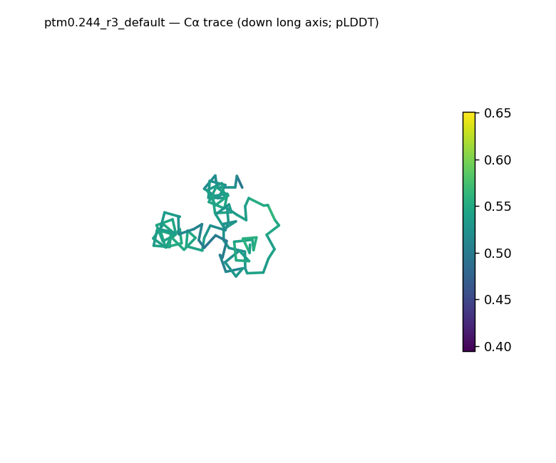
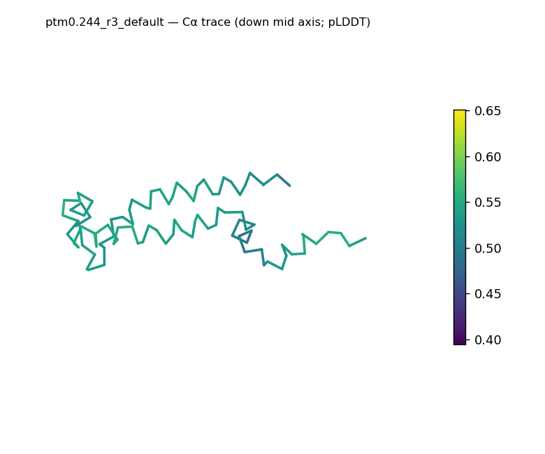
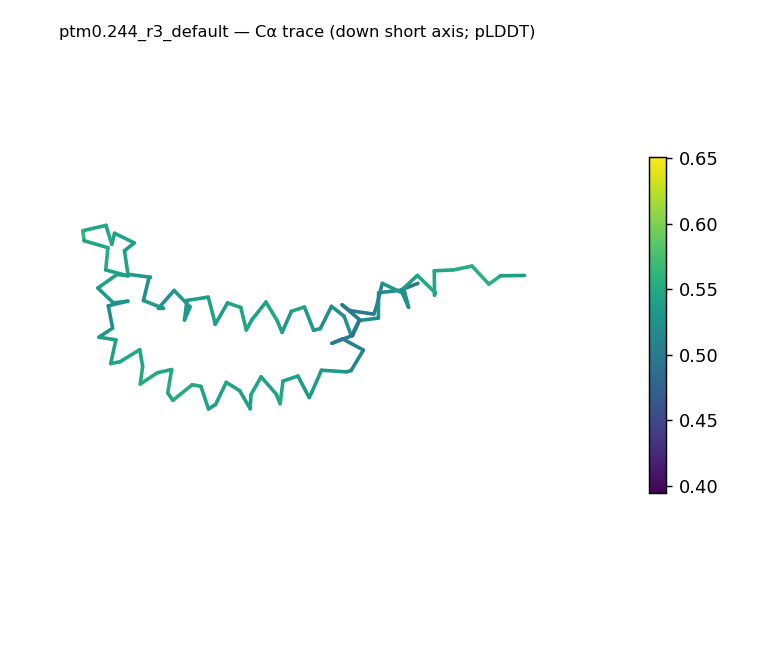
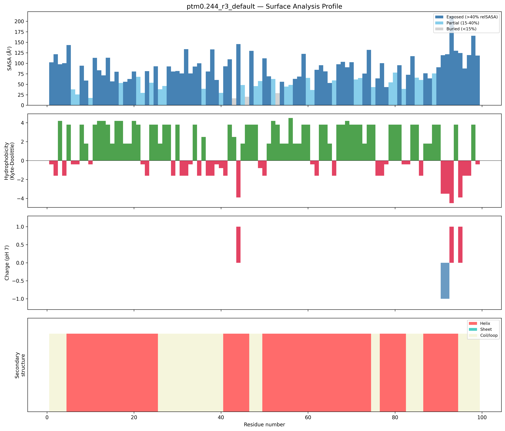
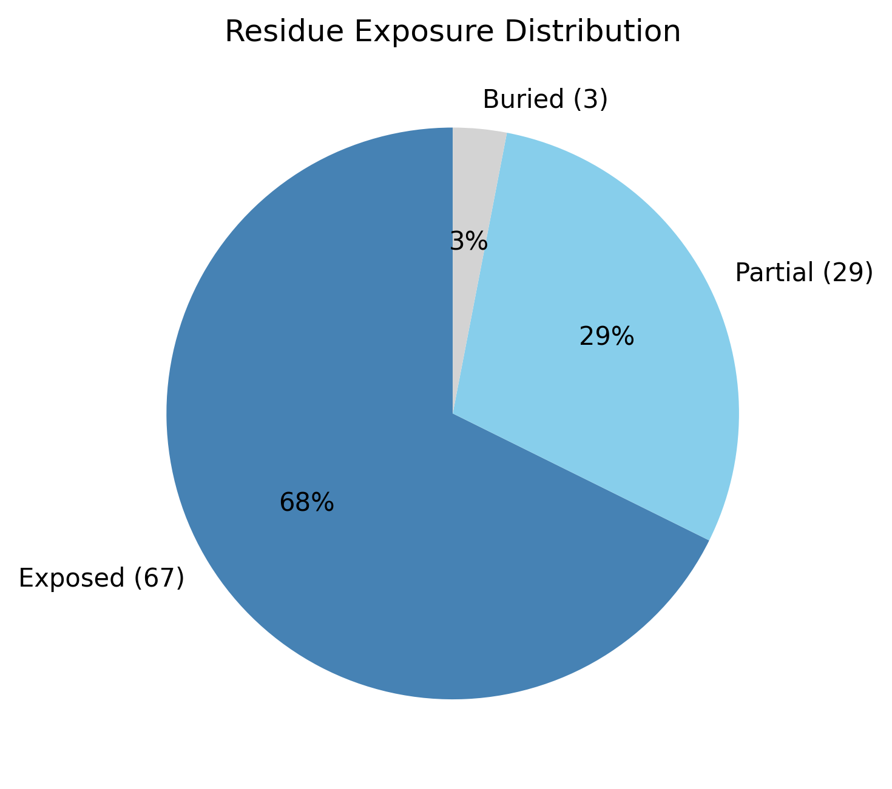

# Structural analysis — `ptm0.244_r3_default`

> Facts are emitted deterministically from the measurement scripts. Sections marked with a SYNTHESIS comment are authored by the Claude session (judgment), kept visibly separate from the measured facts.

## Executive summary

A single 99-residue chain (no missing residues, no ligands) is essentially all-α — helix 66.7%, sheet 0.0%, coil 33.3% — and elongated, with asphericity 0.49 and a radius of gyration (19.98 Å) larger than the ~15.7 Å expected for 99 residues (dimensions 68.2 × 28.4 × 21.5 Å). Its most unusual feature is the surface: mean Kyte–Doolittle hydrophobicity is +1.24 (a hydrophobic surface), net charge is near zero (+1 e; 3 positive, 2 negative residues), and seven hydrophobic patches span much of the chain (the longest being residues 67–75 and 11–21). The buried fraction is only 3.0% with 67.7% of residues exposed, far below the globular norm. Crucially, the high helix content shows the chain is ordered, so this very low burial reflects an extended, surface-exposed (e.g. lipid-facing) helical architecture rather than disorder.

## User-provided context

No prior biological context provided.

## Structure overview

- **Source:** predicted model — pLDDT in the B-factor column
- **Chains:** 1 (single chain)
- **Residues / atoms:** 99 / 672
- **Missing residues:** 0
- **Non-solvent ligands:** none
  - chain **A**: 99 res

## Structural views

_Cα backbone trace (Agent 2.2 matplotlib placeholder), down the long / mid / short principal axes; coloured by pLDDT._

## Shape & secondary structure

- **Shape:** prolate (elongated) (asphericity 0.49, Rg 19.98 Å)
- **Approx. dimensions:** 68.2 × 28.4 × 21.5 Å
- **Secondary structure:** helix 66.7%, sheet 0.0%, coil 33.3% _(method: pydssp)_
- **⚠ SS assigned by pydssp (fallback), not mkdssp** — pydssp is a simplified DSSP reimplementation and can over- or under-call short helix/sheet segments on imperfect (e.g. predicted) backbones. Treat fractions near the ~5% floor, the helix/sheet split, and any coil-vs-disorder reasoning as provisional; install mkdssp for reference-grade assignment.

## Surface properties

- **Exposure:** buried 3.0%, partial 29.3%, exposed 67.7%
- **Total SASA:** 7928.4 Ų
- **Surface hydrophobicity (KD):** mean 1.24 ± 2.67
- **Surface charge (pH 7):** net 1 e (3 +, 2 −)
- **Hydrophobic patches:** 7:
  - residues 11–21 (len 11, mean KD 3.44)
  - residues 24–28 (len 5, mean KD 3.4)
  - residues 54–60 (len 7, mean KD 2.76)
  - residues 63–65 (len 3, mean KD 3.13)
  - residues 67–75 (len 9, mean KD 3.62)
  - residues 79–81 (len 3, mean KD 3.8)
  - residues 87–90 (len 4, mean KD 2.8)

## Prediction quality / structural coherence

Confidence is **reported, never gated** — these signals are inputs for the synthesis below, not a pass/fail.

- **pLDDT (chain A):** mean 54.63, median 55.51, range 39.45–65.08, std 5.63
- **Compactness:** Rg 19.98 Å vs ~15.7 Å expected for 99 residues (2.5·N^0.4) — larger than expected
- **Core present:** buried fraction 3.0%
- **Coil fraction:** 33.3%

### Coherence assessment

This is a bring-your-own structure, so there is no pipeline-generated confidence score to cross-check; the assessment is limited to whether the structural-coherence signals are internally consistent — and here they require care. Taken in isolation, two signals read as "extended/possibly disordered": the buried fraction is only 3.0% (well under the ~30% globular-core threshold) and the radius of gyration (19.98 Å) exceeds the ~15.7 Å expected for 99 residues. But the coil fraction is just 33.3% against 66.7% helix — the chain is strongly ordered, not coil-dominated — so the apparent tension resolves to an extended, surface-exposed all-helical architecture (ordered, with little buried core) rather than to disorder. Read with the all-helical geometry in mind, the compactness, core, and coil signals are mutually consistent.

## Expected-parameter comparison

_No expected-parameter profile supplied — this is the default for novel / low-homology targets. See the independent observations below._

## Independent observations

- **A hydrophobic, near-uncharged surface is the most unusual feature.** Against the baseline that soluble proteins present a polar surface (mean KD < −0.5) carrying charged residues, this surface is the opposite: mean KD +1.24 (above the +0.5 mark that is unusual for soluble proteins and points to membrane contact or aggregation), essentially no net charge (+1 e; only 3 positive and 2 negative residues), and seven hydrophobic patches spanning much of the 99-residue chain (longest: residues 67–75, length 9, mean KD 3.62; and 11–21, length 11, mean KD 3.44). As inference from structure, this surface character is the kind seen in lipid-facing or membrane-associated helical elements — descriptive only, not a function call.
- **Near-absent core, flagged but reconciled.** Buried fraction 3.0% with 67.7% exposed is far from the 40–55% buried typical of globular proteins and, in isolation, matches the guide's "<30% may indicate disorder/extended conformation" criterion. This only appears to contradict the high order of the chain if a soluble-globular frame is assumed; with helix at 66.7% the burial is better read as an extended/lipid-facing all-helical geometry, so I flag the deviation rather than calling disorder.
- **Coarse class is all-α.** Helix 66.7% with sheet effectively absent (0.0%) places the secondary-structure content in the all-α class (subject to the pydssp fallback caveat); shape is elongated (asphericity 0.49, Rg 19.98 Å vs ~15.7 expected).

This is a structural description of a small, elongated, all-α chain with an unusually hydrophobic surface — not an identity, named-fold, or function call; the measurements provide insufficient structural evidence to assign function.

## Methods

- **Measurements (deterministic):** `parse_structure.py` (metadata, confidence stats), `surface_analysis.py` (Shrake–Rupley SASA, Kyte–Doolittle hydrophobicity, charge at pH 7, DSSP secondary structure, shape metrics), `render_trace.py` (Agent 2.2 Cα-trace figures; `render_views.py` Mol* cartoons when Agent 2.1 is available).
- **Report facts** below the synthesis sections are emitted verbatim from the above scripts' JSON by `assemble_report.py` — no transcription.
- **Synthesis** sections (executive summary, independent observations incl. the one-line scope statement, coherence assessment) are authored by Claude per `SKILL.md` Step 9, each claim cited to a measurement.
