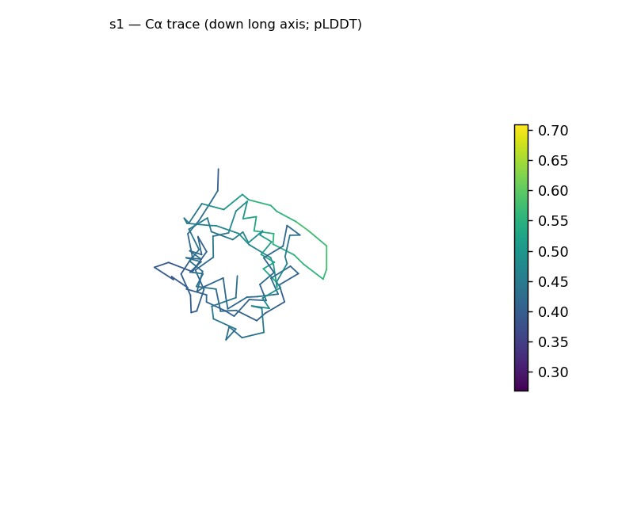
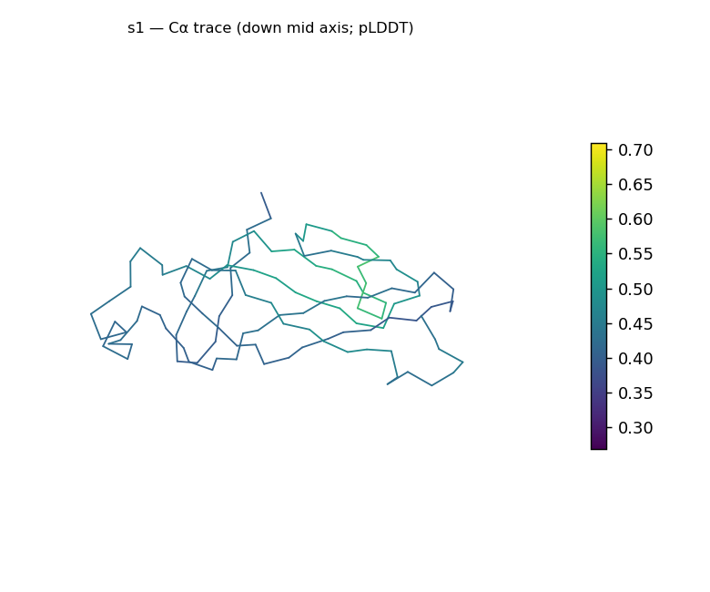
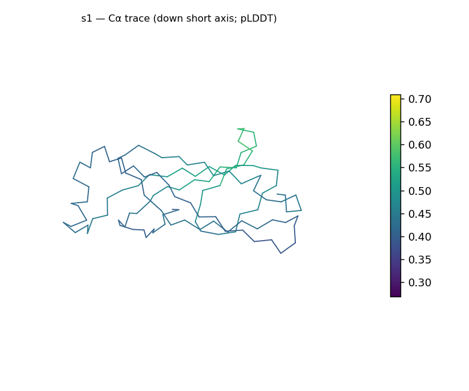
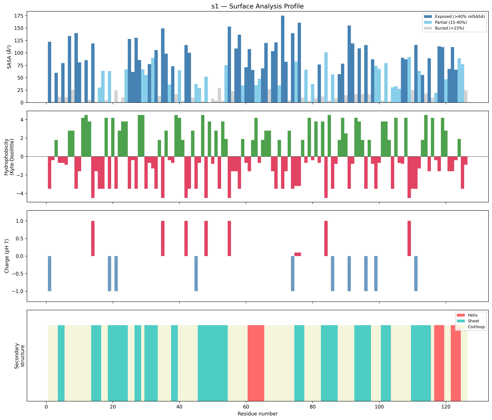
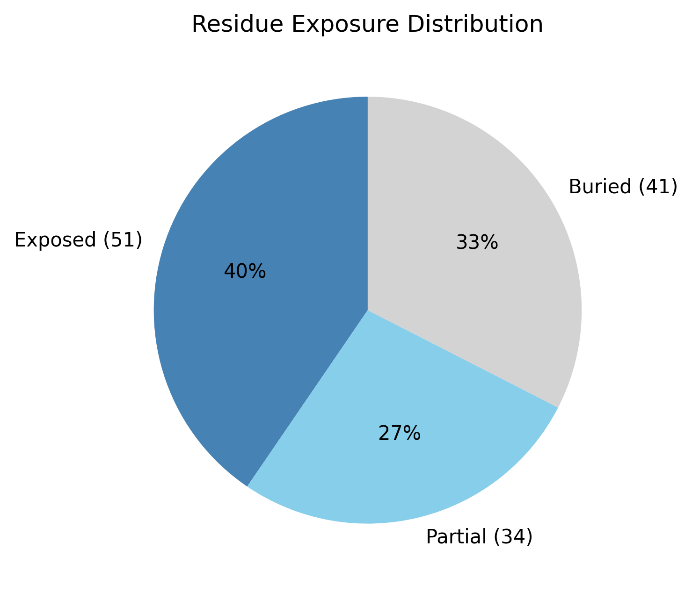

# Structural analysis — `s1`

> Facts are emitted deterministically from the measurement scripts. Sections marked with a SYNTHESIS comment are authored by the Claude session (judgment), kept visibly separate from the measured facts.

## Executive summary

`s1` is a single chain of 126 residues with no missing residues and no bound ligands (metadata). The chain is moderately elongated — classified prolate at asphericity 0.35 with approximate dimensions 49.9 × 26 × 25.8 Å — yet its radius of gyration (15.8 Å) matches the ~17.3 Å expected for a compact globular protein of this length, so the elongation reflects one long axis on an otherwise compact body rather than an extended molecule. Secondary-structure content is sheet-dominated (39.7% sheet vs 8.7% helix, 51.6% coil; pydssp), consistent with a predominantly β (all-β class) architecture as inference. The surface is moderately polar (mean Kyte–Doolittle -0.88), close to charge-neutral (net -0.9 e, 5 positive / 5 negative), and carries no exposed hydrophobic patches, while a buried fraction of 32.5% indicates a packed core is present.

## User-provided context

No prior biological context provided.

## Structure overview

- **Source:** experimental
- **Chains:** 1 (single chain)
- **Residues / atoms:** 126 / 989
- **Missing residues:** 0
- **Non-solvent ligands:** none
  - chain **A**: 126 res

## Structural views

_Cα backbone trace (Agent 2.2 matplotlib placeholder), down the long / mid / short principal axes; coloured by pLDDT._

## Shape & secondary structure

- **Shape:** prolate (elongated) (asphericity 0.35, Rg 15.8 Å)
- **Approx. dimensions:** 49.9 × 26 × 25.8 Å
- **Secondary structure:** helix 8.7%, sheet 39.7%, coil 51.6% _(method: pydssp)_
- **⚠ SS assigned by pydssp (fallback), not mkdssp** — pydssp is a simplified DSSP reimplementation and can over- or under-call short helix/sheet segments on imperfect (e.g. predicted) backbones. Treat fractions near the ~5% floor, the helix/sheet split, and any coil-vs-disorder reasoning as provisional; install mkdssp for reference-grade assignment.

## Surface properties

- **Exposure:** buried 32.5%, partial 27.0%, exposed 40.5%
- **Total SASA:** 7631.9 Ų
- **Surface hydrophobicity (KD):** mean -0.88 ± 2.75
- **Surface charge (pH 7):** net -0.9 e (5 +, 5 −)
- **Hydrophobic patches:** 0

## Prediction quality / structural coherence

Confidence is **reported, never gated** — these signals are inputs for the synthesis below, not a pass/fail.

- **B-factor (chain A):** mean 41.63, median 37.49, range 26.89–70.89, std 11.29
- **Compactness:** Rg 15.8 Å vs ~17.3 Å expected for 126 residues (2.5·N^0.4) — consistent
- **Core present:** buried fraction 32.5%
- **Coil fraction:** 51.6%

### Coherence assessment

The geometric coherence signals agree on a compact, ordered fold: the radius of gyration (15.8 Å) is consistent with the ~17.3 Å expected for 126 residues, a buried core is present (buried fraction 32.5%), and the coil fraction (51.6%), while elevated, sits alongside 39.7% sheet rather than dominating. One caveat applies to the confidence column itself. This structure's per-file classification is experimental — the B-factor column was *not* detected as pLDDT (mean 41.63, range 26.89–70.89) — whereas the run-level provenance for this batch states all structures were ESMFold2-predicted with pLDDT in the B-factor column. Because the meaning of that column is therefore ambiguous for `s1`, I read its values descriptively and do not assign a confidence tier from them; the geometric signals above, which are independent of the column's interpretation, support a coherent compact fold either way.

## Expected-parameter comparison

_No expected-parameter profile supplied — this is the default for novel / low-homology targets. See the independent observations below._

## Independent observations

Against generic globular baselines, the buried fraction (32.5%) sits just below the typical 40–55% range and the exposed fraction (40.5%) at the high end of the typical 25–35%, so the core is somewhat less tightly packed than an average globular protein, though still clearly present. The most notable internal tension is between the shape descriptors: the asphericity (0.35) crosses the prolate/elongated threshold, yet the Rg (15.8 Å) is that of a compact protein — the principal eigenvalues (182.3, 35.9, 31.4) and the near-equal mid/short dimensions (26.0 vs 25.8 Å) show the elongation is confined to one axis while the cross-section is near-circular, so "elongated" here means a single long axis on a compact body, not a fibrous form. The sheet-dominant secondary structure and the compact globular shape are mutually consistent, with no fold-class contradiction; the pydssp caveat means the 51.6% coil may be over-called and the helix/sheet split should be treated as provisional. Surface character is otherwise unremarkable for a soluble protein — moderately polar (KD -0.88), near-neutral charge, zero hydrophobic patches. This is structural description only; there is insufficient structural evidence to assign function.

## Methods

- **Measurements (deterministic):** `parse_structure.py` (metadata, confidence stats), `surface_analysis.py` (Shrake–Rupley SASA, Kyte–Doolittle hydrophobicity, charge at pH 7, DSSP secondary structure, shape metrics), `render_trace.py` (Agent 2.2 Cα-trace figures; `render_views.py` Mol* cartoons when Agent 2.1 is available).
- **Report facts** below the synthesis sections are emitted verbatim from the above scripts' JSON by `assemble_report.py` — no transcription.
- **Synthesis** sections (executive summary, independent observations incl. the one-line scope statement, coherence assessment) are authored by Claude per `SKILL.md` Step 9, each claim cited to a measurement.
