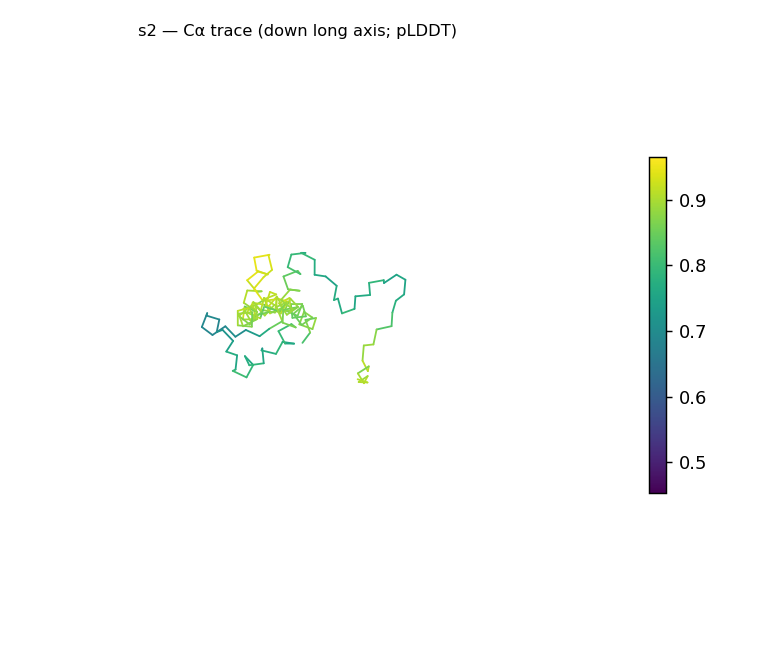
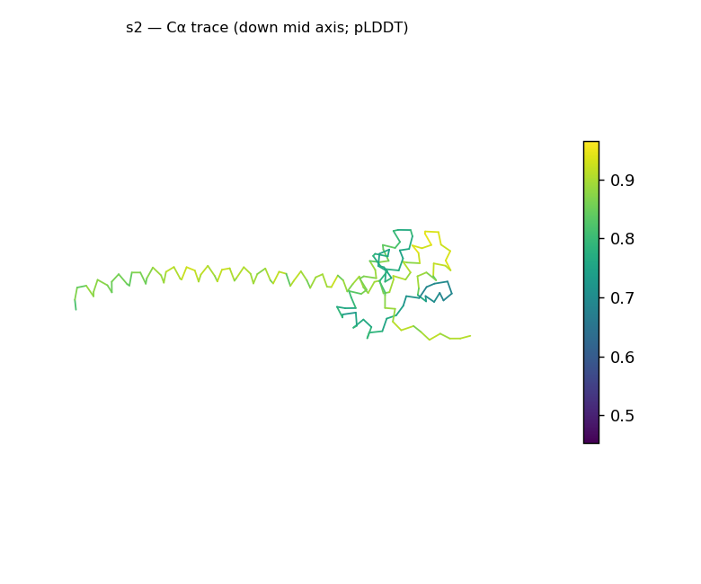
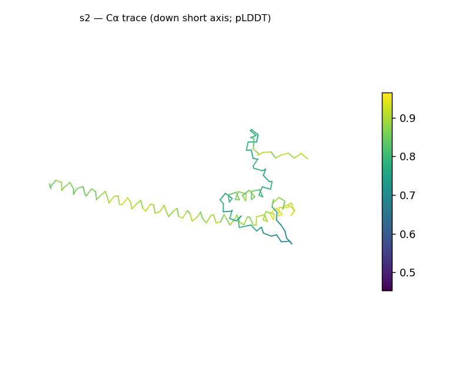
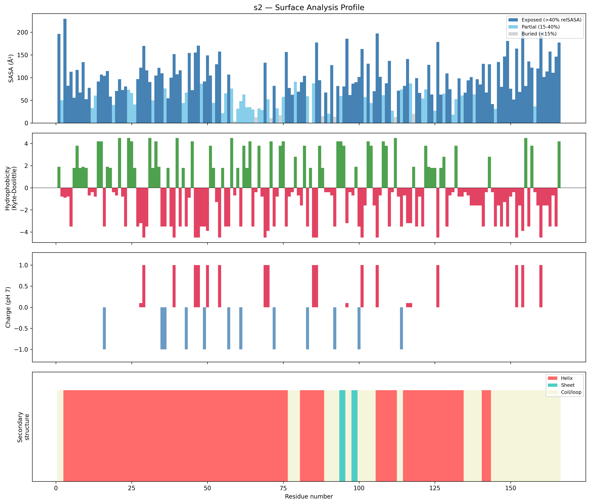
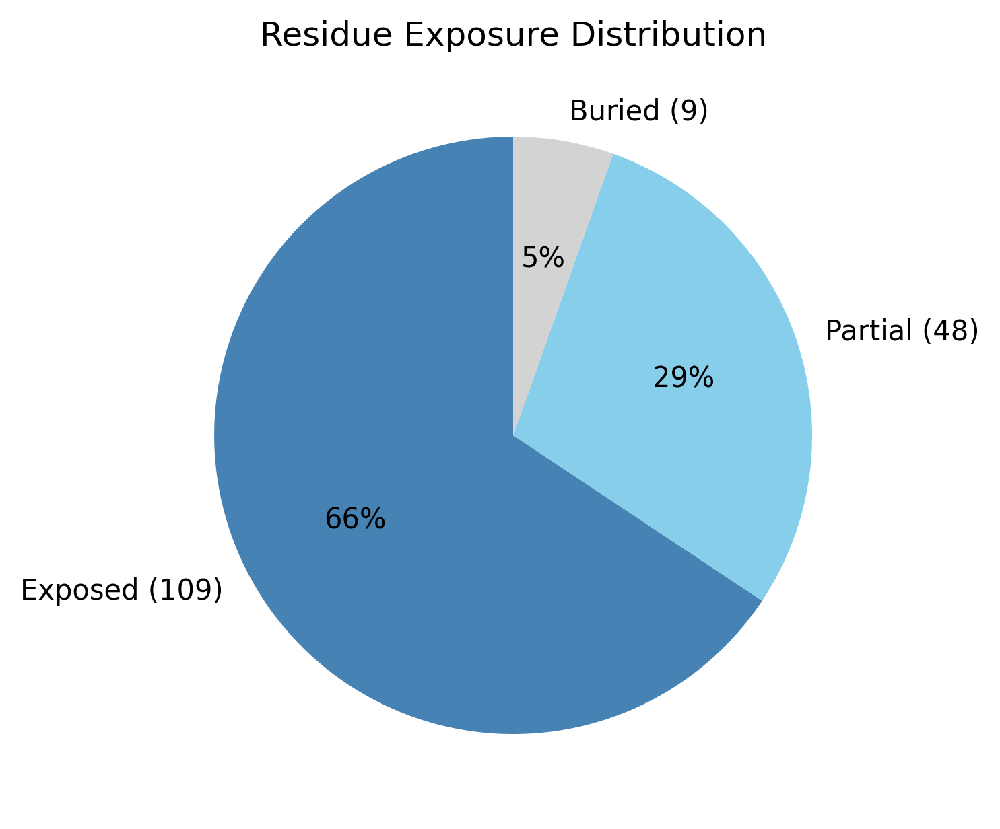

# Structural analysis — `s2`

> Facts are emitted deterministically from the measurement scripts. Sections marked with a SYNTHESIS comment are authored by the Claude session (judgment), kept visibly separate from the measured facts.

## Executive summary

`s2` is a single predicted chain of 166 residues (pLDDT in the B-factor column) with no missing residues and no ligands (metadata). It is strongly elongated — prolate at asphericity 0.58, approximate dimensions 113.2 × 49.2 × 31.5 Å, with a radius of gyration (32.34 Å) far above the ~19.3 Å expected for a compact protein of this length. The chain is helix-dominated (67.5% helix, 2.4% sheet, 30.1% coil; pydssp), pointing to an all-α class architecture as inference, and it is built as an extended rather than globular body: the buried fraction is only 5.4%, i.e. almost no packed hydrophobic core. The surface is moderately polar (mean Kyte–Doolittle -0.77) but carries a strong net positive charge (+8.3 e, 17 positive / 6 negative), and six short hydrophobic patches are distributed along the chain (residues 6–10, 24–26, 31–34, 62–64, 93–95, 122–125). Overall confidence is in the confident tier (pLDDT mean 76.97, median 81.22).

## User-provided context

No prior biological context provided.

## Structure overview

- **Source:** predicted model — pLDDT in the B-factor column
- **Chains:** 1 (single chain)
- **Residues / atoms:** 166 / 1257
- **Missing residues:** 0
- **Non-solvent ligands:** none
  - chain **A**: 166 res

## Structural views

_Cα backbone trace (Agent 2.2 matplotlib placeholder), down the long / mid / short principal axes; coloured by pLDDT._

## Shape & secondary structure

- **Shape:** prolate (elongated) (asphericity 0.58, Rg 32.34 Å)
- **Approx. dimensions:** 113.2 × 49.2 × 31.5 Å
- **Secondary structure:** helix 67.5%, sheet 2.4%, coil 30.1% _(method: pydssp)_
- **⚠ SS assigned by pydssp (fallback), not mkdssp** — pydssp is a simplified DSSP reimplementation and can over- or under-call short helix/sheet segments on imperfect (e.g. predicted) backbones. Treat fractions near the ~5% floor, the helix/sheet split, and any coil-vs-disorder reasoning as provisional; install mkdssp for reference-grade assignment.

## Surface properties

- **Exposure:** buried 5.4%, partial 28.9%, exposed 65.7%
- **Total SASA:** 14641.6 Ų
- **Surface hydrophobicity (KD):** mean -0.77 ± 2.89
- **Surface charge (pH 7):** net 8.3 e (17 +, 6 −)
- **Hydrophobic patches:** 6:
  - residues 6–10 (len 5, mean KD 2.22)
  - residues 24–26 (len 3, mean KD 3.5)
  - residues 31–34 (len 4, mean KD 3.1)
  - residues 62–64 (len 3, mean KD 3.27)
  - residues 93–95 (len 3, mean KD 4.07)
  - residues 122–125 (len 4, mean KD 2.32)

## Prediction quality / structural coherence

Confidence is **reported, never gated** — these signals are inputs for the synthesis below, not a pass/fail.

- **pLDDT (chain A):** mean 76.97, median 81.22, range 45.31–96.45, std 13.17
- **Compactness:** Rg 32.34 Å vs ~19.3 Å expected for 166 residues (2.5·N^0.4) — larger than expected
- **Core present:** buried fraction 5.4%
- **Coil fraction:** 30.1%

### Coherence assessment

Here the confidence score and the compactness signals describe different things and should not be conflated. The pLDDT is in the confident tier (mean 76.97, median 81.22, range 45.31–96.45), indicating the backbone is predicted with reasonable local confidence. The structural-coherence signals, however, do not describe a compact globular fold: the buried fraction is only 5.4% (essentially no packed core) and the Rg (32.34 Å) is ~1.7× the ~19.3 Å globular expectation. These are not in conflict — a confidently predicted structure can be extended and helical — but they mean the usual "compact core" coherence check does not apply here; the high helix content (67.5%) and moderate coil (30.1%) confirm the chain is ordered, just extended rather than globular.

## Expected-parameter comparison

_No expected-parameter profile supplied — this is the default for novel / low-homology targets. See the independent observations below._

## Independent observations

Measured against generic globular baselines, three features stand out. First, the buried fraction (5.4%) is far below the typical 40–55%, and the exposed fraction (65.7%) far above the typical 25–35% — almost every residue is solvent-exposed, consistent with an extended rather than core-packed architecture; relatedly, the Rg (32.34 Å) is ~1.7× the size-matched expectation (≈19.3 Å from 2.5·N^0.4). Second, the surface net charge (+8.3 e, 17 positive / 6 negative) departs markedly from the near-zero net charge typical of soluble proteins — a pronounced positive excess. Third, six short hydrophobic patches recur along an otherwise polar, helix-rich chain (mean surface KD -0.77), the pattern expected from the apolar faces of amphipathic helices. The high-helix/low-sheet content, the elongated shape, and the minimal buried core are mutually consistent — no internal contradiction — though the pydssp caveat means the precise helix/coil split is provisional. This is structural description only; there is insufficient structural evidence to assign function.

## Methods

- **Measurements (deterministic):** `parse_structure.py` (metadata, confidence stats), `surface_analysis.py` (Shrake–Rupley SASA, Kyte–Doolittle hydrophobicity, charge at pH 7, DSSP secondary structure, shape metrics), `render_trace.py` (Agent 2.2 Cα-trace figures; `render_views.py` Mol* cartoons when Agent 2.1 is available).
- **Report facts** below the synthesis sections are emitted verbatim from the above scripts' JSON by `assemble_report.py` — no transcription.
- **Synthesis** sections (executive summary, independent observations incl. the one-line scope statement, coherence assessment) are authored by Claude per `SKILL.md` Step 9, each claim cited to a measurement.
