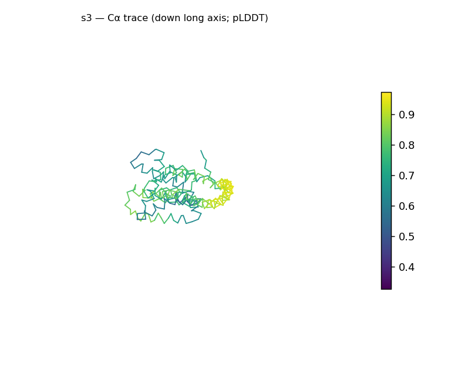
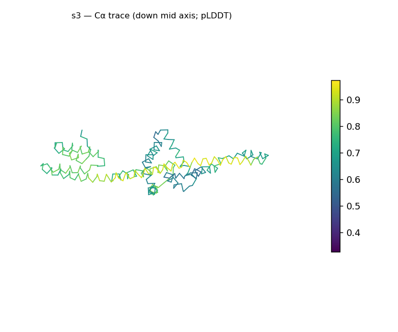
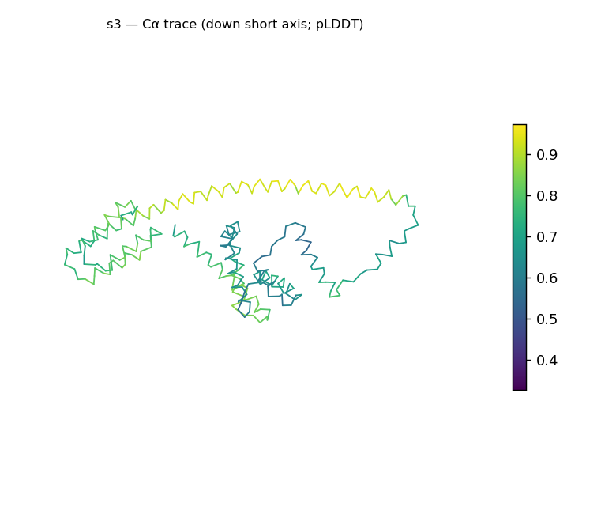
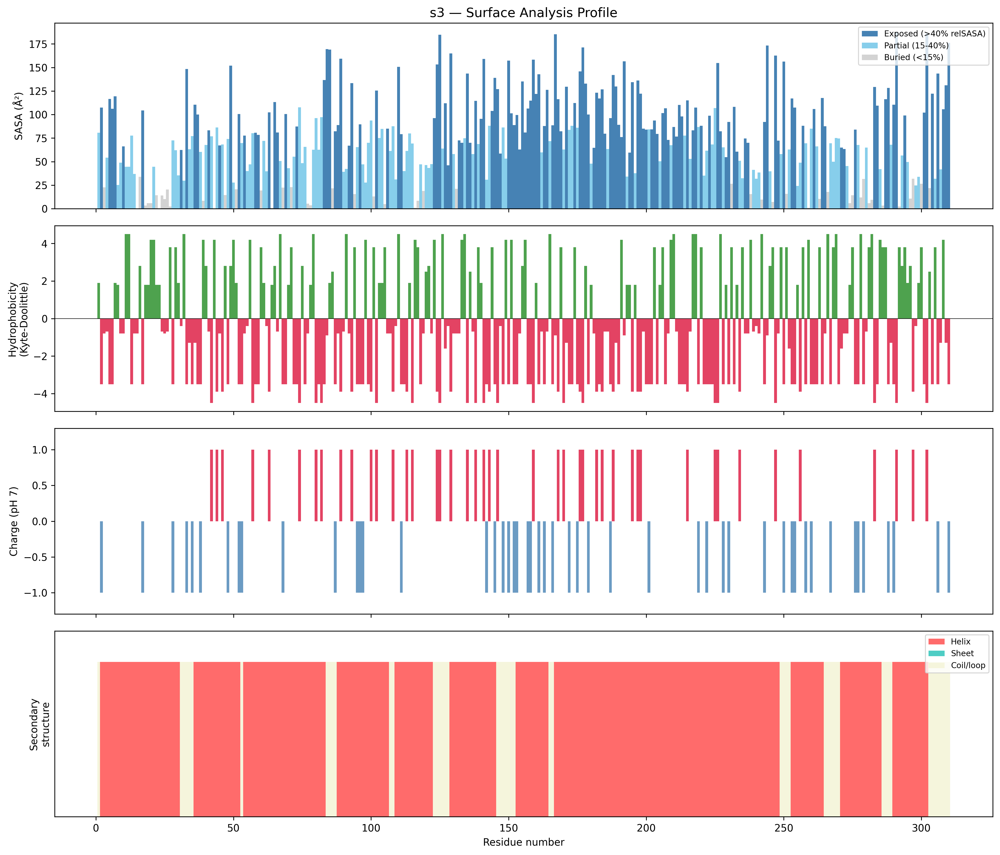
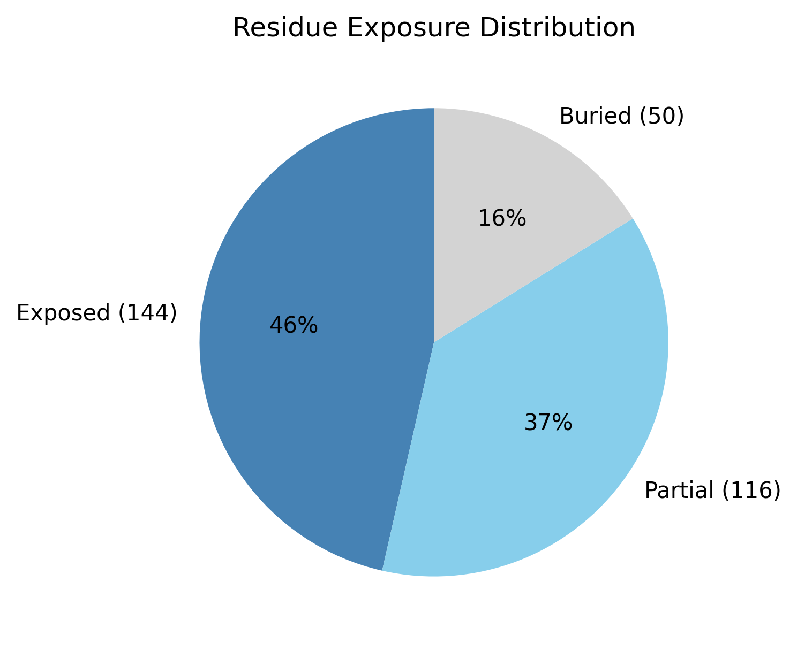

# Structural analysis — `s3`

> Facts are emitted deterministically from the measurement scripts. Sections marked with a SYNTHESIS comment are authored by the Claude session (judgment), kept visibly separate from the measured facts.

## Executive summary

`s3` is a single predicted chain of 310 residues (pLDDT in the B-factor column) with no missing residues and no ligands (metadata). It is overwhelmingly α-helical (83.9% helix, 0% sheet, 16.1% coil; pydssp), pointing to an all-α class architecture as inference. The chain is strongly elongated — prolate at asphericity 0.52, approximate dimensions 114.3 × 46.7 × 32.6 Å, with a radius of gyration (31.62 Å) above the ~24.8 Å expected for a compact protein of this length — and has a limited buried core (buried fraction 16.1%). The surface is moderately polar (mean Kyte–Doolittle -1.48) and essentially charge-balanced (net -1 e) despite a high content of charged residues (27 positive / 28 negative), with only a single short hydrophobic patch (residues 293–295). Overall confidence is modest and highly variable (pLDDT mean 67.15, std 17.36, range 32.73–97.23).

## User-provided context

No prior biological context provided.

## Structure overview

- **Source:** predicted model — pLDDT in the B-factor column
- **Chains:** 1 (single chain)
- **Residues / atoms:** 310 / 2512
- **Missing residues:** 0
- **Non-solvent ligands:** none
  - chain **A**: 310 res

## Structural views

_Cα backbone trace (Agent 2.2 matplotlib placeholder), down the long / mid / short principal axes; coloured by pLDDT._

## Shape & secondary structure

- **Shape:** prolate (elongated) (asphericity 0.52, Rg 31.62 Å)
- **Approx. dimensions:** 114.3 × 46.7 × 32.6 Å
- **Secondary structure:** helix 83.9%, sheet 0.0%, coil 16.1% _(method: pydssp)_
- **⚠ SS assigned by pydssp (fallback), not mkdssp** — pydssp is a simplified DSSP reimplementation and can over- or under-call short helix/sheet segments on imperfect (e.g. predicted) backbones. Treat fractions near the ~5% floor, the helix/sheet split, and any coil-vs-disorder reasoning as provisional; install mkdssp for reference-grade assignment.

## Surface properties

- **Exposure:** buried 16.1%, partial 37.4%, exposed 46.5%
- **Total SASA:** 23239.9 Ų
- **Surface hydrophobicity (KD):** mean -1.48 ± 2.9
- **Surface charge (pH 7):** net -1 e (27 +, 28 −)
- **Hydrophobic patches:** 1:
  - residues 293–295 (len 3, mean KD 2.83)

## Prediction quality / structural coherence

Confidence is **reported, never gated** — these signals are inputs for the synthesis below, not a pass/fail.

- **pLDDT (chain A):** mean 67.15, median 68.3, range 32.73–97.23, std 17.36
- **Compactness:** Rg 31.62 Å vs ~24.8 Å expected for 310 residues (2.5·N^0.4) — larger than expected
- **Core present:** buried fraction 16.1%
- **Coil fraction:** 16.1%

### Coherence assessment

The structure is unambiguously ordered yet only modestly confident, and the two signals must be read together. The coherence signals describe an extended helical body: 83.9% helix with just 16.1% coil (clearly not disordered), an elongated shape (Rg 31.62 Å vs ~24.8 Å expected), and a limited buried core (16.1%). Against this, the pLDDT is only in the low-confidence tier (mean 67.15) and highly heterogeneous (std 17.36, range 32.73–97.23) — some segments are predicted very confidently (up to 97), others poorly. So the ordered-fold signals and the confidence score do not fully agree: the chain is plainly helical and ordered, but the prediction is uncertain in places. Per the interpretation guide, low pLDDT does not by itself indicate disorder; this combination of modest mean and high variance is the expected signature of a low-homology target folded without an MSA, where individual helices may be well-defined while their relative arrangement is less certain.

## Expected-parameter comparison

_No expected-parameter profile supplied — this is the default for novel / low-homology targets. See the independent observations below._

## Independent observations

Against generic globular baselines, the buried fraction (16.1%) is well below the typical 40–55%, while the chain is almost entirely in defined secondary structure (only 16.1% coil) — the limited core therefore reflects an extended helical arrangement, not a lack of folding; the Rg (31.62 Å) is ~1.3× the size-matched expectation (≈24.8 Å). The surface carries an unusually high count of charged residues (27 positive, 28 negative) yet a net charge of essentially zero (-1 e), so any electrostatic asymmetry would arise from their spatial arrangement (not measured here) rather than from a net excess — distinguishing it from a simple highly charged surface. With one short hydrophobic patch (residues 293–295) and a moderately polar mean surface (KD -1.48), the exterior is otherwise unremarkable for a soluble protein. The helix-dominant content, elongated shape, and modest buried core are mutually consistent (no fold-class contradiction), though the pydssp caveat together with the high pLDDT variance means the helix boundaries and inter-helix geometry are provisional. This is structural description only; there is insufficient structural evidence to assign function.

## Methods

- **Measurements (deterministic):** `parse_structure.py` (metadata, confidence stats), `surface_analysis.py` (Shrake–Rupley SASA, Kyte–Doolittle hydrophobicity, charge at pH 7, DSSP secondary structure, shape metrics), `render_trace.py` (Agent 2.2 Cα-trace figures; `render_views.py` Mol* cartoons when Agent 2.1 is available).
- **Report facts** below the synthesis sections are emitted verbatim from the above scripts' JSON by `assemble_report.py` — no transcription.
- **Synthesis** sections (executive summary, independent observations incl. the one-line scope statement, coherence assessment) are authored by Claude per `SKILL.md` Step 9, each claim cited to a measurement.
