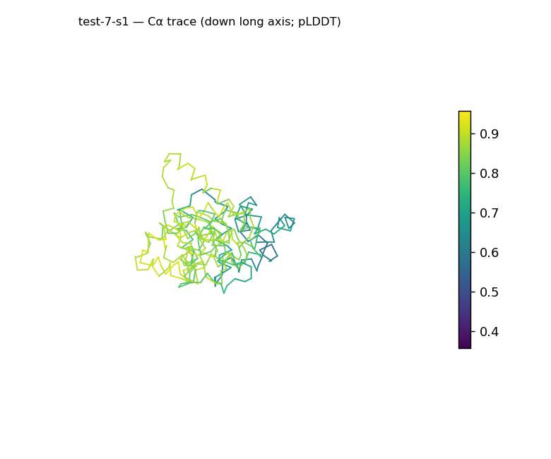
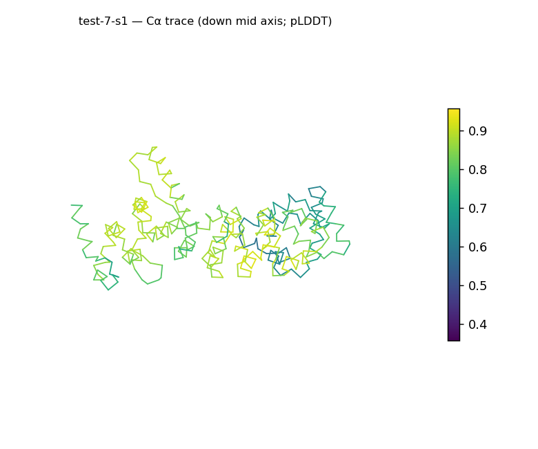
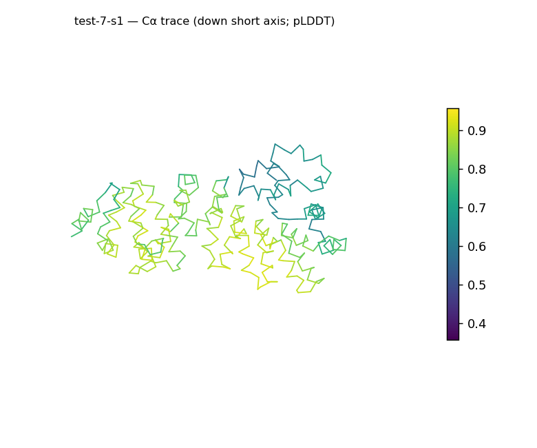
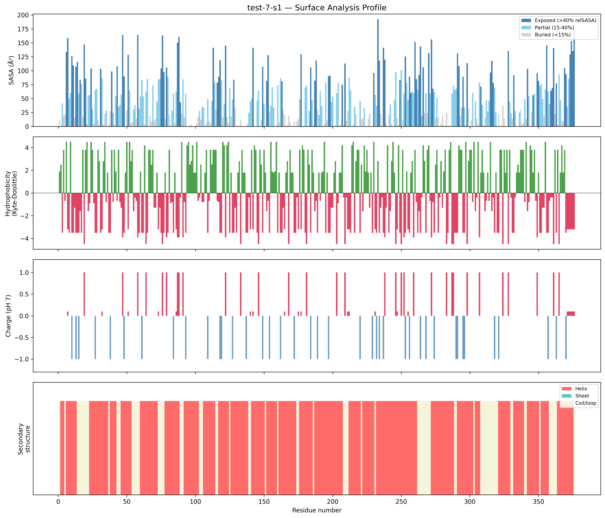
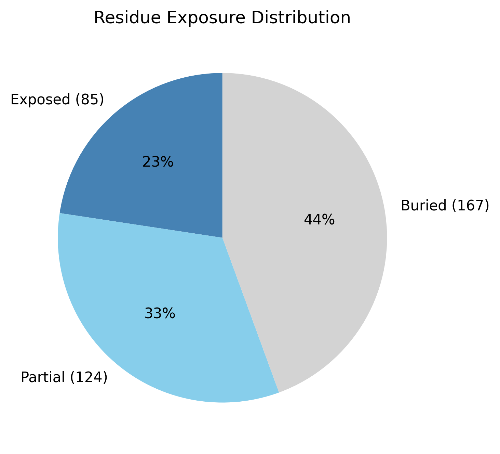

# Structural analysis — `test-7-s1`

> Facts are emitted deterministically from the measurement scripts. Sections marked with a SYNTHESIS comment are authored by the Claude session (judgment), kept visibly separate from the measured facts.

## Executive summary

`test-7-s1` is a 376-residue single chain (`parse_structure.py`) that adopts an elongated, predominantly α-helical architecture: secondary-structure content is 77.1% helix with 0.0% sheet (`surface_analysis.py`, pydssp), and the shape is prolate (asphericity 0.41, long axis 81.3 Å, Rg 24.7 Å). A defined core is present (44.4% buried) and the surface is moderately polar and essentially charge-neutral (mean Kyte–Doolittle −1.59, net −0.2 e). The model is of confident quality overall (mean pLDDT 76.08, median 81.36), with only two short exposed hydrophobic patches (residues 112–114 and 155–157). The high helix fraction alongside an effectively absent sheet is consistent with an all-α structural class.

## User-provided context

No prior biological context provided.

## Structure overview

- **Source:** predicted model — pLDDT in the B-factor column
- **Chains:** 1 (single chain)
- **Residues / atoms:** 376 / 3011
- **Missing residues:** 0
- **Non-solvent ligands:** none
  - chain **A**: 376 res

## Structural views

_Cα backbone trace (Agent 2.2 matplotlib placeholder), down the long / mid / short principal axes; coloured by pLDDT._

## Shape & secondary structure

- **Shape:** prolate (elongated) (asphericity 0.41, Rg 24.7 Å)
- **Approx. dimensions:** 81.3 × 44 × 41.6 Å
- **Secondary structure:** helix 77.1%, sheet 0.0%, coil 22.9% _(method: pydssp)_
- **⚠ SS assigned by pydssp (fallback), not mkdssp** — pydssp is a simplified DSSP reimplementation and can over- or under-call short helix/sheet segments on imperfect (e.g. predicted) backbones. Treat fractions near the ~5% floor, the helix/sheet split, and any coil-vs-disorder reasoning as provisional; install mkdssp for reference-grade assignment.

## Surface properties

- **Exposure:** buried 44.4%, partial 33.0%, exposed 22.6%
- **Total SASA:** 17751 Ų
- **Surface hydrophobicity (KD):** mean -1.59 ± 2.91
- **Surface charge (pH 7):** net -0.2 e (23 +, 16 −)
- **Hydrophobic patches:** 2:
  - residues 112–114 (len 3, mean KD 3.37)
  - residues 155–157 (len 3, mean KD 2.73)

## Prediction quality / structural coherence

Confidence is **reported, never gated** — these signals are inputs for the synthesis below, not a pass/fail.

- **pLDDT (chain A):** mean 76.08, median 81.36, range 35.79–95.69, std 15.7
- **Compactness:** Rg 24.7 Å vs ~26.8 Å expected for 376 residues (2.5·N^0.4) — consistent
- **Core present:** buried fraction 44.4%
- **Coil fraction:** 22.9%

### Coherence assessment

The coherence signals agree with the confidence score. Mean pLDDT 76.08 (median 81.36) sits in the "confident" tier, and the structural signals are consistent with a coherent fold: Rg 24.7 Å against the ~26.8 Å expected for 376 residues, a buried fraction of 44.4% (a genuine packed core), and a low coil fraction of 22.9%. The pLDDT range extends down to 35.79 (std 15.7), indicating a minority of low-confidence positions — expected at termini and loops — but the central tendency together with the compact, well-cored geometry indicates the fold itself is coherent rather than uncertain.

## Expected-parameter comparison

_No expected-parameter profile supplied — this is the default for novel / low-homology targets. See the independent observations below._

## Independent observations

Two features stand out against a generic globular baseline. First, the shape is markedly prolate (asphericity 0.41, long:mid axis ratio 5.37, long axis 81.3 Å) even though Rg (24.7 Å) matches the 2.5·N^0.4 globular expectation (~26.8 Å): the chain is compact across its short axes but extended along one — an elongated rather than spherical globular body. Second, the secondary structure is almost entirely helical (77.1% helix, 0.0% sheet; `surface_analysis.py`/pydssp), and that all-helical signal is internally consistent with the elongated shape, as elongated all-α bodies are common. The surface is unremarkable relative to baseline: moderately polar (mean KD −1.59, within the −2.0 to −0.5 enzyme-like band) and near-neutral (net −0.2 e), exposing only two short 3-residue hydrophobic patches. Per the report's pydssp caveat the exact helix percentage is provisional, but the helix-dominant / sheet-absent pattern is robust. This is structural description only — not an identity, fold-name, or function call — and the measurements are insufficient structural evidence to assign function.

## Methods

- **Measurements (deterministic):** `parse_structure.py` (metadata, confidence stats), `surface_analysis.py` (Shrake–Rupley SASA, Kyte–Doolittle hydrophobicity, charge at pH 7, DSSP secondary structure, shape metrics), `render_trace.py` (Agent 2.2 Cα-trace figures; `render_views.py` Mol* cartoons when Agent 2.1 is available).
- **Report facts** below the synthesis sections are emitted verbatim from the above scripts' JSON by `assemble_report.py` — no transcription.
- **Synthesis** sections (executive summary, independent observations incl. the one-line scope statement, coherence assessment) are authored by Claude per `SKILL.md` Step 9, each claim cited to a measurement.
