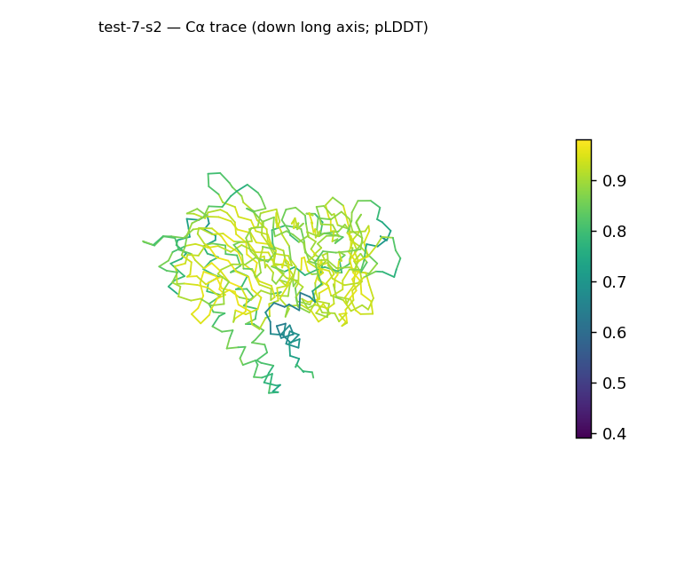
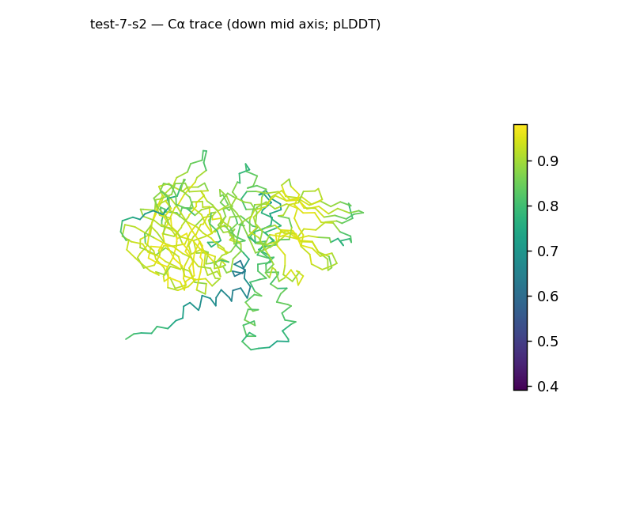
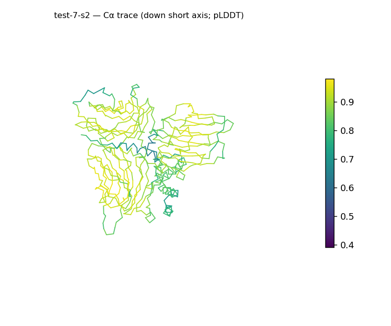
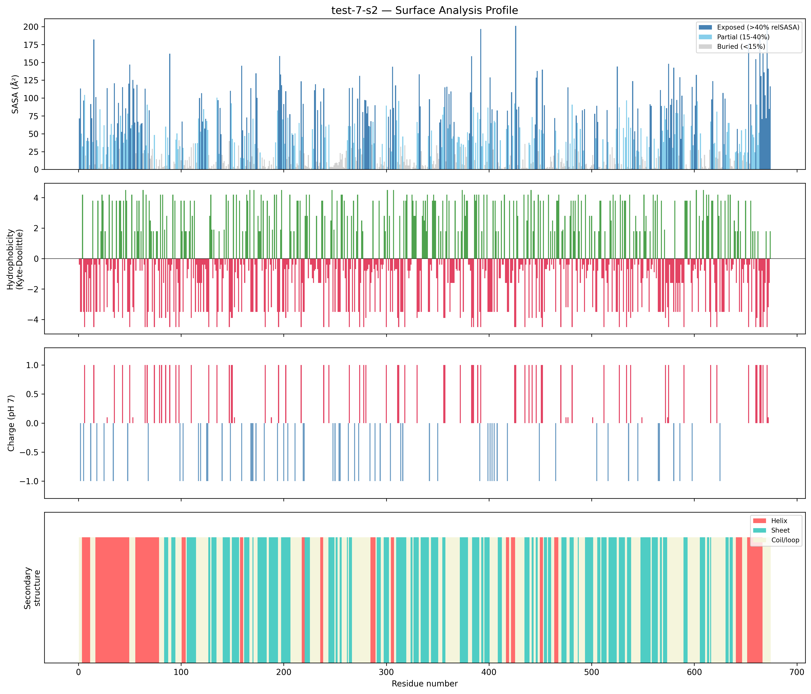
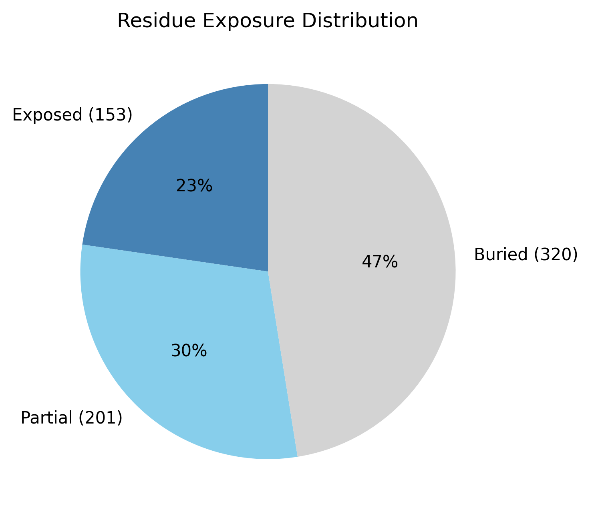

# Structural analysis — `test-7-s2`

> Facts are emitted deterministically from the measurement scripts. Sections marked with a SYNTHESIS comment are authored by the Claude session (judgment), kept visibly separate from the measured facts.

## Executive summary

`test-7-s2` is a large 674-residue single chain (`parse_structure.py`) that is spherical and notably compact: asphericity 0.05 with near-equal axes (75.9 × 71.1 × 59.8 Å) and Rg 25.23 Å against the ~33.8 Å expected for its length (`surface_analysis.py`). Both secondary-structure types are present with sheet predominant (38.4% sheet, 17.8% helix, 43.8% coil; pydssp), consistent with a mixed α/β or α+β class. It has a well-defined core (47.5% buried) and a moderately polar, mildly cationic surface (mean Kyte–Doolittle −1.39, net +5.4 e), with a single short exposed hydrophobic patch (residues 57–59). Model confidence is high (mean pLDDT 82.75, median 86.52).

## User-provided context

No prior biological context provided.

## Structure overview

- **Source:** predicted model — pLDDT in the B-factor column
- **Chains:** 1 (single chain)
- **Residues / atoms:** 674 / 5169
- **Missing residues:** 0
- **Non-solvent ligands:** none
  - chain **A**: 674 res

## Structural views

_Cα backbone trace (Agent 2.2 matplotlib placeholder), down the long / mid / short principal axes; coloured by pLDDT._

## Shape & secondary structure

- **Shape:** spherical/globular (asphericity 0.05, Rg 25.23 Å)
- **Approx. dimensions:** 75.9 × 71.1 × 59.8 Å
- **Secondary structure:** helix 17.8%, sheet 38.4%, coil 43.8% _(method: pydssp)_
- **⚠ SS assigned by pydssp (fallback), not mkdssp** — pydssp is a simplified DSSP reimplementation and can over- or under-call short helix/sheet segments on imperfect (e.g. predicted) backbones. Treat fractions near the ~5% floor, the helix/sheet split, and any coil-vs-disorder reasoning as provisional; install mkdssp for reference-grade assignment.

## Surface properties

- **Exposure:** buried 47.5%, partial 29.8%, exposed 22.7%
- **Total SASA:** 28816.7 Ų
- **Surface hydrophobicity (KD):** mean -1.39 ± 2.68
- **Surface charge (pH 7):** net 5.4 e (30 +, 21 −)
- **Hydrophobic patches:** 1:
  - residues 57–59 (len 3, mean KD 3.13)

## Prediction quality / structural coherence

Confidence is **reported, never gated** — these signals are inputs for the synthesis below, not a pass/fail.

- **pLDDT (chain A):** mean 82.75, median 86.52, range 39.03–98.02, std 12.3
- **Compactness:** Rg 25.23 Å vs ~33.8 Å expected for 674 residues (2.5·N^0.4) — consistent
- **Core present:** buried fraction 47.5%
- **Coil fraction:** 43.8%

### Coherence assessment

The signals agree with — and reinforce — the high confidence score. Mean pLDDT 82.75 (median 86.52) is in the upper "confident" range, and the geometry is strongly coherent: Rg 25.23 Å is well below the ~33.8 Å globular expectation for 674 residues, pointing to tight packing rather than an extended chain, and the buried fraction is 47.5% (a substantial core). The coil fraction is high at 43.8%, but the report's pydssp caveat notes coil can be over-called on predicted backbones; the compact, well-cored, spherical body is consistent with a coherent fold at this confidence level.

## Expected-parameter comparison

_No expected-parameter profile supplied — this is the default for novel / low-homology targets. See the independent observations below._

## Independent observations

The most notable feature against a generic globular baseline is compactness: for 674 residues the expected Rg is ~33.8 Å, yet the measured Rg is 25.23 Å (`surface_analysis.py`) and the body is near-spherical (asphericity 0.05, long:short axis ratio 2.3) — unusually dense packing for a chain this large, the kind of pattern seen when a multi-domain chain folds back on itself. The exposure distribution (47.5% buried / 29.8% partial / 22.7% exposed) is within normal globular ranges. Secondary structure has both helix and sheet above the presence floor with sheet predominant (38.4% vs 17.8%; pydssp), consistent with a mixed class; whether the strands and helices are interleaved (α/β) or segregated (α+β) cannot be resolved from content fractions alone. The surface is moderately polar (mean KD −1.39) and only mildly positive (net +5.4 e, 30 +/21 −) — not strong enough against baseline to flag as a charge-driven binding surface. No internal inconsistencies among the signals. This is structural description only; the measurements are insufficient structural evidence to assign function.

## Methods

- **Measurements (deterministic):** `parse_structure.py` (metadata, confidence stats), `surface_analysis.py` (Shrake–Rupley SASA, Kyte–Doolittle hydrophobicity, charge at pH 7, DSSP secondary structure, shape metrics), `render_trace.py` (Agent 2.2 Cα-trace figures; `render_views.py` Mol* cartoons when Agent 2.1 is available).
- **Report facts** below the synthesis sections are emitted verbatim from the above scripts' JSON by `assemble_report.py` — no transcription.
- **Synthesis** sections (executive summary, independent observations incl. the one-line scope statement, coherence assessment) are authored by Claude per `SKILL.md` Step 9, each claim cited to a measurement.
