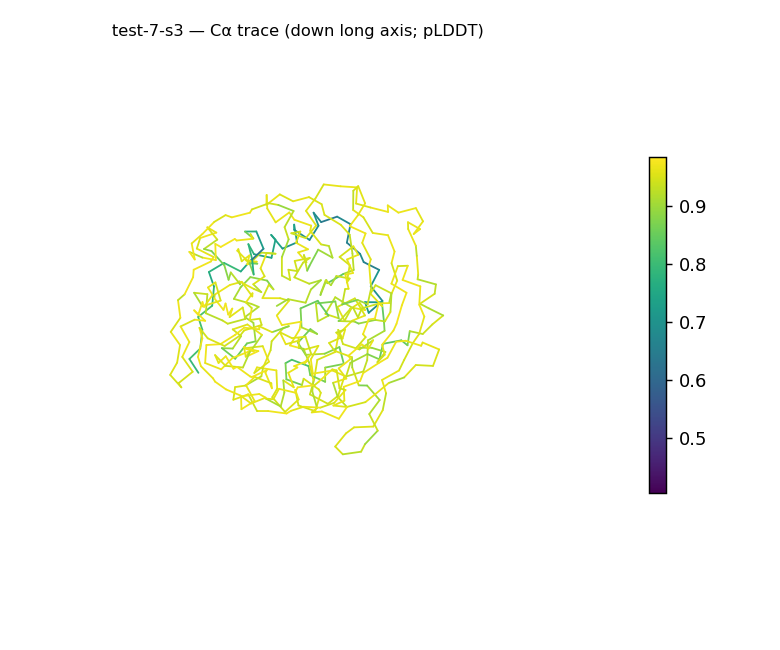
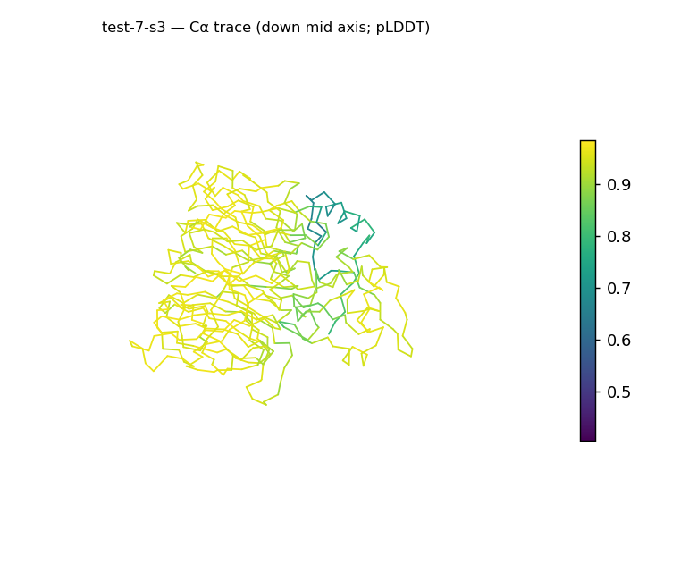
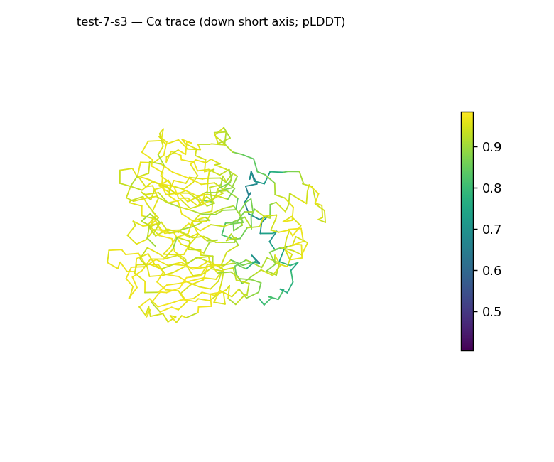
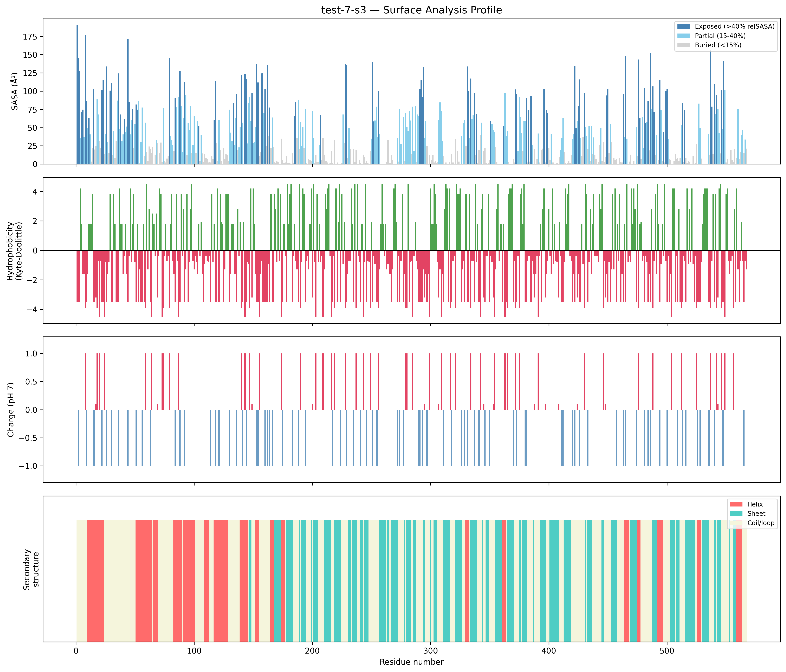
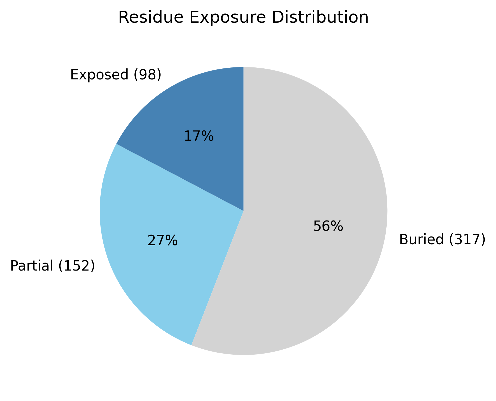

# Structural analysis — `test-7-s3`

> Facts are emitted deterministically from the measurement scripts. Sections marked with a SYNTHESIS comment are authored by the Claude session (judgment), kept visibly separate from the measured facts.

## Executive summary

`test-7-s3` is a 567-residue single chain (`parse_structure.py`) forming a very spherical, compact body (asphericity 0.01, near-equal axes 61.4 × 54 × 53.6 Å, Rg 21.88 Å vs ~31.6 Å expected; `surface_analysis.py`) with a tightly packed core (55.9% buried). Both secondary-structure types are present with sheet predominant (32.8% sheet, 18.9% helix, 48.3% coil; pydssp), consistent with a mixed α/β or α+β class. The standout feature is a strongly electronegative surface — net −25.9 e (15 +, 40 −) with a highly polar mean Kyte–Doolittle of −2.2 — by a wide margin the most charged surface in this set. It is also the highest-confidence model of the batch (mean pLDDT 90.23, median 94.12).

## User-provided context

No prior biological context provided.

## Structure overview

- **Source:** predicted model — pLDDT in the B-factor column
- **Chains:** 1 (single chain)
- **Residues / atoms:** 567 / 4400
- **Missing residues:** 0
- **Non-solvent ligands:** none
  - chain **A**: 567 res

## Structural views

_Cα backbone trace (Agent 2.2 matplotlib placeholder), down the long / mid / short principal axes; coloured by pLDDT._

## Shape & secondary structure

- **Shape:** spherical/globular (asphericity 0.01, Rg 21.88 Å)
- **Approx. dimensions:** 61.4 × 54 × 53.6 Å
- **Secondary structure:** helix 18.9%, sheet 32.8%, coil 48.3% _(method: pydssp)_
- **⚠ SS assigned by pydssp (fallback), not mkdssp** — pydssp is a simplified DSSP reimplementation and can over- or under-call short helix/sheet segments on imperfect (e.g. predicted) backbones. Treat fractions near the ~5% floor, the helix/sheet split, and any coil-vs-disorder reasoning as provisional; install mkdssp for reference-grade assignment.

## Surface properties

- **Exposure:** buried 55.9%, partial 26.8%, exposed 17.3%
- **Total SASA:** 20594.8 Ų
- **Surface hydrophobicity (KD):** mean -2.2 ± 2.08
- **Surface charge (pH 7):** net -25.9 e (15 +, 40 −)
- **Hydrophobic patches:** 1:
  - residues 37–39 (len 3, mean KD 2.6)

## Prediction quality / structural coherence

Confidence is **reported, never gated** — these signals are inputs for the synthesis below, not a pass/fail.

- **pLDDT (chain A):** mean 90.23, median 94.12, range 40.61–98.35, std 10.76
- **Compactness:** Rg 21.88 Å vs ~31.6 Å expected for 567 residues (2.5·N^0.4) — consistent
- **Core present:** buried fraction 55.9%
- **Coil fraction:** 48.3%

### Coherence assessment

The coherence signals strongly agree with the confidence score — this is the most confident model in the batch (mean pLDDT 90.23, median 94.12, "high" tier). Every structural signal points the same way: Rg 21.88 Å is well below the ~31.6 Å globular expectation (compact), the buried fraction is 55.9% (a tight core, at the upper end of the normal globular range), and the body is essentially spherical (asphericity 0.01). The 48.3% coil fraction is high but subject to the pydssp over-call caveat; it does not undercut the otherwise uniformly coherent, high-confidence picture.

## Expected-parameter comparison

_No expected-parameter profile supplied — this is the default for novel / low-homology targets. See the independent observations below._

## Independent observations

The dominant deviation from baseline is electrostatic: net surface charge is −25.9 e with 40 negative versus 15 positive residues, and mean surface hydrophobicity is −2.2 (`surface_analysis.py`) — at or below the −2.0 mark the interpretation guide associates with a highly polar/charged surface, and by a wide margin the most charged surface measured in this set. Against generic baselines such a strong net-negative surface is the kind of feature associated with cation interaction or repulsion of like-charged partners, though this run carries no evidence to choose among those. Geometrically the protein is unusually compact and spherical for 567 residues (Rg 21.88 Å vs ~31.6 Å expected; asphericity 0.01) with a dense core (55.9% buried) and only 17.3% exposed — below the typical 25–35% exposed band. SS is mixed with sheet predominant (32.8% vs 18.9% helix; pydssp), the interleaved-vs-segregated distinction not resolvable from fractions. No internal inconsistencies among the signals. This is structural description only; the measurements are insufficient structural evidence to assign function.

## Methods

- **Measurements (deterministic):** `parse_structure.py` (metadata, confidence stats), `surface_analysis.py` (Shrake–Rupley SASA, Kyte–Doolittle hydrophobicity, charge at pH 7, DSSP secondary structure, shape metrics), `render_trace.py` (Agent 2.2 Cα-trace figures; `render_views.py` Mol* cartoons when Agent 2.1 is available).
- **Report facts** below the synthesis sections are emitted verbatim from the above scripts' JSON by `assemble_report.py` — no transcription.
- **Synthesis** sections (executive summary, independent observations incl. the one-line scope statement, coherence assessment) are authored by Claude per `SKILL.md` Step 9, each claim cited to a measurement.
