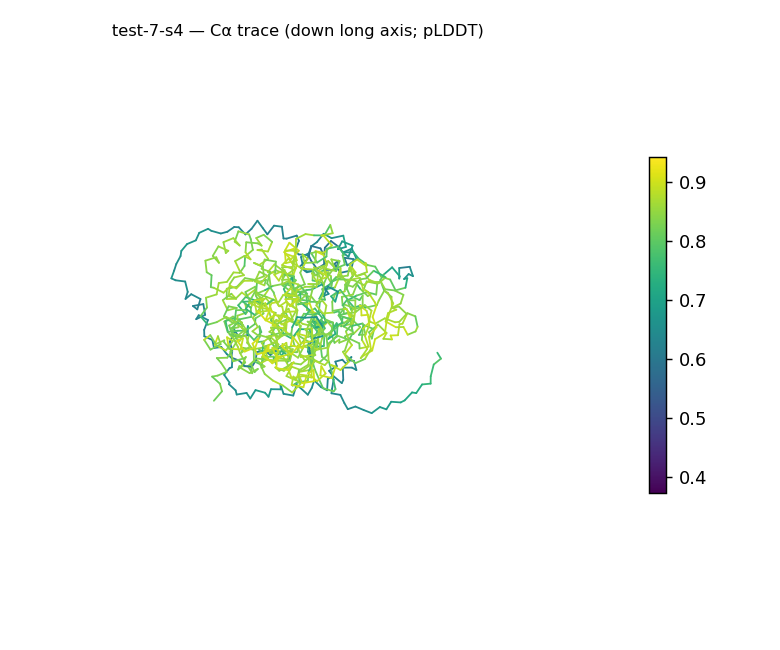
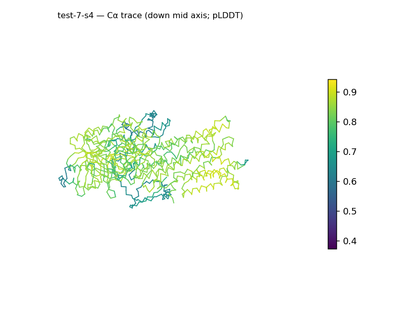
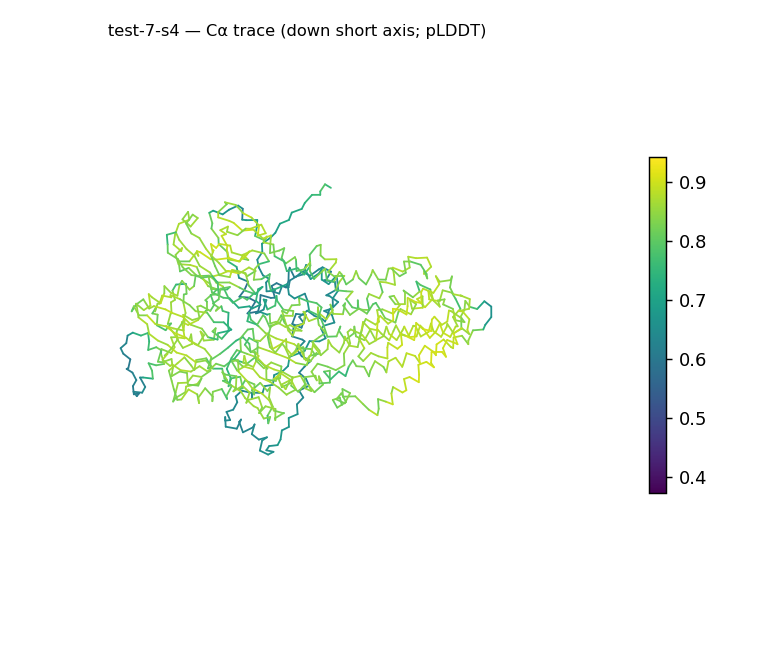
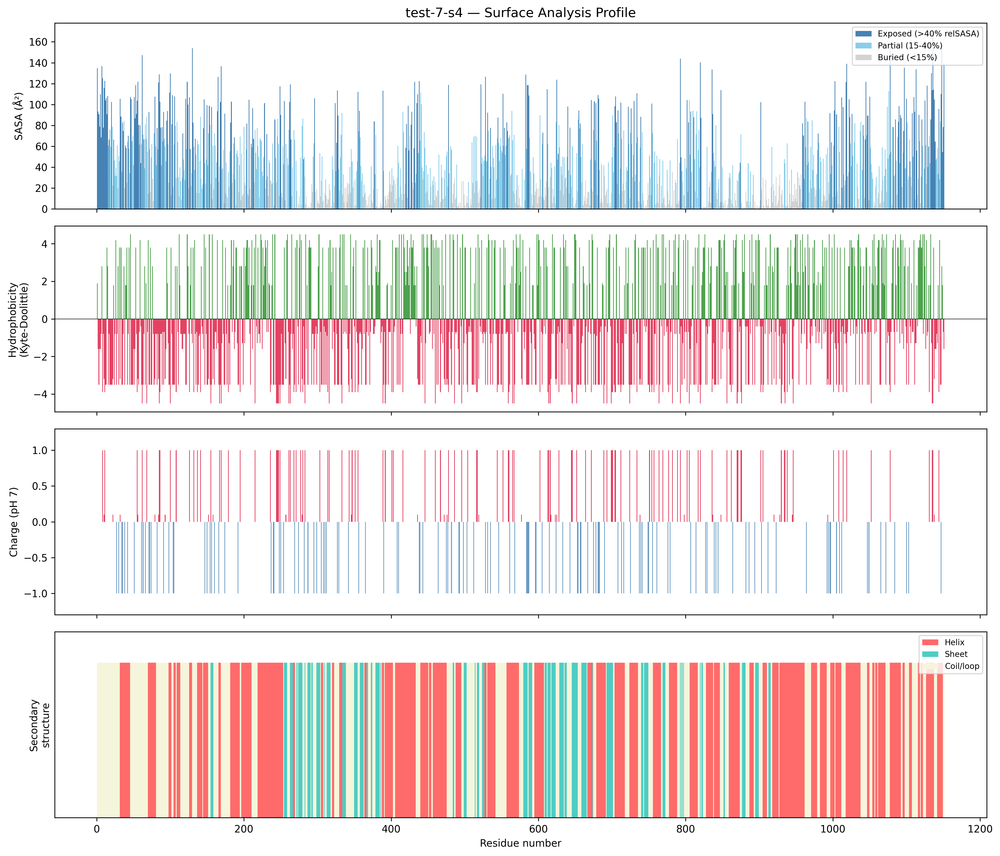
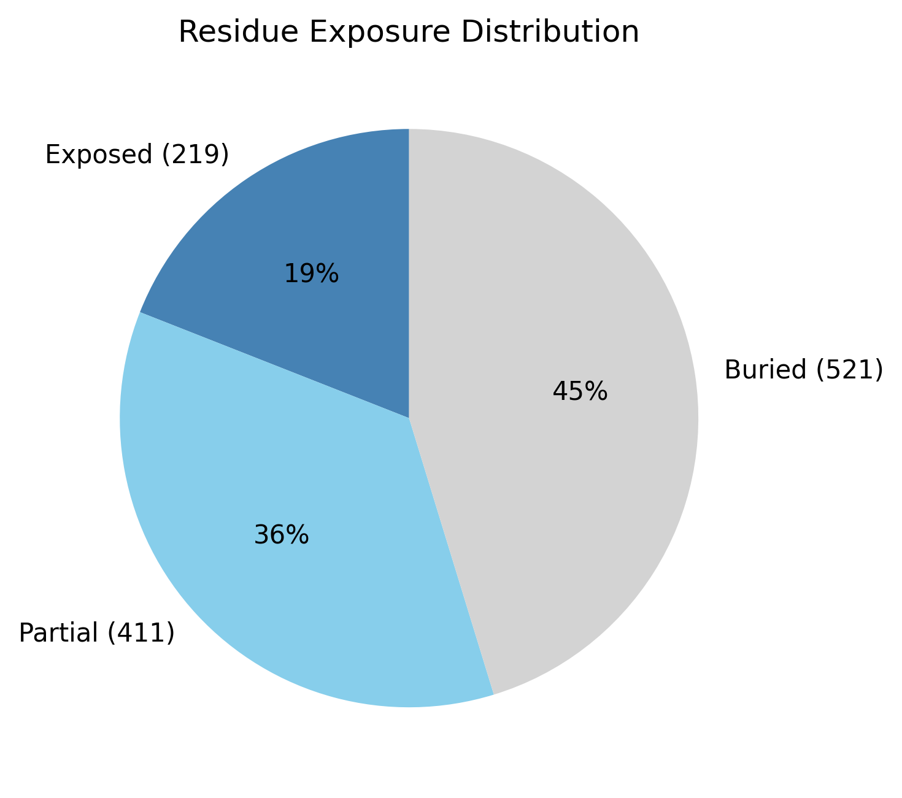

# Structural analysis — `test-7-s4`

> Facts are emitted deterministically from the measurement scripts. Sections marked with a SYNTHESIS comment are authored by the Claude session (judgment), kept visibly separate from the measured facts.

## Executive summary

`test-7-s4` is the largest target in the set, a 1151-residue single chain (`parse_structure.py`) with an elongated architecture (prolate, asphericity 0.22, long axis 113.2 Å, Rg 32.65 Å vs ~41.9 Å expected; `surface_analysis.py`). Both secondary-structure types are present with helix predominant (47.5% helix, 14.6% sheet, 37.9% coil; pydssp), consistent with a helix-rich mixed class. It retains a normal globular core (45.3% buried) and a moderately polar, near-neutral surface (mean Kyte–Doolittle −0.74, net +2.0 e), and it carries seven short exposed hydrophobic patches distributed along the length of the chain — the most of any structure here. Model confidence is in the confident tier (mean pLDDT 76.45, median 81.69).

## User-provided context

No prior biological context provided.

## Structure overview

- **Source:** predicted model — pLDDT in the B-factor column
- **Chains:** 1 (single chain)
- **Residues / atoms:** 1151 / 9164
- **Missing residues:** 0
- **Non-solvent ligands:** none
  - chain **A**: 1151 res

## Structural views

_Cα backbone trace (Agent 2.2 matplotlib placeholder), down the long / mid / short principal axes; coloured by pLDDT._

## Shape & secondary structure

- **Shape:** prolate (elongated) (asphericity 0.22, Rg 32.65 Å)
- **Approx. dimensions:** 113.2 × 82 × 58.8 Å
- **Secondary structure:** helix 47.5%, sheet 14.6%, coil 37.9% _(method: pydssp)_
- **⚠ SS assigned by pydssp (fallback), not mkdssp** — pydssp is a simplified DSSP reimplementation and can over- or under-call short helix/sheet segments on imperfect (e.g. predicted) backbones. Treat fractions near the ~5% floor, the helix/sheet split, and any coil-vs-disorder reasoning as provisional; install mkdssp for reference-grade assignment.

## Surface properties

- **Exposure:** buried 45.3%, partial 35.7%, exposed 19.0%
- **Total SASA:** 49085.3 Ų
- **Surface hydrophobicity (KD):** mean -0.74 ± 3.07
- **Surface charge (pH 7):** net 2.0 e (42 +, 31 −)
- **Hydrophobic patches:** 7:
  - residues 226–228 (len 3, mean KD 2.8)
  - residues 423–425 (len 3, mean KD 2.8)
  - residues 431–433 (len 3, mean KD 2.13)
  - residues 553–555 (len 3, mean KD 3.27)
  - residues 1025–1027 (len 3, mean KD 3.93)
  - residues 1088–1090 (len 3, mean KD 3.47)
  - residues 1120–1122 (len 3, mean KD 4.03)

## Prediction quality / structural coherence

Confidence is **reported, never gated** — these signals are inputs for the synthesis below, not a pass/fail.

- **pLDDT (chain A):** mean 76.45, median 81.69, range 37.21–94.13, std 14.27
- **Compactness:** Rg 32.65 Å vs ~41.9 Å expected for 1151 residues (2.5·N^0.4) — consistent
- **Core present:** buried fraction 45.3%
- **Coil fraction:** 37.9%

### Coherence assessment

The coherence signals agree with the confident pLDDT (mean 76.45, median 81.69). The geometry is consistent with an ordered chain: Rg 32.65 Å against the ~41.9 Å globular expectation (compact for its length), buried fraction 45.3% (a normal core), and a coil fraction of 37.9%. For a chain this large the pLDDT spread is wide (range 37.21–94.13, std 14.27), which is expected when a long multi-domain chain mixes well-ordered domains with lower-confidence linkers and termini, so whole-chain averages blend regions of differing confidence. The central tendency together with the packed core indicates the fold is coherent overall rather than globally uncertain.

## Expected-parameter comparison

_No expected-parameter profile supplied — this is the default for novel / low-homology targets. See the independent observations below._

## Independent observations

Against a generic globular baseline, size and elongation dominate. At 1151 residues this is the largest chain here and is moderately elongated (asphericity 0.22, long:short axis ratio 4.57, long axis 113.2 Å); combined with an Rg (32.65 Å) below the globular expectation (~41.9 Å), this combination — long overall extent but compact radius — is what a multi-domain "string" of packed domains looks like, as opposed to a single spherical domain. Consistent with the greater surface area, it exposes seven 3-residue hydrophobic patches spread from residue ~226 to ~1122 (`surface_analysis.py`), against one or zero in most other structures here; its surface is also the least polar of the set (mean KD −0.74, near the −0.5 mixed boundary) and has the largest hydrophobicity spread (std 3.07). SS is mixed and helix-predominant (47.5% vs 14.6% sheet; pydssp). No internal inconsistencies among the signals, beyond the expected caveat that whole-chain shape and SS metrics carry less meaning for a probable multi-domain chain. This is structural description only; the measurements are insufficient structural evidence to assign function.

## Methods

- **Measurements (deterministic):** `parse_structure.py` (metadata, confidence stats), `surface_analysis.py` (Shrake–Rupley SASA, Kyte–Doolittle hydrophobicity, charge at pH 7, DSSP secondary structure, shape metrics), `render_trace.py` (Agent 2.2 Cα-trace figures; `render_views.py` Mol* cartoons when Agent 2.1 is available).
- **Report facts** below the synthesis sections are emitted verbatim from the above scripts' JSON by `assemble_report.py` — no transcription.
- **Synthesis** sections (executive summary, independent observations incl. the one-line scope statement, coherence assessment) are authored by Claude per `SKILL.md` Step 9, each claim cited to a measurement.
