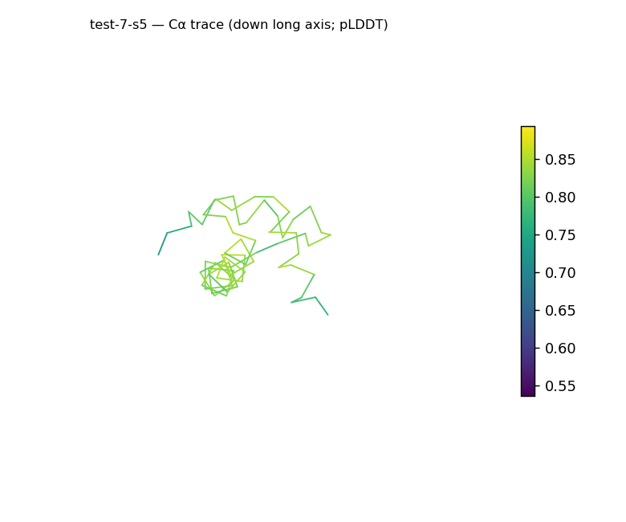
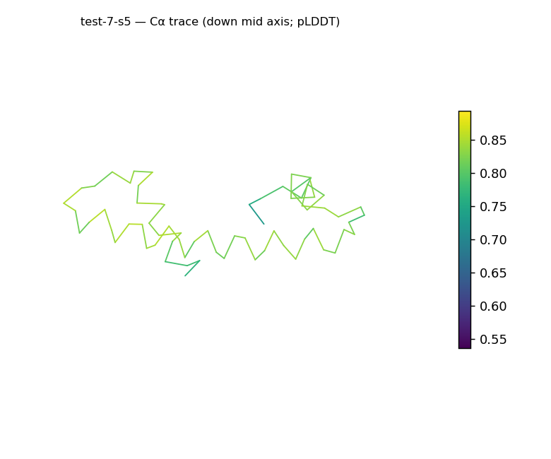
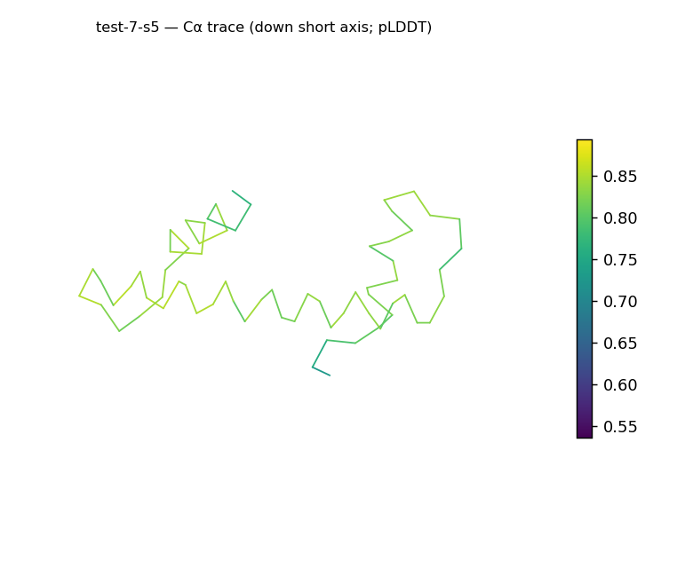
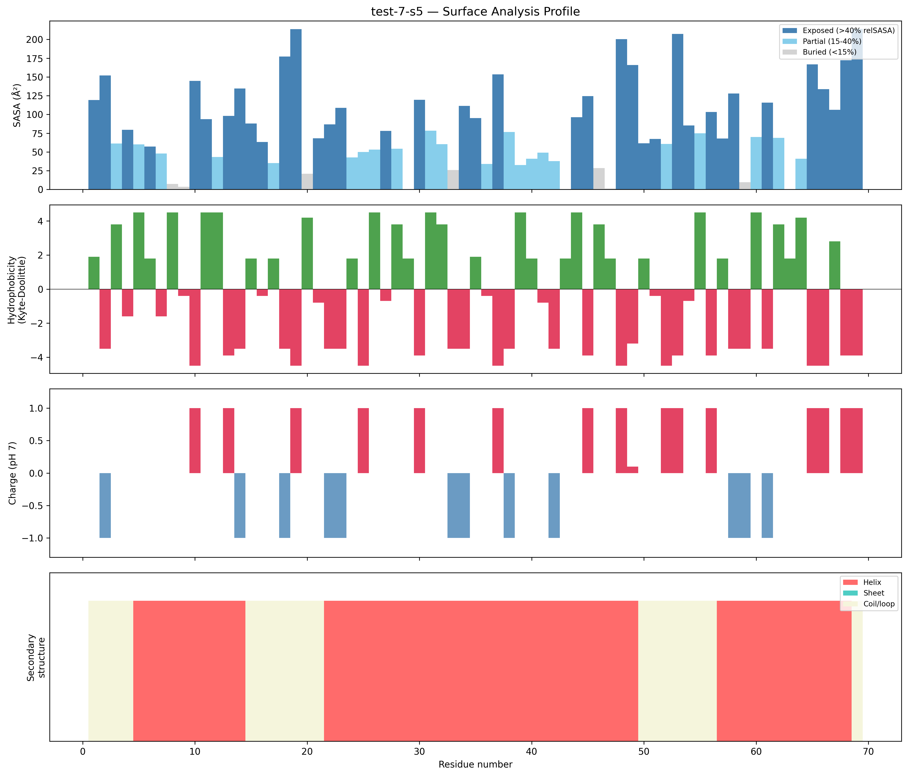
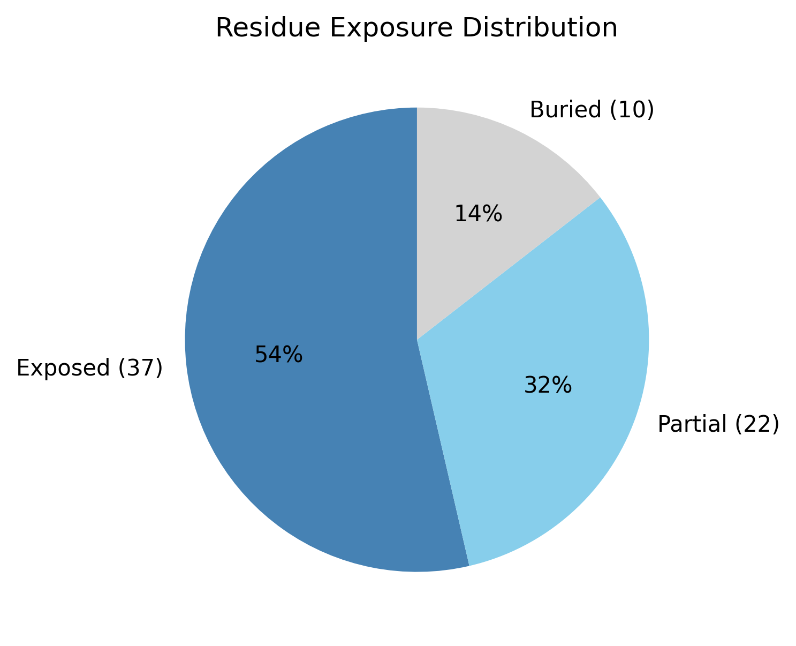

# Structural analysis — `test-7-s5`

> Facts are emitted deterministically from the measurement scripts. Sections marked with a SYNTHESIS comment are authored by the Claude session (judgment), kept visibly separate from the measured facts.

## Executive summary

`test-7-s5` is a small 69-residue single chain (`parse_structure.py`) forming a highly elongated, all-α-helical structure: 72.5% helix with 0.0% sheet (`surface_analysis.py`, pydssp) and a prolate shape (asphericity 0.48, long:short axis ratio 10.26, dimensions 45.9 × 22.6 × 16.2 Å). Its buried fraction is low (14.5%, with 53.6% exposed), but this reflects the thin, rod-like geometry of a small elongated helix rather than disorder — Rg (14.75 Å) matches the ~13.6 Å expected for 69 residues and helical content is high. The surface is moderately polar and mildly cationic (mean Kyte–Doolittle −1.82, net +5.1 e), with no exposed hydrophobic patches. Model confidence is solid and uniform (mean pLDDT 80.13, std 7.37, no residue below 53.58).

## User-provided context

No prior biological context provided.

## Structure overview

- **Source:** predicted model — pLDDT in the B-factor column
- **Chains:** 1 (single chain)
- **Residues / atoms:** 69 / 536
- **Missing residues:** 0
- **Non-solvent ligands:** none
  - chain **A**: 69 res

## Structural views

_Cα backbone trace (Agent 2.2 matplotlib placeholder), down the long / mid / short principal axes; coloured by pLDDT._

## Shape & secondary structure

- **Shape:** prolate (elongated) (asphericity 0.48, Rg 14.75 Å)
- **Approx. dimensions:** 45.9 × 22.6 × 16.2 Å
- **Secondary structure:** helix 72.5%, sheet 0.0%, coil 27.5% _(method: pydssp)_
- **⚠ SS assigned by pydssp (fallback), not mkdssp** — pydssp is a simplified DSSP reimplementation and can over- or under-call short helix/sheet segments on imperfect (e.g. predicted) backbones. Treat fractions near the ~5% floor, the helix/sheet split, and any coil-vs-disorder reasoning as provisional; install mkdssp for reference-grade assignment.

## Surface properties

- **Exposure:** buried 14.5%, partial 31.9%, exposed 53.6%
- **Total SASA:** 5730 Ų
- **Surface hydrophobicity (KD):** mean -1.82 ± 2.78
- **Surface charge (pH 7):** net 5.1 e (14 +, 8 −)
- **Hydrophobic patches:** 0

## Prediction quality / structural coherence

Confidence is **reported, never gated** — these signals are inputs for the synthesis below, not a pass/fail.

- **pLDDT (chain A):** mean 80.13, median 81.72, range 53.58–89.35, std 7.37
- **Compactness:** Rg 14.75 Å vs ~13.6 Å expected for 69 residues (2.5·N^0.4) — consistent
- **Core present:** buried fraction 14.5%
- **Coil fraction:** 27.5%

### Coherence assessment

First, the disorder check: the indicators do not converge on disorder. Although the buried fraction is low (14.5%, below the 30% mark the guide flags), the structure is 72.5% helix (not coil-dominated), Rg (14.75 Å) matches the globular expectation for 69 residues (~13.6 Å), and there are no missing residues — so the low burial is a consequence of the small, elongated single-domain geometry (high surface-to-volume), not intrinsic disorder. On confidence, the coherence signals agree with the score: mean pLDDT is 80.13 with a tight distribution (std 7.37, range 53.58–89.35, no very-low-confidence segments) and the coil fraction is low (27.5%). The fold reads as a coherent, well-predicted small helical structure.

## Expected-parameter comparison

_No expected-parameter profile supplied — this is the default for novel / low-homology targets. See the independent observations below._

## Independent observations

The notable features against baseline are geometric. The structure is the most elongated small protein here (asphericity 0.48, long:short axis ratio 10.26) and surface-dominated: 53.6% exposed and only 14.5% buried (`surface_analysis.py`), well outside the 40–55%-buried band typical of compact globular proteins. As covered in the coherence section, the correct reading is shape, not disorder — a 69-residue, 72.5%-helical body that is thin and elongated has little interior to bury, and its Rg still matches the size expectation (14.75 vs ~13.6 Å). SS is all-α (helix present, sheet absent at 0.0%; pydssp), with no inconsistency between that and the rod-like shape. The surface is moderately polar (mean KD −1.82) and modestly positive (net +5.1 e across only 69 residues). This is structural description only; the measurements are insufficient structural evidence to assign function.

## Methods

- **Measurements (deterministic):** `parse_structure.py` (metadata, confidence stats), `surface_analysis.py` (Shrake–Rupley SASA, Kyte–Doolittle hydrophobicity, charge at pH 7, DSSP secondary structure, shape metrics), `render_trace.py` (Agent 2.2 Cα-trace figures; `render_views.py` Mol* cartoons when Agent 2.1 is available).
- **Report facts** below the synthesis sections are emitted verbatim from the above scripts' JSON by `assemble_report.py` — no transcription.
- **Synthesis** sections (executive summary, independent observations incl. the one-line scope statement, coherence assessment) are authored by Claude per `SKILL.md` Step 9, each claim cited to a measurement.
