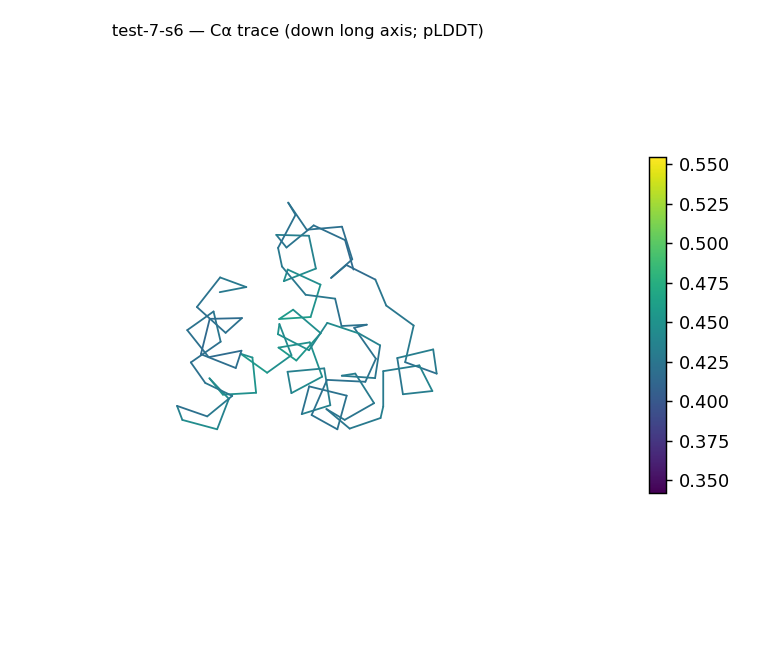
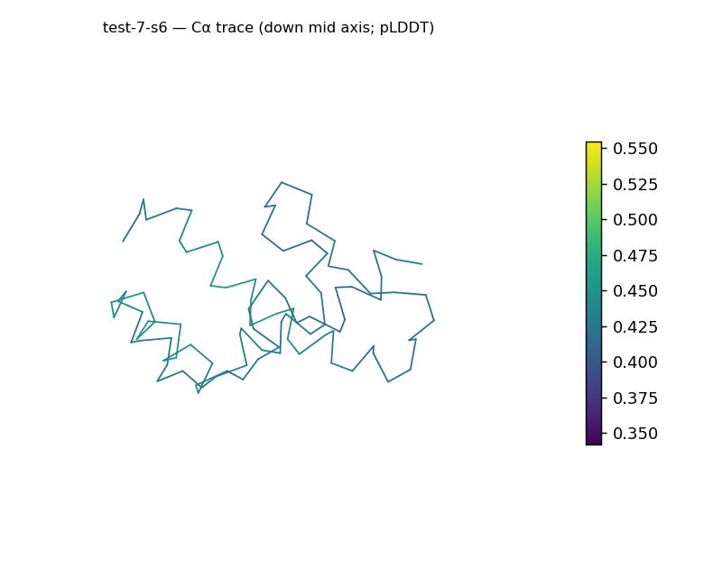
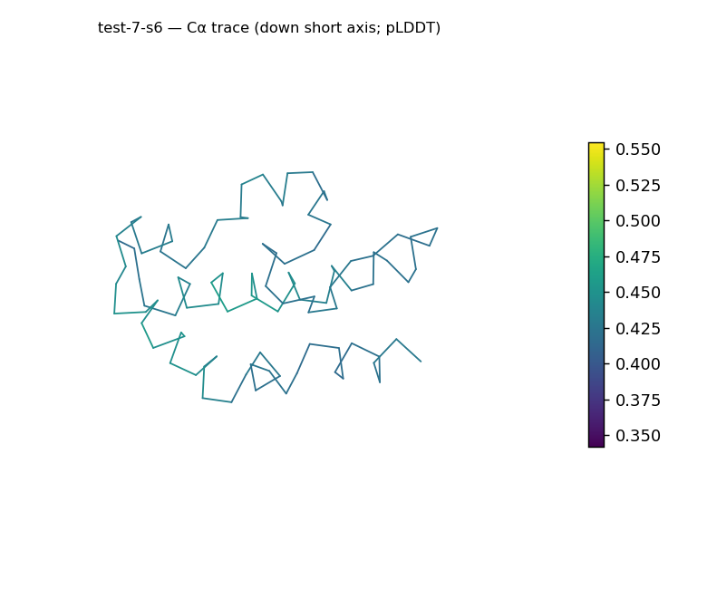
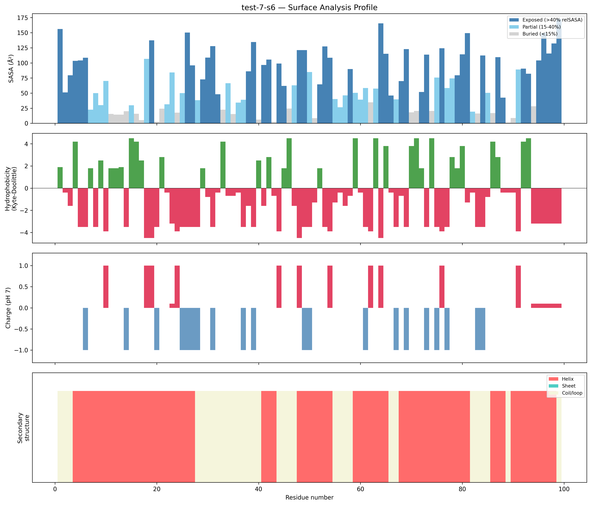
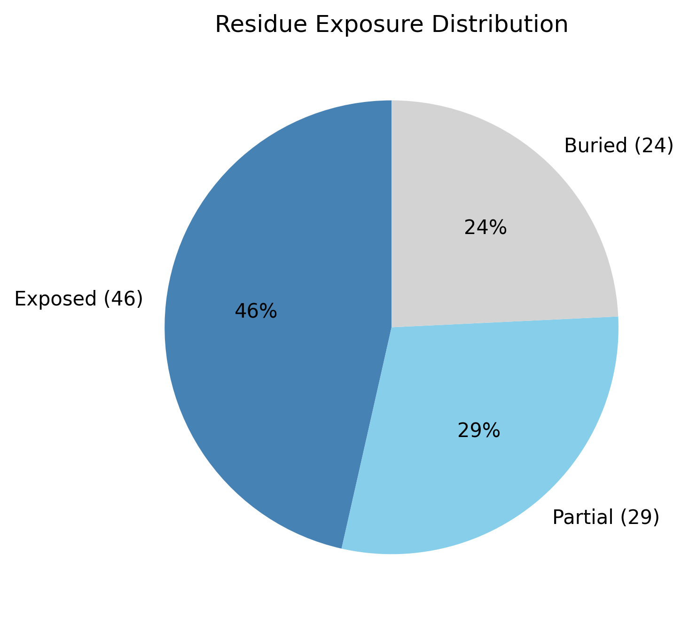

# Structural analysis — `test-7-s6`

> Facts are emitted deterministically from the measurement scripts. Sections marked with a SYNTHESIS comment are authored by the Claude session (judgment), kept visibly separate from the measured facts.

## Executive summary

`test-7-s6` is a 99-residue single chain (`parse_structure.py`) forming a roughly globular, all-α-helical structure: 67.7% helix with 0.0% sheet (`surface_analysis.py`, pydssp), asphericity 0.11 (dimensions 36.3 × 26.2 × 23.1 Å), and Rg (13.01 Å) consistent with the ~15.7 Å expected for its length. The surface is moderately polar and near-neutral (mean Kyte–Doolittle −1.14, net −2.5 e), with one short exposed hydrophobic patch (residues 78–80). Note that `parse_structure.py` classified this input as experimental (is_predicted false; the B-factor column is treated as crystallographic displacement, not pLDDT), which conflicts with the run-level provenance note labelling all inputs ESMFold-predicted — see the coherence section.

## User-provided context

No prior biological context provided.

## Structure overview

- **Source:** experimental
- **Chains:** 1 (single chain)
- **Residues / atoms:** 99 / 768
- **Missing residues:** 0
- **Non-solvent ligands:** none
  - chain **A**: 99 res

## Structural views

_Cα backbone trace (Agent 2.2 matplotlib placeholder), down the long / mid / short principal axes; coloured by pLDDT._

## Shape & secondary structure

- **Shape:** roughly globular (asphericity 0.11, Rg 13.01 Å)
- **Approx. dimensions:** 36.3 × 26.2 × 23.1 Å
- **Secondary structure:** helix 67.7%, sheet 0.0%, coil 32.3% _(method: pydssp)_
- **⚠ SS assigned by pydssp (fallback), not mkdssp** — pydssp is a simplified DSSP reimplementation and can over- or under-call short helix/sheet segments on imperfect (e.g. predicted) backbones. Treat fractions near the ~5% floor, the helix/sheet split, and any coil-vs-disorder reasoning as provisional; install mkdssp for reference-grade assignment.

## Surface properties

- **Exposure:** buried 24.2%, partial 29.3%, exposed 46.5%
- **Total SASA:** 6724.2 Ų
- **Surface hydrophobicity (KD):** mean -1.14 ± 2.81
- **Surface charge (pH 7):** net -2.5 e (11 +, 9 −)
- **Hydrophobic patches:** 1:
  - residues 78–80 (len 3, mean KD 2.8)

## Prediction quality / structural coherence

Confidence is **reported, never gated** — these signals are inputs for the synthesis below, not a pass/fail.

- **B-factor (chain A):** mean 41.87, median 40.35, range 34.19–55.44, std 5.46
- **Compactness:** Rg 13.01 Å vs ~15.7 Å expected for 99 residues (2.5·N^0.4) — consistent
- **Core present:** buried fraction 24.2%
- **Coil fraction:** 32.3%

### Coherence assessment

This structure was detected as experimental (`parse_structure.py`: is_predicted false, bfactor_is_plddt false), so there is no pipeline-generated pLDDT to assess and confidence reasoning is omitted; the reported B-factor (mean 41.87, range 34.19–55.44) is an experimental displacement parameter, and with no resolution recorded it is not interpreted further here. ⚠ This contradicts the run provenance note ("Pipeline-predicted by Agents 0/1 … pLDDT is in the B-factor column") — flagging the discrepancy for the user. On structure alone the body is coherent: Rg 13.01 Å matches the ~15.7 Å size expectation, helix content is high (67.7%) and coil low (32.3%); the buried fraction (24.2%) is modest but consistent with a small 99-residue helical domain rather than indicating disorder.

## Expected-parameter comparison

_No expected-parameter profile supplied — this is the default for novel / low-homology targets. See the independent observations below._

## Independent observations

Against baseline this is a compact, conventional small helical body: asphericity 0.11 (roughly globular) with Rg 13.01 Å in line with the ~15.7 Å size expectation. The buried fraction (24.2%) sits below the 40–55% globular band and exposed is high (46.5%), but for a 99-residue all-α domain this is the expected surface-to-volume effect, not a disorder signal — and the disorder indicators do not converge (helix 67.7%, no missing residues, compact Rg). SS is all-α (sheet 0.0%; pydssp). The surface is moderately polar (mean KD −1.14) and near-neutral (net −2.5 e). The one genuine inconsistency to flag is provenance, not geometry: per-file detection calls this experimental while the run note calls it predicted (see coherence). This is structural description only; the measurements are insufficient structural evidence to assign function.

## Methods

- **Measurements (deterministic):** `parse_structure.py` (metadata, confidence stats), `surface_analysis.py` (Shrake–Rupley SASA, Kyte–Doolittle hydrophobicity, charge at pH 7, DSSP secondary structure, shape metrics), `render_trace.py` (Agent 2.2 Cα-trace figures; `render_views.py` Mol* cartoons when Agent 2.1 is available).
- **Report facts** below the synthesis sections are emitted verbatim from the above scripts' JSON by `assemble_report.py` — no transcription.
- **Synthesis** sections (executive summary, independent observations incl. the one-line scope statement, coherence assessment) are authored by Claude per `SKILL.md` Step 9, each claim cited to a measurement.
