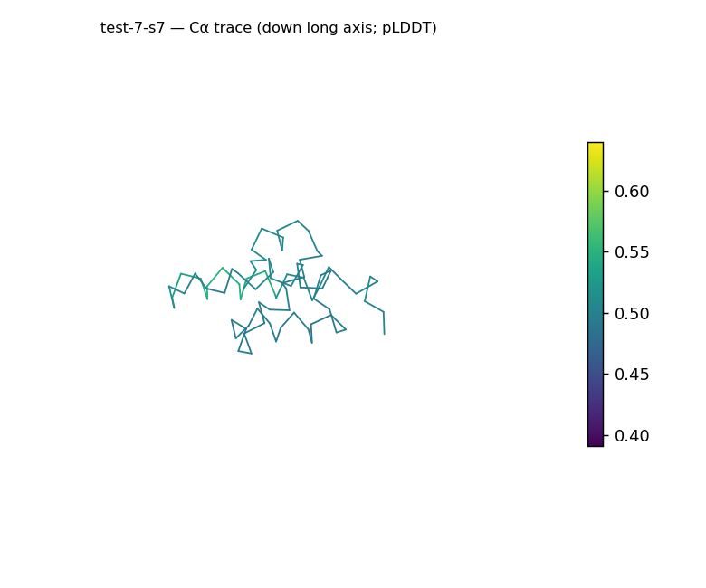
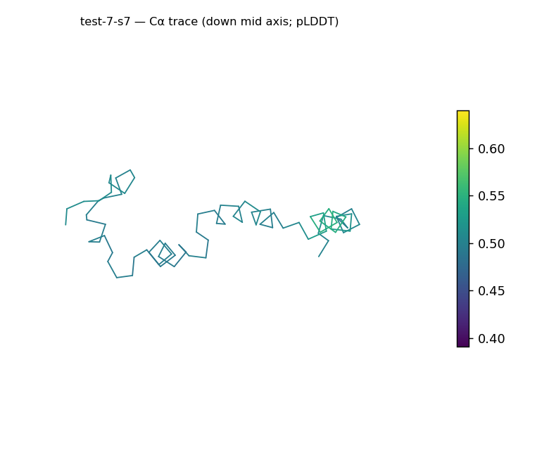
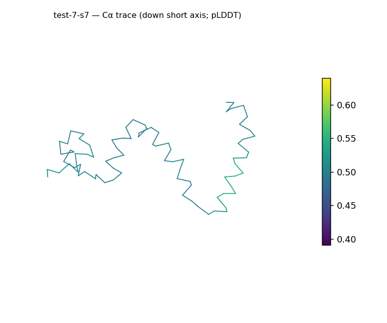
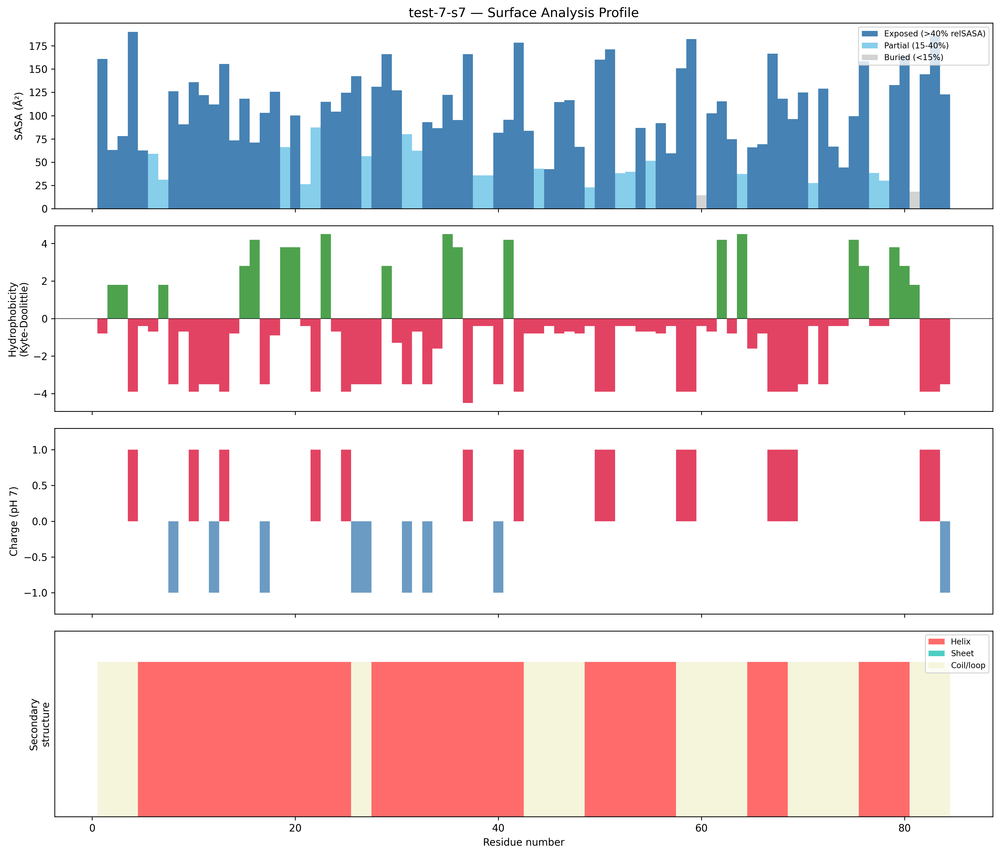
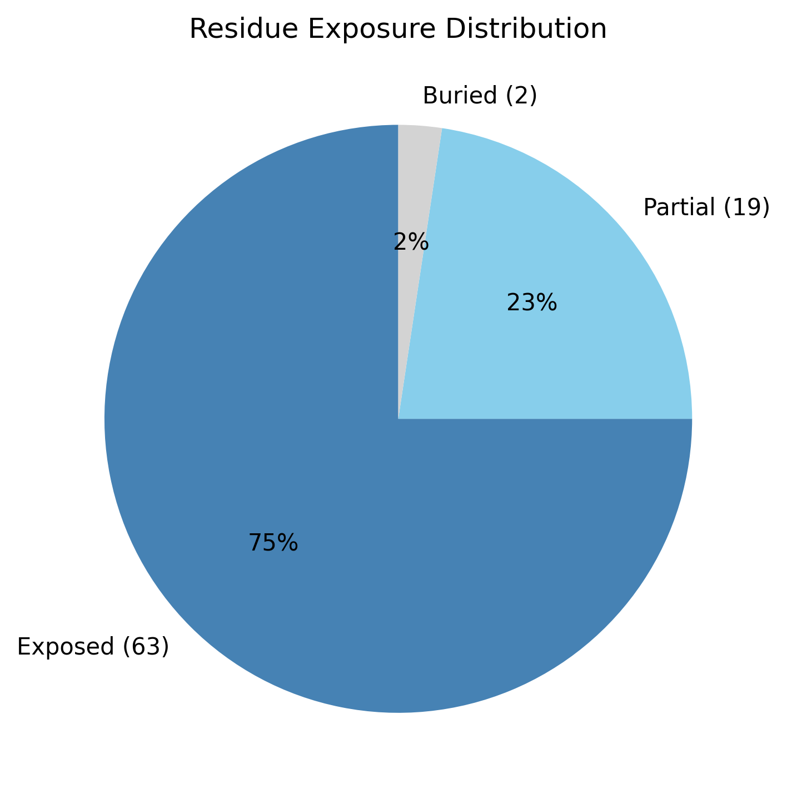

# Structural analysis — `test-7-s7`

> Facts are emitted deterministically from the measurement scripts. Sections marked with a SYNTHESIS comment are authored by the Claude session (judgment), kept visibly separate from the measured facts.

## Executive summary

`test-7-s7` is a small 84-residue single chain (`parse_structure.py`) with a strikingly extended, rod-like geometry: it is the most elongated structure in the set (prolate, asphericity 0.53, long:short axis ratio 15.78, dimensions 57.4 × 31.2 × 21 Å), its Rg (20.03 Å) exceeds the ~14.7 Å expected for 84 residues, and it has essentially no buried core (2.4% buried, 75.0% exposed; `surface_analysis.py`). Despite this, secondary structure is 64.3% helix with 0.0% sheet (pydssp), so the chain is helical and ordered rather than coil-like — the picture is a thin, extended helical body, not a collapsed globular domain. The surface is moderately polar and the most cationic in the set (mean Kyte–Doolittle −1.0, net +8 e). As with `test-7-s6`, `parse_structure.py` classified this as experimental (B-factor, not pLDDT), conflicting with the run provenance note — see coherence.

## User-provided context

No prior biological context provided.

## Structure overview

- **Source:** experimental
- **Chains:** 1 (single chain)
- **Residues / atoms:** 84 / 614
- **Missing residues:** 0
- **Non-solvent ligands:** none
  - chain **A**: 84 res

## Structural views

_Cα backbone trace (Agent 2.2 matplotlib placeholder), down the long / mid / short principal axes; coloured by pLDDT._

## Shape & secondary structure

- **Shape:** prolate (elongated) (asphericity 0.53, Rg 20.03 Å)
- **Approx. dimensions:** 57.4 × 31.2 × 21 Å
- **Secondary structure:** helix 64.3%, sheet 0.0%, coil 35.7% _(method: pydssp)_
- **⚠ SS assigned by pydssp (fallback), not mkdssp** — pydssp is a simplified DSSP reimplementation and can over- or under-call short helix/sheet segments on imperfect (e.g. predicted) backbones. Treat fractions near the ~5% floor, the helix/sheet split, and any coil-vs-disorder reasoning as provisional; install mkdssp for reference-grade assignment.

## Surface properties

- **Exposure:** buried 2.4%, partial 22.6%, exposed 75.0%
- **Total SASA:** 8127.7 Ų
- **Surface hydrophobicity (KD):** mean -1 ± 2.85
- **Surface charge (pH 7):** net 8 e (15 +, 7 −)
- **Hydrophobic patches:** 0

## Prediction quality / structural coherence

Confidence is **reported, never gated** — these signals are inputs for the synthesis below, not a pass/fail.

- **B-factor (chain A):** mean 46.3, median 44.24, range 39.1–63.98, std 6.25
- **Compactness:** Rg 20.03 Å vs ~14.7 Å expected for 84 residues (2.5·N^0.4) — larger than expected
- **Core present:** buried fraction 2.4%
- **Coil fraction:** 35.7%

### Coherence assessment

Detected as experimental (`parse_structure.py`: is_predicted false, bfactor_is_plddt false), so no pipeline pLDDT exists to assess and confidence reasoning is omitted; the B-factor (mean 46.3, range 39.1–63.98) is an experimental displacement parameter and, with no resolution recorded, is not interpreted further. ⚠ This conflicts with the run provenance note labelling all inputs ESMFold-predicted — flagged for the user. On the disorder question the indicators are split. Two point toward an extended, non-globular state: essentially no buried core (2.4% buried) and an Rg (20.03 Å) larger than the globular expectation (~14.7 Å), reinforced by extreme elongation (asphericity 0.53). But the chain is not coil-dominated (64.3% helix, 35.7% coil) and has no missing residues, so it does not meet the "predominantly disordered" bar, which requires overwhelmingly coil. The most consistent reading is an ordered but thin, elongated helical structure: a rod this thin has negligible interior to bury, and its whole-chain Rg-vs-expected comparison — which assumes a globular shape — is skewed by the elongation (per the guide's caveat on elongated bodies).

## Expected-parameter comparison

_No expected-parameter profile supplied — this is the default for novel / low-homology targets. See the independent observations below._

## Independent observations

The defining anomaly against baseline is the near-total absence of a buried core: 2.4% buried versus the 40–55% typical of globular proteins, with 75.0% of residues exposed (`surface_analysis.py`) — the lowest burial and highest exposure in the set. Coupled with extreme elongation (asphericity 0.53, long:short axis ratio 15.78) and an Rg above the size expectation (20.03 vs ~14.7 Å), the geometry is that of a thin elongated rod rather than a packed domain. The apparent internal inconsistency — these extended, core-less signals alongside 64.3% helix — resolves in favour of an ordered elongated helix rather than disorder (high helix, no missing residues; see coherence), but this is the clearest case in the batch where the globular shape baselines do not apply cleanly and should be read with that caveat. The surface is moderately polar (mean KD −1.0) and the most positive here (net +8 e, 15 +/7 −). This is structural description only; the measurements are insufficient structural evidence to assign function.

## Methods

- **Measurements (deterministic):** `parse_structure.py` (metadata, confidence stats), `surface_analysis.py` (Shrake–Rupley SASA, Kyte–Doolittle hydrophobicity, charge at pH 7, DSSP secondary structure, shape metrics), `render_trace.py` (Agent 2.2 Cα-trace figures; `render_views.py` Mol* cartoons when Agent 2.1 is available).
- **Report facts** below the synthesis sections are emitted verbatim from the above scripts' JSON by `assemble_report.py` — no transcription.
- **Synthesis** sections (executive summary, independent observations incl. the one-line scope statement, coherence assessment) are authored by Claude per `SKILL.md` Step 9, each claim cited to a measurement.
